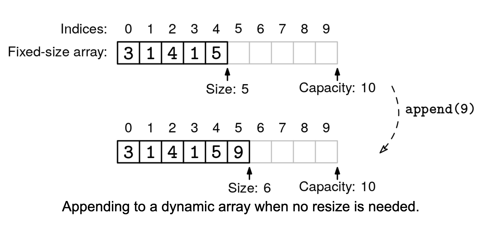
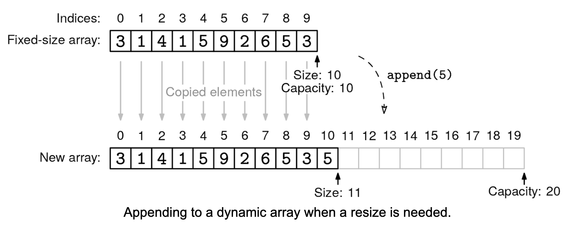

Assume your programming language only supports fixed-size arrays. Implement a dynamic array data structure that supports the following:

Dynamic Array API:

append(x): adds element x to the end of the array
get(i): returns the element at index i
set(i, x): updates the preexisting element at index i to be x
size(): returns the number of elements in the array
pop_back(): removes the last element
You should only declare arrays of a fixed size and not use built-in append() methods or equivalent.

Example 1:
d = DynamicArray()
d.append(1)
d.append(2)
d.get(0)  # returns 1
d.get(1)  # returns 2
d.size()  # returns 2

Example 2:
d = DynamicArray()
d.append(1)
d.set(0, 10)
d.get(0)  # returns 10

Example 3:
d = DynamicArray()
d.append(1)
d.append(2)
d.pop_back()
d.size()  # returns 1
d.get(0)  # returns 1
Constraints:

If you are coding in a strongly typed language, you can either assume all elements are integers, or define a generic dynamic array type.
All operations should work with arrays of up to 10^6 elements
See Solution
Problem 25.1 - Implement Dynamic Array: Solution
Python
The key insight is that we can't grow a fixed-size array, but we can create a new, bigger array and copy all the elements over. We call this process dynamic resizing. The implementation needs to balance between not resizing too often (which would be slow) and not wasting too much space.

Implement Dynamic Array Solution 1Implement Dynamic Array Solution 2
For the initial implementation, we start with a capacity of 10 slots. We maintain two key properties:

capacity: the total number of slots in our underlying fixed array
size: the number of elements actually stored
When checking if an index is within bounds, we compare it against the size, not the capacity. For instance, even if our capacity is 10, if we've only stored 3 elements, we don't let someone read or write index 7.

For append(), we double the capacity whenever we run out of space. This means that after a resize, we have plenty of room to grow before needing another resize. The amortized analysis shows why this is efficient:

Consider n consecutive appends starting from an empty array
The last resize copies at most n elements
The one before that copies at most n/2
The one before that copies at most n/4, and so on
Total copies = n + n/2 + n/4 + ... < 2n (this is a famous inequality)
Therefore, n appends take O(2n) = O(n) total time, or O(1) amortized per append
For pop_back(), we need a strategy for when to shrink the array. There are three options:

Never shrink - bad because it wastes space
Shrink the capacity in half when the array goes below 50% full - bad because the array would be at full capacity after shrinking, meaning that an append may trigger another resize immediately
Shrink the capacity in half when the array goes below 25% full - good because after shrinking we're at 50% capacity, far from both resize trigger points
The exact number is not critical -- we just want to be careful not to bounce back between expanding and shrinking too often.

The space complexity is O(n), where n is the number of elements. In the worst case (just after shrinking), we use 4n space, but this is still O(n).

Here is the implementation:

class DynamicArray:
  def __init__(self):
    self.capacity = 10
    self._size = 0
    self.fixed_array = [None] * self.capacity

  def get(self, i):
    if i < 0 or i >= self._size:
      raise IndexError('Index out of bounds')
    return self.fixed_array[i]

  def set(self, i, x):
    if i < 0 or i >= self._size:
      raise IndexError('Index out of bounds')
    self.fixed_array[i] = x

  def size(self):
    return self._size

  def append(self, x):
    if self._size == self.capacity:
      self.resize(self.capacity * 2)
    self.fixed_array[self._size] = x
    self._size += 1

  def resize(self, new_capacity):
    new_fixed_size_arr = [None] * (new_capacity)
    for i in range(self._size):
      new_fixed_size_arr[i] = self.fixed_array[i]
    self.fixed_array = new_fixed_size_arr
    self.capacity = new_capacity

  def pop_back(self):
    if self._size == 0:
      raise IndexError('Pop from empty array')
    self._size -= 1
    if self._size / self.capacity < 0.25 and self.capacity > 10:
      self.resize(self.capacity//2)
Time & Space Analysis
n: the number of elements in the array
Per Operation:

append(x): O(1) amortized - Doubling strategy ensures total cost of n appends is O(n)
get(i): O(1) - Direct array access
set(i, x): O(1) - Direct array assignment
size(): O(1) - Return stored size
pop_back(): O(1) amortized - Shrinking when 25% full prevents thrashing
Space: O(n) - At most 4n capacity after shrinking, which is still O(n)

Operations take constant time assuming that we don't need to make copies of elements that take more than O(1) space, such as large objects that can't be stored by reference.

Tests
Here are some test cases to verify the solution:

def run_tests():
  
  def test_get_set():
    d = DynamicArray()
    # Setup array with [0,1,2,3,4]
    for i in range(5):
      d.append(i)
    
    # Test get
    assert d.get(0) == 0, "get(0) should return 0"
    assert d.get(4) == 4, "get(4) should return 4"
    
    # Test set
    d.set(0, 10)
    assert d.get(0) == 10, "After set(0,10), get(0) should return 10"
    
    # Test error cases
    try:
      d.get(-1)
      assert False, "get(-1) should raise IndexError"
    except IndexError:
      pass
    
    try:
      d.get(5)
      assert False, "get(5) should raise IndexError"
    except IndexError:
      pass
    
    try:
      d.set(-1, 0)
      assert False, "set(-1,0) should raise IndexError"
    except IndexError:
      pass
    
    try:
      d.set(5, 0)
      assert False, "set(5,0) should raise IndexError"
    except IndexError:
      pass

  def test_append():
    d = DynamicArray()
    # Test append to empty array
    d.append(1)
    assert d.size() == 1, "Size should be 1 after append"
    assert d.get(0) == 1, "Element at 0 should be 1"
    
    # Test multiple appends
    d.append(2)
    d.append(3)
    assert d.size() == 3, "Size should be 3 after appends"
    assert d.get(1) == 2, "Element at 1 should be 2"
    assert d.get(2) == 3, "Element at 2 should be 3"

  def test_pop_back():
    d = DynamicArray()
    # Test pop from empty array
    try:
      d.pop_back()
      assert False, "pop_back() on empty array should raise IndexError"
    except IndexError:
      pass
    
    # Setup array with [1,2,3]
    d.append(1)
    d.append(2)
    d.append(3)
    
    # Test pop_back
    d.pop_back()
    assert d.size() == 2, "Size should be 2 after pop_back"
    try:
      d.get(2)
      assert False, "get(2) should raise IndexError after pop_back"
    except IndexError:
      pass

  def test_resize():
    d = DynamicArray()
    # Test initial capacity
    assert d.capacity == 10, "Initial capacity should be 10"
    
    # Test grow capacity
    for i in range(11):
      d.append(i)
    assert d.capacity == 20, "Capacity should double to 20"
    
    # Test shrink capacity
    for i in range(8):
      d.pop_back()
    assert d.capacity == 10, "Capacity should shrink back to 10"

  tests = [
    lambda: test_get_set(),
    lambda: test_append(),
    lambda: test_pop_back(),
    lambda: test_resize(),
  ]
  
  for test in tests:
    test()

run_tests()

Javascript:
class DynamicArray {
  constructor() {
    this.capacity = 10;
    this._size = 0;
    this.fixedArray = new Array(this.capacity).fill(null);
  }

  get(i) {
    if (i < 0 || i >= this._size) {
      throw new Error("Index out of bounds");
    }
    return this.fixedArray[i];
  }

  set(i, x) {
    if (i < 0 || i >= this._size) {
      throw new Error("Index out of bounds");
    }
    this.fixedArray[i] = x;
  }

  size() {
    return this._size;
  }

  append(x) {
    if (this._size === this.capacity) {
      this.resize(this.capacity * 2);
    }
    this.fixedArray[this._size] = x;
    this._size++;
  }

  resize(newCapacity) {
    const newFixedSizeArr = new Array(newCapacity).fill(null);
    for (let i = 0; i < this._size; i++) {
      newFixedSizeArr[i] = this.fixedArray[i];
    }
    this.fixedArray = newFixedSizeArr;
    this.capacity = newCapacity;
  }

  popBack() {
    if (this._size === 0) {
      throw new Error("Pop from empty array");
    }
    this._size--;
    if (this._size / this.capacity < 0.25 && this.capacity > 10) {
      this.resize(Math.floor(this.capacity / 2));
    }
  }
}

function runTests() {

  function testGetSet() {
    const d = new DynamicArray();
    // Setup array with [0, 1, 2, 3, 4]
    for (let i = 0; i < 5; i++) {
      d.append(i);
    }

    // Test get
    if (d.get(0) !== 0) {
      throw new Error("get(0) should return 0");
    }
    if (d.get(4) !== 4) {
      throw new Error("get(4) should return 4");
    }

    // Test set
    d.set(0, 10);
    if (d.get(0) !== 10) {
      throw new Error("After set(0,10), get(0) should return 10");
    }

    // Test error cases
    try {
      d.get(-1);
      throw new Error("get(-1) should throw Error");
    } catch (error) {
      if (!(error instanceof Error)) {
        throw new Error("Expected Error instance");
      }
    }

    try {
      d.get(5);
      throw new Error("get(5) should throw Error");
    } catch (error) {
      if (!(error instanceof Error)) {
        throw new Error("Expected Error instance");
      }
    }

    try {
      d.set(-1, 0);
      throw new Error("set(-1,0) should throw Error");
    } catch (error) {
      if (!(error instanceof Error)) {
        throw new Error("Expected Error instance");
      }
    }

    try {
      d.set(5, 0);
      throw new Error("set(5,0) should throw Error");
    } catch (error) {
      if (!(error instanceof Error)) {
        throw new Error("Expected Error instance");
      }
    }
  }

  function testAppend() {
    const d = new DynamicArray();
    // Test append to empty array
    d.append(1);
    if (d.size() !== 1) {
      throw new Error("Size should be 1 after append");
    }
    if (d.get(0) !== 1) {
      throw new Error("Element at 0 should be 1");
    }

    // Test multiple appends
    d.append(2);
    d.append(3);
    if (d.size() !== 3) {
      throw new Error("Size should be 3 after appends");
    }
    if (d.get(1) !== 2) {
      throw new Error("Element at 1 should be 2");
    }
    if (d.get(2) !== 3) {
      throw new Error("Element at 2 should be 3");
    }
  }

  function testPopBack() {
    const d = new DynamicArray();
    // Test pop from empty array
    try {
      d.popBack();
      throw new Error("popBack() on empty array should throw Error");
    } catch (error) {
      if (!(error instanceof Error)) {
        throw new Error("Expected Error instance");
      }
    }

    // Setup array with [1,2,3]
    d.append(1);
    d.append(2);
    d.append(3);

    // Test pop_back
    d.popBack();
    if (d.size() !== 2) {
      throw new Error("Size should be 2 after popBack");
    }
    try {
      d.get(2);
      throw new Error("get(2) should throw Error after popBack");
    } catch (error) {
      if (!(error instanceof Error)) {
        throw new Error("Expected Error instance");
      }
    }
  }

  function testResize() {
    const d = new DynamicArray();
    // Test initial capacity
    if (d.capacity !== 10) {
      throw new Error("Initial capacity should be 10");
    }

    // Test grow capacity
    for (let i = 0; i < 11; i++) {
      d.append(i);
    }
    if (d.capacity !== 20) {
      throw new Error("Capacity should double to 20");
    }

    // Test shrink capacity
    for (let i = 0; i < 8; i++) {
      d.popBack();
    }
    if (d.capacity !== 10) {
      throw new Error("Capacity should shrink back to 10");
    }
  }

  const tests = [testGetSet, testAppend, testPopBack, testResize];

  for (const test of tests) {
    test();
  }
  return true;
}

runTests();

Java

public class DynamicArray {
  private int[] fixedArray;
  private int capacity;
  private int _size;

  public DynamicArray() {
    capacity = 10;
    _size = 0;
    fixedArray = new int[capacity]; // Java arrays are initialized to 0 by
                                    // default
  }

  public int get(int i) {
    if (i < 0 || i >= _size) {
      throw new IndexOutOfBoundsException("Index out of bounds");
    }
    return fixedArray[i];
  }

  public void set(int i, int x) {
    if (i < 0 || i >= _size) {
      throw new IndexOutOfBoundsException("Index out of bounds");
    }
    fixedArray[i] = x;
  }

  public int size() {
    return _size;
  }

  public void append(int x) {
    if (_size == capacity) {
      resize(capacity * 2);
    }
    fixedArray[_size] = x;
    _size++;
  }

  private void resize(int newCapacity) {
    int[] newFixedSizeArr = new int[newCapacity];
    for (int i = 0; i < _size; i++) {
      newFixedSizeArr[i] = fixedArray[i];
    }
    fixedArray = newFixedSizeArr;
    capacity = newCapacity;
  }

  public void popBack() {
    if (_size == 0) {
      throw new IndexOutOfBoundsException("Pop from empty array");
    }
    _size--;
    if (_size * 4 < capacity && capacity > 10) {
      resize(capacity / 2);
    }
  }

  // Added for testing
  public int getCapacity() {
    return capacity;
  }
}

class TestGetSet {
  public void runTests() {
    DynamicArray d = new DynamicArray();
    // Setup array with [0,1,2,3,4]
    for (int i = 0; i < 5; i++) {
      d.append(i);
    }

    // Test get
    if (d.get(0) != 0) {
      throw new RuntimeException("get(0) should return 0");
    }
    if (d.get(4) != 4) {
      throw new RuntimeException("get(4) should return 4");
    }

    // Test set
    d.set(0, 10);
    if (d.get(0) != 10) {
      throw new RuntimeException("After set(0,10), get(0) should return 10");
    }

    // Test error cases
    try {
      d.get(-1);
      throw new RuntimeException(
          "get(-1) should throw IndexOutOfBoundsException");
    } catch (IndexOutOfBoundsException e) {
      // Expected
    }

    try {
      d.get(5);
      throw new RuntimeException(
          "get(5) should throw IndexOutOfBoundsException");
    } catch (IndexOutOfBoundsException e) {
      // Expected
    }

    try {
      d.set(-1, 0);
      throw new RuntimeException(
          "set(-1,0) should throw IndexOutOfBoundsException");
    } catch (IndexOutOfBoundsException e) {
      // Expected
    }

    try {
      d.set(5, 0);
      throw new RuntimeException(
          "set(5,0) should throw IndexOutOfBoundsException");
    } catch (IndexOutOfBoundsException e) {
      // Expected
    }
  }
}

class TestAppend {
  public void runTests() {
    DynamicArray d = new DynamicArray();
    // Test append to empty array
    d.append(1);
    if (d.size() != 1) {
      throw new RuntimeException("Size should be 1 after append");
    }
    if (d.get(0) != 1) {
      throw new RuntimeException("Element at 0 should be 1");
    }

    // Test multiple appends
    d.append(2);
    d.append(3);
    if (d.size() != 3) {
      throw new RuntimeException("Size should be 3 after appends");
    }
    if (d.get(1) != 2) {
      throw new RuntimeException("Element at 1 should be 2");
    }
    if (d.get(2) != 3) {
      throw new RuntimeException("Element at 2 should be 3");
    }
  }
}

class TestPopBack {
  public void runTests() {
    DynamicArray d = new DynamicArray();
    // Test pop from empty array
    try {
      d.popBack();
      throw new RuntimeException(
          "popBack() on empty array should throw IndexOutOfBoundsException");
    } catch (IndexOutOfBoundsException e) {
      // Expected
    }

    // Setup array with [1,2,3]
    d.append(1);
    d.append(2);
    d.append(3);

    // Test pop_back
    d.popBack();
    if (d.size() != 2) {
      throw new RuntimeException("Size should be 2 after popBack");
    }
    try {
      d.get(2);
      throw new RuntimeException(
          "get(2) should throw IndexOutOfBoundsException after popBack");
    } catch (IndexOutOfBoundsException e) {
      // Expected
    }
  }
}

class TestResize {
  public void runTests() {
    DynamicArray d = new DynamicArray();
    // Test initial capacity
    if (d.getCapacity() != 10) {
      throw new RuntimeException("Initial capacity should be 10");
    }

    // Test grow capacity
    for (int i = 0; i < 11; i++) {
      d.append(i);
    }
    if (d.getCapacity() != 20) {
      throw new RuntimeException("Capacity should double to 20");
    }

    // Test shrink capacity
    for (int i = 0; i < 8; i++) {
      d.popBack();
    }
    if (d.getCapacity() != 10) {
      throw new RuntimeException("Capacity should shrink back to 10");
    }
  }
}

class RunTests {
  public void runTests() {
    TestGetSet testGetSet = new TestGetSet();
    TestAppend testAppend = new TestAppend();
    TestPopBack testPopBack = new TestPopBack();
    TestResize testResize = new TestResize();

    try {
      testGetSet.runTests();

      testAppend.runTests();

      testPopBack.runTests();

      testResize.runTests();

    } catch (RuntimeException e) {
      System.out.println("Test failed: " + e.getMessage());
      throw e;
    }
  }
}

public class Solution {
  public static void main(String[] args) {
    new RunTests().runTests();
  }
}