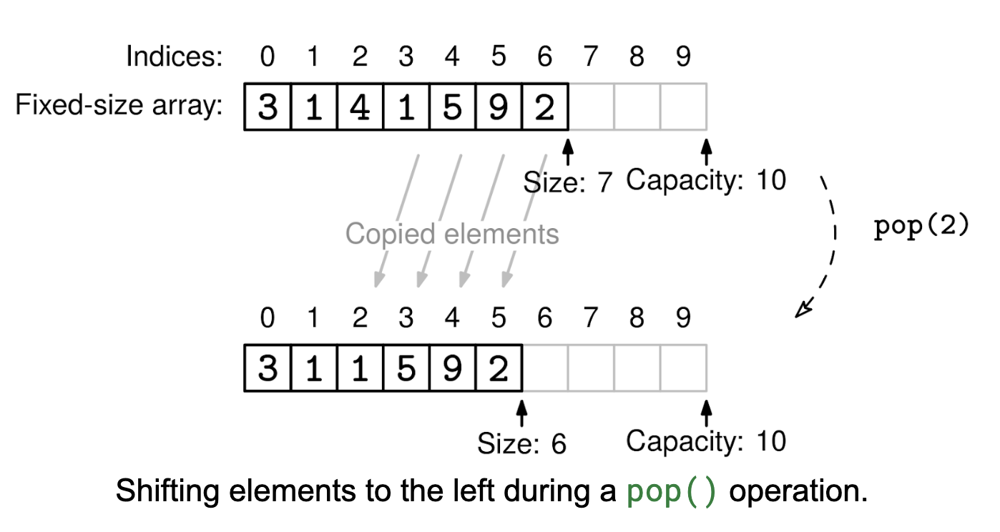

In this problem, we are building off of an existing dynamic array data structure, which already has append, pop_back, set, get, and size methods, and adding additional methods. Please refer to the Implement Dynamic Array problem first.

Add the following methods:

pop(i): Removes the element at index i. Every element after that index should be shifted left by one index so that there are no gaps remaining in the fixed-size array. Returns the element removed.

contains(x): Takes an element and returns whether the element appears in the array.

insert(i, x): Takes an index and an element and adds the element at that index, shifting right any preexisting elements at index i or greater.

remove(x): Takes in an element and removes the first instance of that element in the array. Returns the index that the element was at or -1 if the element was not found.

Example 1:
d = DynamicArrayExtras()
d.append(1)
d.append(2)
d.append(3)
d.pop(1) # returns 2
d.get(1) # returns 3
d.size() # returns 2

Example 2:
d = DynamicArrayExtras()
d.append(1)
d.append(2)
d.contains(1) # returns True
d.contains(3) # returns False

Example 3:
d = DynamicArrayExtras()
d.append(1)
d.append(2)
d.insert(1, 3) # array becomes [1,3,2]
d.get(1) # returns 3

Example 4:
d = DynamicArrayExtras()
d.append(1)
d.append(2)
d.append(2)
d.remove(2) # returns 1 (first index where 2 appears)
d.get(1) # returns 2 (the second 2 shifted left)
Constraints:

If you are coding in a strongly typed language, you can either assume all elements are integers, or define a generic dynamic array type.
All operations should work with arrays of up to 10^6 elements

See Solution
Problem 25.2 - Extra Dynamic Array Operations: Solution
Python
The key insight is that operations that modify elements in the middle of the array require shifting elements to maintain the 'contiguous elements' property. This makes these operations slower than the basic operations from the first problem.

For pop(i), there are two cases:

If i is the last index (size-1), we can just use pop_back()
Otherwise, we need to shift all elements after index i one position to the left to maintain contiguous storage The worst case is O(n) when popping from the front, as we need to shift n-1 elements. Unlike pop_back(), this operation cannot be amortized - popping from the front n times takes O(n²) total time.

For contains(x), we need to check every element until we find x or reach the end. This takes O(n) time since we have no ordering guarantees. If you need this operation to be fast, consider using a different data structure like a hash set or, if the elements are sorted, binary search.

For insert(i, x), we have the opposite of pop:

First ensure we have space, resizing if needed
Shift all elements from index i onwards one position to the right
Place x at index i
The worst case is O(n) when inserting at the front. Like pop(i), this cannot be amortized: n front inserts take O(n²) time.

For remove(x), we combine the ideas from contains() and pop():

Scan the array to find the first occurrence of x
If found, use pop(i) to remove it and shift elements
Return the index where x was found, or -1 if not found
The total time is O(n): O(n) to find x and potentially another O(n) to shift elements.

If you find yourself needing fast operations at both ends of the array, consider using a double-ended queue (deque) instead, which supports O(1) operations at both ends.

Here is the implementation:

class DynamicArrayExtras(DynamicArray):
  def pop(self, i):
    if i < 0 or i >= self._size:
      raise IndexError('Index out of bounds')

    x = self.fixed_array[i]

    for j in range(i, self._size - 1):
      self.fixed_array[j] = self.fixed_array[j + 1]

    self._size -= 1
    if self._size / self.capacity < 0.25 and self.capacity > 10:
      self.resize(self.capacity // 2)
    return x

  def contains(self, x):
    for i in range(self._size):
      if self.fixed_array[i] == x:
        return True
    return False

  def insert(self, i, x):
    if i < 0 or i > self._size:
      raise IndexError('Index out of bounds')

    if self._size == self.capacity:
      self.resize(self.capacity * 2)

    for j in range(self._size - 1, i - 1, -1):
      self.fixed_array[j + 1] = self.fixed_array[j]

    self.fixed_array[i] = x
    self._size += 1

  def remove(self, x):
    for i in range(self._size):
      if self.fixed_array[i] == x:
        self.pop(i)
        return i
    return -1
Here is the basic array class:

class DynamicArray:
  def __init__(self):
    self.capacity = 10
    self._size = 0
    self.fixed_array = [None] * self.capacity

  def get(self, i):
    if i < 0 or i >= self._size:
      raise IndexError('Index out of bounds')
    return self.fixed_array[i]

  def set(self, i, x):
    if i < 0 or i >= self._size:
      raise IndexError('Index out of bounds')
    self.fixed_array[i] = x

  def size(self):
    return self._size

  def append(self, x):
    if self._size == self.capacity:
      self.resize(self.capacity * 2)
    self.fixed_array[self._size] = x
    self._size += 1

  def resize(self, new_capacity):
    new_fixed_size_arr = [None] * (new_capacity)
    for i in range(self._size):
      new_fixed_size_arr[i] = self.fixed_array[i]
    self.fixed_array = new_fixed_size_arr
    self.capacity = new_capacity

  def pop_back(self):
    if self._size == 0:
      raise IndexError('Pop from empty array')
    self._size -= 1
    if self._size / self.capacity < 0.25 and self.capacity > 10:
      self.resize(self.capacity//2)
Time & Space Analysis
n: the number of elements in the array
Per Operation:

pop(i): O(n) worst case when popping from front (requires shifting)
contains(x): O(n) - Linear search through all elements
insert(i, x): O(n) worst case when inserting at front (requires shifting)
remove(x): O(n) - Finding element + shifting if found
Space: O(n) - For storing the elements

Operations modifying at the front (pop, insert) take O(n) time due to shifting, unlike operations modifying the back ()append, pop_back) which take amortized O(1) time.

Tests
Here are some test cases to verify the solution:

def run_tests():
  def test_pop():
    d = DynamicArrayExtras()
    # Setup array with [0,1,2,3,4]
    for i in range(5):
      d.append(i)

    # Test pop from middle
    assert d.pop(2) == 2, "pop(2) should return 2"
    assert d.size() == 4, "Size should be 4 after pop"
    assert d.get(2) == 3, "Element at 2 should now be 3"

    # Test pop from start
    assert d.pop(0) == 0, "pop(0) should return 0"
    assert d.size() == 3, "Size should be 3 after pop"
    assert d.get(0) == 1, "Element at 0 should now be 1"

    # Test pop from end
    assert d.pop(2) == 4, "pop(2) should return 4"
    assert d.size() == 2, "Size should be 2 after pop"

    # Test error cases
    try:
      d.pop(-1)
      assert False, "pop(-1) should raise IndexError"
    except IndexError:
      pass

    try:
      d.pop(2)
      assert False, "pop(2) should raise IndexError"
    except IndexError:
      pass

  def test_contains():
    d = DynamicArrayExtras()
    # Test empty array
    assert not d.contains(1), "Empty array should not contain 1"

    # Setup array with [1,2,3]
    d.append(1)
    d.append(2)
    d.append(3)

    # Test positive cases
    assert d.contains(1), "Array should contain 1"
    assert d.contains(2), "Array should contain 2"
    assert d.contains(3), "Array should contain 3"

    # Test negative cases
    assert not d.contains(0), "Array should not contain 0"
    assert not d.contains(4), "Array should not contain 4"

  def test_insert():
    d = DynamicArrayExtras()
    # Test insert into empty array
    d.insert(0, 1)
    assert d.size() == 1, "Size should be 1 after insert"
    assert d.get(0) == 1, "Element at 0 should be 1"

    # Test insert at start
    d.insert(0, 0)
    assert d.size() == 2, "Size should be 2 after insert"
    assert d.get(0) == 0, "Element at 0 should be 0"
    assert d.get(1) == 1, "Element at 1 should be 1"

    # Test insert at end
    d.insert(2, 2)
    assert d.size() == 3, "Size should be 3 after insert"
    assert d.get(2) == 2, "Element at 2 should be 2"

    # Test insert in middle
    d.insert(1, 3)
    assert d.size() == 4, "Size should be 4 after insert"
    assert d.get(1) == 3, "Element at 1 should be 3"

    # Test error cases
    try:
      d.insert(-1, 0)
      assert False, "insert(-1, 0) should raise IndexError"
    except IndexError:
      pass

    try:
      d.insert(5, 0)
      assert False, "insert(5, 0) should raise IndexError"
    except IndexError:
      pass

  def test_remove():
    d = DynamicArrayExtras()
    # Test remove from empty array
    assert d.remove(1) == -1, "Remove from empty array should return -1"

    # Setup array with [1,2,2,3]
    d.append(1)
    d.append(2)
    d.append(2)
    d.append(3)

    # Test successful removes
    assert d.remove(1) == 0, "Remove should return index 0"
    assert d.size() == 3, "Size should be 3 after remove"
    assert d.get(0) == 2, "Element at 0 should be 2"

    assert d.remove(2) == 0, "Remove should return index 0"
    assert d.size() == 2, "Size should be 2 after remove"
    assert d.get(0) == 2, "Element at 0 should be 2"

    # Test remove non-existent element
    assert d.remove(4) == -1, "Remove non-existent should return -1"

  test_pop()
  test_contains()
  test_insert()
  test_remove()

run_tests()

JS:
class DynamicArrayExtras extends DynamicArray {
pop(i) {
if (i < 0 || i >= this.size()) {
throw new Error("Index out of bounds");
}

    const x = this.get(i);

    for (let j = i; j < this.size() - 1; j++) {
      this.set(j, this.get(j + 1));
    }

    this.popBack();
    return x;

}

contains(x) {
for (let i = 0; i < this.size(); i++) {
if (this.get(i) === x) {
return true;
}
}
return false;
}

insert(i, x) {
if (i < 0 || i > this.size()) {
throw new Error("Index out of bounds");
}

    this.append(0); // Make space
    for (let j = this.size() - 1; j > i; j--) {
      this.set(j, this.get(j - 1));
    }
    this.set(i, x);

}

remove(x) {
for (let i = 0; i < this.size(); i++) {
if (this.get(i) === x) {
this.pop(i);
return i;
}
}
return -1;
}
}
Here is the basic array class:

class DynamicArray {
constructor() {
this.capacity = 10;
this.\_size = 0;
this.fixedArray = new Array(this.capacity).fill(null);
}

get(i) {
if (i < 0 || i >= this.\_size) {
throw new Error("Index out of bounds");
}
return this.fixedArray[i];
}

set(i, x) {
if (i < 0 || i >= this.\_size) {
throw new Error("Index out of bounds");
}
this.fixedArray[i] = x;
}

size() {
return this.\_size;
}

append(x) {
if (this.\_size === this.capacity) {
this.resize(this.capacity \* 2);
}
this.fixedArray[this._size] = x;
this.\_size++;
}

resize(newCapacity) {
const newFixedSizeArr = new Array(newCapacity).fill(null);
for (let i = 0; i < this.\_size; i++) {
newFixedSizeArr[i] = this.fixedArray[i];
}
this.fixedArray = newFixedSizeArr;
this.capacity = newCapacity;
}

popBack() {
if (this.\_size === 0) {
throw new Error("Pop from empty array");
}
this.\_size--;
if (this.\_size / this.capacity < 0.25 && this.capacity > 10) {
this.resize(Math.floor(this.capacity / 2));
}
}
}

function runTests() {

function testPop() {
const d = new DynamicArrayExtras();
// Setup array with [0,1,2,3,4]
for (let i = 0; i < 5; i++) {
d.append(i);
}

    // Test pop from middle
    if (d.pop(2) !== 2) {
      throw new Error("pop(2) should return 2");
    }
    if (d.size() !== 4) {
      throw new Error("Size should be 4 after pop");
    }
    if (d.get(2) !== 3) {
      throw new Error("Element at 2 should now be 3");
    }

    // Test pop from start
    if (d.pop(0) !== 0) {
      throw new Error("pop(0) should return 0");
    }
    if (d.size() !== 3) {
      throw new Error("Size should be 3 after pop");
    }
    if (d.get(0) !== 1) {
      throw new Error("Element at 0 should now be 1");
    }

    // Test pop from end
    if (d.pop(2) !== 4) {
      throw new Error("pop(2) should return 4");
    }
    if (d.size() !== 2) {
      throw new Error("Size should be 2 after pop");
    }

    // Test error cases
    try {
      d.pop(-1);
      throw new Error("pop(-1) should throw Error");
    } catch (error) {
      if (!(error instanceof Error)) {
        throw new Error("Expected Error instance");
      }
    }

    try {
      d.pop(2);
      throw new Error("pop(2) should throw Error");
    } catch (error) {
      if (!(error instanceof Error)) {
        throw new Error("Expected Error instance");
      }
    }

}

function testContains() {
const d = new DynamicArrayExtras();
// Test empty array
if (d.contains(1)) {
throw new Error("Empty array should not contain 1");
}

    // Setup array with [1,2,3]
    d.append(1);
    d.append(2);
    d.append(3);

    // Test positive cases
    if (!d.contains(1)) {
      throw new Error("Array should contain 1");
    }
    if (!d.contains(2)) {
      throw new Error("Array should contain 2");
    }
    if (!d.contains(3)) {
      throw new Error("Array should contain 3");
    }

    // Test negative cases
    if (d.contains(0)) {
      throw new Error("Array should not contain 0");
    }
    if (d.contains(4)) {
      throw new Error("Array should not contain 4");
    }

}

function testInsert() {
const d = new DynamicArrayExtras();
// Test insert into empty array
d.insert(0, 1);
if (d.size() !== 1) {
throw new Error("Size should be 1 after insert");
}
if (d.get(0) !== 1) {
throw new Error("Element at 0 should be 1");
}

    // Test insert at start
    d.insert(0, 0);
    if (d.size() !== 2) {
      throw new Error("Size should be 2 after insert");
    }
    if (d.get(0) !== 0) {
      throw new Error("Element at 0 should be 0");
    }
    if (d.get(1) !== 1) {
      throw new Error("Element at 1 should be 1");
    }

    // Test insert at end
    d.insert(2, 2);
    if (d.size() !== 3) {
      throw new Error("Size should be 3 after insert");
    }
    if (d.get(2) !== 2) {
      throw new Error("Element at 2 should be 2");
    }

    // Test insert in middle
    d.insert(1, 3);
    if (d.size() !== 4) {
      throw new Error("Size should be 4 after insert");
    }
    if (d.get(1) !== 3) {
      throw new Error("Element at 1 should be 3");
    }

    // Test error cases
    try {
      d.insert(-1, 0);
      throw new Error("insert(-1, 0) should throw Error");
    } catch (error) {
      if (!(error instanceof Error)) {
        throw new Error("Expected Error instance");
      }
    }

    try {
      d.insert(5, 0);
      throw new Error("insert(5, 0) should throw Error");
    } catch (error) {
      if (!(error instanceof Error)) {
        throw new Error("Expected Error instance");
      }
    }

}

function testRemove() {
const d = new DynamicArrayExtras();
// Test remove from empty array
if (d.remove(1) !== -1) {
throw new Error("Remove from empty array should return -1");
}

    // Setup array with [1,2,2,3]
    d.append(1);
    d.append(2);
    d.append(2);
    d.append(3);

    // Test successful removes
    if (d.remove(1) !== 0) {
      throw new Error("Remove should return index 0");
    }
    if (d.size() !== 3) {
      throw new Error("Size should be 3 after remove");
    }
    if (d.get(0) !== 2) {
      throw new Error("Element at 0 should be 2");
    }

    if (d.remove(2) !== 0) {
      throw new Error("Remove should return index 0");
    }
    if (d.size() !== 2) {
      throw new Error("Size should be 2 after remove");
    }
    if (d.get(0) !== 2) {
      throw new Error("Element at 0 should be 2");
    }

    // Test remove non-existent element
    if (d.remove(4) !== -1) {
      throw new Error("Remove non-existent should return -1");
    }

}

try {
testPop();
testContains();
testInsert();
testRemove();
} catch (error) {
console.log(`Test failed: ${error.message}`);
throw error;
}
return true;
}

runTests();

class DynamicArrayExtras extends DynamicArray {
public int pop(int i) {
if (i < 0 || i >= size()) {
throw new IndexOutOfBoundsException("Index out of bounds");
}

    int x = get(i);

    for (int j = i; j < size() - 1; j++) {
      set(j, get(j + 1));
    }

    popBack();
    return x;

}

public boolean contains(int x) {
for (int i = 0; i < size(); i++) {
if (get(i) == x) {
return true;
}
}
return false;
}

public void insert(int i, int x) {
if (i < 0 || i > size()) {
throw new IndexOutOfBoundsException("Index out of bounds");
}

    append(0); // Make space
    for (int j = size() - 1; j > i; j--) {
      set(j, get(j - 1));
    }
    set(i, x);

}

public int remove(int x) {
for (int i = 0; i < size(); i++) {
if (get(i) == x) {
pop(i);
return i;
}
}
return -1;
}
}

public class DynamicArray {
private int[] fixedArray;
private int capacity;
private int \_size;

public DynamicArray() {
capacity = 10;
\_size = 0;
fixedArray = new int[capacity]; // Java arrays are initialized to 0 by
// default
}

public int get(int i) {
if (i < 0 || i >= \_size) {
throw new IndexOutOfBoundsException("Index out of bounds");
}
return fixedArray[i];
}

public void set(int i, int x) {
if (i < 0 || i >= \_size) {
throw new IndexOutOfBoundsException("Index out of bounds");
}
fixedArray[i] = x;
}

public int size() {
return \_size;
}

public void append(int x) {
if (\_size == capacity) {
resize(capacity \* 2);
}
fixedArray[_size] = x;
\_size++;
}

private void resize(int newCapacity) {
int[] newFixedSizeArr = new int[newCapacity];
for (int i = 0; i < \_size; i++) {
newFixedSizeArr[i] = fixedArray[i];
}
fixedArray = newFixedSizeArr;
capacity = newCapacity;
}

public void popBack() {
if (\_size == 0) {
throw new IndexOutOfBoundsException("Pop from empty array");
}
\_size--;
if (\_size \* 4 < capacity && capacity > 10) {
resize(capacity / 2);
}
}

// Added for testing
public int getCapacity() {
return capacity;
}
}

class RunTests {
  private void testPop() {
    DynamicArrayExtras d = new DynamicArrayExtras();
    // Setup array with [0,1,2,3,4]
    for (int i = 0; i < 5; i++) {
      d.append(i);
    }

    // Test pop from middle
    if (d.pop(2) != 2) {
      throw new RuntimeException("pop(2) should return 2");
    }
    if (d.size() != 4) {
      throw new RuntimeException("Size should be 4 after pop");
    }
    if (d.get(2) != 3) {
      throw new RuntimeException("Element at 2 should now be 3");
    }

    // Test pop from start
    if (d.pop(0) != 0) {
      throw new RuntimeException("pop(0) should return 0");
    }
    if (d.size() != 3) {
      throw new RuntimeException("Size should be 3 after pop");
    }
    if (d.get(0) != 1) {
      throw new RuntimeException("Element at 0 should now be 1");
    }

    // Test pop from end
    if (d.pop(2) != 4) {
      throw new RuntimeException("pop(2) should return 4");
    }
    if (d.size() != 2) {
      throw new RuntimeException("Size should be 2 after pop");
    }

    // Test error cases
    try {
      d.pop(-1);
      throw new RuntimeException(
          "pop(-1) should throw IndexOutOfBoundsException");
    } catch (IndexOutOfBoundsException e) {
      // Expected
    }

    try {
      d.pop(2);
      throw new RuntimeException(
          "pop(2) should throw IndexOutOfBoundsException");
    } catch (IndexOutOfBoundsException e) {
      // Expected
    }
  }

  private void testContains() {
    DynamicArrayExtras d = new DynamicArrayExtras();
    // Test empty array
    if (d.contains(1)) {
      throw new RuntimeException("Empty array should not contain 1");
    }

    // Setup array with [1,2,3]
    d.append(1);
    d.append(2);
    d.append(3);

    // Test positive cases
    if (!d.contains(1)) {
      throw new RuntimeException("Array should contain 1");
    }
    if (!d.contains(2)) {
      throw new RuntimeException("Array should contain 2");
    }
    if (!d.contains(3)) {
      throw new RuntimeException("Array should contain 3");
    }

    // Test negative cases
    if (d.contains(0)) {
      throw new RuntimeException("Array should not contain 0");
    }
    if (d.contains(4)) {
      throw new RuntimeException("Array should not contain 4");
    }
  }

  private void testInsert() {
    DynamicArrayExtras d = new DynamicArrayExtras();
    // Test insert into empty array
    d.insert(0, 1);
    if (d.size() != 1) {
      throw new RuntimeException("Size should be 1 after insert");
    }
    if (d.get(0) != 1) {
      throw new RuntimeException("Element at 0 should be 1");
    }

    // Test insert at start
    d.insert(0, 0);
    if (d.size() != 2) {
      throw new RuntimeException("Size should be 2 after insert");
    }
    if (d.get(0) != 0) {
      throw new RuntimeException("Element at 0 should be 0");
    }
    if (d.get(1) != 1) {
      throw new RuntimeException("Element at 1 should be 1");
    }

    // Test insert at end
    d.insert(2, 2);
    if (d.size() != 3) {
      throw new RuntimeException("Size should be 3 after insert");
    }
    if (d.get(2) != 2) {
      throw new RuntimeException("Element at 2 should be 2");
    }

    // Test insert in middle
    d.insert(1, 3);
    if (d.size() != 4) {
      throw new RuntimeException("Size should be 4 after insert");
    }
    if (d.get(1) != 3) {
      throw new RuntimeException("Element at 1 should be 3");
    }

    // Test error cases
    try {
      d.insert(-1, 0);
      throw new RuntimeException(
          "insert(-1, 0) should throw IndexOutOfBoundsException");
    } catch (IndexOutOfBoundsException e) {
      // Expected
    }

    try {
      d.insert(5, 0);
      throw new RuntimeException(
          "insert(5, 0) should throw IndexOutOfBoundsException");
    } catch (IndexOutOfBoundsException e) {
      // Expected
    }
  }

  private void testRemove() {
    DynamicArrayExtras d = new DynamicArrayExtras();
    // Test remove from empty array
    if (d.remove(1) != -1) {
      throw new RuntimeException("Remove from empty array should return -1");
    }

    // Setup array with [1,2,2,3]
    d.append(1);
    d.append(2);
    d.append(2);
    d.append(3);

    // Test successful removes
    if (d.remove(1) != 0) {
      throw new RuntimeException("Remove should return index 0");
    }
    if (d.size() != 3) {
      throw new RuntimeException("Size should be 3 after remove");
    }
    if (d.get(0) != 2) {
      throw new RuntimeException("Element at 0 should be 2");
    }

    if (d.remove(2) != 0) {
      throw new RuntimeException("Remove should return index 0");
    }
    if (d.size() != 2) {
      throw new RuntimeException("Size should be 2 after remove");
    }
    if (d.get(0) != 2) {
      throw new RuntimeException("Element at 0 should be 2");
    }

    // Test remove non-existent element
    if (d.remove(4) != -1) {
      throw new RuntimeException("Remove non-existent should return -1");
    }
  }

  public void runTests() {
    try {
      testPop();
      testContains();
      testInsert();
      testRemove();
    } catch (RuntimeException e) {
      System.out.println("Test failed: " + e.getMessage());
      throw e;
    }
  }
}

public class Solution {
  public static void main(String[] args) {
    new RunTests().runTests();
  }
}
