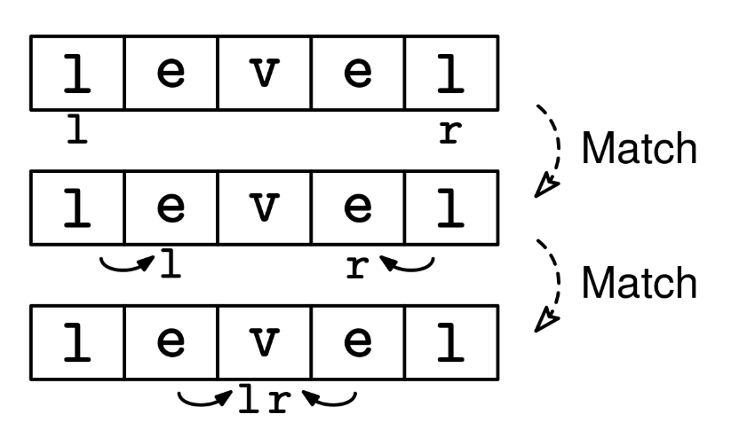

Given a string s, return whether s is a palindrome. A palindrome is a string that reads the same forward and backward.

Example 1: s = "level"
Output: true

Example 2: s = "naan"
Output: true

Example 3: s = "hello"
Output: false
Constraints:

The length of s is at most 10^6
s consists of lowercase English letters
See Solution
Problem 27.1 - Palindrome Check: Solution
Python
This is a classic example of using two inward pointers. We can check if a string is a palindrome by comparing characters from both ends and moving inward. If at any point the characters don't match, we know it's not a palindrome.

We maintain two pointers:

l (left): starts at the beginning of the string
r (right): starts at the end of the string
At each step, we:

Compare the characters at positions l and r
If they don't match, return false as the string is not a palindrome
If they match, move the pointers inward (l increases, r decreases)
Continue until the pointers meet in the middle
If we make it through all comparisons without finding any mismatches, the string is a palindrome.

Palindrome check 1
The runtime is linear in the size of the input string, since each element is visited by a pointer at most once.

Here is the implementation:

def palindrome(s):
  l, r = 0, len(s) - 1
  while l < r:
    if s[l] != s[r]:
      return False
    l += 1
    r -= 1
  return True
Time & Space Analysis
n: the length of the string

Time: O(n) - each character is compared at most once as the pointers move from the ends toward the center

Extra space: O(1) - only using constant extra space for the two pointers

Tests
Here are some test cases to verify the solution:

def run_tests():
tests = [
# Example from the book
("level", True),
("naan", True),
# Additional test cases
("", True),
("a", True),
("ab", False),
("abc", False),
("abba", True),
("abcba", True),
]
for s, want in tests:
got = palindrome(s)
assert got == want, f"\npalindrome({s}): got: {got}, want: {want}\n"

run_tests()

function palindrome(s) {
let l = 0,
r = s.length - 1;
while (l < r) {
if (s[l] !== s[r]) {
return false;
}
l++;
r--;
}
return true;
}
Time & Space Analysis
n: the length of the string

Time: O(n) - each character is compared at most once as the pointers move from the ends toward the center

Extra space: O(1) - only using constant extra space for the two pointers

Tests
Here are some test cases to verify the solution:

function runTests() {
const tests = [
// Example from the book
["level", true],
["naan", true],
// Additional test cases
["", true],
["a", true],
["ab", false],
["abc", false],
["abba", true],
["abcba", true],
];
for (const [s, want] of tests) {
const got = palindrome(s);
if (got !== want) {
throw new Error(`\npalindrome(${s}): got: ${got}, want: ${want}\n`);
}
}
}

runTests();

class Palindrome {
public boolean solve(String s) {
int l = 0, r = s.length() - 1;
while (l < r) {
if (s.charAt(l) != s.charAt(r)) {
return false;
}
l++;
r--;
}
return true;
}
}
Time & Space Analysis
n: the length of the string

Time: O(n) - each character is compared at most once as the pointers move from the ends toward the center

Extra space: O(1) - only using constant extra space for the two pointers

Tests
Here are some test cases to verify the solution:

class RunTests {
public void runTests() {
Object[][] tests = {
// Example from the book
{ "level", true },
{ "naan", true },
// Additional test cases
{ "", true },
{ "a", true },
{ "ab", false },
{ "abc", false },
{ "abba", true },
{ "abcba", true },
};

    Palindrome solution = new Palindrome();
    for (Object[] test : tests) {
      String s = (String) test[0];
      boolean want = (boolean) test[1];
      boolean got = solution.solve(s);
      if (got != want) {
        throw new RuntimeException(String.format(
            "\nsolve(%s): got: %b, want: %b\n",
            s, got, want));
      }
    }

}
}

public class Solution {
public static void main(String[] args) {
new RunTests().runTests();
}
}
