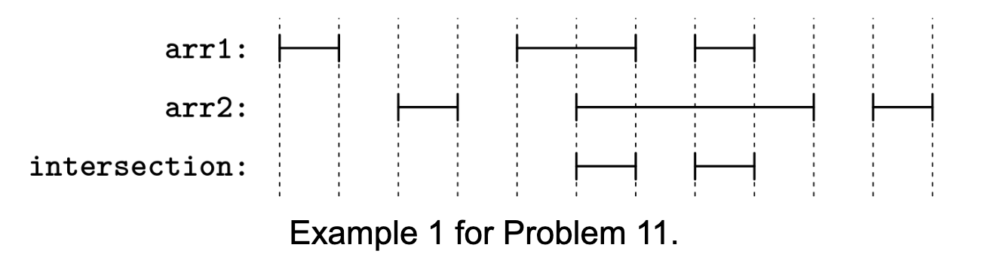
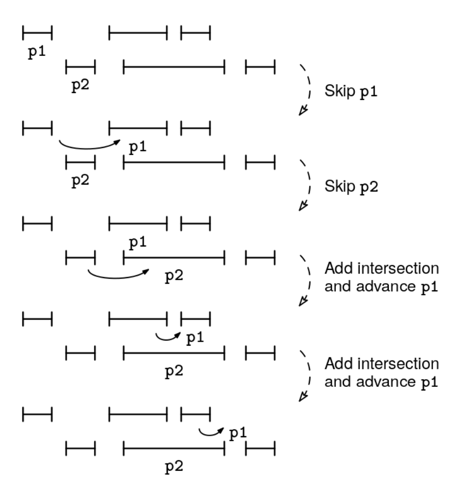

In this problem, we represent an interval as an array with two integers, [start, end], where start <= end. Both endpoints are considered part of the interval, which may consist of a singular point if start == end.

You are given two arrays of intervals, arr1 and arr2. For each array, the intervals are non-overlapping (they don't even share an endpoint) and sorted from left to right. Return a similarly non-overlapping, sorted array of intervals representing the intersection of the intervals in arr1 and arr2. An interval shouldn't start at the same value where another interval ends.

Example 1:
Input:
arr1 = [[0, 1], [4, 6], [7, 8]]
arr2 = [[2, 3], [5, 9], [10, 11]]
Output: [[5, 6], [7, 8]]
Explanation:

- [4, 6] from arr1 intersects with [5, 9] from arr2 to give [5, 6]
- [7, 8] from arr1 intersects with [5, 9] from arr2 to give [7, 8]

Example 2:
Input:
arr1 = [[2, 4], [5, 8]]
arr2 = [[3, 3], [4, 7]]
Output: [[3, 3], [4, 4], [5, 7]]
Explanation:

- [2, 4] intersects with [3, 3] to give [3, 3]
- [2, 4] intersects with [4, 7] to give [4, 4]
- [5, 8] intersects with [4, 7] to give [5, 7]
  The array [[3, 3], [4, 4], [5, 6], [6, 7]] would not be correct because [5, 6]
  and [6, 7] can be combined.
  Here is a visualization of Example 1:

Interval intersection problem 1
Constraints:

0 ≤ arr1.length, arr2.length ≤ 10^6
arr1[i].length = arr2[j].length = 2
-10^9 ≤ start ≤ end ≤ 10^9 for each interval
Each list is sorted and non-overlapping (any two intervals from the same list don't even share an endpoint)
See Solution
Problem 27.11 - Interval Intersection: Solution
Python
We can use a pointer for each array, following the 'parallel pointers' movement pattern.

We maintain the following invariant, which relates the pointers, p1 and p2, to the result array, res:

"res contains the intersection of every interval in arr1 before p1 and every interval in arr2 before p2"
At each iteration, our goal is to advance one of the pointers while preserving this invariant.

The easier case is when arr1[p1] and arr2[p2] do not overlap, as we can advance whichever pointer is earlier.
If they overlap, we add their intersection to res and advance whichever pointer ends earliest.
We can stop once we finish iterating through one of the arrays.

For problems about intervals, we often need to work out the endpoint logic:

How do we know if two intervals overlap?
If they don't, how do we know which one is earlier?
If they do, how do we compute the overlap?
To get these questions right, we recommend using the case analysis and sketch a diagram boosters. Code-wise, it can help to factor out some of the interval-specific logic to helper functions.

This is a two-pointer problem where we need to find overlapping intervals between two sorted lists. We can solve it by maintaining two pointers, one for each list, and advancing them based on which interval ends first.

Interval intersection solution 1
Here's the implementation:

def intersection(int1, int2):
  overlap_start = max(int1[0], int2[0])
  overlap_end = min(int1[1], int2[1])
  return [overlap_start, overlap_end]

def interval_intersection(arr1, arr2):
  p1, p2 = 0, 0
  n1, n2 = len(arr1), len(arr2)
  res = []
  while p1 < n1 and p2 < n2:
    int1, int2 = arr1[p1], arr2[p2]
    if int1[1] < int2[0]:
      p1 += 1
    elif int2[1] < int1[0]:
      p2 += 1
    else:
      res.append(intersection(int1, int2))
      if int1[1] < int2[1]:
        p1 += 1
      else:
        p2 += 1
  return res
Time & Space Analysis
n1: the length of arr1

n2: the length of arr2

Time: O(n1 + n2) - all the interval operations take O(1) time. We visit each interval at most once, so the total time complexity is linear on the size of the input arrays

Extra space: O(1) - only using constant extra space for the pointers, not counting the output array

Tests
Here are some test cases to verify the solution:

def run_tests():
tests = [ # Example 1 from the book
([[0, 1], [4, 6], [7, 8]], [[2, 3], [5, 9], [10, 11]], [[5, 6], [7, 8]]), # Example 2 from the book
([[2, 4], [5, 8]], [[3, 3], [4, 7]], [[3, 3], [4, 4], [5, 7]]), # Additional test cases
([], [], []),
([[1, 2]], [], []),
([[1, 3]], [[2, 4]], [[2, 3]]),
([[1, 5]], [[2, 3]], [[2, 3]]),
([[1, 2], [3, 4]], [[2, 3]], [[2, 2], [3, 3]]),
]
for arr1, arr2, want in tests:
got = interval_intersection(arr1, arr2)
assert got == want, f"\ninterval_intersection({arr1}, {arr2}): got: {
got}, want: {want}\n"

run_tests()

function intersection(int1, int2) {
const overlapStart = Math.max(int1[0], int2[0]);
const overlapEnd = Math.min(int1[1], int2[1]);
return [overlapStart, overlapEnd];
}

function intervalIntersection(arr1, arr2) {
let p1 = 0,
p2 = 0;
const n1 = arr1.length,
n2 = arr2.length;
const res = [];

while (p1 < n1 && p2 < n2) {
const int1 = arr1[p1],
int2 = arr2[p2];
if (int1[1] < int2[0]) {
p1++;
} else if (int2[1] < int1[0]) {
p2++;
} else {
res.push(intersection(int1, int2));
if (int1[1] < int2[1]) {
p1++;
} else {
p2++;
}
}
}
return res;
}
Time & Space Analysis
n1: the length of arr1

n2: the length of arr2

Time: O(n1 + n2) - all the interval operations take O(1) time. We visit each interval at most once, so the total time complexity is linear on the size of the input arrays

Extra space: O(1) - only using constant extra space for the pointers, not counting the output array

Tests
Here are some test cases to verify the solution:

function runTests() {
const tests = [
// Example 1 from the book
[
[
[0, 1],
[4, 6],
[7, 8],
],
[
[2, 3],
[5, 9],
[10, 11],
],
[
[5, 6],
[7, 8],
],
],
// Example 2 from the book
[
[
[2, 4],
[5, 8],
],
[
[3, 3],
[4, 7],
],
[
[3, 3],
[4, 4],
[5, 7],
],
],
// Additional test cases
[[], [], []],
[[[1, 2]], [], []],
[[[1, 3]], [[2, 4]], [[2, 3]]],
[[[1, 5]], [[2, 3]], [[2, 3]]],
[
[
[1, 2],
[3, 4],
],
[[2, 3]],
[
[2, 2],
[3, 3],
],
],
];

for (const [arr1, arr2, want] of tests) {
const got = intervalIntersection(arr1, arr2);
if (JSON.stringify(got) !== JSON.stringify(want)) {
throw new Error(
`\nintervalIntersection(${JSON.stringify(arr1)}, ${JSON.stringify(arr2)}): ` +
`got: ${JSON.stringify(got)}, want: ${JSON.stringify(want)}\n`,
);
}
}
}

runTests();

class Intersection {
public int[] solve(int[] int1, int[] int2) {
int overlapStart = Math.max(int1[0], int2[0]);
int overlapEnd = Math.min(int1[1], int2[1]);
return new int[] {overlapStart, overlapEnd};
}
}

class IntervalIntersection {
public int[][] solve(int[][] arr1, int[][] arr2) {
int p1 = 0, p2 = 0;
int n1 = arr1.length, n2 = arr2.length;
List<int[]> res = new ArrayList<>();

    while (p1 < n1 && p2 < n2) {
      int[] int1 = arr1[p1], int2 = arr2[p2];
      if (int1[1] < int2[0]) {
        p1++;
      } else if (int2[1] < int1[0]) {
        p2++;
      } else {
        res.add(new Intersection().solve(int1, int2));
        if (int1[1] < int2[1]) {
          p1++;
        } else {
          p2++;
        }
      }
    }
    return res.toArray(new int[0][]);

}
}
Time & Space Analysis
n1: the length of arr1

n2: the length of arr2

Time: O(n1 + n2) - all the interval operations take O(1) time. We visit each interval at most once, so the total time complexity is linear on the size of the input arrays

Extra space: O(1) - only using constant extra space for the pointers, not counting the output array

Tests
Here are some test cases to verify the solution:

class RunTests {
public void runTests() {
Object[][] tests = {
// Example 1 from the book
{new int[][] {{0, 1}, {4, 6}, {7, 8}},
new int[][] {{2, 3}, {5, 9}, {10, 11}},
new int[][] {{5, 6}, {7, 8}}},
// Example 2 from the book
{new int[][] {{2, 4}, {5, 8}},
new int[][] {{3, 3}, {4, 7}},
new int[][] {{3, 3}, {4, 4}, {5, 7}}},
// Additional test cases
{new int[][] {}, new int[][] {}, new int[][] {}},
{new int[][] {{1, 2}}, new int[][] {}, new int[][] {}},
{new int[][] {{1, 3}}, new int[][] {{2, 4}}, new int[][] {{2, 3}}},
{new int[][] {{1, 5}}, new int[][] {{2, 3}}, new int[][] {{2, 3}}},
{new int[][] {{1, 2}, {3, 4}}, new int[][] {{2, 3}},
new int[][] {{2, 2}, {3, 3}}},
};

    IntervalIntersection solution = new IntervalIntersection();
    for (Object[] test : tests) {
      int[][] arr1 = (int[][]) test[0];
      int[][] arr2 = (int[][]) test[1];
      int[][] want = (int[][]) test[2];
      int[][] got = solution.solve(arr1, arr2);
      if (!Arrays.deepEquals(got, want)) {
        throw new RuntimeException(String.format(
            "\ninterval_intersection(%s, %s): got: %s, want: %s\n",
            Arrays.deepToString(arr1), Arrays.deepToString(arr2),
            Arrays.deepToString(got), Arrays.deepToString(want)));
      }
    }

}
}

public class Solution {
public static void main(String[] args) {
new RunTests().runTests();
}
}
