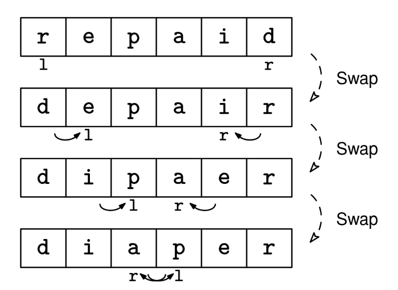

Reverse an array of letters, arr, in place using O(1) extra space.

Example 1:
Input: arr = ['h', 'e', 'l', 'l', 'o']
Output: ['o', 'l', 'l', 'e', 'h']

Example 2:
Input: arr = ['a']
Output: ['a']

Example 3:
Input: arr = []
Output: []
Constraints:

0 ≤ arr.length ≤ 10^5
arr contains only letters
See Solution
Problem 27.12 - Array Reversal: Solution
Python
If we were reversing arr into a new array, we could use a simple backward loop. However, when doing things in place, we need to worry about writing over elements that we still need to move -- we cannot simply write the first element to the final position because the element at the final position would get 'erased'.

Instead, we can use the inward pointers movement pattern. We start by swapping the first and final elements, then move the pointers inward.

We stop when the two pointers meet. If we kept going, we'd end up reversing the array back to its original state. For odd-length arrays, the middle element doesn't need to be moved.

Array reversal solution 1
Here's the implementation:

def reverse(arr):
  l, r = 0, len(arr) - 1
  while l < r:
    arr[l], arr[r] = arr[r], arr[l]
    l += 1
    r -= 1
Time & Space Analysis
n: the length of the array

Time: O(n) - we perform n/2 swaps, where each swap takes constant time

Extra space: O(1) - the reversal is done in-place using only two pointers

Tests
Here are some test cases to verify the solution:

def run_tests():
tests = [
# Test cases
(list("hello"), list("olleh")),
(list(""), list("")),
(list("a"), list("a")),
(list("ab"), list("ba")),
(list("abc"), list("cba")),
(list("abcd"), list("dcba")),
]
for arr, want in tests:
arr_copy = arr.copy() # Make a copy since reverse modifies in place
reverse(arr_copy)
assert arr_copy == want, f"\nreverse({arr}): got: {
arr_copy}, want: {want}\n"

run_tests()

function reverse(arr) {
let l = 0,
r = arr.length - 1;
while (l < r) {
[arr[l], arr[r]] = [arr[r], arr[l]];
l++;
r--;
}
}
Time & Space Analysis
n: the length of the array

Time: O(n) - we perform n/2 swaps, where each swap takes constant time

Extra space: O(1) - the reversal is done in-place using only two pointers

Tests
Here are some test cases to verify the solution:

function runTests() {
const tests = [
// Test cases
[Array.from("hello"), Array.from("olleh")],
[Array.from(""), Array.from("")],
[Array.from("a"), Array.from("a")],
[Array.from("ab"), Array.from("ba")],
[Array.from("abc"), Array.from("cba")],
[Array.from("abcd"), Array.from("dcba")],
];
for (const [arr, want] of tests) {
const arrCopy = [...arr]; // Make a copy since reverse modifies in place
reverse(arrCopy);
if (JSON.stringify(arrCopy) !== JSON.stringify(want)) {
throw new Error(
`\nreverse(${JSON.stringify(arr)}): got: ${JSON.stringify(arrCopy)}, want: ${JSON.stringify(want)}\n`,
);
}
}
}

runTests();

class Reverse {
public void solve(char[] arr) {
int l = 0, r = arr.length - 1;
while (l < r) {
char temp = arr[l];
arr[l] = arr[r];
arr[r] = temp;
l++;
r--;
}
}
}
Time & Space Analysis
n: the length of the array

Time: O(n) - we perform n/2 swaps, where each swap takes constant time

Extra space: O(1) - the reversal is done in-place using only two pointers

Tests
Here are some test cases to verify the solution:

class RunTests {
public void runTests() {
Object[][] tests = {
// Test cases
{ "hello".toCharArray(), "olleh".toCharArray() },
{ "".toCharArray(), "".toCharArray() },
{ "a".toCharArray(), "a".toCharArray() },
{ "ab".toCharArray(), "ba".toCharArray() },
{ "abc".toCharArray(), "cba".toCharArray() },
{ "abcd".toCharArray(), "dcba".toCharArray() },
};

    Reverse solution = new Reverse();
    for (Object[] test : tests) {
      char[] arr = Arrays.copyOf((char[]) test[0], ((char[]) test[0]).length);
      char[] want = (char[]) test[1];
      solution.solve(arr);
      if (!Arrays.equals(arr, want)) {
        throw new RuntimeException(String.format(
            "\nsolve(%s): got: %s, want: %s\n",
            Arrays.toString((char[]) test[0]), Arrays.toString(arr),
            Arrays.toString(want)));
      }
    }

}
}

public class Solution {
public static void main(String[] args) {
new RunTests().runTests();
}
}
