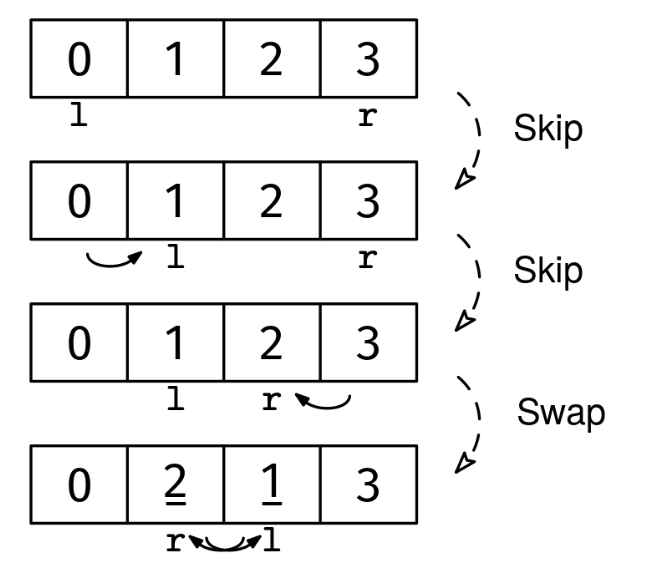

Given an array of integers arr, modify it in place so that all even numbers come before all odd numbers. The relative order of even numbers does not need to be maintained. The same goes for odd numbers.

Example 1:
Input: arr = [1, 2, 3, 4, 5]
Output: [2, 4, 1, 3, 5]
Explanation: There are other valid outputs, e.g. [4, 2, 3, 1, 5].

Example 2:
Input: arr = [5, 1, 3, 1, 5]
Output: [5, 1, 3, 1, 5]
Explanation: Since all numbers are odd, any ordering is valid.

Example 3:
Input: arr = [1, 3, 2, 4]
Output: [2, 4, 1, 3]
Explanation: Any arrangement where the even numbers (2, 4) come before the odd
numbers (1, 3) is valid.
Constraints:

The length of arr is at most 10^6
Each element in arr is an integer in the range [-10^9, 10^9]
See Solution
Problem 27.13 - Parity Sorting: Solution
Python
If we start reading from the left, we may encounter even or odd numbers. The even ones are already in the right place, while the odd ones must be moved to the end of the array. The opposite is true if we start reading from the right.

This leads us to the idea of using two pointers following the inward pointers movement pattern. We can use two pointers, l and r, moving in opposite directions while preserving the following loop invariant:

"Every number to the left of l is even, and every number to the right of r is odd"
If we maintain this invariant throughout the loop, when l and r meet or cross, the array will be in the desired order.

To maintain the invariant while always making progress, at each iteration we have the following cases:

If the left element is even, it's in the right place, so we skip it by moving l
If the right element is odd, it's in the right place, so we skip it by moving r
Otherwise, we have an odd number on the left and an even number on the right, so we swap them and move both pointers

Parity sorting solution 1
Here's the implementation:

def sort_even(arr):
  l, r = 0, len(arr) - 1
  while l < r:
    if arr[l] % 2 == 0:
      l += 1
    elif arr[r] % 2 == 1:
      r -= 1
    else:
      arr[l], arr[r] = arr[r], arr[l]
      l += 1
      r -= 1
Time & Space Analysis
n: the length of the array

Time: O(n) - each iteration moves at least one pointer closer to the center, and each iteration takes constant time

Extra space: O(1) - the sorting is done in-place using only constant extra space for the two pointers

Tests
To verify the solution is correct, we need to check two things:

The array contains the same elements as before (just rearranged)
All even numbers come before all odd numbers
Here's the validation function:

def is_valid_solution(arr, original):
  # Check that we have the same elements
  if sorted(arr) != sorted(original):
    return False

  # Find the boundary between even and odd numbers
  boundary = 0
  while boundary < len(arr) and arr[boundary] % 2 == 0:
    boundary += 1

  # Check that all numbers before boundary are even
  # and all numbers after are odd
  for i in range(boundary):
    if arr[i] % 2 != 0:
      return False
  for i in range(boundary, len(arr)):
    if arr[i] % 2 != 1:
      return False
  return True
Here are some test cases to verify the solution:

def run_tests():
tests = [ # Example 1 from the book
([1, 2, 3, 4, 5], [2, 4, 1, 3, 5]), # Example 2 from the book
([5, 1, 3, 1, 5], [5, 1, 3, 1, 5]), # Additional test cases
([], []),
([1], [1]),
([2], [2]),
([1, 2], [2, 1]),
([2, 1], [2, 1]),
([1, 3, 2, 4], [2, 4, 1, 3]),
]
for arr, example_solution in tests:
arr_copy = arr.copy() # Make a copy since sort_even modifies in place
sort_even(arr_copy)
assert is_valid_solution(arr_copy, arr), \
 f"\nsort_even({arr}): got: {arr_copy}, example solution: {
example_solution}\n"

run_tests()

function sortEven(arr) {
  let l = 0,
    r = arr.length - 1;
  while (l < r) {
    if (arr[l] % 2 === 0) {
      l++;
    } else if (arr[r] % 2 === 1) {
      r--;
    } else {
      [arr[l], arr[r]] = [arr[r], arr[l]];
      l++;
      r--;
    }
  }
}
Time & Space Analysis
n: the length of the array

Time: O(n) - each iteration moves at least one pointer closer to the center, and each iteration takes constant time

Extra space: O(1) - the sorting is done in-place using only constant extra space for the two pointers

Tests
To verify the solution is correct, we need to check two things:

The array contains the same elements as before (just rearranged)
All even numbers come before all odd numbers
Here's the validation function:

      function isValidSolution(arr, original) {

// Check that we have the same elements
if (
JSON.stringify([...arr].sort()) !== JSON.stringify([...original].sort())
) {
return false;
}

// Find the boundary between even and odd numbers
let boundary = 0;
while (boundary < arr.length && arr[boundary] % 2 === 0) {
boundary++;
}

// Check that all numbers before boundary are even
// and all numbers after are odd
for (let i = 0; i < boundary; i++) {
if (arr[i] % 2 !== 0) {
return false;
}
}
for (let i = boundary; i < arr.length; i++) {
if (arr[i] % 2 !== 1) {
return false;
}
}
return true;
}
Here are some test cases to verify the solution:

function runTests() {
const tests = [
// Example 1 from the book
[
[1, 2, 3, 4, 5],
[2, 4, 1, 3, 5],
],
// Example 2 from the book
[
[5, 1, 3, 1, 5],
[5, 1, 3, 1, 5],
],
// Additional test cases
[[], []],
[[1], [1]],
[[2], [2]],
[
[1, 2],
[2, 1],
],
[
[2, 1],
[2, 1],
],
[
[1, 3, 2, 4],
[2, 4, 1, 3],
],
];
for (const [arr, exampleSolution] of tests) {
const arrCopy = [...arr]; // Make a copy since sortEven modifies in place
sortEven(arrCopy);
if (!isValidSolution(arrCopy, arr)) {
throw new Error(
`\nsortEven(${JSON.stringify(arr)}): got: ${JSON.stringify(arrCopy)}, example solution: ${JSON.stringify(exampleSolution)}\n`,
);
}
}
}

runTests();
class SortEven {
public void solve(int[] arr) {
int l = 0, r = arr.length - 1;
while (l < r) {
if (arr[l] % 2 == 0) {
l++;
} else if (arr[r] % 2 == 1) {
r--;
} else {
int temp = arr[l];
arr[l] = arr[r];
arr[r] = temp;
l++;
r--;
}
}
}
}
Time & Space Analysis
n: the length of the array

Time: O(n) - each iteration moves at least one pointer closer to the center, and each iteration takes constant time

Extra space: O(1) - the sorting is done in-place using only constant extra space for the two pointers

Tests
To verify the solution is correct, we need to check two things:

The array contains the same elements as before (just rearranged)
All even numbers come before all odd numbers
Here's the validation function:

class IsValidSolution {
public boolean solve(int[] arr, int[] original) {
// Check that we have the same elements
int[] sortedArr = Arrays.copyOf(arr, arr.length);
int[] sortedOriginal = Arrays.copyOf(original, original.length);
Arrays.sort(sortedArr);
Arrays.sort(sortedOriginal);
if (!Arrays.equals(sortedArr, sortedOriginal)) {
return false;
}

    // Find the boundary between even and odd numbers
    int boundary = 0;
    while (boundary < arr.length && arr[boundary] % 2 == 0) {
      boundary++;
    }

    // Check that all numbers before boundary are even
    // and all numbers after are odd
    for (int i = 0; i < boundary; i++) {
      if (arr[i] % 2 != 0) {
        return false;
      }
    }
    for (int i = boundary; i < arr.length; i++) {
      if (arr[i] % 2 != 1) {
        return false;
      }
    }
    return true;

}
}
Here are some test cases to verify the solution:

class RunTests {
public void solve() {
Object[][] tests = {
// Example 1 from the book
{ new int[] { 1, 2, 3, 4, 5 }, new int[] { 2, 4, 1, 3, 5 } },
// Example 2 from the book
{ new int[] { 5, 1, 3, 1, 5 }, new int[] { 5, 1, 3, 1, 5 } },
// Additional test cases
{ new int[] {}, new int[] {} },
{ new int[] { 1 }, new int[] { 1 } },
{ new int[] { 2 }, new int[] { 2 } },
{ new int[] { 1, 2 }, new int[] { 2, 1 } },
{ new int[] { 2, 1 }, new int[] { 2, 1 } },
{ new int[] { 1, 3, 2, 4 }, new int[] { 2, 4, 1, 3 } },
};

    SortEven sorter = new SortEven();
    IsValidSolution validator = new IsValidSolution();

    for (Object[] test : tests) {
      int[] arr = Arrays.copyOf((int[]) test[0], ((int[]) test[0]).length);
      int[] example_solution = (int[]) test[1];
      sorter.solve(arr);
      if (!validator.solve(arr, (int[]) test[0])) {
        throw new RuntimeException(String.format(
            "\nsort_even(%s): got: %s, example solution: %s\n",
            Arrays.toString((int[]) test[0]), Arrays.toString(arr),
            Arrays.toString(example_solution)));
      }
    }

}
}

public class Solution {
public static void main(String[] args) {
new RunTests().runTests();
}
}
