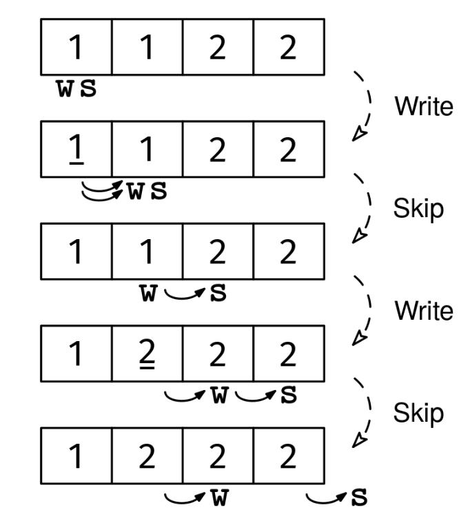

Given a sorted array of integers, arr, remove duplicates in place while preserving the order, and return the number of unique elements. It doesn't matter what remains in arr beyond the unique elements.

Example 1:
Input: arr = [1, 2, 2, 3, 3, 3, 5]
Output: 4
After the operation, the first 4 elements should be [1, 2, 3, 5]
The last 3 values could be anything

Example 2:
Input: arr = []
Output: 0
After the operation, the array remains empty

Example 3:
Input: arr = [1, 1, 1]
Output: 1
After the operation, the first element should be [1]
The last 2 values could be anything.
Constraints:

The array is sorted in non-decreasing order
The length of arr is at most 10^6
See Solution
Problem 27.14 - In-Place Duplicate Removal: Solution
Python
Since the array is sorted, duplicates will always be adjacent to each other.

We can use the 'seeker and writer' two-pointer recipe:

seeker_writer_recipe(arr)
  seeker, writer = 0, 0
  while seeker < len(arr)
    if we need to keep arr[seeker]
      arr[writer] = arr[seeker]
      advance writer and seeker
    else
      only advance seeker
The seeker (s) looks for the next unique element, while the writer (w) stays at the first position that hasn't been written yet.

For each position s, we need to determine if the current element should be kept. An element should be kept if either:

It's the first element (s == 0), or
It's different from the previous element (arr[s] != arr[s-1])
When we find an element that should be kept, we write it to position w and increment w. Regardless of whether we keep the current element, we always increment s to continue scanning.

At the end, w represents both the number of unique elements and the position after the last unique element written.

In-place duplicate removal solution 1
Here's the implementation:

def remove_duplicates(arr):
  s, w = 0, 0
  while s < len(arr):
    must_keep = s == 0 or arr[s] != arr[s - 1]
    if must_keep:
      arr[w] = arr[s]
      w += 1
    s += 1
  return w
When the two pointers point to the same element, the assignment arr[w] = arr[s] has no effect because the element is already in the right position. That is fine -- we still make progress by advancing both pointers.

Time & Space Analysis
n: the length of the array

Time: O(n) - the seeker advances at each iteration, and each iteration takes O(1) time, so the total runtime is linear on the size of the input array

Extra space: O(1) - the removal is done in-place using only constant extra space for the two pointers

Tests
Here are some test cases to verify the solution:

def run_tests():
  tests = [
      # Example from the book
      ([1, 2, 2, 3, 3, 3, 5], 4, [1, 2, 3, 5]),
      # Additional test cases
      ([], 0, []),
      ([1], 1, [1]),
      ([1, 1], 1, [1]),
      ([1, 2], 2, [1, 2]),
      ([1, 1, 1], 1, [1]),
      ([1, 2, 2, 2, 3], 3, [1, 2, 3]),
  ]
  for arr, want_len, want_prefix in tests:
    arr_copy = arr.copy()  # Make a copy since remove_duplicates modifies in place
    got_len = remove_duplicates(arr_copy)
    assert got_len == want_len, \
        f"\nremove_duplicates({arr}): got length: {
            got_len}, want length: {want_len}\n"
    assert arr_copy[:want_len] == want_prefix, \
        f"\nremove_duplicates({arr}): got prefix: {
        arr_copy[:want_len]}, want prefix: {want_prefix}\n"

run_tests()

function removeDuplicates(arr) {
  let s = 0,
    w = 0;
  while (s < arr.length) {
    const mustKeep = s === 0 || arr[s] !== arr[s - 1];
    if (mustKeep) {
      arr[w] = arr[s];
      w++;
    }
    s++;
  }
  return w;
}
When the two pointers point to the same element, the assignment arr[w] = arr[s] has no effect because the element is already in the right position. That is fine -- we still make progress by advancing both pointers.

Time & Space Analysis
n: the length of the array

Time: O(n) - the seeker advances at each iteration, and each iteration takes O(1) time, so the total runtime is linear on the size of the input array

Extra space: O(1) - the removal is done in-place using only constant extra space for the two pointers

Tests
Here are some test cases to verify the solution:

function runTests() {
  const tests = [
    // Example from the book
    [[1, 2, 2, 3, 3, 3, 5], 4, [1, 2, 3, 5]],
    // Additional test cases
    [[], 0, []],
    [[1], 1, [1]],
    [[1, 1], 1, [1]],
    [[1, 2], 2, [1, 2]],
    [[1, 1, 1], 1, [1]],
    [[1, 2, 2, 2, 3], 3, [1, 2, 3]],
  ];
  for (const [arr, wantLen, wantPrefix] of tests) {
    const arrCopy = [...arr]; // Make a copy since removeDuplicates modifies in place
    const gotLen = removeDuplicates(arrCopy);
    if (gotLen !== wantLen) {
      throw new Error(
        `\nremoveDuplicates(${JSON.stringify(arr)}): got length: ${gotLen}, want length: ${wantLen}\n`,
      );
    }
    if (
      JSON.stringify(arrCopy.slice(0, wantLen)) !== JSON.stringify(wantPrefix)
    ) {
      throw new Error(
        `\nremoveDuplicates(${JSON.stringify(arr)}): got prefix: ${JSON.stringify(arrCopy.slice(0, wantLen))}, want prefix: ${JSON.stringify(wantPrefix)}\n`,
      );
    }
  }
}

runTests();

class RemoveDuplicates {
  public int solve(int[] arr) {
    int s = 0, w = 0;
    while (s < arr.length) {
      boolean mustKeep = s == 0 || arr[s] != arr[s - 1];
      if (mustKeep) {
        arr[w] = arr[s];
        w++;
      }
      s++;
    }
    return w;
  }
}
When the two pointers point to the same element, the assignment arr[w] = arr[s] has no effect because the element is already in the right position. That is fine -- we still make progress by advancing both pointers.

Time & Space Analysis
n: the length of the array

Time: O(n) - the seeker advances at each iteration, and each iteration takes O(1) time, so the total runtime is linear on the size of the input array

Extra space: O(1) - the removal is done in-place using only constant extra space for the two pointers

Tests
Here are some test cases to verify the solution:

class RunTests {
  public void runTests() {
    Object[][] tests = {
        // Example from the book
        { new int[] { 1, 2, 2, 3, 3, 3, 5 }, 4,
            new int[] { 1, 2, 3, 5 } },
        // Additional test cases
        { new int[] {}, 0, new int[] {} },
        { new int[] { 1 }, 1, new int[] { 1 } },
        { new int[] { 1, 1 }, 1, new int[] { 1 } },
        { new int[] { 1, 2 }, 2, new int[] { 1, 2 } },
        { new int[] { 1, 1, 1 }, 1, new int[] { 1 } },
        { new int[] { 1, 2, 2, 2, 3 }, 3, new int[] { 1, 2, 3 } },
    };

    RemoveDuplicates solution = new RemoveDuplicates();
    for (Object[] test : tests) {
      int[] arr = Arrays.copyOf((int[]) test[0], ((int[]) test[0]).length);
      int wantLen = (int) test[1];
      int[] wantPrefix = (int[]) test[2];
      int gotLen = solution.solve(arr);
      if (gotLen != wantLen) {
        throw new RuntimeException(String.format(
            "\nsolve(%s): got length: %d, want length: %d\n",
            Arrays.toString((int[]) test[0]), gotLen, wantLen));
      }
      if (!Arrays.equals(Arrays.copyOf(arr, wantLen), wantPrefix)) {
        throw new RuntimeException(String.format(
            "\nsolve(%s): got prefix: %s, want prefix: %s\n",
            Arrays.toString((int[]) test[0]),
            Arrays.toString(Arrays.copyOf(arr, wantLen)),
            Arrays.toString(wantPrefix)));
      }
    }
  }
}

public class Solution {
  public static void main(String[] args) {
    new RunTests().runTests();
  }
}