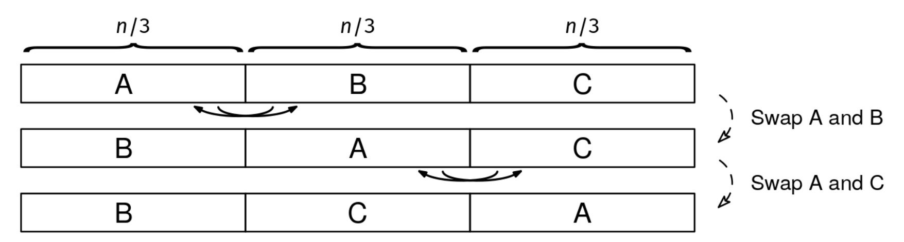
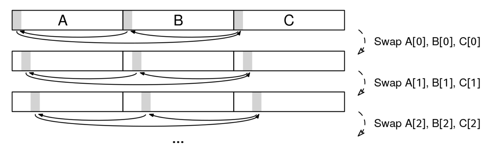

We are given an array of letters, arr, with a length, n, which is a multiple of 3. The goal is to modify arr in place to move the prefix of length n/3 to the end and the suffix of length 2n/3 to the beginning.

Example 1:
Input: arr = ['b', 'a', 'd', 'r', 'e', 'v', 'i', 'e', 'w']
Output: ['r', 'e', 'v', 'i', 'e', 'w', 'b', 'a', 'd']
Explanation: The first third (bad) moves to the end, while the rest (review)
stays in order.

Example 2:
Input: arr = ['a', 'b', 'c']
Output: ['b', 'c', 'a']

Example 3:
Input: arr = []
Output: []
Constraints:

The length of arr is divisible by 3
0 ≤ arr.length ≤ 10^6
arr[i] is a letter
See Solution
Problem 27.17 - Prefix-Suffix Swap: Solution
Python
The challenge in this problem is that the prefix and suffix we need to swap have different lengths. We'll show three different ways of solving this problem.

Since swapping arrays of the same length is simpler, we can break down the problem into two steps, where we swap equal-length arrays at each step:

Prefix suffix swap solution 1
First we swap the first third with the second third, and then we swap the (new) second third with the final third. At the end, each third ends in the correct position.

We can do 3-way swaps:
Prefix suffix swap solution 2
Using three pointers, we can swap one element from each third at the same time.

Solutions 1 and 2 wouldn't work if the length of the prefix wasn't exactly n/3. There is a trick that allows you to reverse a prefix of any length in place.
Imagine we want to swap the prefix of the first k letters to the end. We do it in three steps:

a. Reverse arr in place (see Problem 27.12: Array Reversal). This puts the suffix before the prefix, but both are now reversed. b. Reverse the final k letters of arr. This fixes the order of what was initially the prefix. c. Reverse the first n-k letters of arr. This fixes the order of what was initially the suffix.

For instance, if we have "outbreak" and we need to move "out" to the end, we can:

(a) reverse the whole thing to get "kaerbtuo"
(b) reverse the final three letters to get "kaerbout"
(c) reverse the first five letters to get "breakout"
Here's the implementation of the third approach:

def swap_prefix_suffix(arr):
  if len(arr) == 0:
    return

  n = len(arr)

  # Reverse the whole array
  l, r = 0, n - 1
  while l < r:
    arr[l], arr[r] = arr[r], arr[l]
    l += 1
    r -= 1

  # Reverse the last n/3 elements
  l, r = 2 * n // 3, n - 1
  while l < r:
    arr[l], arr[r] = arr[r], arr[l]
    l += 1
    r -= 1

  # Reverse the first 2n/3 elements
  l, r = 0, (2 * n // 3) - 1
  while l < r:
    arr[l], arr[r] = arr[r], arr[l]
    l += 1
    r -= 1
Time & Space Analysis
n: the length of the array

Time: O(n) - the algorithm performs three array reversals: the entire array, the last n/3 elements, and the first 2n/3 elements. Each reversal takes O(n) time

Extra space: O(1) - the swapping is done in-place using only constant extra space

Tests
Here are some test cases to verify the solution:

def run_tests():
tests = [ # Example from the book
(list("badreview"), list("reviewbad")), # Additional test cases
([], []),
(list("abc"), list("bca")),
(list("abcdef"), list("cdefab")),
(list("123456789"), list("456789123")),
(list("aaabbbccc"), list("bbbcccaaa")),
]
for arr, want in tests:
arr_copy = arr.copy() # Make a copy since swap_prefix_suffix modifies in place
swap_prefix_suffix(arr_copy)
assert arr_copy == want, f"\nswap_prefix_suffix({arr}): got: {
arr_copy}, want: {want}\n"

run_tests()

function swapPrefixSuffix(arr) {
  if (arr.length === 0) {
    return;
  }

  const n = arr.length;

  // Reverse the whole array
  let l = 0,
    r = n - 1;
  while (l < r) {
    [arr[l], arr[r]] = [arr[r], arr[l]];
    l++;
    r--;
  }

  // Reverse the last n/3 elements
  l = Math.floor((2 * n) / 3);
  r = n - 1;
  while (l < r) {
    [arr[l], arr[r]] = [arr[r], arr[l]];
    l++;
    r--;
  }

  // Reverse the first 2n/3 elements
  l = 0;
  r = Math.floor((2 * n) / 3) - 1;
  while (l < r) {
    [arr[l], arr[r]] = [arr[r], arr[l]];
    l++;
    r--;
  }
}
Time & Space Analysis
n: the length of the array

Time: O(n) - the algorithm performs three array reversals: the entire array, the last n/3 elements, and the first 2n/3 elements. Each reversal takes O(n) time

Extra space: O(1) - the swapping is done in-place using only constant extra space

Tests
Here are some test cases to verify the solution:

function runTests() {
  const tests = [
    // Example from the book
    [Array.from("badreview"), Array.from("reviewbad")],
    // Additional test cases
    [[], []],
    [Array.from("abc"), Array.from("bca")],
    [Array.from("abcdef"), Array.from("cdefab")],
    [Array.from("123456789"), Array.from("456789123")],
    [Array.from("aaabbbccc"), Array.from("bbbcccaaa")],
  ];
  for (const [arr, want] of tests) {
    const arrCopy = [...arr]; // Make a copy since swapPrefixSuffix modifies in place
    swapPrefixSuffix(arrCopy);
    if (JSON.stringify(arrCopy) !== JSON.stringify(want)) {
      throw new Error(
        `\nswapPrefixSuffix(${JSON.stringify(arr)}): got: ${JSON.stringify(arrCopy)}, want: ${JSON.stringify(want)}\n`,
      );
    }
  }
}

runTests();
class SwapPrefixSuffix {
  public void solve(char[] arr) {
    if (arr.length == 0) {
      return;
    }

    int n = arr.length;

    // Reverse the whole array
    int l = 0, r = n - 1;
    while (l < r) {
      char temp = arr[l];
      arr[l] = arr[r];
      arr[r] = temp;
      l++;
      r--;
    }
    
    // Reverse the last n/3 elements
    l = 2 * n / 3;
    r = n - 1;
    while (l < r) {
      char temp = arr[l];
      arr[l] = arr[r];
      arr[r] = temp;
      l++;
      r--;
    }

    // Reverse the first 2n/3 elements
    l = 0;
    r = (2 * n / 3) - 1;
    while (l < r) {
      char temp = arr[l];
      arr[l] = arr[r];
      arr[r] = temp;
      l++;
      r--;
    }
  }
}
Time & Space Analysis
n: the length of the array

Time: O(n) - the algorithm performs three array reversals: the entire array, the last n/3 elements, and the first 2n/3 elements. Each reversal takes O(n) time

Extra space: O(1) - the swapping is done in-place using only constant extra space

Tests
Here are some test cases to verify the solution:

class RunTests {
  public void runTests() {
    Object[][] tests = {
        // Example from the book
        { "badreview".toCharArray(), "reviewbad".toCharArray() },
        // Additional test cases
        { "".toCharArray(), "".toCharArray() },
        { "abc".toCharArray(), "bca".toCharArray() },
        { "abcdef".toCharArray(), "cdefab".toCharArray() },
        { "123456789".toCharArray(), "456789123".toCharArray() },
        { "aaabbbccc".toCharArray(), "bbbcccaaa".toCharArray() },
    };

    SwapPrefixSuffix solution = new SwapPrefixSuffix();
    for (Object[] test : tests) {
      char[] arr = Arrays.copyOf((char[]) test[0], ((char[]) test[0]).length);
      char[] want = (char[]) test[1];
      solution.solve(arr);
      if (!Arrays.equals(arr, want)) {
        throw new RuntimeException(String.format(
            "\nsolve(%s): got: %s, want: %s\n",
            Arrays.toString((char[]) test[0]), Arrays.toString(arr),
            Arrays.toString(want)));
      }
    }
  }
}

public class Solution {
  public static void main(String[] args) {
    new RunTests().runTests();
  }
}