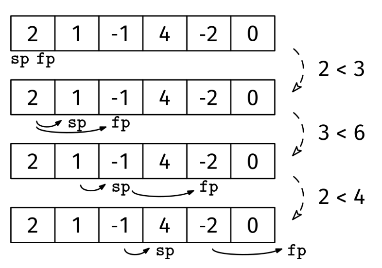

Given an array of integers, arr, where the length, n, is even, return whether the following condition holds for every k in the range 1 ≤ k <= n/2: "the sum of the first k elements is smaller than the sum of the first 2k elements." If this condition is false for any k in the range, return false.

Example 1: arr = [1, 2, 2, -1]
Output: True. The prefix [1] has a smaller sum than the prefix [1, 2], and the
prefix [1, 2] has a smaller sum than the prefix [1, 2, 2, -1]. The other
prefixes have length > n/2.

Example 2: arr = [1, 2, -2, 1, 3, 5]
Output: False. The prefix [1, 2] has a larger sum than the prefix [1, 2, -2,
1].
Constraints:

len(arr) is even
0 ≤ len(arr) ≤ 10^6
-10^9 ≤ arr[i] ≤ 10^9
See Solution
Problem 27.2 - Smaller Prefixes: Solution
Python
The naive solution would be to iterate over all values of k from 1 to n/2, and for each value, compute and compare the sums of the two prefixes. This would take O(n^2) time. Instead, we can use a slow pointer, sp, and a fast pointer, fp, where fp moves twice as fast as sp.

Smaller prefixes solution 1
The runtime is linear in the size of the input array, since each pointer visits each element at most once.

Here's the implementation:

def smaller_prefixes(arr):
  sp, fp = 0, 0
  slow_sum, fast_sum = 0, 0
  while fp < len(arr):
    slow_sum += arr[sp]
    fast_sum += arr[fp] + arr[fp + 1]
    if slow_sum >= fast_sum:
      return False
    sp += 1
    fp += 2
  return True
Time & Space Analysis
n: the length of the array

Time: O(n) - both pointers traverse the array once, with the fast pointer moving twice as fast as the slow pointer. Each element is visited at most once by each pointer

Extra space: O(1) - only using constant extra space for the two pointers and running sums

Tests
Here are some test cases to verify the solution:

def run_tests():
tests = [ # Example 1 from the book
([1, 2, 2, -1], True), # Example 2 from the book
([1, 2, -2, 1, 3, 5], False), # Additional test cases
([0, 3, 7, 12, 10, 5, 0, 1], True),
([], True),
([1, 2], True),
([2, 1], True),
([-2, 1, -4, 5, -3, 7], True),
([-2, 1, -14, 8, -3, 2], False),
]
for arr, want in tests:
got = smaller_prefixes(arr)
assert got == want, f"\nsmaller_prefixes({arr}): got: {got}, want: {want}\n"

run_tests()

function smallerPrefixes(arr) {
let sp = 0,
fp = 0;
let slowSum = 0,
fastSum = 0;
while (fp < arr.length) {
slowSum += arr[sp];
fastSum += arr[fp] + arr[fp + 1];
if (slowSum >= fastSum) {
return false;
}
sp++;
fp += 2;
}
return true;
}
Time & Space Analysis
n: the length of the array

Time: O(n) - both pointers traverse the array once, with the fast pointer moving twice as fast as the slow pointer. Each element is visited at most once by each pointer

Extra space: O(1) - only using constant extra space for the two pointers and running sums

Tests
Here are some test cases to verify the solution:

function runTests() {
const tests = [
// Example 1 from the book
[[1, 2, 2, -1], true],
// Example 2 from the book
[[1, 2, -2, 1, 3, 5], false],
// Additional test cases
[[0, 3, 7, 12, 10, 5, 0, 1], true],
[[], true],
[[1, 2], true],
[[2, 1], true],
[[-2, 1, -4, 5, -3, 7], true],
[[-2, 1, -14, 8, -3, 2], false],
];
for (const [arr, want] of tests) {
const got = smallerPrefixes(arr);
if (got !== want) {
throw new Error(
`\nsmallerPrefixes(${JSON.stringify(arr)}): got: ${got}, want: ${want}\n`,
);
}
}
}

runTests();

class SmallerPrefixes {
public boolean solve(int[] arr) {
int sp = 0, fp = 0;
int slowSum = 0, fastSum = 0;
while (fp < arr.length) {
slowSum += arr[sp];
fastSum += arr[fp] + arr[fp + 1];
if (slowSum >= fastSum) {
return false;
}
sp++;
fp += 2;
}
return true;
}
}
Time & Space Analysis
n: the length of the array

Time: O(n) - both pointers traverse the array once, with the fast pointer moving twice as fast as the slow pointer. Each element is visited at most once by each pointer

Extra space: O(1) - only using constant extra space for the two pointers and running sums

Tests
Here are some test cases to verify the solution:

class RunTests {
public void runTests() {
Object[][] tests = {
// Example 1 from the book
{ new int[] { 1, 2, 2, -1 }, true },
// Example 2 from the book
{ new int[] { 1, 2, -2, 1, 3, 5 }, false },
// Additional test cases
{ new int[] { 0, 3, 7, 12, 10, 5, 0, 1 }, true },
{ new int[] {}, true },
{ new int[] { 1, 2 }, true },
{ new int[] { 2, 1 }, true },
{ new int[] { -2, 1, -4, 5, -3, 7 }, true },
{ new int[] { -2, 1, -14, 8, -3, 2 }, false },
};

    SmallerPrefixes solution = new SmallerPrefixes();
    for (Object[] test : tests) {
      int[] arr = (int[]) test[0];
      boolean want = (boolean) test[1];
      boolean got = solution.solve(arr);
      if (got != want) {
        throw new RuntimeException(String.format(
            "\nsolve(%s): got: %b, want: %b\n",
            Arrays.toString(arr), got, want));
      }
    }

}
}

public class Solution {
public static void main(String[] args) {
new RunTests().runTests();
}
}
