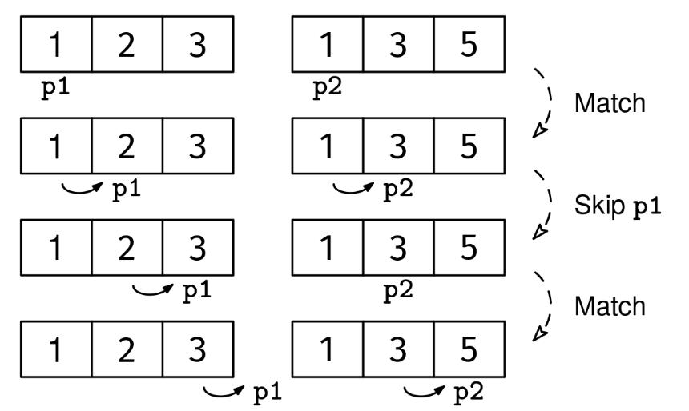

Given two sorted arrays, arr1 and arr2, return their intersection.

The intersection is a new array that contains all elements that appear in both arrays, in sorted order, including duplicates.

Example 1:
Input:
arr1 = [1, 2, 3]
arr2 = [1, 3, 5]
Output: [1, 3]
Explanation: 1 and 3 appear in both arrays.

Example 2:
Input:
arr1 = [1, 1, 1]
arr2 = [1, 1]
Output: [1, 1]
Explanation: Two 1s appear in both arrays.

Example 3:
Input:
arr1 = [1, 2, 2, 3]
arr2 = []
Output: []
Constraints:

The input arrays are sorted in ascending order
0 ≤ arr1.length, arr2.length ≤ 10^6
-10^9 ≤ arr1[i], arr2[i] ≤ 10^9
See Solution
Problem 27.3 - Array Intersection: Solution
Python
We can use a pointer for each input array. If both point to the same value, we can add it to the output. The key detail to make sure we don't miss any elements is that both arrays are sorted, so elements to the right of the pointers will be the same or larger. This means we can skip over the smallest element among the two pointers, as that element won't appear again in the other array.

The algorithm uses two pointers:

p1: current position in arr1
p2: current position in arr2
At each step:

If the elements at both pointers are equal:
Add the element to the result
Move both pointers forward
If the element in arr1 is smaller:
Move p1 forward (since we won't find this element in arr2)
If the element in arr2 is smaller:
Move p2 forward (since we won't find this element in arr1)
We stop when either array is exhausted.

Array intersection solution 1
The key for the analysis is that we only scan each array once. The result is automatically sorted, so we don't have a 'sorting' bottleneck. The final runtime is linear in the size of the input arrays.

Here's the implementation:

def common_elements(arr1, arr2):
  p1, p2 = 0, 0
  res = []
  while p1 < len(arr1) and p2 < len(arr2):
    if arr1[p1] == arr2[p2]:
      res.append(arr1[p1])
      p1 += 1
      p2 += 1
    elif arr1[p1] < arr2[p2]:
      p1 += 1
    else:
      p2 += 1
  return res
Time & Space Analysis
n1: the length of arr1

n2: the length of arr2

Time: O(n1 + n2) - each element in both arrays is visited at most once by the two pointers

Extra space: O(min(n1, n2)) - for the output array

Tests
Here are some test cases to verify the solution:

def run_tests():
tests = [ # Example 1 from the book
([1, 2, 3], [1, 3, 5], [1, 3]), # Example 2 from the book
([1, 1, 1], [1, 1], [1, 1]), # Additional test cases
([], [], []),
([1], [], []),
([], [1], []),
([1], [1], [1]),
([1, 2, 3], [4, 5, 6], []),
([1, 2, 2, 3], [2, 2, 3], [2, 2, 3]),
]
for arr1, arr2, want in tests:
got = common_elements(arr1, arr2)
assert got == want, f"\ncommon_elements({arr1}, {arr2}): got: {
got}, want: {want}\n"

run_tests()

function commonElements(arr1, arr2) {
let p1 = 0,
p2 = 0;
const res = [];
while (p1 < arr1.length && p2 < arr2.length) {
if (arr1[p1] === arr2[p2]) {
res.push(arr1[p1]);
p1++;
p2++;
} else if (arr1[p1] < arr2[p2]) {
p1++;
} else {
p2++;
}
}
return res;
}
Time & Space Analysis
n1: the length of arr1

n2: the length of arr2

Time: O(n1 + n2) - each element in both arrays is visited at most once by the two pointers

Extra space: O(min(n1, n2)) - for the output array

Tests
Here are some test cases to verify the solution:

function runTests() {
const tests = [
// Example 1 from the book
[
[1, 2, 3],
[1, 3, 5],
[1, 3],
],
// Example 2 from the book
[
[1, 1, 1],
[1, 1],
[1, 1],
],
// Additional test cases
[[], [], []],
[[1], [], []],
[[], [1], []],
[[1], [1], [1]],
[[1, 2, 3], [4, 5, 6], []],
[
[1, 2, 2, 3],
[2, 2, 3],
[2, 2, 3],
],
];
for (const [arr1, arr2, want] of tests) {
const got = commonElements(arr1, arr2);
if (JSON.stringify(got) !== JSON.stringify(want)) {
throw new Error(
`\ncommonElements(${JSON.stringify(arr1)}, ${JSON.stringify(arr2)}): got: ${JSON.stringify(got)}, want: ${JSON.stringify(want)}\n`,
);
}
}
return true;
}

runTests();

class CommonElements {
public int[] solve(int[] arr1, int[] arr2) {
int p1 = 0, p2 = 0;
List<Integer> res = new ArrayList<>();
while (p1 < arr1.length && p2 < arr2.length) {
if (arr1[p1] == arr2[p2]) {
res.add(arr1[p1]);
p1++;
p2++;
} else if (arr1[p1] < arr2[p2]) {
p1++;
} else {
p2++;
}
}
return res.stream().mapToInt(i -> i).toArray();
}
}
Time & Space Analysis
n1: the length of arr1

n2: the length of arr2

Time: O(n1 + n2) - each element in both arrays is visited at most once by the two pointers

Extra space: O(min(n1, n2)) - for the output array

Tests
Here are some test cases to verify the solution:

class RunTests {
public void runTests() {
Object[][] tests = {
// Example 1 from the book
{ new int[] { 1, 2, 3 }, new int[] { 1, 3, 5 }, new int[] { 1, 3 } },
// Example 2 from the book
{ new int[] { 1, 1, 1 }, new int[] { 1, 1 }, new int[] { 1, 1 } },
// Additional test cases
{ new int[] {}, new int[] {}, new int[] {} },
{ new int[] { 1 }, new int[] {}, new int[] {} },
{ new int[] {}, new int[] { 1 }, new int[] {} },
{ new int[] { 1 }, new int[] { 1 }, new int[] { 1 } },
{ new int[] { 1, 2, 3 }, new int[] { 4, 5, 6 }, new int[] {} },
{ new int[] { 1, 2, 2, 3 }, new int[] { 2, 2, 3 },
new int[] { 2, 2, 3 } },
};

    CommonElements solution = new CommonElements();
    for (Object[] test : tests) {
      int[] arr1 = (int[]) test[0];
      int[] arr2 = (int[]) test[1];
      int[] want = (int[]) test[2];
      int[] got = solution.solve(arr1, arr2);
      if (!Arrays.equals(got, want)) {
        throw new RuntimeException(String.format(
            "\nsolve(%s, %s): got: %s, want: %s\n",
            Arrays.toString(arr1), Arrays.toString(arr2),
            Arrays.toString(got), Arrays.toString(want)));
      }
    }

}
}

public class Solution {
public static void main(String[] args) {
new RunTests().runTests();
}
}
