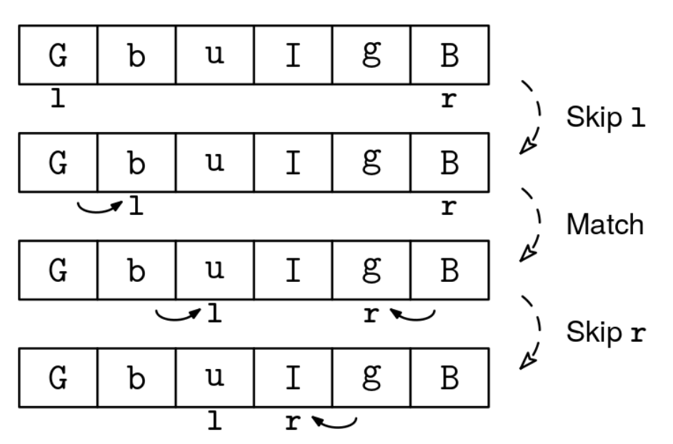

Given a string, s, where half of the letters are lowercase and half uppercase, return whether the word formed by the lowercase letters is the same as the reverse of the word formed by the uppercase letters. Assume that the length, n, is even.

Example 1:
Input: s = "haDrRAHd"
Output: true
Explanation:
- Lowercase letters: "hard"
- Uppercase letters: "DRAH"
- When reversed, "DRAH" becomes "HARD", which matches "hard" ignoring case.

Example 2:
Input: s = "haHrARDd"
Output: false
Explanation:
- Lowercase letters: "hard"
- Uppercase letters: "HARD"
- When reversed, "HARD" becomes "DRAH", which doesn't match "hard".

Example 3:
Input: s = "BbbB"
Output: true
Explanation:
- Lowercase letters: "bb"
- Uppercase letters: "BB"
- When reversed, "BB" becomes "BB", which matches "bb" ignoring case.
Constraints:

0 ≤ s.length ≤ 10^6
s contains only uppercase and lowercase English letters
See Solution
Problem 27.5 - Reverse Case Match: Solution
Python
We need to read two words, a left-to-right one and a right-to-left one, so we can use 'inward pointers'. That means moving two pointers, l and r, starting from both ends of the string.

Next, we need to figure out the case analysis and the actions to take in each case. Some people find it helpful to state a loop invariant upfront and use it to guide a clean implementation.

A loop invariant is a property that is true at the beginning of each iteration. For this problem, we can state this invariant:

"Lowercase letters to the left of l and uppercase letters to the right of r have already been matched to each other"
The invariant should be true at the beginning, so we can initialize l to 0 and r to len(s)-1.

Each iteration needs to:

maintain the loop invariant, and
make progress towards the end of the loop
This helps us think about how to design the case analysis and the actions to take:

If l points to an uppercase letter, we can skip it.
If r points to a lowercase letter, we can skip it.
If l points to a lowercase letter and r points to an uppercase letter, we see if they match.
Imagine we update our pointers in a way that maintains the invariant throughout every iteration, and eventually, we get to a point where either l or r finishes traversing the array. According to the invariant, we'll be in one of the following situations, depending on which variable reached the end:

if l is at len(s): All lowercase letters have been matched to uppercase letters
if r is at -1: All uppercase letters have been matched to lowercase letters
Since the statement guarantees that there is the same number of lowercase and uppercase letters, we are done!

Reverse case match solution 1
Here's the implementation:

def reverse_case_match(s):
  l, r = 0, len(s) - 1
  while l < len(s) and r >= 0:
    if not s[l].islower():
      l += 1
    elif not s[r].isupper():
      r -= 1
    else:
      if s[l] != s[r].lower():
        return False
      l += 1
      r -= 1
  return True
Time & Space Analysis
n: the length of the string

Time: O(n) - each character is visited at most once by each pointer as they move inward from opposite ends

Extra space: O(1) - only using constant extra space for the two pointers

Tests
Here are some test cases to verify the solution:

def run_tests():
  tests = [
      # Example 1 from the book
      ("haDrRAHd", True),
      # Example 2 from the book
      ("haHrARDd", False),
      # Additional test cases
      ("", True),
      ("aA", True),
      ("Aa", True),
      ("BbbB", True),
      ("abAB", False),
      ("abBA", True),
      ("helloworldHELLOWORLD", False),
  ]
  for s, want in tests:
    got = reverse_case_match(s)
    assert got == want, f"\nreverse_case_match({s}): got: {got}, want: {want}\n"

run_tests()

function reverseCaseMatch(s) {
  let l = 0,
    r = s.length - 1;
  while (l < s.length && r >= 0) {
    if (!/[a-z]/.test(s[l])) {
      l++;
    } else if (!/[A-Z]/.test(s[r])) {
      r--;
    } else {
      if (s[l] !== s[r].toLowerCase()) {
        return false;
      }
      l++;
      r--;
    }
  }
  return true;
}
Time & Space Analysis
n: the length of the string

Time: O(n) - each character is visited at most once by each pointer as they move inward from opposite ends

Extra space: O(1) - only using constant extra space for the two pointers

Tests
Here are some test cases to verify the solution:

function runTests() {
  const tests = [
    // Example 1 from the book
    ["haDrRAHd", true],
    // Example 2 from the book
    ["haHrARDd", false],
    // Additional test cases
    ["", true],
    ["aA", true],
    ["Aa", true],
    ["BbbB", true],
    ["abAB", false],
    ["abBA", true],
    ["helloworldHELLOWORLD", false],
  ];
  for (const [s, want] of tests) {
    const got = reverseCaseMatch(s);
    if (got !== want) {
      throw new Error(`\nreverseCaseMatch(${s}): got: ${got}, want: ${want}\n`);
    }
  }
}

runTests();
class ReverseCaseMatch {
  public boolean solve(String s) {
    int l = 0, r = s.length() - 1;
    while (l < s.length() && r >= 0) {
      if (!Character.isLowerCase(s.charAt(l))) {
        l++;
      } else if (!Character.isUpperCase(s.charAt(r))) {
        r--;
      } else {
        if (s.charAt(l) != Character.toLowerCase(s.charAt(r))) {
          return false;
        }
        l++;
        r--;
      }
    }
    return true;
  }
}
Time & Space Analysis
n: the length of the string

Time: O(n) - each character is visited at most once by each pointer as they move inward from opposite ends

Extra space: O(1) - only using constant extra space for the two pointers

Tests
Here are some test cases to verify the solution:

class RunTests {
  public void runTests() {
    Object[][] tests = {
        // Example 1 from the book
        { "haDrRAHd", true },
        // Example 2 from the book
        { "haHrARDd", false },
        // Additional test cases
        { "", true },
        { "aA", true },
        { "Aa", true },
        { "BbbB", true },
        { "abAB", false },
        { "abBA", true },
        { "helloworldHELLOWORLD", false },
    };

    ReverseCaseMatch solution = new ReverseCaseMatch();
    for (Object[] test : tests) {
      String s = (String) test[0];
      boolean want = (boolean) test[1];
      boolean got = solution.solve(s);
      if (got != want) {
        throw new RuntimeException(String.format(
            "\nsolve(%s): got: %b, want: %b\n",
            s, got, want));
      }
    }
  }
}

public class Solution {
  public static void main(String[] args) {
    new RunTests().runTests();
  }
}
