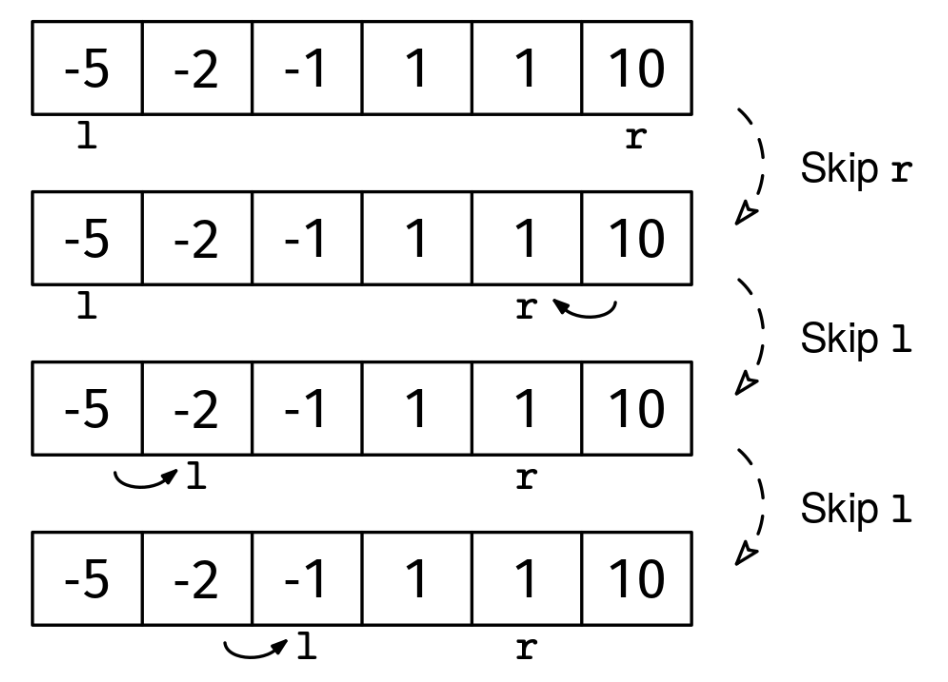

Given a sorted array of integers, arr, return whether there are two distinct indices, i and j, such that arr[i] + arr[j] = 0.

Example 1:
Input: arr = [-5, -2, -1, 1, 1, 10]
Output: true
Explanation: The elements -1 and 1 sum to zero.

Example 2:
Input: arr = [-3, 0, 0, 1, 2]
Output: true
Explanation: The two 0s sum to zero.

Example 3:
Input: arr = [-5, -3, -1, 0, 2, 4, 6]
Output: false
Explanation: No two elements sum to zero.
Constraints:

arr is sorted in ascending order
0 ≤ arr.length ≤ 10^6
-10^9 ≤ arr[i] ≤ 10^9
See Solution
Problem 27.7 - 2-Sum: Solution
Python
We need to find two numbers that are the opposite of each other, like -5 and 5. We have all the negative numbers at the beginning and all the positive numbers at the end, which suggests trying inward pointers.

We can compare the first and the last numbers, which are the smallest (most negative) and the largest. If they add to more than 0, like if arr[l] is -5 and arr[r] is 10, the largest number (10) is too large: we will not find any numbers that sum to -10, so we can skip over 10.

In the opposite case, where the sum is negative, we can skip over the most negative number by increasing l.

We can stop as soon as we find a pair that sums to 0 or when the pointers meet.

Two sum solution 1
Here's the implementation:

def two_sum(arr):
  l, r = 0, len(arr) - 1
  while l < r:
    if arr[l] + arr[r] > 0:
      r -= 1
    elif arr[l] + arr[r] < 0:
      l += 1
    else:
      return True
  return False
Time & Space Analysis
n: the length of the array

Time: O(n) - each element is visited by a pointer at most once as the pointers move inward

Extra space: O(1) - only using constant extra space for the two pointers

Tests
Here are some test cases to verify the solution:

def run_tests():
tests = [ # Example 1 from the book
([-5, -2, -1, 1, 1, 10], True), # Example 2 from the book
([-3, 0, 0, 1, 2], True), # Example 3 from the book
([-5, -3, -1, 0, 2, 4, 6], False), # Additional test cases
([], False),
([0], False),
([-1, 1], True),
([-2, -1, 0, 1], True),
([1, 2, 3, 4], False),
]
for arr, want in tests:
got = two_sum(arr)
assert got == want, f"\ntwo_sum({arr}): got: {got}, want: {want}\n"

run_tests()

function twoSum(arr) {
let l = 0,
r = arr.length - 1;
while (l < r) {
if (arr[l] + arr[r] > 0) {
r--;
} else if (arr[l] + arr[r] < 0) {
l++;
} else {
return true;
}
}
return false;
}
Time & Space Analysis
n: the length of the array

Time: O(n) - each element is visited by a pointer at most once as the pointers move inward

Extra space: O(1) - only using constant extra space for the two pointers

Tests
Here are some test cases to verify the solution:

function runTests() {
const tests = [
// Example 1 from the book
[[-5, -2, -1, 1, 1, 10], true],
// Example 2 from the book
[[-3, 0, 0, 1, 2], true],
// Example 3 from the book
[[-5, -3, -1, 0, 2, 4, 6], false],
// Additional test cases
[[], false],
[[0], false],
[[-1, 1], true],
[[-2, -1, 0, 1], true],
[[1, 2, 3, 4], false],
];
for (const [arr, want] of tests) {
const got = twoSum(arr);
if (got !== want) {
throw new Error(
`\ntwoSum(${JSON.stringify(arr)}): got: ${got}, want: ${want}\n`,
);
}
}
}

runTests();

class TwoSum {
public boolean solve(int[] arr) {
int l = 0, r = arr.length - 1;
while (l < r) {
if (arr[l] + arr[r] > 0) {
r--;
} else if (arr[l] + arr[r] < 0) {
l++;
} else {
return true;
}
}
return false;
}
}
Time & Space Analysis
n: the length of the array

Time: O(n) - each element is visited by a pointer at most once as the pointers move inward

Extra space: O(1) - only using constant extra space for the two pointers

Tests
Here are some test cases to verify the solution:

class RunTests {
public void runTests() {
Object[][] tests = {
// Example 1 from the book
{ new int[] { -5, -2, -1, 1, 1, 10 }, true },
// Example 2 from the book
{ new int[] { -3, 0, 0, 1, 2 }, true },
// Example 3 from the book
{ new int[] { -5, -3, -1, 0, 2, 4, 6 }, false },
// Additional test cases
{ new int[] {}, false },
{ new int[] { 0 }, false },
{ new int[] { -1, 1 }, true },
{ new int[] { -2, -1, 0, 1 }, true },
{ new int[] { 1, 2, 3, 4 }, false },
};

    TwoSum solution = new TwoSum();
    for (Object[] test : tests) {
      int[] arr = (int[]) test[0];
      boolean want = (boolean) test[1];
      boolean got = solution.solve(arr);
      if (got != want) {
        throw new RuntimeException(String.format(
            "\nsolve(%s): got: %b, want: %b\n",
            Arrays.toString(arr), got, want));
      }
    }

}
}

public class Solution {
public static void main(String[] args) {
new RunTests().runTests();
}
}
