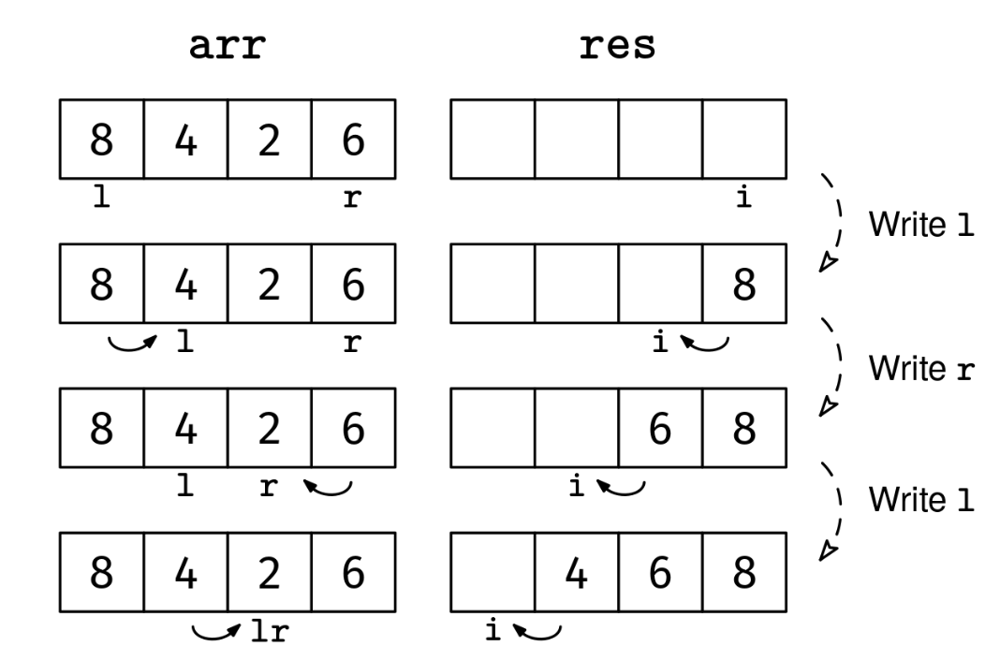

A valley-shaped array is an array of integers such that:

It can be split into a non-empty prefix and a non-empty suffix
The prefix is sorted in decreasing order (duplicates allowed)
The suffix is sorted in increasing order (duplicates allowed)
Given a valley-shaped array, arr, return a new array with the elements sorted.

Example 1: arr = [8, 4, 2, 6]
Output: [2, 4, 6, 8]
Explanation: Note that the decreasing prefix is not necessarily unique. The
decreasing prefix could be [8, 4] or [8, 4, 2]. The corresponding increasing
suffixes would be [2, 6] or [6].

Example 2: arr = [1, 2]
Output: [1, 2]. The array is already sorted (the decreasing prefix is just
[1]).

Example 3: arr = [2, 2, 1, 1]
Output: [1, 1, 2, 2]
Constraints:

0 ≤ arr.length ≤ 10^6
-10^9 ≤ arr[i] ≤ 10^9
See Solution
Problem 27.9 - Sort Valley-Shaped Array: Solution
Python
Let's consider a two-pointers approach.

The first obstacle in this problem is that the element that goes first in the output could be anywhere in the array. We could find it with binary search, but there is one key question we can ask when implementing the two-pointer technique:

"Of all the possible combinations of pointer directions, which one makes my life the easiest?"

In this case, the largest element is the first one or the last one, so we know one of them must go at the end of the output array. This suggests that starting from the largest element and working backward is easier than trying to fill in the elements from left to right.

We can reframe the problem as a variation of the classic 'Merge Two Sorted Arrays' problem: each slope of the valley is one of the two "input" sorted arrays, and we can traverse them from largest to smallest element with two inward pointers, l and r. Our loop invariant can be:

"Every number before l or after r in the input array is already in the correct place in the output array."

If we maintain this invariant at every iteration while making progress, eventually, l and r will meet and point to the same element--the smallest one (or one of them). We add the smallest element as part of the 'wrap-up work.'

Sort valley shaped array solution 1
Here's the implementation:

def sort_valley_array(arr):
  if len(arr) == 0:
    return []
  l, r = 0, len(arr) - 1
  res = [0] * len(arr)
  i = len(arr) - 1
  while l < r:
    if arr[l] >= arr[r]:
      res[i] = arr[l]
      l += 1
      i -= 1
    else:
      res[i] = arr[r]
      r -= 1
      i -= 1
  res[0] = arr[l]
  return res
Time & Space Analysis
n: the length of the array

Time: O(n) - each element is visited exactly once by the inward pointers as they work from largest to smallest elements

Extra space: O(n) - the result array requires space proportional to the input size

Tests
Here are some test cases to verify the solution:

def run_tests():
tests = [ # Example 1 from the book
([8, 4, 2, 6], [2, 4, 6, 8]), # Example 2 from the book
([1, 2], [1, 2]), # Example 3 from the book
([2, 2, 1, 1], [1, 1, 2, 2]), # Additional test cases
([], []),
([1], [1]),
([3, 2, 1, 4], [1, 2, 3, 4]),
([5, 4, 3, 2, 1, 2, 3], [1, 2, 2, 3, 3, 4, 5]),
([1, 1, 1, 1], [1, 1, 1, 1]),
]
for arr, want in tests:
got = sort_valley_array(arr)
assert got == want, f"\nsort_valley_array({arr}): got: {
got}, want: {want}\n"

run_tests()

function sortValleyArray(arr) {
if (arr.length === 0) {
return [];
}
let l = 0,
r = arr.length - 1;
const res = new Array(arr.length).fill(0);
let i = arr.length - 1;
while (l < r) {
if (arr[l] >= arr[r]) {
res[i] = arr[l];
l++;
i--;
} else {
res[i] = arr[r];
r--;
i--;
}
}
res[0] = arr[l];
return res;
}
Time & Space Analysis
n: the length of the array

Time: O(n) - each element is visited exactly once by the inward pointers as they work from largest to smallest elements

Extra space: O(n) - the result array requires space proportional to the input size

Tests
Here are some test cases to verify the solution:

function runTests() {
const tests = [
// Example 1 from the book
[
[8, 4, 2, 6],
[2, 4, 6, 8],
],
// Example 2 from the book
[
[1, 2],
[1, 2],
],
// Example 3 from the book
[
[2, 2, 1, 1],
[1, 1, 2, 2],
],
// Additional test cases
[[], []],
[[1], [1]],
[
[3, 2, 1, 4],
[1, 2, 3, 4],
],
[
[5, 4, 3, 2, 1, 2, 3],
[1, 2, 2, 3, 3, 4, 5],
],
[
[1, 1, 1, 1],
[1, 1, 1, 1],
],
];
for (const [arr, want] of tests) {
const got = sortValleyArray(arr);
if (JSON.stringify(got) !== JSON.stringify(want)) {
throw new Error(
`\nsortValleyArray(${JSON.stringify(arr)}): got: ${JSON.stringify(got)}, want: ${JSON.stringify(want)}\n`,
);
}
}
}

runTests();
class SortValleyArray {
  public int[] solve(int[] arr) {
    if (arr.length == 0) {
      return new int[] {};
    }
    int l = 0, r = arr.length - 1;
    int[] res = new int[arr.length];
    int i = arr.length - 1;
    while (l < r) {
      if (arr[l] >= arr[r]) {
        res[i] = arr[l];
        l++;
        i--;
      } else {
        res[i] = arr[r];
        r--;
        i--;
      }
    }
    res[0] = arr[l];
    return res;
  }
}
Time & Space Analysis
n: the length of the array

Time: O(n) - each element is visited exactly once by the inward pointers as they work from largest to smallest elements

Extra space: O(n) - the result array requires space proportional to the input size

Tests
Here are some test cases to verify the solution:

class RunTests {
  public void runTests() {
    Object[][] tests = {
        // Example 1 from the book
        { new int[] { 8, 4, 2, 6 }, new int[] { 2, 4, 6, 8 } },
        // Example 2 from the book
        { new int[] { 1, 2 }, new int[] { 1, 2 } },
        // Example 3 from the book
        { new int[] { 2, 2, 1, 1 }, new int[] { 1, 1, 2, 2 } },
        // Additional test cases
        { new int[] {}, new int[] {} },
        { new int[] { 1 }, new int[] { 1 } },
        { new int[] { 3, 2, 1, 4 }, new int[] { 1, 2, 3, 4 } },
        { new int[] { 5, 4, 3, 2, 1, 2, 3 },
            new int[] { 1, 2, 2, 3, 3, 4, 5 } },
        { new int[] { 1, 1, 1, 1 }, new int[] { 1, 1, 1, 1 } },
    };

    SortValleyArray solution = new SortValleyArray();
    for (Object[] test : tests) {
      int[] arr = (int[]) test[0];
      int[] want = (int[]) test[1];
      int[] got = solution.solve(arr);
      if (!Arrays.equals(got, want)) {
        throw new RuntimeException(String.format(
            "\nsolve(%s): got: %s, want: %s\n",
            Arrays.toString(arr), Arrays.toString(got), Arrays.toString(want)));
      }
    }
  }
}

public class Solution {
  public static void main(String[] args) {
    new RunTests().runTests();
  }
}