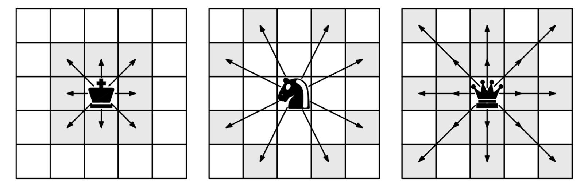
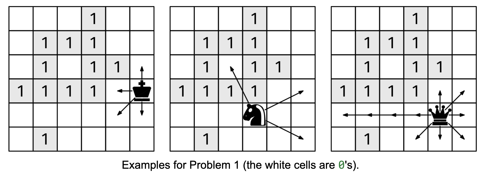

For context, this is how the King, Knight, and Queen move on a chessboard:

The king can go to any adjacent cell, including diagonals. The knight 'jumps' one cell in one dimension and two in the other, even if there are pieces in between. The queen can move any number of cells in any direction, including diagonals, but cannot go through occupied cells.

We are given three inputs:

board, an nxn binary grid, where a 0 denotes an empty cell, 1 denotes an occupied cell (for this problem, it doesn't matter what piece is in it)
piece, which is one of "king", "knight", or "queen"
r and c, with 0 ≤ r < n and 0 ≤ c < n, which denote an unoccupied position in the board
Return a list of all the unoccupied cells in board that can be reached by the given piece in one move starting from [r, c]. The order of the output cells does not matter.

Example 1:
board = [[0, 0, 0, 1, 0, 0],
         [0, 1, 1, 1, 0, 0],
         [0, 1, 0, 1, 1, 0],
         [1, 1, 1, 1, 0, 0],
         [0, 0, 0, 0, 0, 0],
         [0, 1, 0, 0, 0, 0]]
piece = "king"
r = 3
c = 5
Output: [[2, 5], [3, 4], [4, 4], [4, 5]]

Example 2:
board = [[0, 0, 0, 1, 0, 0],
         [0, 1, 1, 1, 0, 0],
         [0, 1, 0, 1, 1, 0],
         [1, 1, 1, 1, 0, 0],
         [0, 0, 0, 0, 0, 0],
         [0, 1, 0, 0, 0, 0]]
piece = "knight"
r = 4
c = 3
Output: [[2, 2], [3, 5], [5, 5]]

Example 3:
board = [[0, 0, 0, 1, 0, 0],
         [0, 1, 1, 1, 0, 0],
         [0, 1, 0, 1, 1, 0],
         [1, 1, 1, 1, 0, 0],
         [0, 0, 0, 0, 0, 0],
         [0, 1, 0, 0, 0, 0]]
piece = "queen"
r = 4
c = 4
Output: [[3, 4], [3, 5], [4, 0], [4, 1], [4, 2], [4, 3], [4, 5], [5, 3], [5,
4], [5, 5]]

Constraints:

1 ≤ n ≤ 100
board[i][j] is either 0 or 1
0 ≤ r, c < n
piece is one of "king", "knight", or "queen"

This problem can be solved using the 'directions array' reusable idea. For each piece type, we need to define its possible moves and then check which of those moves are valid (within bounds and unoccupied).

For the king and knight, we just need to check one step in each possible direction.

For the queen, we need to continue in each direction until we either:

Hit the board boundary
Hit an occupied cell
We can include a validation helper function to check if a cell is valid and reuse it across all piece types.

def chess_moves(board, piece, r, c):

  def is_valid(board, r, c):
    return 0 <= r < len(board) and 0 <= c < len(board[0]) and board[r][c] != 1

  moves = []
  king_directions = [
      [-1, 0], [1, 0], [0, -1], [0, 1],  # Vertical and horizontal
      [-1, -1], [-1, 1], [1, -1], [1, 1]  # Diagonals
  ]
  knight_directions = [[-2, 1], [-1, 2], [1, 2], [2, 1],
                       [2, -1], [1, -2], [-1, -2], [-2, -1]]

  if piece == "knight":
    directions = knight_directions
  else:
    directions = king_directions

  for dir_r, dir_c in directions:
    new_r, new_c = r + dir_r, c + dir_c
    if piece == "queen":
      while is_valid(board, new_r, new_c):
        moves.append([new_r, new_c])
        new_r += dir_r
        new_c += dir_c
    elif is_valid(board, new_r, new_c):
      moves.append([new_r, new_c])
  return moves
Time & Space Analysis
n: the size of the board
Knight and king:

Time: O(1)
Extra space: O(1)
Queen:

Time: O(8*n) = O(n)
Extra space: O(8*n) = O(n)
Tests
Here are some test cases to verify the solution:

def run_tests():
  tests = [
      # Example 1 from the book - king moves
      ([[0, 0, 0, 1, 0, 0],
        [0, 1, 1, 1, 0, 0],
        [0, 1, 0, 1, 1, 0],
        [1, 1, 1, 1, 0, 0],
        [0, 0, 0, 0, 0, 0],
        [0, 1, 0, 0, 0, 0]], "king", 3, 5,
          [[2, 5], [3, 4], [4, 4], [4, 5]]),
      # Example 2 from the book - knight moves
      ([[0, 0, 0, 1, 0, 0],
        [0, 1, 1, 1, 0, 0],
        [0, 1, 0, 1, 1, 0],
        [1, 1, 1, 1, 0, 0],
        [0, 0, 0, 0, 0, 0],
        [0, 1, 0, 0, 0, 0]], "knight", 4, 3,
       [[2, 2], [3, 5], [5, 5]]),
      # Example 3 from the book - queen moves
      ([[0, 0, 0, 1, 0, 0],
        [0, 1, 1, 1, 0, 0],
        [0, 1, 0, 1, 1, 0],
        [1, 1, 1, 1, 0, 0],
        [0, 0, 0, 0, 0, 0],
        [0, 1, 0, 0, 0, 0]], "queen", 4, 4,
       [[3, 4], [3, 5], [4, 0], [4, 1], [4, 2], [4, 3], [4, 5],
        [5, 3], [5, 4], [5, 5]]),
      # Edge case - 1x1 board
      ([[0]], "queen", 0, 0, []),
      # Edge case - all occupied except current position
      ([[1, 1], [1, 0]], "knight", 1, 1, []),
  ]

  for board, piece, r, c, want in tests:
    got = chess_moves(board, piece, r, c)
    # Sort both lists for consistent comparison
    got.sort()
    want.sort()
    assert got == want, (f"\nchess_moves({board}, {piece}, {r}, {c}): "
                         f"got: {got}, want: {want}\n")

run_tests()

function chessMoves(board, piece, r, c) {

  function isValid(board, r, c) {
    return (
      0 <= r &&
      r < board.length &&
      0 <= c &&
      c < board[0].length &&
      board[r][c] !== 1
    );
  }

  const moves = [];
  const kingDirections = [
    [-1, 0],
    [1, 0],
    [0, -1],
    [0, 1], // Vertical and horizontal
    [-1, -1],
    [-1, 1],
    [1, -1],
    [1, 1], // Diagonals
  ];
  const knightDirections = [
    [-2, 1],
    [-1, 2],
    [1, 2],
    [2, 1],
    [2, -1],
    [1, -2],
    [-1, -2],
    [-2, -1],
  ];

  const directions = piece === "knight" ? knightDirections : kingDirections;

  for (const [dirR, dirC] of directions) {
    let newR = r + dirR;
    let newC = c + dirC;
    if (piece === "queen") {
      while (isValid(board, newR, newC)) {
        if (board[newR][newC] === 1) {
          // Stop at obstacles
          break;
        }
        moves.push([newR, newC]);
        newR += dirR;
        newC += dirC;
      }
    } else if (isValid(board, newR, newC)) {
      moves.push([newR, newC]);
    }
  }
  return moves;
}
Time & Space Analysis
n: the size of the board
Knight and king:

Time: O(1)
Extra space: O(1)
Queen:

Time: O(8*n) = O(n)
Extra space: O(8*n) = O(n)
Tests
Here are some test cases to verify the solution:

function runTests() {
  const tests = [
    // Example 1 from the book - king moves
    [
      [
        [0, 0, 0, 1, 0, 0],
        [0, 1, 1, 1, 0, 0],
        [0, 1, 0, 1, 1, 0],
        [1, 1, 1, 1, 0, 0],
        [0, 0, 0, 0, 0, 0],
        [0, 1, 0, 0, 0, 0],
      ],
      "king",
      3,
      5,
      [
        [2, 5],
        [3, 4],
        [4, 4],
        [4, 5],
      ],
    ],
    // Example 2 from the book - knight moves
    [
      [
        [0, 0, 0, 1, 0, 0],
        [0, 1, 1, 1, 0, 0],
        [0, 1, 0, 1, 1, 0],
        [1, 1, 1, 1, 0, 0],
        [0, 0, 0, 0, 0, 0],
        [0, 1, 0, 0, 0, 0],
      ],
      "knight",
      4,
      3,
      [
        [2, 2],
        [3, 5],
        [5, 5],
      ],
    ],
    // Example 3 from the book - queen moves
    [
      [
        [0, 0, 0, 1, 0, 0],
        [0, 1, 1, 1, 0, 0],
        [0, 1, 0, 1, 1, 0],
        [1, 1, 1, 1, 0, 0],
        [0, 0, 0, 0, 0, 0],
        [0, 1, 0, 0, 0, 0],
      ],
      "queen",
      4,
      4,
      [
        [3, 4],
        [3, 5],
        [4, 0],
        [4, 1],
        [4, 2],
        [4, 3],
        [4, 5],
        [5, 3],
        [5, 4],
        [5, 5],
      ],
    ],
    // Edge case - 1x1 board
    [[[0]], "queen", 0, 0, []],
    // Edge case - all occupied except current position
    [
      [
        [1, 1],
        [1, 0],
      ],
      "knight",
      1,
      1,
      [],
    ],
  ];

  for (const [board, piece, r, c, want] of tests) {
    const got = chessMoves(board, piece, r, c);
    // Sort both lists for consistent comparison
    got.sort((a, b) => a[0] - b[0] || a[1] - b[1]);
    want.sort((a, b) => a[0] - b[0] || a[1] - b[1]);
    if (JSON.stringify(got) !== JSON.stringify(want)) {
      throw new Error(
        `\nchessMoves(${JSON.stringify(board)}, ${piece}, ${r}, ${c}): ` +
        `got: ${JSON.stringify(got)}, want: ${JSON.stringify(want)}\n`,
      );
    }
  }
}

runTests();

class ChessMoves {
  private static boolean isValid(int[][] board, int r, int c) {
    return 0 <= r && r < board.length && 0 <= c && c < board[0].length
        && board[r][c] != 1;
  }

  public List<int[]> solve(int[][] board, String piece, int r, int c) {
    List<int[]> moves = new ArrayList<>();
    int[][] kingDirections = {
        { -1, 0 }, { 1, 0 }, { 0, -1 }, { 0, 1 }, // Vertical and horizontal
        { -1, -1 }, { -1, 1 }, { 1, -1 }, { 1, 1 } // Diagonals
    };
    int[][] knightDirections = { { -2, 1 }, { -1, 2 }, { 1, 2 }, { 2, 1 },
        { 2, -1 }, { 1, -2 }, { -1, -2 }, { -2, -1 } };

    int[][] directions = piece.equals("knight") ? knightDirections
        : kingDirections;

    for (int[] dir : directions) {
      int newR = r + dir[0];
      int newC = c + dir[1];
      if (piece.equals("queen")) {
        while (isValid(board, newR, newC)) {
          if (board[newR][newC] == 1) { // Stop at obstacles
            break;
          }
          moves.add(new int[] { newR, newC });
          newR += dir[0];
          newC += dir[1];
        }
      } else if (isValid(board, newR, newC)) {
        moves.add(new int[] { newR, newC });
      }
    }
    return moves;
  }
}
Time & Space Analysis
n: the size of the board
Knight and king:

Time: O(1)
Extra space: O(1)
Queen:

Time: O(8*n) = O(n)
Extra space: O(8*n) = O(n)
Tests
Here are some test cases to verify the solution:

class RunTests {
  public void runTests() {
    Object[][] tests = {
        // Example 1 from the book - king moves
        { new int[][] {
            { 0, 0, 0, 1, 0, 0 },
            { 0, 1, 1, 1, 0, 0 },
            { 0, 1, 0, 1, 1, 0 },
            { 1, 1, 1, 1, 0, 0 },
            { 0, 0, 0, 0, 0, 0 },
            { 0, 1, 0, 0, 0, 0 }
        }, "king", 3, 5,
            new int[][] { { 2, 5 }, { 3, 4 }, { 4, 4 }, { 4, 5 } } },
        // Example 2 from the book - knight moves
        { new int[][] {
            { 0, 0, 0, 1, 0, 0 },
            { 0, 1, 1, 1, 0, 0 },
            { 0, 1, 0, 1, 1, 0 },
            { 1, 1, 1, 1, 0, 0 },
            { 0, 0, 0, 0, 0, 0 },
            { 0, 1, 0, 0, 0, 0 }
        }, "knight", 4, 3,
            new int[][] { { 2, 2 }, { 3, 5 }, { 5, 5 } } },
        // Example 3 from the book - queen moves
        { new int[][] {
            { 0, 0, 0, 1, 0, 0 },
            { 0, 1, 1, 1, 0, 0 },
            { 0, 1, 0, 1, 1, 0 },
            { 1, 1, 1, 1, 0, 0 },
            { 0, 0, 0, 0, 0, 0 },
            { 0, 1, 0, 0, 0, 0 }
        }, "queen", 4, 4,
            new int[][] { { 3, 4 }, { 3, 5 }, { 4, 0 }, { 4, 1 }, { 4, 2 },
                { 4, 3 }, { 4, 5 },
                { 5, 3 }, { 5, 4 }, { 5, 5 } } },
        // Edge case - 1x1 board
        { new int[][] { { 0 } }, "queen", 0, 0, new int[][] {} },
        // Edge case - all occupied except current position
        { new int[][] { { 1, 1 }, { 1, 0 } }, "knight", 1, 1, new int[][] {} },
    };

    ChessMoves solution = new ChessMoves();
    for (Object[] test : tests) {
      int[][] board = (int[][]) test[0];
      String piece = (String) test[1];
      int r = (int) test[2];
      int c = (int) test[3];
      int[][] want = (int[][]) test[4];

      List<int[]> gotList = solution.solve(board, piece, r, c);
      int[][] got = gotList.toArray(new int[0][]);

      // Sort both arrays for consistent comparison
      Arrays.sort(got, Comparator.comparingInt((int[] a) -> a[0])
          .thenComparingInt(a -> a[1]));
      Arrays.sort(want, Comparator.comparingInt((int[] a) -> a[0])
          .thenComparingInt(a -> a[1]));

      if (!Arrays.deepEquals(got, want)) {
        throw new RuntimeException(String.format(
            "\nsolve(%s, %s, %d, %d): got: %s, want: %s\n",
            Arrays.deepToString(board), piece, r, c,
            Arrays.deepToString(got), Arrays.deepToString(want)));
      }
    }
  }
}

public class Solution {
  public static void main(String[] args) {
    new RunTests().runTests();
  }
}