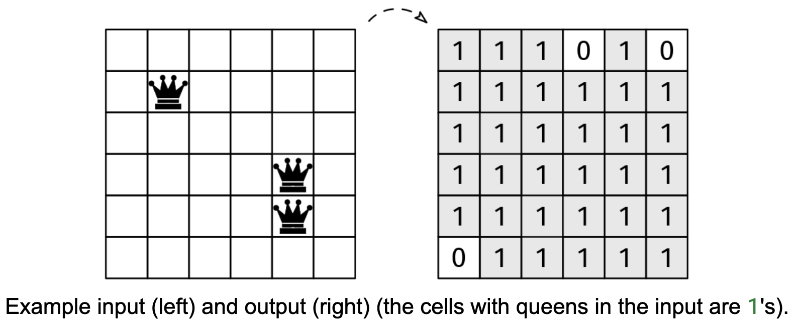

Imagine that an n x n chessboard has a number of queens in it. Remember that in chess, a queen can move any number of cells horizontally, vertically, or diagonally.

We are given an nxn binary grid, board, with n > 0, where 0 indicates that the cell is unoccupied, and a 1 indicates a queen (the color of the queen doesn't matter). Return a binary board with the same dimensions. In the returned board, 0 denotes that a cell is 'safe', and a 1 denotes that a cell is not safe. A cell is safe if there isn't a queen in it and no queen on the board can reach it in a single move.

Example 1:
board = [[0, 0, 0, 1],
         [0, 0, 0, 0],
         [0, 0, 0, 0],
         [1, 0, 0, 0]]
Output: [[1, 1, 1, 1],
         [1, 0, 1, 1],
         [1, 1, 0, 1],
         [1, 1, 1, 1]]

Example 2:
board = [[1]]
Output: [[1]]
Explanation: The only cell has a queen, so it's not safe.

Example 3:
board = [[0]]
Output: [[0]]
Explanation: With no queens, all cells are safe.

Constraints:

1 ≤ n ≤ 100
board[i][j] is either 0 or 1
We can solve this problem by:

Creating an empty result grid of the same size as the input
Finding each queen in the input grid
For each queen:
Mark its cell as unsafe in the result grid
Mark all cells it can reach as unsafe
For marking reachable cells, we can use the 'directions array' reusable idea to handle all eight directions a queen can move (horizontal, vertical, and diagonal). For each direction, we continue marking cells as unsafe until we reach the board boundary.

To simplify the main function, we can factor out the check of whether a cell is valid to a helper function.

Here is the implementation:

class SafeCells {
  private boolean isValid(int[][] board, int r, int c) {
    return 0 <= r && r < board.length && 0 <= c && c < board[0].length &&
        board[r][c] != 1;
  }

  private void markReachableCells(int[][] board, int r, int c, int[][] res) {
    int[][] directions = {
        { -1, 0 }, { 1, 0 }, { 0, -1 }, { 0, 1 }, // Vertical and horizontal
        { -1, -1 }, { -1, 1 }, { 1, -1 }, { 1, 1 } // Diagonals
    };
    for (int[] dir : directions) {
      int newR = r + dir[0], newC = c + dir[1];
      while (isValid(board, newR, newC)) {
        res[newR][newC] = 1;
        newR += dir[0];
        newC += dir[1];
      }
    }
  }

  public int[][] solve(int[][] board) {
    if (board.length == 0)
      return new int[0][0];
    int n = board.length;
    int[][] res = new int[n][n];
    for (int r = 0; r < n; r++) {
      for (int c = 0; c < n; c++) {
        if (board[r][c] == 1) {
          res[r][c] = 1;
          markReachableCells(board, r, c, res);
        }
      }
    }
    return res;
  }
}
Time & Space Analysis
n: the size of the board
Finding all the queens takes O(n^2) time. The runtime analysis for marking cells as unsafe is not as simple as it may seem: there may be up to O(n^2) queens, and each queen can reach up to O(8*n) = O(n) cells, which suggests that the runtime may be O(n^3).

However, if we look at it from a different angle, we can see that it is actually O(n^2). The key is to realize that each cell is visited by at most 8 queens: one from each possible direction. Thus, the total time spent visiting cells from a queen is O(8*n^2) = O(n^2).

Time: O(n^2)
Extra space: O(n^2) - for the result grid
Tests
Here are some test cases to verify the solution:

class RunTests {
  public void runTests() {
    Object[][] tests = {
        { new int[][] {
            { 0, 0, 0, 1 },
            { 0, 0, 0, 0 },
            { 0, 0, 0, 0 },
            { 1, 0, 0, 0 } },
            new int[][] {
                { 1, 1, 1, 1 },
                { 1, 0, 1, 1 },
                { 1, 1, 0, 1 },
                { 1, 1, 1, 1 } } },
        // Edge case - 1x1 board with queen
        { new int[][] { { 1 } }, new int[][] { { 1 } } },
        // Edge case - 1x1 board without queen
        { new int[][] { { 0 } }, new int[][] { { 0 } } },
        // Edge case - no queens
        { new int[][] { { 0, 0 }, { 0, 0 } },
            new int[][] { { 0, 0 }, { 0, 0 } } },
    };

    SafeCells solution = new SafeCells();
    for (Object[] test : tests) {
      int[][] board = (int[][]) test[0];
      int[][] want = (int[][]) test[1];
      int[][] got = solution.solve(board);

      boolean equal = got.length == want.length;
      if (equal) {
        for (int i = 0; i < got.length && equal; i++) {
          if (got[i].length != want[i].length) {
            equal = false;
            break;
          }
          for (int j = 0; j < got[i].length && equal; j++) {
            if (got[i][j] != want[i][j]) {
              equal = false;
              break;
            }
          }
        }
      }

      if (!equal) {
        StringBuilder error = new StringBuilder("\nsolve(");
        error.append(arrayToString(board));
        error.append("): got: ");
        error.append(arrayToString(got));
        error.append(", want: ");
        error.append(arrayToString(want));
        error.append("\n");
        throw new RuntimeException(error.toString());
      }
    }
  }

  private String arrayToString(int[][] arr) {
    StringBuilder sb = new StringBuilder("[");
    for (int i = 0; i < arr.length; i++) {
      sb.append("[");
      for (int j = 0; j < arr[i].length; j++) {
        sb.append(arr[i][j]);
        if (j < arr[i].length - 1)
          sb.append(", ");
      }
      sb.append("]");
      if (i < arr.length - 1)
        sb.append(", ");
    }
    sb.append("]");
    return sb.toString();
  }
}

public class Solution {
  public static void main(String[] args) {
    new RunTests().runTests();
  }
}

def safe_cells(board):

  directions = [
      [-1, 0], [1, 0], [0, -1], [0, 1],  # Vertical and horizontal
      [-1, -1], [-1, 1], [1, -1], [1, 1]  # Diagonals
  ]

  n = len(board)

  def is_valid(r, c):
    return 0 <= r < n and 0 <= c < n and board[r][c] != 1

  res = [[0] * n for _ in range(n)]

  def mark_reachable_cells(r, c):
    for dir_r, dir_c in directions:
      new_r, new_c = r + dir_r, c + dir_c
      while is_valid(new_r, new_c):
        res[new_r][new_c] = 1
        new_r += dir_r
        new_c += dir_c

  for r in range(n):
    for c in range(n):
      if board[r][c] == 1:
        res[r][c] = 1
        mark_reachable_cells(r, c)
  return res
Time & Space Analysis
n: the size of the board
Finding all the queens takes O(n^2) time. The runtime analysis for marking cells as unsafe is not as simple as it may seem: there may be up to O(n^2) queens, and each queen can reach up to O(8*n) = O(n) cells, which suggests that the runtime may be O(n^3).

However, if we look at it from a different angle, we can see that it is actually O(n^2). The key is to realize that each cell is visited by at most 8 queens: one from each possible direction. Thus, the total time spent visiting cells from a queen is O(8*n^2) = O(n^2).

Time: O(n^2)
Extra space: O(n^2) - for the result grid
Tests
Here are some test cases to verify the solution:

def run_tests():
  tests = [
      ([[0, 0, 0, 1],
        [0, 0, 0, 0],
        [0, 0, 0, 0],
        [1, 0, 0, 0]],
       [[1, 1, 1, 1],
        [1, 0, 1, 1],
        [1, 1, 0, 1],
        [1, 1, 1, 1]]),
      # Edge case - 1x1 board with queen
      ([[1]], [[1]]),
      # Edge case - 1x1 board without queen
      ([[0]], [[0]]),
      # Edge case - no queens
      ([[0, 0], [0, 0]], [[0, 0], [0, 0]]),
  ]

  for board, want in tests:
    got = safe_cells(board)
    assert got == want, f"\nsafe_cells({board}): got: {got}, want: {want}\n"

run_tests()

function safeCells(board) {
  const n = board.length;
  if (n == 0) return [];

  function isValid(r, c) {
    return 0 <= r && r < n && 0 <= c && c < n && board[r][c] !== 1;
  }

  const directions = [
    [-1, 0],
    [1, 0],
    [0, -1],
    [0, 1], // Vertical and horizontal
    [-1, -1],
    [-1, 1],
    [1, -1],
    [1, 1], // Diagonals
  ];

  const res = Array(n)
    .fill()
    .map(() => Array(n).fill(0));

  function markReachableCells(r, c) {
    for (const [dirR, dirC] of directions) {
      let newR = r + dirR,
        newC = c + dirC;
      while (isValid(newR, newC)) {
        res[newR][newC] = 1;
        newR += dirR;
        newC += dirC;
      }
    }
  }

  for (let r = 0; r < n; r++) {
    for (let c = 0; c < n; c++) {
      if (board[r][c] === 1) {
        res[r][c] = 1;
        markReachableCells(r, c);
      }
    }
  }
  return res;
}
Time & Space Analysis
n: the size of the board
Finding all the queens takes O(n^2) time. The runtime analysis for marking cells as unsafe is not as simple as it may seem: there may be up to O(n^2) queens, and each queen can reach up to O(8*n) = O(n) cells, which suggests that the runtime may be O(n^3).

However, if we look at it from a different angle, we can see that it is actually O(n^2). The key is to realize that each cell is visited by at most 8 queens: one from each possible direction. Thus, the total time spent visiting cells from a queen is O(8*n^2) = O(n^2).

Time: O(n^2)
Extra space: O(n^2) - for the result grid
Tests
Here are some test cases to verify the solution:

function runTests() {
  const tests = [
    [
      [
        [0, 0, 0, 1],
        [0, 0, 0, 0],
        [0, 0, 0, 0],
        [1, 0, 0, 0],
      ],
      [
        [1, 1, 1, 1],
        [1, 0, 1, 1],
        [1, 1, 0, 1],
        [1, 1, 1, 1],
      ],
    ],
    // Edge case - 1x1 board with queen
    [[[1]], [[1]]],
    // Edge case - 1x1 board without queen
    [[[0]], [[0]]],
    // Edge case - no queens
    [
      [
        [0, 0],
        [0, 0],
      ],
      [
        [0, 0],
        [0, 0],
      ],
    ],
  ];

  for (const [board, want] of tests) {
    const got = safeCells(board);
    if (JSON.stringify(got) !== JSON.stringify(want)) {
      throw new Error(
        `\nsafeCells(${JSON.stringify(board)}): got: ${JSON.stringify(got)}, want: ${JSON.stringify(want)}\n`,
      );
    }
  }
}

runTests();