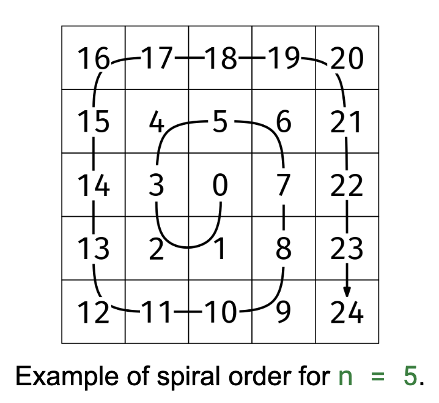

Given a positive and odd integer n, return an nxn grid of integers filled as follows: the grid should have every number from 0 to n^2 - 1 in spiral order, starting by going down from the center and turning clockwise.

Example 1:
n = 5
Output: [[16, 17, 18, 19, 20],
         [15,  4,  5,  6, 21],
         [14,  3,  0,  7, 22],
         [13,  2,  1,  8, 23],
         [12, 11, 10,  9, 24]]

Example 2:
n = 1
Output: [[0]]

Example 3:
n = 3
Output: [[4, 5, 6],
         [3, 0, 7],
         [2, 1, 8]]

         

      Constraints:

0 < n < 1000
n is odd

We can start by initializing an empty grid, and then fill in the numubers following the spiral order. To start, we need to find the center: [(n - 1)/2, (n - 1)/2]. From there, we can:

Move by 1 → turn
Move by 1 → turn
Move by 2 → turn
Move by 2 → turn
Move by 3 → turn
Move by 3 → turn
And so on.
While it could be a bit annoying to implement, it is quite feasible.

However, there is a trick that makes it simpler to code: spiral from the end to the beginning. Wether we have a 1x1, 3x3, 5x5, or any odd nxn grid, we can observe that the end is always at the bottom-right corner, so we can start there. It's also easy to know when to turn: we turn whenever the next step would take us off the edge of the board or onto a cell that already has a number.

We'll use the 'directions array' reusable idea to handle the four possible directions (up, left, down, right). We'll also use a helper function to check if a move is valid.

function spiral(n) {

  function isValid(grid, r, c) {
    return (
      0 <= r && r < grid.length && 0 <= c < grid[0].length && grid[r][c] === 0
    );
  }

  let val = n * n - 1;
  const res = Array(n)
    .fill()
    .map(() => Array(n).fill(0));
  let r = n - 1,
    c = n - 1;
  const directions = [
    [-1, 0],
    [0, -1],
    [1, 0],
    [0, 1],
  ]; // Counterclockwise
  let dir = 0; // Start going up

  while (val > 0) {
    res[r][c] = val;
    val--;
    if (!isValid(res, r + directions[dir][0], c + directions[dir][1])) {
      dir = (dir + 1) % 4; // Change directions counterclockwise
    }
    r += directions[dir][0];
    c += directions[dir][1];
  }
  return res;
}
Time & Space Analysis
n: the size of the grid

Time: O(n²) - We need to fill every cell in the grid

Extra space: O(n²) - for the result grid

Tests
Here are some test cases to verify the solution:

function runTests() {
  const tests = [
    // Example from book
    [
      5,
      [
        [16, 17, 18, 19, 20],
        [15, 4, 5, 6, 21],
        [14, 3, 0, 7, 22],
        [13, 2, 1, 8, 23],
        [12, 11, 10, 9, 24],
      ],
    ],
    // Edge case - 1x1
    [1, [[0]]],
    // Edge case - 3x3
    [
      3,
      [
        [4, 5, 6],
        [3, 0, 7],
        [2, 1, 8],
      ],
    ],
  ];

  for (const [n, want] of tests) {
    const got = spiral(n);
    if (JSON.stringify(got) !== JSON.stringify(want)) {
      throw new Error(
        `\nspiral(${n}): got: ${JSON.stringify(got)}, want: ${JSON.stringify(want)}\n`,
      );
    }
  }
}

runTests();

def spiral(n):
  
  def is_valid(grid, r, c):
    return 0 <= r < len(grid) and 0 <= c < len(grid[0]) and grid[r][c] == 0

  val = n * n - 1
  res = [[0] * n for _ in range(n)]
  r, c = n - 1, n - 1
  directions = [[-1, 0], [0, -1], [1, 0], [0, 1]]  # Counterclockwise
  dir = 0  # Start going up

  while val > 0:
    res[r][c] = val
    val -= 1
    if not is_valid(res, r + directions[dir][0], c + directions[dir][1]):
      dir = (dir + 1) % 4  # Change directions counterclockwise
    r, c = r + directions[dir][0], c + directions[dir][1]
  return res
Time & Space Analysis
n: the size of the grid

Time: O(n²) - We need to fill every cell in the grid

Extra space: O(n²) - for the result grid

Tests
Here are some test cases to verify the solution:

def run_tests():
  tests = [
      # Example from book
      (5, [
          [16, 17, 18, 19, 20],
          [15, 4, 5, 6, 21],
          [14, 3, 0, 7, 22],
          [13, 2, 1, 8, 23],
          [12, 11, 10, 9, 24]
      ]),
      # Edge case - 1x1
      (1, [[0]]),
      # Edge case - 3x3
      (3, [
          [4, 5, 6],
          [3, 0, 7],
          [2, 1, 8]
      ]),
  ]

  for n, want in tests:
    got = spiral(n)
    assert got == want, f"\nspiral({n}): got: {got}, want: {want}\n"

run_tests()

class Spiral {
  private static boolean isValid(int[][] grid, int r, int c) {
    return 0 <= r && r < grid.length && 0 <= c && c < grid[0].length
        && grid[r][c] == 0;
  }

  public int[][] solve(int n) {
    int val = n * n - 1;
    int[][] res = new int[n][n];
    int r = n - 1, c = n - 1;
    int[][] directions = { { -1, 0 }, { 0, -1 }, { 1, 0 }, { 0, 1 } }; // Counterclockwise
    int dir = 0; // Start going up

    while (val > 0) {
      res[r][c] = val;
      val--;
      if (!isValid(res, r + directions[dir][0], c + directions[dir][1])) {
        dir = (dir + 1) % 4; // Change directions counterclockwise
      }
      r += directions[dir][0];
      c += directions[dir][1];
    }
    return res;
  }
}
Time & Space Analysis
n: the size of the grid

Time: O(n²) - We need to fill every cell in the grid

Extra space: O(n²) - for the result grid

Tests
Here are some test cases to verify the solution:

class RunTests {
  public void runTests() {
    Object[][] tests = {
        // Example from book
        { 5, new int[][] {
            { 16, 17, 18, 19, 20 },
            { 15, 4, 5, 6, 21 },
            { 14, 3, 0, 7, 22 },
            { 13, 2, 1, 8, 23 },
            { 12, 11, 10, 9, 24 }
        } },
        // Edge case - 1x1
        { 1, new int[][] { { 0 } } },
        // Edge case - 3x3
        { 3, new int[][] {
            { 4, 5, 6 },
            { 3, 0, 7 },
            { 2, 1, 8 }
        } },
    };

    Spiral solution = new Spiral();
    for (Object[] test : tests) {
      int n = (int) test[0];
      int[][] want = (int[][]) test[1];
      int[][] got = solution.solve(n);
      if (!Arrays.deepEquals(got, want)) {
        throw new RuntimeException(String.format(
            "\nsolve(%d): got: %s, want: %s\n",
            n, Arrays.deepToString(got), Arrays.deepToString(want)));
      }
    }
  }
}

public class Solution {
  public static void main(String[] args) {
    new RunTests().runTests();
  }
}