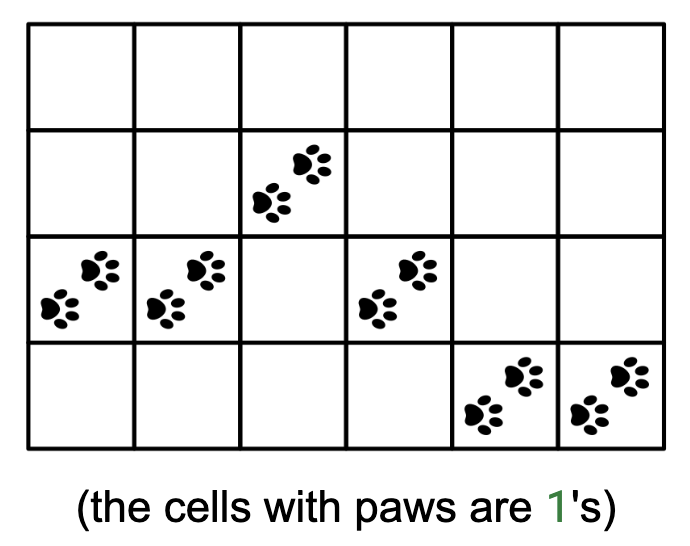

We are tracking Elsa, an arctic fox, through a rectangular snowy field represented by a binary grid, field, where 1 denotes snowprints and 0 denotes no snowprints. We know that the fox crossed the field from left to right, so each column has exactly one 1. Between two consecutive columns, the row of the 1 may remain the same, go up by one, or go down by one. Above the field (above the first row), there is an icy river. Return how close the fox got to the river, in terms of the number of rows between it and the river.

Example 1:
field = [[0, 0, 0, 0, 0, 0],
         [0, 0, 1, 0, 0, 0],
         [1, 1, 0, 1, 0, 0],
         [0, 0, 0, 0, 1, 1]]
Output: 1
Explanation: The fox was closest to the river at column 2 (0-based), where it
was 1 row away.

Example 2:
field = [[0, 0, 0, 1, 0, 0],
         [0, 0, 1, 0, 1, 0],
         [1, 1, 0, 0, 0, 1],
         [0, 0, 0, 0, 0, 0]]
Output: 0
Explanation: The fox touched row 0, which is right next to the river.

Example 3:
field = [[1, 1, 1]]
Output: 0
Explanation: The fox stayed in row 0 the whole time.

Above is a picture representation of Example 1.

Constraints:

1 ≤ R, C ≤ 1000, where R is the number of rows and C is the number of columns
field[i][j] is either 0 or 1
Each column has exactly one 1
The fox's path is valid (moves at most one row up/down between columns)

Let R and C be the dimensions of the grid. A naive solution would be to iterate through the entire grid to find each footprint, which would take O(R•C) time. However, it is more efficient to trace the fox's steps.

We can start by finding where the fox started along the first column, in O(R) time. Then, for each other column, we can find where the fox went next with a directions array that covers the three options. Since we only need to consider 3 cells per column, this takes O(C) time, for a total of O(R + C) time.

class DistanceToRiver {
  private static boolean hasFootprints(int[][] field, int r, int c) {
    return 0 <= r && r < field.length && 0 <= c && c < field[0].length
        && field[r][c] == 1;
  }

  public int solve(int[][] field) {
    final int R = field.length;
    final int C = field[0].length;

    // Find starting position in first column
    int r = 0;
    while (r < R && field[r][0] != 1) {
      r++;
    }

    int closest = r;
    int c = 0;

    // Track fox through remaining columns
    while (c < C - 1) { // Stop before last column
      boolean found = false;
      for (int dirR : new int[] { -1, 0, 1 }) { // Check up, same level, down
        int newR = r + dirR;
        int newC = c + 1;
        if (hasFootprints(field, newR, newC)) {
          r = newR;
          c = newC;
          closest = Math.min(closest, r);
          found = true;
          break;
        }
      }
      if (!found) { // No valid move found
        break;
      }
    }

    return closest;
  }
}
Time & Space Analysis
R: the number of rows

C: the number of columns

Time: O(R + C) - Finding the starting position takes O(R), then tracing takes O(C)

Extra space: O(1) - only using constant extra space for tracking position and minimum distance

Tests
Here are some test cases to verify the solution:

class RunTests {
  public void runTests() {
    Object[][] tests = {
        // Example from book
        { new int[][] {
            { 0, 0, 0, 0, 0, 0 },
            { 0, 0, 1, 0, 0, 0 },
            { 1, 1, 0, 1, 0, 0 },
            { 0, 0, 0, 0, 1, 1 }
        }, 1 },
        // Edge case - top of grid
        { new int[][] {
            { 0, 0, 0, 1, 0, 0 },
            { 0, 0, 1, 0, 1, 0 },
            { 1, 1, 0, 0, 0, 1 },
            { 0, 0, 0, 0, 0, 0 }
        }, 0 },
        // Edge case - bottom of grid
        { new int[][] {
            { 0, 0, 0, 0, 0, 0 },
            { 0, 0, 0, 0, 0, 0 },
            { 0, 0, 0, 0, 0, 0 },
            { 1, 1, 1, 1, 1, 1 }
        }, 3 },
        // Edge case - single column
        { new int[][] { { 0 }, { 1 } }, 1 },
        // Edge case - single row
        { new int[][] { { 1, 1, 1 } }, 0 },
        // Edge case - zigzag path
        { new int[][] {
            { 0, 0, 0 },
            { 1, 0, 0 },
            { 0, 1, 0 },
            { 0, 0, 1 }
        }, 1 },
    };

    DistanceToRiver solution = new DistanceToRiver();
    for (Object[] test : tests) {
      int[][] field = (int[][]) test[0];
      int want = (int) test[1];
      int got = solution.solve(field);
      if (got != want) {
        throw new RuntimeException(String.format(
            "\nsolve(%s): got: %d, want: %d\n",
            Arrays.deepToString(field), got, want));
      }
    }
  }
}

public class Solution {
  public static void main(String[] args) {
    new RunTests().runTests();
  }
}

def distance_to_river(field):
  R, C = len(field), len(field[0])

  def has_footprints(r, c):
    return 0 <= r < R and 0 <= c < C and field[r][c] == 1

  # Find starting position in first column
  r, c = 0, 0
  while field[r][c] != 1:
    r += 1

  closest = r

  # Track fox through remaining columns
  while c < C - 1:  # Stop before last column
    for dir_r in [-1, 0, 1]:  # Check up, same level, down
      new_r = r + dir_r
      new_c = c + 1
      if has_footprints(new_r, new_c):
        r, c = new_r, new_c
        closest = min(closest, r)
        break

  return closest
Time & Space Analysis
R: the number of rows

C: the number of columns

Time: O(R + C) - Finding the starting position takes O(R), then tracing takes O(C)

Extra space: O(1) - only using constant extra space for tracking position and minimum distance

Tests
Here are some test cases to verify the solution:

def run_tests():
  tests = [
      # Example from book
      ([[0, 0, 0, 0, 0, 0],
        [0, 0, 1, 0, 0, 0],
        [1, 1, 0, 1, 0, 0],
        [0, 0, 0, 0, 1, 1]], 1),
      # Edge case - top of grid
      ([[1, 1, 1, 1],
        [0, 0, 0, 0],
        [0, 0, 0, 0]], 0),
      # Edge case - bottom of grid
      ([[0, 0, 0, 0],
        [0, 0, 0, 0],
        [1, 1, 1, 1]], 2),
      # Edge case - single column
      ([[0], [1], [0]], 1),
      # Edge case - single row
      ([[1]], 0),
      # Edge case - zigzag path
      ([[0, 0, 0, 0],
        [1, 0, 0, 0],
        [0, 1, 0, 0],
        [0, 0, 1, 1]], 1),
      # Test max up/down movement
      ([[0, 0, 0, 0],
        [1, 0, 0, 0],
        [0, 1, 0, 0],
        [0, 0, 1, 0],
        [0, 0, 0, 1]], 1),
      # Test staying at same level
      ([[0, 0, 0, 0],
        [1, 1, 1, 1],
        [0, 0, 0, 0]], 1),
      # Test going up then down
      ([[0, 0, 0, 0],
        [1, 0, 0, 0],
        [0, 1, 1, 0],
        [0, 0, 0, 1]], 1)
  ]

  for field, want in tests:
    got = distance_to_river(field)
    assert got == want, f"\ndistance_to_river({field}): got: {
        got}, want: {want}\n"

run_tests()

function distanceToRiver(field) {
  const R = field.length;
  const C = field[0].length;

  function hasFootprints(r, c) {
    return 0 <= r && r < R && 0 <= c && c < C && field[r][c] === 1;
  }

  // Find starting position in first column
  let r = 0;
  while (r < R && !field[r][0]) {
    r++;
  }

  let closest = r;
  let c = 0;

  // Track fox through remaining columns
  while (c < C - 1) {
    // Stop before last column
    let found = false;
    for (const dirR of [-1, 0, 1]) {
      // Check up, same level, down
      const newR = r + dirR;
      const newC = c + 1;
      if (hasFootprints(newR, newC)) {
        r = newR;
        c = newC;
        closest = Math.min(closest, r);
        found = true;
        break;
      }
    }
    if (!found) {
      // No valid move found
      break;
    }
  }

  return closest;
}
Time & Space Analysis
R: the number of rows

C: the number of columns

Time: O(R + C) - Finding the starting position takes O(R), then tracing takes O(C)

Extra space: O(1) - only using constant extra space for tracking position and minimum distance

Tests
Here are some test cases to verify the solution:

function runTests() {
  const tests = [
    // Example from book
    [
      [
        [0, 0, 0, 0, 0, 0],
        [0, 0, 1, 0, 0, 0],
        [1, 1, 0, 1, 0, 0],
        [0, 0, 0, 0, 1, 1],
      ],
      1,
    ],
    // Edge case - top of grid
    [
      [
        [0, 0, 0, 1, 0, 0],
        [0, 0, 1, 0, 1, 0],
        [1, 1, 0, 0, 0, 1],
        [0, 0, 0, 0, 0, 0],
      ],
      0,
    ],
    // Edge case - bottom of grid
    [
      [
        [0, 0, 0, 0, 0, 0],
        [0, 0, 0, 0, 0, 0],
        [0, 0, 0, 0, 0, 0],
        [1, 1, 1, 1, 1, 1],
      ],
      3,
    ],
    // Edge case - single column
    [[[0], [1]], 1],
    // Edge case - single row
    [[[1, 1, 1]], 0],
    // Edge case - zigzag path
    [
      [
        [0, 0, 0],
        [1, 0, 0],
        [0, 1, 0],
        [0, 0, 1],
      ],
      1,
    ],
  ];

  for (const [field, want] of tests) {
    const got = distanceToRiver(field);
    if (got !== want) {
      throw new Error(
        `\ndistanceToRiver(${JSON.stringify(field)}): got: ${got}, want: ${want}\n`,
      );
    }
  }
}

runTests();