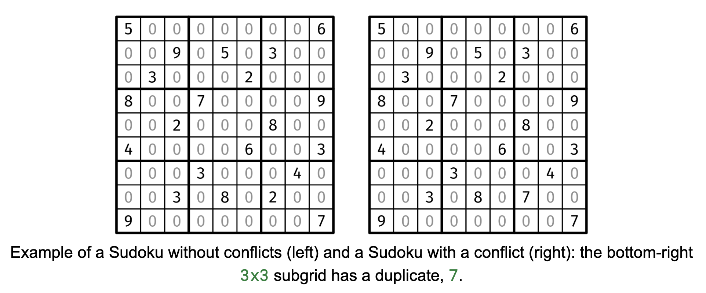

Given a 9x9 grid board representing a Sudoku, return true if the board does not have any conflicts and false otherwise. The board contains only numbers between 0 and 9 in each cell, with 0's denoting empty cells.

A conflict is a duplicate number (other than 0) along a row, a column, or a 3x3 subgrid (shown with the thicker outline). For the purposes of this problem, it doesn't matter if the Sudoku has a valid solution or not -- only whether it has a conflict in the already-filled cells.

For those who don't know the rules of Sudoku: the grid starts off with some cells pre-filled with numbers. The player is asked to fill in the empty cells with the numbers 1 through 9, such that there are no duplicates in the same row, column, or subgrid (the 3x3 sections shown with the thicker outline).

Example 1:
board = +-------+-------+-------+
        | 5 . . | . . . | . . 6 |
        | . . 9 | . 5 . | 3 . . |
        | . 3 . | . . 2 | . . . |
        +-------+-------+-------+
        | 8 . . | 7 . . | . . 9 |
        | . . 2 | . . . | 8 . . |
        | 4 . . | . . 6 | . . 3 |
        +-------+-------+-------+
        | . . . | 3 . . | . 4 . |
        | . . 3 | . 8 . | 2 . . |
        | 9 . . | . . . | . . 7 |
        +-------+-------+-------+
Output: true

Example 2:
board = +-------+-------+-------+
        | 5 . . | . . . | . . 6 |
        | . . 9 | . 5 . | 3 . . |
        | . 3 . | . . 2 | . . . |
        +-------+-------+-------+
        | 8 . . | 7 . . | . . 9 |
        | . . 2 | . . . | 8 . . |
        | 4 . . | . . 6 | . . 3 |
        +-------+-------+-------+
        | . . . | 3 . . | . 4 . |
        | . . 3 | . 8 . | 7 . . |
        | 9 . . | . . . | . . 7 |
        +-------+-------+-------+
Output: false
Explanation: The bottom-right 3x3 subgrid has a duplicate, 7.

Example 3:
board = +-------+-------+-------+
        | . . . | . . . | . . . |
        | . . . | . . . | . . . |
        | . . . | . . . | . . . |
        +-------+-------+-------+
        | . . . | . . . | . . . |
        | . . . | . . . | . . . |
        | . . . | . . . | . . . |
        +-------+-------+-------+
        | . . . | . . . | . . . |
        | . . . | . . . | . . . |
        | . . . | . . . | . . . |
        +-------+-------+-------+
Output: true
Explanation: An empty board has no conflicts.

Constraints:

board.length == 9
board[i].length == 9
board[i][j] is a digit between 0 and 9.

This question isn't terribly difficult, but it requires a decent amount of code. While there is a one-pass solution, let's break down the problem and handle each constraint as a separate subtask:

Validate rows: This is a straightforward nested loop that walks through each row, checking the cells in each for duplicates. We can use a set to efficiently track what numbers we've seen so far in the current row.
Validate columns: This is almost identical to the row validation, but iterating over the columns instead of the rows.
Validate 3x3 subgrids: To keep the code clean, we can factor out the subgrid validation to a helper function that receives the top-left cell in a 3x3 subgrid. For this helper function, we can use a similar approach as a row validation, but with two nested loops instead of one long loop. We need to pinpoint the coordinates of each top-left cell in a subgrid to pass into the helper function. It helps to know that there are 9 subgrids, and they are evenly spaced.
Here is the implementation:

class ValidSudoku {
  solve(board) {
    return (
      this.validRows(board) &&
      this.validCols(board) &&
      this.validSubgrids(board)
    );
  }

  validRows(board) {
    const [R, C] = [board.length, board[0].length];
    for (let r = 0; r < R; r++) {
      const seen = new Set();
      for (let c = 0; c < C; c++) {
        if (board[r][c] !== 0) {
          if (seen.has(board[r][c])) return false;
          seen.add(board[r][c]);
        }
      }
    }
    return true;
  }

  validCols(board) {
    const [R, C] = [board.length, board[0].length];
    for (let c = 0; c < C; c++) {
      const seen = new Set();
      for (let r = 0; r < R; r++) {
        if (board[r][c] !== 0) {
          if (seen.has(board[r][c])) return false;
          seen.add(board[r][c]);
        }
      }
    }
    return true;
  }

  validSubgrid(board, r, c) {
    const seen = new Set();
    for (let newR = r; newR < r + 3; newR++) {
      for (let newC = c; newC < c + 3; newC++) {
        if (board[newR][newC] !== 0) {
          if (seen.has(board[newR][newC])) return false;
          seen.add(board[newR][newC]);
        }
      }
    }
    return true;
  }

  validSubgrids(board) {
    for (let r = 0; r < 9; r += 3) {
      for (let c = 0; c < 9; c += 3) {
        if (!this.validSubgrid(board, r, c)) return false;
      }
    }
    return true;
  }
}
Time & Space Analysis
Time: O(1) - each of the three validations spends O(1) time per cell, since set operations take O(1) amortized time. Thus, the runtime is O(9*9) = O(1).
Extra space: O(1) - the space bottleneck is the size of the seen set, which is at most 9 elements.
If we cared about the constant factors, we could also use a boolean array of size 9 instead of a set, which would be more efficient without changing the asymptotic runtime.

Tests
Here are some test cases to verify the solution:

function runTests() {
  const tests = [
    // Example 1 from book - valid sudoku
    [
      [
        [5, 0, 0, 0, 0, 0, 0, 0, 6],
        [0, 0, 9, 0, 5, 0, 3, 0, 0],
        [0, 3, 0, 0, 0, 2, 0, 0, 0],
        [8, 0, 0, 7, 0, 0, 0, 0, 9],
        [0, 0, 2, 0, 0, 0, 8, 0, 0],
        [4, 0, 0, 0, 0, 6, 0, 0, 3],
        [0, 0, 0, 3, 0, 0, 0, 4, 0],
        [0, 0, 3, 0, 8, 0, 2, 0, 0],
        [9, 0, 0, 0, 0, 0, 0, 0, 7],
      ],
      true,
    ],
    // Example 2 from book - invalid sudoku (duplicate 7 in bottom right subgrid)
    [
      [
        [5, 0, 0, 0, 0, 0, 0, 0, 6],
        [0, 0, 9, 0, 5, 0, 3, 0, 0],
        [0, 3, 0, 0, 0, 2, 0, 0, 0],
        [8, 0, 0, 7, 0, 0, 0, 0, 9],
        [0, 0, 2, 0, 0, 0, 8, 0, 0],
        [4, 0, 0, 0, 0, 6, 0, 0, 3],
        [0, 0, 0, 3, 0, 0, 0, 4, 0],
        [0, 0, 3, 0, 8, 0, 7, 0, 0],
        [9, 0, 0, 0, 0, 0, 0, 0, 7],
      ],
      false,
    ],
    // Edge case - empty board
    [
      Array(9)
        .fill()
        .map(() => Array(9).fill(0)),
      true,
    ],
    // Edge case - full valid board
    [
      [
        [1, 2, 3, 4, 5, 6, 7, 8, 9],
        [4, 5, 6, 7, 8, 9, 1, 2, 3],
        [7, 8, 9, 1, 2, 3, 4, 5, 6],
        [2, 3, 1, 5, 6, 4, 8, 9, 7],
        [5, 6, 4, 8, 9, 7, 2, 3, 1],
        [8, 9, 7, 2, 3, 1, 5, 6, 4],
        [3, 1, 2, 6, 4, 5, 9, 7, 8],
        [6, 4, 5, 9, 7, 8, 3, 1, 2],
        [9, 7, 8, 3, 1, 2, 6, 4, 5],
      ],
      true,
    ],
  ];

  const solution = new ValidSudoku();
  for (const [board, want] of tests) {
    const got = solution.solve(board);
    if (got !== want) {
      throw new Error(
        `\nsolve(${JSON.stringify(board)}): got: ${got}, want: ${want}\n`,
      );
    }
  }
}

runTests();

class ValidSudoku:
  
  def solve(self, board):
    return self.valid_rows(board) and self.valid_cols(board) and self.valid_subgrids(board)

  def valid_rows(self, board):
    R, C = len(board), len(board[0])
    for r in range(R):
      seen = set()
      for c in range(C):
        if board[r][c] in seen:
          return False
        if board[r][c] != 0:
          seen.add(board[r][c])
    return True

  def valid_cols(self, board):
    R, C = len(board), len(board[0])
    for c in range(C):
      seen = set()
      for r in range(R):
        if board[r][c] in seen:
          return False
        if board[r][c] != 0:
          seen.add(board[r][c])
    return True

  def valid_subgrid(self, board, r, c):
    seen = set()
    for new_r in range(r, r + 3):
      for new_c in range(c, c + 3):
        if board[new_r][new_c] in seen:
          return False
        if board[new_r][new_c] != 0:
          seen.add(board[new_r][new_c])
    return True

  def valid_subgrids(self, board):
    for r in range(3):
      for c in range(3):
        if not self.valid_subgrid(board, r * 3, c * 3):
          return False
    return True
Time & Space Analysis
Time: O(1) - each of the three validations spends O(1) time per cell, since set operations take O(1) amortized time. Thus, the runtime is O(9*9) = O(1).
Extra space: O(1) - the space bottleneck is the size of the seen set, which is at most 9 elements.
If we cared about the constant factors, we could also use a boolean array of size 9 instead of a set, which would be more efficient without changing the asymptotic runtime.

Tests
Here are some test cases to verify the solution:

def run_tests():
  tests = [
      # Example 1 from book - valid sudoku
      ([[5, 0, 0, 0, 0, 0, 0, 0, 6],
        [0, 0, 9, 0, 5, 0, 3, 0, 0],
        [0, 3, 0, 0, 0, 2, 0, 0, 0],
        [8, 0, 0, 7, 0, 0, 0, 0, 9],
        [0, 0, 2, 0, 0, 0, 8, 0, 0],
        [4, 0, 0, 0, 0, 6, 0, 0, 3],
        [0, 0, 0, 3, 0, 0, 0, 4, 0],
        [0, 0, 3, 0, 8, 0, 2, 0, 0],
        [9, 0, 0, 0, 0, 0, 0, 0, 7]], True),
      # Example 2 from book - invalid sudoku (duplicate 7 in bottom right subgrid)
      ([[5, 0, 0, 0, 0, 0, 0, 0, 6],
        [0, 0, 9, 0, 5, 0, 3, 0, 0],
        [0, 3, 0, 0, 0, 2, 0, 0, 0],
        [8, 0, 0, 7, 0, 0, 0, 0, 9],
        [0, 0, 2, 0, 0, 0, 8, 0, 0],
        [4, 0, 0, 0, 0, 6, 0, 0, 3],
        [0, 0, 0, 3, 0, 0, 0, 4, 0],
        [0, 0, 3, 0, 8, 0, 7, 0, 0],
        [9, 0, 0, 0, 0, 0, 0, 0, 7]], False),
      # Edge case - empty board
      ([[0] * 9 for _ in range(9)], True),
      # Edge case - full valid board
      ([[1, 2, 3, 4, 5, 6, 7, 8, 9],
        [4, 5, 6, 7, 8, 9, 1, 2, 3],
        [7, 8, 9, 1, 2, 3, 4, 5, 6],
        [2, 3, 1, 5, 6, 4, 8, 9, 7],
        [5, 6, 4, 8, 9, 7, 2, 3, 1],
        [8, 9, 7, 2, 3, 1, 5, 6, 4],
        [3, 1, 2, 6, 4, 5, 9, 7, 8],
        [6, 4, 5, 9, 7, 8, 3, 1, 2],
        [9, 7, 8, 3, 1, 2, 6, 4, 5]], True),
  ]

  solution = ValidSudoku()
  for board, want in tests:
    got = solution.solve(board)
    assert got == want, f"\nsolve({board}): got: {got}, want: {want}\n"

run_tests()
class ValidSudoku {
  public boolean solve(int[][] board) {
    return validRows(board) && validCols(board) && validSubgrids(board);
  }

  private boolean validRows(int[][] board) {
    final int R = board.length, C = board[0].length;
    for (int r = 0; r < R; r++) {
      Set<Integer> seen = new HashSet<>();
      for (int c = 0; c < C; c++) {
        if (board[r][c] != 0) {
          if (seen.contains(board[r][c]))
            return false;
          seen.add(board[r][c]);
        }
      }
    }
    return true;
  }

  private boolean validCols(int[][] board) {
    final int R = board.length, C = board[0].length;
    for (int c = 0; c < C; c++) {
      Set<Integer> seen = new HashSet<>();
      for (int r = 0; r < R; r++) {
        if (board[r][c] != 0) {
          if (seen.contains(board[r][c]))
            return false;
          seen.add(board[r][c]);
        }
      }
    }
    return true;
  }

  private boolean validSubgrid(int[][] board, int r, int c) {
    Set<Integer> seen = new HashSet<>();
    for (int newR = r; newR < r + 3; newR++) {
      for (int newC = c; newC < c + 3; newC++) {
        if (board[newR][newC] != 0) {
          if (seen.contains(board[newR][newC]))
            return false;
          seen.add(board[newR][newC]);
        }
      }
    }
    return true;
  }

  private boolean validSubgrids(int[][] board) {
    for (int r = 0; r < 9; r += 3) {
      for (int c = 0; c < 9; c += 3) {
        if (!validSubgrid(board, r, c))
          return false;
      }
    }
    return true;
  }
}
Time & Space Analysis
Time: O(1) - each of the three validations spends O(1) time per cell, since set operations take O(1) amortized time. Thus, the runtime is O(9*9) = O(1).
Extra space: O(1) - the space bottleneck is the size of the seen set, which is at most 9 elements.
If we cared about the constant factors, we could also use a boolean array of size 9 instead of a set, which would be more efficient without changing the asymptotic runtime.

Tests
Here are some test cases to verify the solution:

class RunTests {
  public void runTests() {
    Object[][] tests = {
        // Example 1 from book - valid sudoku
        { new int[][] {
            { 5, 0, 0, 0, 0, 0, 0, 0, 6 },
            { 0, 0, 9, 0, 5, 0, 3, 0, 0 },
            { 0, 3, 0, 0, 0, 2, 0, 0, 0 },
            { 8, 0, 0, 7, 0, 0, 0, 0, 9 },
            { 0, 0, 2, 0, 0, 0, 8, 0, 0 },
            { 4, 0, 0, 0, 0, 6, 0, 0, 3 },
            { 0, 0, 0, 3, 0, 0, 0, 4, 0 },
            { 0, 0, 3, 0, 8, 0, 2, 0, 0 },
            { 9, 0, 0, 0, 0, 0, 0, 0, 7 } }, true },
        // Example 2 from book - invalid sudoku (duplicate 7 in bottom right subgrid)
        { new int[][] {
            { 5, 0, 0, 0, 0, 0, 0, 0, 6 },
            { 0, 0, 9, 0, 5, 0, 3, 0, 0 },
            { 0, 3, 0, 0, 0, 2, 0, 0, 0 },
            { 8, 0, 0, 7, 0, 0, 0, 0, 9 },
            { 0, 0, 2, 0, 0, 0, 8, 0, 0 },
            { 4, 0, 0, 0, 0, 6, 0, 0, 3 },
            { 0, 0, 0, 3, 0, 0, 0, 4, 0 },
            { 0, 0, 3, 0, 8, 0, 7, 0, 0 },
            { 9, 0, 0, 0, 0, 0, 0, 0, 7 } }, false },
        // Edge case - empty board
        { new int[9][9], true },
        // Edge case - full valid board
        { new int[][] {
            { 1, 2, 3, 4, 5, 6, 7, 8, 9 },
            { 4, 5, 6, 7, 8, 9, 1, 2, 3 },
            { 7, 8, 9, 1, 2, 3, 4, 5, 6 },
            { 2, 3, 1, 5, 6, 4, 8, 9, 7 },
            { 5, 6, 4, 8, 9, 7, 2, 3, 1 },
            { 8, 9, 7, 2, 3, 1, 5, 6, 4 },
            { 3, 1, 2, 6, 4, 5, 9, 7, 8 },
            { 6, 4, 5, 9, 7, 8, 3, 1, 2 },
            { 9, 7, 8, 3, 1, 2, 6, 4, 5 } }, true },
    };

    ValidSudoku solution = new ValidSudoku();
    for (Object[] test : tests) {
      int[][] board = (int[][]) test[0];
      boolean want = (boolean) test[1];
      boolean got = solution.solve(board);
      if (got != want) {
        StringBuilder error = new StringBuilder("\nsolve(");
        error.append(arrayToString(board));
        error.append("): got: ");
        error.append(got);
        error.append(", want: ");
        error.append(want);
        error.append("\n");
        throw new RuntimeException(error.toString());
      }
    }
  }

  private String arrayToString(int[][] arr) {
    StringBuilder sb = new StringBuilder("[");
    for (int i = 0; i < arr.length; i++) {
      sb.append("[");
      for (int j = 0; j < arr[i].length; j++) {
        sb.append(arr[i][j]);
        if (j < arr[i].length - 1)
          sb.append(", ");
      }
      sb.append("]");
      if (i < arr.length - 1)
        sb.append(", ");
    }
    sb.append("]");
    return sb.toString();
  }
}

public class Solution {
  public static void main(String[] args) {
    new RunTests().runTests();
  }
}
