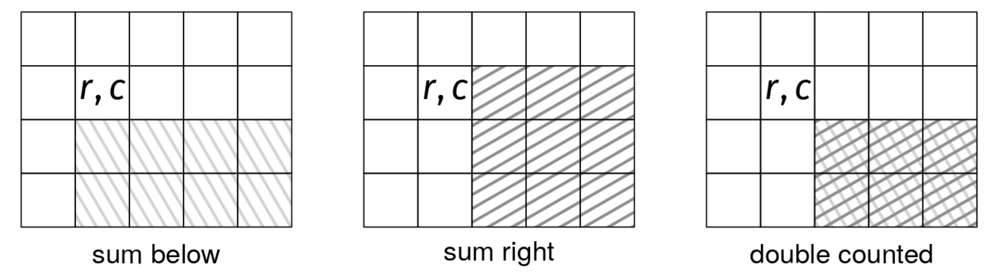

Given a rectangular RxC grid of integers, grid, with R > 0 and C > 0, return a new grid with the same dimensions where each cell [r, c] contains the sum of all the elements in the subgrid with [r, c] in the top-left corner and [R - 1, C - 1] in the bottom-right corner.

Example 1:
grid =  [[-1,  2,  3],
         [ 4,  0,  0],
         [-2,  0,  9]]
Output: [[15, 14, 12],
         [11,  9,  9],
         [ 7,  9,  9]]

Example 2:
grid =  [[5]]
Output: [[5]]
Explanation: For a 1x1 grid, each cell's subgrid is just itself.

Example 3:
grid =  [[1, 2, 3]]
Output: [[6, 5, 3]]
Explanation: For a single row, each cell's subgrid includes all elements to
its right.
Constraints:

1 ≤ R, C ≤ 10^3
-10^3 ≤ grid[i][j] ≤ 10^3

The naive solution computes the sum for each individual cell by iterating through the corresponding subgrid. This takes O(R•C) time per subgrid, resulting in a total runtime of O((R*C)^2).

To improve this runtime, we should look for ways in which we can reuse the sums that we have already computed to compute the sum of additional cells. The key property is that the sum of the subgrid for a given cell [r, c] is:

res[r][c] = grid[r][c] + res[r + 1][c] + res[r][c + 1] - res[r + 1][c + 1]

That is, we add the sum of the elements below (res[r + 1][c]) and to the right (res[r][c + 1]). The reason why we subtract res[r + 1][c + 1] is because we are double counting the elements which are both below and to the right of the current position:

Here is the implementation:

def subgrid_sums(grid):
  R, C = len(grid), len(grid[0])
  res = [row.copy() for row in grid]
  for r in range(R - 1, -1, -1):
    for c in range(C - 1, -1, -1):
      if r + 1 < R:
        res[r][c] += res[r + 1][c]
      if c + 1 < C:
        res[r][c] += res[r][c + 1]
      if r + 1 < R and c + 1 < C:  # subtract doublecounted subgrid
        res[r][c] -= res[r + 1][c + 1]
  return res
Time & Space Analysis
R: the number of rows

C: the number of columns

Time: O(R*C) - we copy the grid, which takes O(R*C) time, and then iterate through the grid once, which takes O(R*C) time.

Extra space: O(R*C) - we create a new grid to store the sums.

Tests
Here are some test cases to verify the solution:

def run_tests():
  tests = [
      # Example from book
      ([[-1, 2, 3],
        [4, 0, 0],
        [-2, 0, 9]],
       [[15, 14, 12],
        [11, 9, 9],
        [7, 9, 9]]),
      # Edge case - 1x1 grid
      ([[5]], [[5]]),
      # Edge case - single row
      ([[1, 2, 3]], [[6, 5, 3]]),
      # Edge case - single column
      ([[1], [2], [3]], [[6], [5], [3]]),
      # Edge case - all zeros
      ([[0, 0],
        [0, 0]],
       [[0, 0],
        [0, 0]]),
  ]

  for grid, want in tests:
    got = subgrid_sums(grid)
    assert got == want, f"\nsubgrid_sums({grid}): got: {got}, want: {want}\n"

run_tests()
function subgridSums(grid) {
  const R = grid.length;
  const C = grid[0].length;
  const res = grid.map((row) => [...row]);
  for (let r = R - 1; r >= 0; r--) {
    for (let c = C - 1; c >= 0; c--) {
      if (r + 1 < R) {
        res[r][c] += res[r + 1][c];
      }
      if (c + 1 < C) {
        res[r][c] += res[r][c + 1];
      }
      if (r + 1 < R && c + 1 < C) {
        // subtract doublecounted subgrid
        res[r][c] -= res[r + 1][c + 1];
      }
    }
  }
  return res;
}
Time & Space Analysis
R: the number of rows

C: the number of columns

Time: O(R*C) - we copy the grid, which takes O(R*C) time, and then iterate through the grid once, which takes O(R*C) time.

Extra space: O(R*C) - we create a new grid to store the sums.

Tests
Here are some test cases to verify the solution:

function runTests() {
  const tests = [
    // Example from book
    [
      [
        [-1, 2, 3],
        [4, 0, 0],
        [-2, 0, 9],
      ],
      [
        [15, 14, 12],
        [11, 9, 9],
        [7, 9, 9],
      ],
    ],
    // Edge case - 1x1 grid
    [[[5]], [[5]]],
    // Edge case - single row
    [[[1, 2, 3]], [[6, 5, 3]]],
    // Edge case - single column
    [
      [[1], [2], [3]],
      [[6], [5], [3]],
    ],
    // Edge case - all zeros
    [
      [
        [0, 0],
        [0, 0],
      ],
      [
        [0, 0],
        [0, 0],
      ],
    ],
  ];

  for (const [grid, want] of tests) {
    const got = subgridSums(grid);
    if (JSON.stringify(got) !== JSON.stringify(want)) {
      throw new Error(
        `\nsubgridSums(${JSON.stringify(grid)}): got: ${JSON.stringify(got)}, want: ${JSON.stringify(want)}\n`,
      );
    }
  }
}

runTests();

class SubgridSums {
  public int[][] solve(int[][] grid) {
    final int R = grid.length;
    final int C = grid[0].length;
    int[][] res = new int[R][C];
    for (int r = 0; r < R; r++) {
      res[r] = Arrays.copyOf(grid[r], C);
    }

    for (int r = R - 1; r >= 0; r--) {
      for (int c = C - 1; c >= 0; c--) {
        if (r + 1 < R) {
          res[r][c] += res[r + 1][c];
        }
        if (c + 1 < C) {
          res[r][c] += res[r][c + 1];
        }
        if (r + 1 < R && c + 1 < C) { // subtract doublecounted subgrid
          res[r][c] -= res[r + 1][c + 1];
        }
      }
    }
    return res;
  }
}
Time & Space Analysis
R: the number of rows

C: the number of columns

Time: O(R*C) - we copy the grid, which takes O(R*C) time, and then iterate through the grid once, which takes O(R*C) time.

Extra space: O(R*C) - we create a new grid to store the sums.

Tests
Here are some test cases to verify the solution:

class RunTests {
  public void runTests() {
    Object[][] tests = {
        // Example from book
        { new int[][] {
            { -1, 2, 3 },
            { 4, 0, 0 },
            { -2, 0, 9 }
        }, new int[][] {
            { 15, 14, 12 },
            { 11, 9, 9 },
            { 7, 9, 9 }
        } },
        // Edge case - 1x1 grid
        { new int[][] { { 5 } }, new int[][] { { 5 } } },
        // Edge case - single row
        { new int[][] { { 1, 2, 3 } }, new int[][] { { 6, 5, 3 } } },
        // Edge case - single column
        { new int[][] { { 1 }, { 2 }, { 3 } },
            new int[][] { { 6 }, { 5 }, { 3 } } },
        // Edge case - all zeros
        { new int[][] {
            { 0, 0 },
            { 0, 0 }
        }, new int[][] {
            { 0, 0 },
            { 0, 0 }
        } },
    };

    SubgridSums solution = new SubgridSums();
    for (Object[] test : tests) {
      int[][] grid = (int[][]) test[0];
      int[][] want = (int[][]) test[1];
      int[][] got = solution.solve(grid);
      if (!Arrays.deepEquals(got, want)) {
        throw new RuntimeException(String.format(
            "\nsolve(%s): got: %s, want: %s\n",
            Arrays.deepToString(grid), Arrays.deepToString(got),
            Arrays.deepToString(want)));
      }
    }
  }
}

public class Solution {
  public static void main(String[] args) {
    new RunTests().runTests();
  }
}