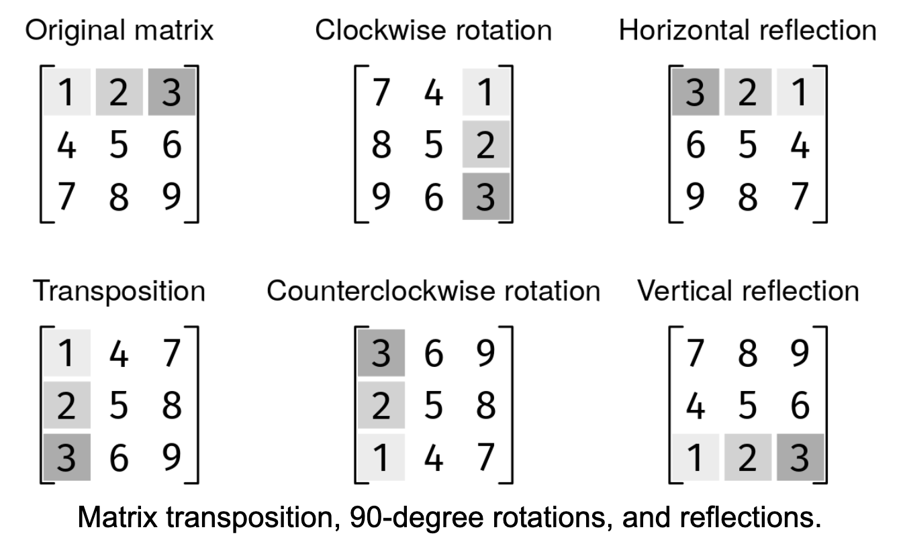

Basic matrix operations sometimes come up in coding interviews because they involve interesting grid transformations, but they usually don't assume background knowledge.

Transposition: The first row becomes the first column, the second row becomes the second column, and so on.
Rotation: A transformation that turns the matrix 90 degrees, clockwise or counterclockwise.
Vertical reflection: The first column becomes the last column, the second column becomes the second last, and so on.
Horizontal reflection: The first row becomes the last row, the second row becomes the second last, and so on.
Implement a Matrix class that can be initialized with a square grid of floating point numbers. It must have methods for transposition, clockwise rotation, anticlockwise rotation, horizontal reflection, and vertical reflection. All the methods take zero parameters and should modify the matrix in place, using only O(1) extra space, and return nothing.

Example 1: Transposition
grid = [[1, 2],
        [3, 4]]
After transpose():
       [[1, 3],
        [2, 4]]

Example 2: Clockwise Rotation
grid = [[1, 2],
        [3, 4]]
After rotate_clockwise():
       [[3, 1],
        [4, 2]]

Example 3: Horizontal Reflection
grid = [[1, 2],
        [3, 4]]
After reflect_horizontally():
       [[3, 4],
        [1, 2]]
        Constraints:

1 ≤ n ≤ 1000 where n is the size of the square matrix
-10^4 ≤ grid[i][j] ≤ 10^4
We can initialize the class by making a copy of the input grid.

We'll implement each operation separately, making sure to modify the matrix in place and use only O(1) extra space.

Transposition

Tracking rows and columns through a transposition example can help work out the logic. Essentially, the rows become columns, and the columns become rows. We can achieve it by swapping elements under the main diagonal with elements above it.

In the implementation, the limited range in the second loop makes it so we only iterate through the cells under the main diagonal. If we forget it, we will swap each pair of cells twice, leaving them in their original place!

Reflection

Reflections are straightforward to implement.

Horizontal reflection: reverse the order of rows
Vertical reflection: reverse each row
Rotation

There are two approaches to implementing rotations:

We can do 4-way swaps, where we swap a four cells at once, one from the top-left quadrant, one from the top-right, one from the bottom-left, and one from the bottom-right.

However, there is a trick that allows us to leverage the previous solutions: notice how both transpositions and rotations turn rows into columns and columns into rows. By transposing the matrix, we are close to achieving a rotation. We only need to follow it with a reflection.

Clockwise rotation = transpose + vertical reflection
Counterclockwise rotation = transpose + horizontal reflection
Here is the implementation:

class Matrix {
  private double[][] matrix;

  public Matrix(double[][] grid) {
    matrix = new double[grid.length][];
    for (int i = 0; i < grid.length; i++) {
      matrix[i] = Arrays.copyOf(grid[i], grid[i].length);
    }
  }

  public void transpose() {
    for (int r = 0; r < matrix.length; r++) {
      for (int c = 0; c < r; c++) {
        double temp = matrix[r][c];
        matrix[r][c] = matrix[c][r];
        matrix[c][r] = temp;
      }
    }
  }

  public void reflectHorizontally() {
    for (int i = 0; i < matrix.length / 2; i++) {
      double[] temp = matrix[i];
      matrix[i] = matrix[matrix.length - 1 - i];
      matrix[matrix.length - 1 - i] = temp;
    }
  }

  public void reflectVertically() {
    for (int r = 0; r < matrix.length; r++) {
      for (int c = 0; c < matrix[0].length / 2; c++) {
        double temp = matrix[r][c];
        matrix[r][c] = matrix[r][matrix[0].length - 1 - c];
        matrix[r][matrix[0].length - 1 - c] = temp;
      }
    }
  }

  public void rotateClockwise() {
    transpose();
    reflectVertically();
  }

  public void rotateCounterclockwise() {
    transpose();
    reflectHorizontally();
  }

  public double[][] getMatrix() {
    return matrix;
  }
}
Time & Space Analysis
n: the size of the matrix

Time: O(n^2) for each operation

Extra space: O(1) for each operation. We modify the matrix in place.

Tests
Here are some test cases to verify the solution:

class RunTests {
  public void runTests() {
    Object[][] tests = {
        // Test transpose
        { new double[][] { { 1.0, 2.0 }, { 3.0, 4.0 } }, "transpose",
            new double[][] { { 1.0, 3.0 }, { 2.0, 4.0 } } },
        // Test horizontal reflection
        { new double[][] { { 1.0, 2.0 }, { 3.0, 4.0 } }, "reflectHorizontally",
            new double[][] { { 3.0, 4.0 }, { 1.0, 2.0 } } },
        // Test vertical reflection
        { new double[][] { { 1.0, 2.0 }, { 3.0, 4.0 } }, "reflectVertically",
            new double[][] { { 2.0, 1.0 }, { 4.0, 3.0 } } },
        // Test clockwise rotation
        { new double[][] { { 1.0, 2.0 }, { 3.0, 4.0 } }, "rotateClockwise",
            new double[][] { { 3.0, 1.0 }, { 4.0, 2.0 } } },
        // Test counterclockwise rotation
        { new double[][] { { 1.0, 2.0 }, { 3.0, 4.0 } }, "rotateCounterclockwise",
            new double[][] { { 2.0, 4.0 }, { 1.0, 3.0 } } },
        // Edge case - 1x1 matrix
        { new double[][] { { 5.0 } }, "transpose", new double[][] { { 5.0 } } },
        // Edge case - 3x3 matrix
        { new double[][] {
            { 1.0, 2.0, 3.0 },
            { 4.0, 5.0, 6.0 },
            { 7.0, 8.0, 9.0 }
        }, "rotateClockwise",
            new double[][] {
                { 7.0, 4.0, 1.0 },
                { 8.0, 5.0, 2.0 },
                { 9.0, 6.0, 3.0 }
            } },
    };

    for (Object[] test : tests) {
      double[][] grid = (double[][]) test[0];
      String operation = (String) test[1];
      double[][] want = (double[][]) test[2];
      Matrix matrix = new Matrix(grid);
      try {
        Matrix.class.getMethod(operation).invoke(matrix);
        double[][] got = matrix.getMatrix();
        if (!Arrays.deepEquals(got, want)) {
          throw new RuntimeException(String.format(
              "\nMatrix(%s).%s(): got: %s, want: %s\n",
              Arrays.deepToString(grid), operation,
              Arrays.deepToString(got), Arrays.deepToString(want)));
        }
      } catch (Exception e) {
        throw new RuntimeException(e);
      }
    }
  }
}

public class Solution {
  public static void main(String[] args) {
    new RunTests().runTests();
  }
}

class Matrix:
  def __init__(self, grid):
    self.matrix = [row.copy() for row in grid]

  def transpose(self):
    matrix = self.matrix
    for r in range(len(matrix)):
      for c in range(r):
        matrix[r][c], matrix[c][r] = matrix[c][r], matrix[r][c]

  def reflect_horizontally(self):
    self.matrix.reverse()

  def reflect_vertically(self):
    for row in self.matrix:
      row.reverse()

  def rotate_clockwise(self):
    self.transpose()
    self.reflect_vertically()

  def rotate_counterclockwise(self):
    self.transpose()
    self.reflect_horizontally()
Time & Space Analysis
n: the size of the matrix

Time: O(n^2) for each operation

Extra space: O(1) for each operation. We modify the matrix in place.

Tests
Here are some test cases to verify the solution:

def run_tests():
  tests = [
      # Test transpose
      ([[1, 2], [3, 4]], "transpose", [[1, 3], [2, 4]]),
      # Test horizontal reflection
      ([[1, 2], [3, 4]], "reflect_horizontally", [[3, 4], [1, 2]]),
      # Test vertical reflection
      ([[1, 2], [3, 4]], "reflect_vertically", [[2, 1], [4, 3]]),
      # Test clockwise rotation
      ([[1, 2], [3, 4]], "rotate_clockwise", [[3, 1], [4, 2]]),
      # Test counterclockwise rotation
      ([[1, 2], [3, 4]], "rotate_counterclockwise", [[2, 4], [1, 3]]),
      # Edge case - 1x1 matrix
      ([[5]], "transpose", [[5]]),
      # Edge case - 3x3 matrix
      ([[1, 2, 3],
        [4, 5, 6],
        [7, 8, 9]], "rotate_clockwise",
       [[7, 4, 1],
        [8, 5, 2],
        [9, 6, 3]]),
  ]

  for grid, operation, want in tests:
    matrix = Matrix(grid)
    getattr(matrix, operation)()
    got = matrix.matrix
    assert got == want, (f"\nMatrix({grid}).{operation}(): "
                         f"got: {got}, want: {want}\n")

run_tests()

class Matrix {
  constructor(grid) {
    this.matrix = grid.map((row) => [...row]);
  }

  transpose() {
    const matrix = this.matrix;
    for (let r = 0; r < matrix.length; r++) {
      for (let c = 0; c < r; c++) {
        [matrix[r][c], matrix[c][r]] = [matrix[c][r], matrix[r][c]];
      }
    }
  }

  reflectHorizontally() {
    this.matrix.reverse();
  }

  reflectVertically() {
    for (const row of this.matrix) {
      row.reverse();
    }
  }

  rotateClockwise() {
    this.transpose();
    this.reflectVertically();
  }

  rotateCounterclockwise() {
    this.transpose();
    this.reflectHorizontally();
  }
}
Time & Space Analysis
n: the size of the matrix

Time: O(n^2) for each operation

Extra space: O(1) for each operation. We modify the matrix in place.

Tests
Here are some test cases to verify the solution:

function runTests() {
  const tests = [
    // Test transpose
    [
      [1, 2],
      [3, 4],
    ],
    "transpose",
    [
      [1, 3],
      [2, 4],
    ],
    // Test horizontal reflection
    [
      [1, 2],
      [3, 4],
    ],
    "reflectHorizontally",
    [
      [3, 4],
      [1, 2],
    ],
    // Test vertical reflection
    [
      [1, 2],
      [3, 4],
    ],
    "reflectVertically",
    [
      [2, 1],
      [4, 3],
    ],
    // Test clockwise rotation
    [
      [1, 2],
      [3, 4],
    ],
    "rotateClockwise",
    [
      [3, 1],
      [4, 2],
    ],
    // Test counterclockwise rotation
    [
      [1, 2],
      [3, 4],
    ],
    "rotateCounterclockwise",
    [
      [2, 4],
      [1, 3],
    ],
    // Edge case - 1x1 matrix
    [[5]],
    "transpose",
    [[5]],
    // Edge case - 3x3 matrix
    [
      [1, 2, 3],
      [4, 5, 6],
      [7, 8, 9],
    ],
    "rotateClockwise",
    [
      [7, 4, 1],
      [8, 5, 2],
      [9, 6, 3],
    ],
  ];

  for (let i = 0; i < tests.length; i += 3) {
    const grid = tests[i];
    const operation = tests[i + 1];
    const want = tests[i + 2];
    const matrix = new Matrix(grid);
    matrix[operation]();
    const got = matrix.matrix;
    if (JSON.stringify(got) !== JSON.stringify(want)) {
      throw new Error(
        `\nMatrix(${JSON.stringify(grid)}).${operation}(): ` +
          `got: ${JSON.stringify(got)}, want: ${JSON.stringify(want)}\n`,
      );
    }
  }
}

runTests();