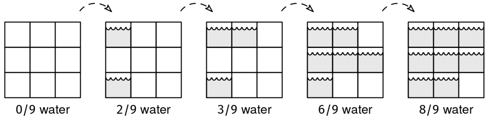

You are provided a series of aerial-view pictures of the same coastal region, taken a few minutes apart from each other around the time the tide rises. Each picture consists of an nxn binary grid, where 0 represents a part of the region above water, and 1 represents a part below water.

The tide appears from the left side and rises toward the right, so, in each picture, for each row, all the 1's will be before all the 0's.
Once a region is under water, it stays under water.
All pictures are different.
Determine which picture shows the most even balance between regions above and below water (i.e., where the number of 1's most closely equals the number of 0's). In the event of a tie, return the earliest picture.

Example 1:

Picture 0:
[0, 0, 0]
[0, 0, 0]
[0, 0, 0]
Picture 1:
[1, 0, 0]
[0, 0, 0]
[1, 0, 0]
Picture 2:
[1, 1, 0]
[0, 0, 0]
[1, 0, 0]
Picture 3:
[1, 1, 0]
[1, 1, 1]
[1, 0, 0]
Picture 4:
[1, 1, 1]
[1, 1, 1]
[1, 1, 0]

Output: 2. The pictures at index 2 and 3 are equally far from having 50%
water. We break the tie by picking the earlier one, 2.

Example 2:

Picture 0:
[1, 1]
[1, 1]

Output: 0. It's the only picture.
Here is a visualization of Example 1:

Tide Aerial View Example 1
Constraints:

1 ≤ pictures.length ≤ 500
All pictures have dimension n x n, where 1 ≤ n ≤ 500
See Solution
Problem 29.12 - Tide Aerial View: Solution
Python
We can binary search for the transition point where it goes from majority above water to majority underwater. The 'before' pictures are < 50% water, and the 'after' pictures are ≥ 50% water. The answer will be the last 'before' or the first 'after'.

We can use the transition point recipe:

transition_point_recipe()
  define is_before(val) to return whether val is 'before'
  initialize l and r to the first and last values in the range
  handle edge cases:
    - the range is empty
    - l is 'after'  (the whole range is 'after')
    - r is 'before' (the whole range is 'before')

  while l and r are not next to each other (r - l > 1)
    mid = (l + r) / 2
    if is_before(mid)
      l = mid
    else
      r = mid

  return l (the last 'before'), r (the first 'after'), or something else,
         depending on the problem
However, if you constructed the is_before() function to just loop through the matrix, counting the number of cells underwater, you missed something! Besides doing a binary search across the range of pictures, we can speed up the count of underwater cells by also doing a binary search on each row: the rows are monotonic, with all 1's followed by all 0's.

Here is the implementation:

class TideAerialView:

  # Time: O(log n)
  # Space: O(1)
  def get_ones_in_row(self, row):
    if row[0] == 0:
      return 0
    if row[-1] == 1:
      return len(row)

    def is_before(idx):
      return row[idx] == 1

    l, r = 0, len(row)
    while r - l > 1:
      mid = (l + r) // 2
      if is_before(mid):
        l = mid
      else:
        r = mid
    return r

  # Time: O(n log n)
  # Space: O(1)
  def get_ones_in_picture(self, picture):
    ones = 0
    for row in picture:
      ones += self.get_ones_in_row(row)
    return ones

  # Time: O((log k) * n log n)
  # Space: O(1)
  def solve(self, pictures):
    
    def is_before(picture):
      water = self.get_ones_in_picture(picture)
      total = len(picture[0])**2
      return water / total < 0.5

    if not is_before(pictures[0]):
      return 0
    if is_before(pictures[-1]):
      return len(pictures) - 1

    l, r = 0, len(pictures) - 1
    while r - l > 1:
      mid = (l + r) // 2
      if is_before(pictures[mid]):
        l = mid
      else:
        r = mid

    # Return the closest one to the midpoint, or l in case of a tie
    l_water = self.get_ones_in_picture(pictures[l])
    r_water = self.get_ones_in_picture(pictures[r])
    mid_point = len(pictures[0])**2 / 2
    return l if abs(l_water - mid_point) <= abs(r_water - mid_point) else r
Time & Space Analysis
k: the number of pictures

n: the dimension of each picture (n x n grid)

Time: O((log k) * n log n)

Extra space: O(1)

Checking the number of ones in a row takes O(log n) time. Checking the number of ones in an entire grid takes O(n log n) time. The binary search on pictures takes O(log k) iterations, and each iteration requires O(n log n) time to count ones in a picture. The total time is O((log k) * n log n).

Tests
Here are some test cases to verify the solution:

def run_tests():
  tests = [
      # Example from the book
      ([[[0, 0, 0],
         [0, 0, 0],
         [0, 0, 0]],
        [[1, 0, 0],
         [0, 0, 0],
         [1, 0, 0]],
        [[1, 1, 0],
         [0, 0, 0],
         [1, 0, 0]],
        [[1, 1, 0],
         [1, 1, 1],
         [1, 0, 0]],
        [[1, 1, 1],
         [1, 1, 1],
         [1, 1, 0]]], 2),
      # 3 pictures with increasing water
      ([[[1, 0, 0],
         [1, 0, 0],
         [1, 0, 0]],
        [[1, 1, 0],
         [1, 1, 0],
         [1, 0, 0]],
        [[1, 1, 1],
         [1, 1, 1],
         [1, 0, 0]]], 1),
      # 2 pictures
      ([[[1, 0],
         [0, 0]],
        [[1, 1],
         [1, 0]]], 0),
      # Incremental progression
      ([[[0, 0, 0],
         [0, 0, 0],
         [0, 0, 0]],
        [[1, 0, 0],
         [0, 0, 0],
         [0, 0, 0]],
        [[1, 0, 0],
         [1, 0, 0],
         [0, 0, 0]],
        [[1, 1, 0],
         [1, 0, 0],
         [0, 0, 0]],
        [[1, 1, 1],
         [1, 0, 0],
         [0, 0, 0]],
        [[1, 1, 1],
         [1, 1, 0],
         [0, 0, 0]],
        [[1, 1, 1],
         [1, 1, 1],
         [0, 0, 0]],
        [[1, 1, 1],
         [1, 1, 1],
         [1, 0, 0]],
        [[1, 1, 1],
         [1, 1, 1],
         [1, 1, 0]],
        [[1, 1, 1],
         [1, 1, 1],
         [1, 1, 1]],
        ], 4),
      # Edge case - single picture
      ([[[1, 1], [0, 0]]], 0),
      # Edge case - all water
      ([[[1, 1], [1, 1]]], 0),
      # Edge case - all land
      ([[[0, 0], [0, 0]]], 0)
  ]

  for pictures, want in tests:
    got = TideAerialView().solve(pictures)
    assert got == want, f"\ntide_aerial_view({pictures}): got: {
        got}, want: {want}\n"

run_tests()

class TideAerialView {
  // Time: O(log n)
  // Space: O(1)
  getOnesInRow(row) {
    if (row[0] === 0) {
      return 0;
    }
    if (row[row.length - 1] === 1) {
      return row.length;
    }

    function isBefore(idx) {
      return row[idx] === 1;
    }

    let l = 0,
      r = row.length;
    while (r - l > 1) {
      const mid = Math.floor((l + r) / 2);
      if (isBefore(mid)) {
        l = mid;
      } else {
        r = mid;
      }
    }
    return r;
  }

  // Time: O(n log n)
  // Space: O(1)
  getOnesInPicture(picture) {
    let ones = 0;
    for (const row of picture) {
      ones += this.getOnesInRow(row);
    }
    return ones;
  }

  // Time: O((log k) * n log n)
  // Space: O(1)
  solve(pictures) {
    const isBefore = (picture) => {
      const water = this.getOnesInPicture(picture);
      const total = Math.pow(picture[0].length, 2);
      return water / total < 0.5;
    };

    if (!isBefore(pictures[0])) {
      return 0;
    }
    if (isBefore(pictures[pictures.length - 1])) {
      return pictures.length - 1;
    }

    let l = 0,
      r = pictures.length - 1;
    while (r - l > 1) {
      const mid = Math.floor((l + r) / 2);
      if (isBefore(pictures[mid])) {
        l = mid;
      } else {
        r = mid;
      }
    }

    // Return the closest one to the midpoint, or l in case of a tie
    const lWater = this.getOnesInPicture(pictures[l]);
    const rWater = this.getOnesInPicture(pictures[r]);
    const midPoint = Math.pow(pictures[0][0].length, 2) / 2;
    return Math.abs(lWater - midPoint) <= Math.abs(rWater - midPoint) ? l : r;
  }
}
Time & Space Analysis
k: the number of pictures

n: the dimension of each picture (n x n grid)

Time: O((log k) * n log n)

Extra space: O(1)

Checking the number of ones in a row takes O(log n) time. Checking the number of ones in an entire grid takes O(n log n) time. The binary search on pictures takes O(log k) iterations, and each iteration requires O(n log n) time to count ones in a picture. The total time is O((log k) * n log n).

Tests
Here are some test cases to verify the solution:

function runTests() {
  const tests = [
    // Example from the book
    [
      [
        [
          [0, 0, 0],
          [0, 0, 0],
          [0, 0, 0],
        ],
        [
          [1, 0, 0],
          [0, 0, 0],
          [1, 0, 0],
        ],
        [
          [1, 1, 0],
          [0, 0, 0],
          [1, 0, 0],
        ],
        [
          [1, 1, 0],
          [1, 1, 1],
          [1, 0, 0],
        ],
        [
          [1, 1, 1],
          [1, 1, 1],
          [1, 1, 0],
        ],
      ],
      2,
    ],
    // 3 pictures with increasing water
    [
      [
        [
          [1, 0, 0],
          [1, 0, 0],
          [1, 0, 0],
        ],
        [
          [1, 1, 0],
          [1, 1, 0],
          [1, 0, 0],
        ],
        [
          [1, 1, 1],
          [1, 1, 1],
          [1, 0, 0],
        ],
      ],
      1,
    ],
    // 2 pictures
    [
      [
        [
          [1, 0],
          [0, 0],
        ],
        [
          [1, 1],
          [1, 0],
        ],
      ],
      0,
    ],
    // Incremental progression
    [
      [
        [
          [0, 0, 0],
          [0, 0, 0],
          [0, 0, 0],
        ],
        [
          [1, 0, 0],
          [0, 0, 0],
          [0, 0, 0],
        ],
        [
          [1, 0, 0],
          [1, 0, 0],
          [0, 0, 0],
        ],
        [
          [1, 1, 0],
          [1, 0, 0],
          [0, 0, 0],
        ],
        [
          [1, 1, 1],
          [1, 0, 0],
          [0, 0, 0],
        ],
        [
          [1, 1, 1],
          [1, 1, 0],
          [0, 0, 0],
        ],
        [
          [1, 1, 1],
          [1, 1, 1],
          [0, 0, 0],
        ],
        [
          [1, 1, 1],
          [1, 1, 1],
          [1, 0, 0],
        ],
        [
          [1, 1, 1],
          [1, 1, 1],
          [1, 1, 0],
        ],
        [
          [1, 1, 1],
          [1, 1, 1],
          [1, 1, 1],
        ],
      ],
      4,
    ],
    // Edge case - single picture
    [
      [
        [
          [1, 1],
          [0, 0],
        ],
      ],
      0,
    ],
    // Edge case - all water
    [
      [
        [
          [1, 1],
          [1, 1],
        ],
      ],
      0,
    ],
    // Edge case - all land
    [
      [
        [
          [0, 0],
          [0, 0],
        ],
      ],
      0,
    ],
  ];

  for (const [pictures, want] of tests) {
    const got = new TideAerialView().solve(pictures);
    if (got !== want) {
      throw new Error(
        `\ntideAerialView(${JSON.stringify(pictures)}): got: ${got}, want: ${want}\n`,
      );
    }
  }
}

runTests();

class TideAerialView {
  // Time: O((log k) * n log n)
  // Space: O(1)
  public int solve(int[][][] pictures) {
    if (!isBefore(pictures[0])) {
      return 0;
    }
    if (isBefore(pictures[pictures.length - 1])) {
      return pictures.length - 1;
    }

    int l = 0, r = pictures.length - 1;
    while (r - l > 1) {
      int mid = (l + r) / 2;
      if (isBefore(pictures[mid])) {
        l = mid;
      } else {
        r = mid;
      }
    }

    // Return the closest one to the midpoint, or l in case of a tie
    int lWater = getOnesInPicture(pictures[l]);
    int rWater = getOnesInPicture(pictures[r]);
    double midPoint = pictures[0][0].length * pictures[0][0].length / 2.0;
    return Math.abs(lWater - midPoint) <= Math.abs(rWater - midPoint) ? l : r;
  }

  // Time: O(n log n)
  // Space: O(1)
  private int getOnesInPicture(int[][] picture) {
    int ones = 0;
    for (int[] row : picture) {
      ones += getOnesInRow(row);
    }
    return ones;
  }

  // Time: O(n log n)
  // Space: O(1)
  private boolean isBefore(int[][] picture) {
    int water = getOnesInPicture(picture);
    int total = picture[0].length * picture[0].length;
    return (double) water / total < 0.5;
  }

  // Time: O(log n)
  // Space: O(1)
  private int getOnesInRow(int[] row) {
    if (row[0] == 0) {
      return 0;
    }
    if (row[row.length - 1] == 1) {
      return row.length;
    }

    int l = 0, r = row.length;
    while (r - l > 1) {
      int mid = (l + r) / 2;
      if (isBeforeRow(mid, row)) {
        l = mid;
      } else {
        r = mid;
      }
    }
    return r;
  }

  private boolean isBeforeRow(int idx, int[] row) {
    return row[idx] == 1;
  }
}
Time & Space Analysis
k: the number of pictures

n: the dimension of each picture (n x n grid)

Time: O((log k) * n log n)

Extra space: O(1)

Checking the number of ones in a row takes O(log n) time. Checking the number of ones in an entire grid takes O(n log n) time. The binary search on pictures takes O(log k) iterations, and each iteration requires O(n log n) time to count ones in a picture. The total time is O((log k) * n log n).

Tests
Here are some test cases to verify the solution:

class RunTests {
  public void runTests() {
    Object[][] tests = {
        // Example from the book
        { new int[][][] {
            {
                { 0, 0, 0 },
                { 0, 0, 0 },
                { 0, 0, 0 }
            },
            {
                { 1, 0, 0 },
                { 0, 0, 0 },
                { 1, 0, 0 }
            },
            {
                { 1, 1, 0 },
                { 0, 0, 0 },
                { 1, 0, 0 }
            },
            {
                { 1, 1, 0 },
                { 1, 1, 1 },
                { 1, 0, 0 }
            },
            {
                { 1, 1, 1 },
                { 1, 1, 1 },
                { 1, 1, 0 }
            }
        }, 2 },
        // 3 pictures with increasing water
        { new int[][][] {
            {
                { 1, 0, 0 },
                { 1, 0, 0 },
                { 1, 0, 0 }
            },
            {
                { 1, 1, 0 },
                { 1, 1, 0 },
                { 1, 0, 0 }
            },
            {
                { 1, 1, 1 },
                { 1, 1, 1 },
                { 1, 0, 0 }
            }
        }, 1 },
        // 2 pictures
        { new int[][][] {
            { { 1, 0 }, { 0, 0 } },
            { { 1, 1 }, { 1, 0 } }
        }, 0 },
        // Incremental progression
        { new int[][][] {
            { { 0, 0, 0 }, { 0, 0, 0 }, { 0, 0, 0 } },
            { { 1, 0, 0 }, { 0, 0, 0 }, { 0, 0, 0 } },
            { { 1, 0, 0 }, { 1, 0, 0 }, { 0, 0, 0 } },
            { { 1, 1, 0 }, { 1, 0, 0 }, { 0, 0, 0 } },
            { { 1, 1, 1 }, { 1, 0, 0 }, { 0, 0, 0 } },
            { { 1, 1, 1 }, { 1, 1, 0 }, { 0, 0, 0 } },
            { { 1, 1, 1 }, { 1, 1, 1 }, { 0, 0, 0 } },
            { { 1, 1, 1 }, { 1, 1, 1 }, { 1, 0, 0 } },
            { { 1, 1, 1 }, { 1, 1, 1 }, { 1, 1, 0 } },
            { { 1, 1, 1 }, { 1, 1, 1 }, { 1, 1, 1 } }
        }, 4 },
        // Edge case - single picture
        { new int[][][] {
            { { 1, 1 }, { 0, 0 } }
        }, 0 },
        // Edge case - all water
        { new int[][][] {
            { { 1, 1 }, { 1, 1 } }
        }, 0 },
        // Edge case - all land
        { new int[][][] {
            { { 0, 0 }, { 0, 0 } }
        }, 0 }
    };

    TideAerialView solution = new TideAerialView();
    for (Object[] test : tests) {
      int[][][] pictures = (int[][][]) test[0];
      int want = (int) test[1];
      int got = solution.solve(pictures);
      if (got != want) {
        throw new RuntimeException(String.format(
            "\nsolve(%s): got: %d, want: %d\n",
            Arrays.deepToString(pictures), got, want));
      }
    }
  }
}

public class Solution {
  public static void main(String[] args) {
    new RunTests().runTests();
  }
}