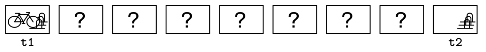
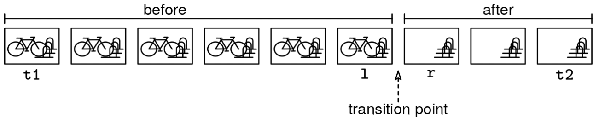
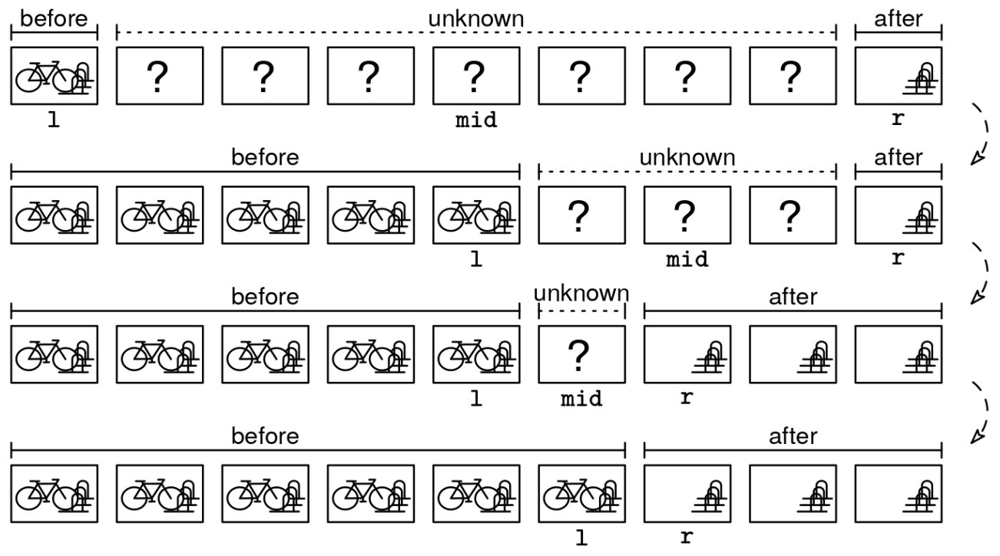

You are given an API called is_stolen(t) which takes a timestamp as input and returns True if the bike is missing at that timestamp and False if it is still there. You're also given two timestamps, t1 and t2, representing when you parked the bike and when you found it missing. Return the timestamp when the bike was first missing, minimizing the number of API calls. Assume that 0 < t1 < t2, is_stolen(t1) is False, and is_stolen(t2) is True.

CCTV Footage Example

Example 1: t1 = 1, t2 = 5, is_stolen = lambda t: t >= 3
Output: 3. The bike was stolen at timestamp 3.

Example 2: t1 = 1, t2 = 10, is_stolen = lambda t: t >= 7
Output: 7. The bike was stolen at timestamp 7.

Example 3: t1 = 5, t2 = 10, is_stolen = lambda t: t >= 8
Output: 8. The bike was stolen at timestamp 8.
Constraints:

0 < t1 < t2 ≤ 10^6
The API call is_stolen(t) takes O(1) time
on
Java
This problem is quite different than typical binary search problems - it doesn't have an array input, and we don't have a target value. Nonetheless, we can still use binary search because the range of possible answers can be broken down into two regions: (1) before the bike was stolen and (2) after it was stolen. We are searching for the transition point from 'before' to 'after'.

Initially, we don't know where the transition point is, but we can binary search for it:

Let l be in the 'before' region (t1) and r be in the 'after' region (t2)
Check the midpoint - if the bike is still there, we know the transition point is after mid
If the bike is gone, we know the transition point is before mid
Repeat until l and r are next to each other, meaning that the transition point is between them
We can use the transition point recipe:

transition_point_recipe()
  define is_before(val) to return whether val is 'before'
  initialize l and r to the first and last values in the range
  handle edge cases:
    - the range is empty
    - l is 'after'  (the whole range is 'after')
    - r is 'before' (the whole range is 'before')

  while l and r are not next to each other (r - l > 1)
    mid = (l + r) / 2
    if is_before(mid)
      l = mid
    else
      r = mid

  return l (the last 'before'), r (the first 'after'), or something else,
         depending on the problem
Here is the implementation:

class FindBike {
  public int solve(int t1, int t2, Function<Integer, Boolean> isStolen) {
    int l = t1, r = t2;
    while (r - l > 1) {
      int mid = (l + r) / 2;
      if (isBefore(mid, isStolen)) {
        l = mid;
      } else {
        r = mid;
      }
    }
    return r;
  }

  private boolean isBefore(int t, Function<Integer, Boolean> isStolen) {
    return !isStolen.apply(t);
  }
}
Time & Space Analysis
n = the time range t2 - t1

Time: O(log n) - Binary search on the timestamp range
Extra Space: O(1) - Only using constant extra space for pointers
Tests
Here are some test cases to verify the solution:

class RunTests {
  public void runTests() {
    Object[][] tests = {
        // Example 1 - stolen at t=5
        { 1, 10, (Function<Integer, Boolean>) (t -> t >= 5), 5 },
        // Example 2 - stolen at start 
        { 1, 5, (Function<Integer, Boolean>) (t -> t >= 2), 2 },
        // Example 3 - stolen at end
        { 1, 5, (Function<Integer, Boolean>) (t -> t >= 5), 5 },
        // Edge case - two timestamps
        { 5, 6, (Function<Integer, Boolean>) (t -> t >= 6), 6 }
    };

    FindBike solution = new FindBike();
    for (Object[] test : tests) {
      int t1 = (int) test[0];
      int t2 = (int) test[1];
      @SuppressWarnings("unchecked")
      Function<Integer, Boolean> isStolen = (Function<Integer, Boolean>) test[2];
      int want = (int) test[3];
      int got = solution.solve(t1, t2, isStolen);
      if (got != want) {
        throw new RuntimeException(String.format(
            "\nsolve(%d, %d): got: %d, want: %d\n",
            t1, t2, got, want));
      }
    }
  }
}

public class Solution {
  public static void main(String[] args) {
    new RunTests().runTests();
  }
}
def find_bike(t1, t2, is_stolen):

  def is_before(t):
    return not is_stolen(t)

  l, r = t1, t2
  while r - l > 1:
    mid = (l + r) // 2
    if is_before(mid):
      l = mid
    else:
      r = mid
  return r
Time & Space Analysis
n = the time range t2 - t1

Time: O(log n) - Binary search on the timestamp range
Extra Space: O(1) - Only using constant extra space for pointers
Tests
Here are some test cases to verify the solution:

def run_tests():
  tests = [
      # Example 1 - stolen at t=5
      (1, 10, lambda t: t >= 5, 5),
      # Example 2 - stolen at start
      (1, 5, lambda t: t >= 2, 2),
      # Example 3 - stolen at end
      (1, 5, lambda t: t >= 5, 5),
      # Edge case - two timestamps
      (5, 6, lambda t: t >= 6, 6)
  ]

  for t1, t2, is_stolen, want in tests:
    got = find_bike(t1, t2, is_stolen)
    assert got == want, f"\nfind_bike({t1}, {t2}): got: {got}, want: {want}\n"

run_tests()

function findBike(t1, t2, isStolen) {

  function isBefore(t) {
    return !isStolen(t);
  }

  let l = t1,
    r = t2;
  while (r - l > 1) {
    const mid = Math.floor((l + r) / 2);
    if (isBefore(mid)) {
      l = mid;
    } else {
      r = mid;
    }
  }
  return r;
}
Time & Space Analysis
n = the time range t2 - t1

Time: O(log n) - Binary search on the timestamp range
Extra Space: O(1) - Only using constant extra space for pointers
Tests
Here are some test cases to verify the solution:

function runTests() {
  const tests = [
    // Example 1 - stolen at t=5
    [1, 10, (t) => t >= 5, 5],
    // Example 2 - stolen at start
    [1, 5, (t) => t >= 2, 2],
    // Example 3 - stolen at end
    [1, 5, (t) => t >= 5, 5],
    // Edge case - two timestamps
    [5, 6, (t) => t >= 6, 6],
  ];

  for (const [t1, t2, isStolen, want] of tests) {
    const got = findBike(t1, t2, isStolen);
    if (got !== want) {
      throw new Error(`\nfindBike(${t1}, ${t2}): got: ${got}, want: ${want}\n`);
    }
  }
}

runTests();

Recipe 1 - Transition-point

transition_point_recipe()
  define is_before(val) to return whether val is 'before'
  initialize l and r to the first and last values in the range
  handle edge cases:
    - the range is empty
    - l is 'after'  (the whole range is 'after')
    - r is 'before' (the whole range is 'before')

  while l and r are not next to each other (r - l > 1)
    mid = (l + r) / 2
    if is_before(mid)
      l = mid
    else
      r = mid

  return l (the last 'before'), r (the first 'after'), or something else,
         depending on the problem

         