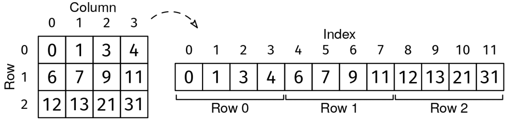

You are given a 2D grid of integers, grid, where each row is sorted (without duplicates), and the last value in each row is smaller than the first value in the following row. You are also given a target value, target. If the target is in the grid, return an array with its row and column indices. Otherwise, return [-1, -1].

Example 1:
target = 4
grid = [[1, 2, 4, 5],
        [6, 7, 8, 9]]
Output: [0, 2]. The number 4 is found in row 0 and column 2.

Example 2:
target = 3
grid = [[1, 2, 4, 5],
        [6, 7, 8, 9]]
Output: [-1, -1].
Constraints:

1 ≤ grid.length, grid[i].length ≤ 10000
-10^4 ≤ grid[i][j], target ≤ 10^4
The grid has no duplicates
See Solution
Problem 29.7 - Search In Sorted Grid: Solution
Python
We could solve this problem in two steps:

Binary search over the rows to find a single row that may contain the target.
Binary search over the row.
While this works, a trick that makes the implementation easier is to imagine that we "flatten" the grid into a single, long array with all the rows consecutively.

For instance, we imagine the following grid:

[[1, 2, 4, 5],
 [6, 7, 8, 9]]
as the following array:

[1, 2, 4, 5, 6, 7, 8, 9]

Search in Sorted Grid Example 1
The flattened array is a sorted array with R * C elements. We can binary search over this array without actually creating it. We start with l = 0 and r = R * C - 1. To implement binary search, we can map 'flattened-grid' indices to actual grid coordinates on the fly using these formulas:

  row = i // C
  col = i % C
We can use the transition point recipe, as it also works for the case where we're looking for an exact match:

transition_point_recipe()
  define is_before(val) to return whether val is 'before'
  initialize l and r to the first and last values in the range
  handle edge cases:
    - the range is empty
    - l is 'after'  (the whole range is 'after')
    - r is 'before' (the whole range is 'before')

  while l and r are not next to each other (r - l > 1)
    mid = (l + r) / 2
    if is_before(mid)
      l = mid
    else
      r = mid

  return l (the last 'before'), r (the first 'after'), or something else,
         depending on the problem
To find if there is an exact match, we define the 'before' region as < target. If target is found, then it will be the first element in the 'after' region, so we finish binary search by checking if the target is at index r.

Here is the implementation:

def search_in_sorted_grid(grid, target):
  R, C = len(grid), len(grid[0])

  # Before is < target, after is >= target
  def is_before(i):
    row, col = i // C, i % C
    return grid[row][col] < target

  # Ensure the first element is 'before' and the last element is 'after'
  if grid[0][0] > target or grid[R-1][C-1] < target:
    return [-1, -1]
  if grid[0][0] == target:
    return [0, 0]
  if grid[R-1][C-1] == target:
    return [R-1, C-1]

  # Binary search for the transition point
  l, r = 0, R * C - 1
  while r - l > 1:
    mid = (l + r) // 2
    if is_before(mid):
      l = mid
    else:
      r = mid

  row, col = r // C, r % C
  if grid[row][col] == target:
    return [row, col]
  return [-1, -1]
Time & Space Analysis
R: number of rows in the grid

C: number of columns in the grid

N: total number of elements in the grid (R * C)

Time: O(log N) - Binary search over the flattened grid

Extra space: O(1)

Tests
Here are some test cases to verify the solution:

def run_tests():
  tests = [
      ([[1, 3, 5], [7, 9, 11], [13, 15, 17]], 9, [1, 1]),  # Example 1
      ([[1, 3, 5], [7, 9, 11]], 4, [-1, -1]),  # Example 2
      ([[2, 3], [4, 5]], 1, [-1, -1]),  # 2x2 grid, all grid after
      ([[1, 2], [3, 4]], 5, [-1, -1]),  # 2x2 grid, all grid before
      ([[1, 2], [3, 4], [5, 6]], 1, [0, 0]),  # 3x2 grid, first element
      ([[1, 2, 3], [4, 5, 6]], 6, [1, 2]),  # 2x3 grid, last element
      ([[7]], 7, [0, 0]),  # Single element edge case
      ([[7]], 6, [-1, -1])  # Single element edge case (not found)
  ]

  for grid, target, want in tests:
    got = search_in_sorted_grid(grid, target)
    assert got == want, (
        f"\nsearch_in_sorted_grid({grid}, {target}): got: {got}, want: {want}\n")

run_tests()

function searchInSortedGrid(grid, target) {
  const R = grid.length;
  const C = grid[0].length;

  // Before is < target, after is >= target
  function isBefore(i) {
    const row = Math.floor(i / C);
    const col = i % C;
    return grid[row][col] < target;
  }

  // Ensure the first element is 'before' and the last is 'after'
  if (grid[0][0] > target || grid[R - 1][C - 1] < target) {
    return [-1, -1];
  }
  if (grid[0][0] === target) {
    return [0, 0];
  }
  if (grid[R - 1][C - 1] === target) {
    return [R - 1, C - 1];
  }

  // Binary search for the transition point
  let l = 0,
    r = R * C - 1;
  while (r - l > 1) {
    const mid = Math.floor((l + r) / 2);
    if (isBefore(mid)) {
      l = mid;
    } else {
      r = mid;
    }
  }

  const row = Math.floor(r / C);
  const col = r % C;
  if (grid[row][col] === target) {
    return [row, col];
  }
  return [-1, -1];
}
Time & Space Analysis
R: number of rows in the grid

C: number of columns in the grid

N: total number of elements in the grid (R * C)

Time: O(log N) - Binary search over the flattened grid

Extra space: O(1)

Tests
Here are some test cases to verify the solution:

function runTests() {
  const tests = [
    [
      [
        [1, 3, 5],
        [7, 9, 11],
        [13, 15, 17],
      ],
      9,
      [1, 1],
    ], // Example 1
    [
      [
        [1, 3, 5],
        [7, 9, 11],
      ],
      4,
      [-1, -1],
    ], // Example 2
    [
      [
        [2, 3],
        [4, 5],
      ],
      1,
      [-1, -1],
    ], // 2x2 grid, all grid after
    [
      [
        [1, 2],
        [3, 4],
      ],
      5,
      [-1, -1],
    ], // 2x2 grid, all grid before
    [
      [
        [1, 2],
        [3, 4],
        [5, 6],
      ],
      1,
      [0, 0],
    ], // 3x2 grid, first element
    [
      [
        [1, 2, 3],
        [4, 5, 6],
      ],
      6,
      [1, 2],
    ], // 2x3 grid, last element
    [[[7]], 7, [0, 0]], // Single element edge case
    [[[7]], 6, [-1, -1]], // Single element edge case (not found)
  ];

  for (const [grid, target, want] of tests) {
    const got = searchInSortedGrid(grid, target);
    if (JSON.stringify(got) !== JSON.stringify(want)) {
      throw new Error(
        `\nsearchInSortedGrid(${JSON.stringify(grid)}, ${target}): got: ${JSON.stringify(got)}, want: ${JSON.stringify(want)}\n`,
      );
    }
  }
}

runTests();

class SearchInSortedGrid {
  public int[] solve(int[][] grid, int target) {
    int R = grid.length;
    int C = grid[0].length;

    // Ensure the first element is 'before' and the last is 'after'
    if (grid[0][0] > target || grid[R - 1][C - 1] < target) {
      return new int[] { -1, -1 };
    }
    if (grid[0][0] == target) {
      return new int[] { 0, 0 };
    }
    if (grid[R - 1][C - 1] == target) {
      return new int[] { R - 1, C - 1 };
    }

    // Binary search for the transition point
    int l = 0, r = R * C - 1;
    while (r - l > 1) {
      int mid = (l + r) / 2;
      if (isBefore(mid, grid, target)) {
        l = mid;
      } else {
        r = mid;
      }
    }

    int row = r / C;
    int col = r % C;
    if (grid[row][col] == target) {
      return new int[] { row, col };
    }
    return new int[] { -1, -1 };
  }

  // Before is < target, after is >= target
  private boolean isBefore(int i, int[][] grid, int target) {
    int C = grid[0].length;
    int row = i / C;
    int col = i % C;
    return grid[row][col] < target;
  }
}
Time & Space Analysis
R: number of rows in the grid

C: number of columns in the grid

N: total number of elements in the grid (R * C)

Time: O(log N) - Binary search over the flattened grid

Extra space: O(1)

Tests
Here are some test cases to verify the solution:

class RunTests {
  public void runTests() {
    Object[][] tests = {
        // Example 1
        { new int[][] { { 1, 3, 5 }, { 7, 9, 11 }, { 13, 15, 17 } }, 9,
            new int[] { 1, 1 } },
        // Example 2
        { new int[][] { { 1, 3, 5 }, { 7, 9, 11 } }, 4, new int[] { -1, -1 } },
        // 2x2 grid, all grid after
        { new int[][] { { 2, 3 }, { 4, 5 } }, 1, new int[] { -1, -1 } },
        // 2x2 grid, all grid before
        { new int[][] { { 1, 2 }, { 3, 4 } }, 5, new int[] { -1, -1 } },
        // 3x2 grid, first element
        { new int[][] { { 1, 2 }, { 3, 4 }, { 5, 6 } }, 1, new int[] { 0, 0 } },
        // 2x3 grid, last element
        { new int[][] { { 1, 2, 3 }, { 4, 5, 6 } }, 6, new int[] { 1, 2 } },
        // Single element edge case
        { new int[][] { { 7 } }, 7, new int[] { 0, 0 } },
        // Single element edge case (not found)
        { new int[][] { { 7 } }, 6, new int[] { -1, -1 } }
    };

    SearchInSortedGrid solution = new SearchInSortedGrid();
    for (Object[] test : tests) {
      int[][] grid = (int[][]) test[0];
      int target = (int) test[1];
      int[] want = (int[]) test[2];
      int[] got = solution.solve(grid, target);
      if (!Arrays.equals(got, want)) {
        throw new RuntimeException(String.format(
            "\nsolve(%s, %d): got: %s, want: %s\n",
            Arrays.deepToString(grid), target, Arrays.toString(got),
            Arrays.toString(want)));
      }
    }
  }
}

public class Solution {
  public static void main(String[] args) {
    new RunTests().runTests();
  }
}
