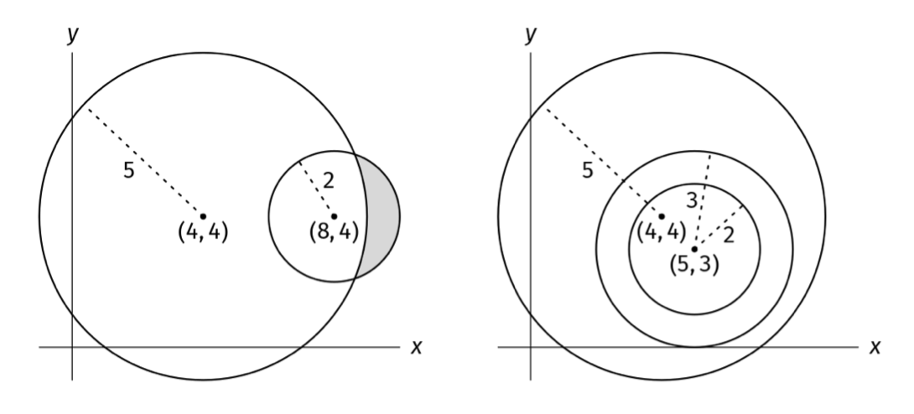
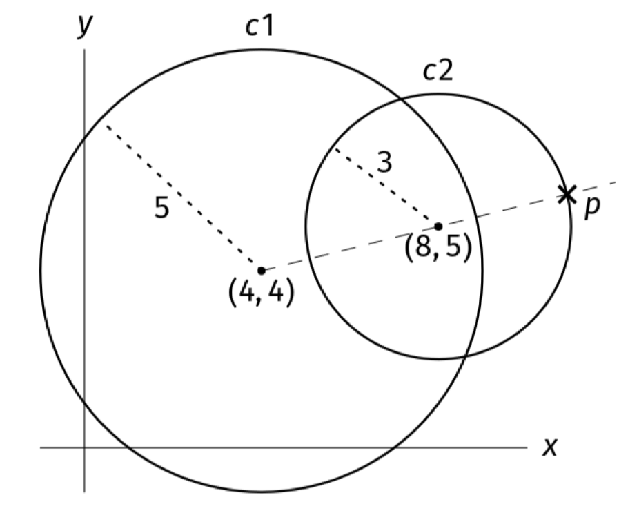

You are given a non-empty array of circles, circles, where each circle is specified by its center coordinates (x, y) and its radius r. Your task is to determine whether the circles are nested. For the circles to be considered nested, one of the following conditions must be met:

There is a single circle.
One circle completely surrounds all the others (without touching boundaries), and the other circles are themselves nested (this is a recursive definition).
Write a function that returns a boolean indicating whether the circles are nested.

Sorting circles example 1 and 2

Example 1: circles = [
    ((4, 4), 5),  # Circle with center (4, 4) and radius 5
    ((8, 4), 2)   # Circle with center (8, 4) and radius 2
]
Output: false. Neither circle is surrounded by the other.

Example 2: circles = [
    ((5, 3), 3),
    ((5, 3), 2),
    ((4, 4), 5)
]
Output: true. The third circle contains all the first and second circles, and
the first circle contains the second circle.

Example 3: circles = [((5, 3), 3)]
Output: true. A single circle is considered nested.
Constraints:

The length of circles is at most 10^4
All coordinates and radii are integers between -10^4 and 10^4
See Solution
Problem 31.2 - Nested Circles: Solution
JavaScript
Drawing examples is usually the key to uncovering useful properties for geometric problems. After looking at some examples, we may realize that if the circles are nested, they must be nested from largest to smallest radius. Thus, if we sort them in that order, we only need to check that each circle contains the next one in the sorted order.

We need a way to check if a circle contains another. For now, let's compartmentalize this task and assume that we are given a function contains(c1, c2).

The easy case is when c1 and c2 share the same center. In that case, all that matters is that radius(c1) > radius(c2).

In the general case, it seems hard to check if c1 contains every point in c2, since circles are made of infinitely many points! Can we narrow it down somehow? We should look for the point in c2 farthest away from c1. If that point is inside c1, we can safely say that the entirety of c2 is in c1 as well.

Nested Circles Problem
The point p in the boundary of c2 which is the furthest from c1 is on the same line as the center of c1 and the center of c2. The distance from the center of c1 to p is distance(center(c1), center(c2)) + radius(c2). We need to check that this distance is less than radius(c1).

Here is the implementation:

function contains(c1, c2) {
  const [[x1, y1], r1] = c1;
  const [[x2, y2], r2] = c2;
  const centerDistance = Math.sqrt((x1 - x2) ** 2 + (y1 - y2) ** 2);
  return centerDistance + r2 < r1;
}

function areCirclesNested(circles) {
  circles.sort((a, b) => b[1] - a[1]); // sort by radius in descending order

  for (let i = 0; i < circles.length - 1; i++) {
    if (!contains(circles[i], circles[i + 1])) {
      return false;
    }
  }
  return true;
}
Time & Space Analysis
n: the number of circles

Time: O(n log n) - we sort the circles by radius (O(n log n)), then make one pass through the sorted array to check if each circle contains the next one (O(n)).

Extra space: O(n) - in-place sorts take linear space and we use constant extra space for the distance calculations.

Tests
Here are some test cases to verify the solution:

function runTests() {
  const tests = [
    // Example 1 from the book
    [
      [
        [[4, 4], 5],
        [[8, 4], 2],
      ],
      false,
    ],
    // Example 2 from the book
    [
      [
        [[5, 3], 3],
        [[5, 3], 2],
        [[4, 4], 5],
      ],
      true,
    ],
    // Example 3 from the book
    [[[[5, 3], 3]], true],
    // Edge case - two identical circles
    [
      [
        [[1, 1], 2],
        [[1, 1], 2],
      ],
      false,
    ],
    // Edge case - touching circles
    [
      [
        [[0, 0], 4],
        [[0, 0], 2],
      ],
      true,
    ],
    // Edge case - empty list
    [[], true],
    // Edge case - negative coordinates
    [
      [
        [[-5, -3], 4],
        [[-5, -3], 2],
      ],
      true,
    ],
    // Edge case - negative radius
    [[[[0, 0], -2]], true],
    // Edge case - max coordinate values
    [
      [
        [[10000, 10000], 10000],
        [[0, 0], 100],
      ],
      false,
    ],
    // Edge case - min coordinate values
    [
      [
        [[-10000, -10000], 10000],
        [[0, 0], 100],
      ],
      false,
    ],
    // Edge case - multiple circles with same center
    [
      [
        [[1, 1], 5],
        [[1, 1], 4],
        [[1, 1], 3],
        [[1, 1], 2],
      ],
      true,
    ],
    // Edge case - circles not sorted by radius
    [
      [
        [[0, 0], 2],
        [[0, 0], 4],
        [[0, 0], 3],
      ],
      true,
    ],
  ];

  for (const [circles, want] of tests) {
    const got = areCirclesNested(circles);
    if (got !== want) {
      throw new Error(
        `\nareCirclesNested(${JSON.stringify(circles)}): got: ${got}, want: ${want}\n`,
      );
    }
  }
}

runTests();

def contains(c1, c2):
  (x1, y1), r1 = c1
  (x2, y2), r2 = c2
  center_distance = sqrt((x1 - x2)**2 + (y1 - y2)**2)
  return center_distance + r2 < r1

def are_circles_nested(circles):
  circles.sort(key=lambda c: c[1], reverse=True)

  for i in range(len(circles) - 1):
    if not contains(circles[i], circles[i + 1]):
      return False
  return True
Time & Space Analysis
n: the number of circles

Time: O(n log n) - we sort the circles by radius (O(n log n)), then make one pass through the sorted array to check if each circle contains the next one (O(n)).

Extra space: O(n) - in-place sorts take linear space and we use constant extra space for the distance calculations.

Tests
Here are some test cases to verify the solution:

def run_tests():
  tests = [
    # Example 1 from the book
    ([((4, 4), 5), ((8, 4), 2)], False),
    # Example 2 from the book
    ([((5, 3), 3), ((5, 3), 2), ((4, 4), 5)], True),
    # Example 3 from the book
    ([((5, 3), 3)], True),
    # Edge case - two identical circles
    ([((1, 1), 2), ((1, 1), 2)], False),
    # Edge case - touching circles
    ([((0, 0), 4), ((0, 0), 2)], True),
    # Edge case - empty list
    ([], True),
    # Edge case - negative coordinates
    ([((-5, -3), 4), ((-5, -3), 2)], True),
    # Edge case - negative radius
    ([((0, 0), -2)], True),
    # Edge case - max coordinate values
    ([((10000, 10000), 10000), ((0, 0), 100)], False),
    # Edge case - min coordinate values
    ([((-10000, -10000), 10000), ((0, 0), 100)], False),
    # Edge case - multiple circles with same center
    ([((1, 1), 5), ((1, 1), 4), ((1, 1), 3), ((1, 1), 2)], True),
    # Edge case - circles not sorted by radius
    ([((0, 0), 2), ((0, 0), 4), ((0, 0), 3)], True),
  ]
  for circles, want in tests:
    got = are_circles_nested(circles)
    assert got == want, f"\nare_circles_nested({circles}): got: {got}, want: {want}\n"

run_tests()

class Circle {
  public final double[] center;
  public final double radius;

  public Circle(double[] center, double radius) {
    this.center = center;
    this.radius = radius;
  }
}

class AreCirclesNested {
  private boolean contains(Circle c1, Circle c2) {
    double x1 = c1.center[0], y1 = c1.center[1], r1 = c1.radius;
    double x2 = c2.center[0], y2 = c2.center[1], r2 = c2.radius;
    double centerDistance = Math
        .sqrt(Math.pow(x1 - x2, 2) + Math.pow(y1 - y2, 2));
    return centerDistance + r2 < r1;
  }

  public boolean solve(List<Circle> circles) {
    circles.sort((a, b) -> Double.compare(b.radius, a.radius)); // sort by
                                                                // radius
                                                                // descending

    for (int i = 0; i < circles.size() - 1; i++) {
      if (!contains(circles.get(i), circles.get(i + 1))) {
        return false;
      }
    }
    return true;
  }
}
Time & Space Analysis
n: the number of circles

Time: O(n log n) - we sort the circles by radius (O(n log n)), then make one pass through the sorted array to check if each circle contains the next one (O(n)).

Extra space: O(n) - in-place sorts take linear space and we use constant extra space for the distance calculations.

Tests
Here are some test cases to verify the solution:

record TestCase(List<Circle> circles, boolean want) {
}

class RunTests {
  public void runTests() {
    List<TestCase> tests = Arrays.asList(
        // Example 1 from the book
        new TestCase(
            Arrays.asList(
                new Circle(new double[] { 4, 4 }, 5),
                new Circle(new double[] { 8, 4 }, 2)),
            false),
        // Example 2 from the book
        new TestCase(
            Arrays.asList(
                new Circle(new double[] { 5, 3 }, 3),
                new Circle(new double[] { 5, 3 }, 2),
                new Circle(new double[] { 4, 4 }, 5)),
            true),
        // Example 3 from the book
        new TestCase(
            Arrays.asList(new Circle(new double[] { 5, 3 }, 3)),
            true),
        // Edge case - two identical circles
        new TestCase(
            Arrays.asList(
                new Circle(new double[] { 1, 1 }, 2),
                new Circle(new double[] { 1, 1 }, 2)),
            false),
        // Edge case - touching circles
        new TestCase(
            Arrays.asList(
                new Circle(new double[] { 0, 0 }, 4),
                new Circle(new double[] { 0, 0 }, 2)),
            true),
        // Edge case - empty list
        new TestCase(
            Arrays.asList(),
            true),
        // Edge case - negative coordinates
        new TestCase(
            Arrays.asList(
                new Circle(new double[] { -5, -3 }, 4),
                new Circle(new double[] { -5, -3 }, 2)),
            true),
        // Edge case - negative radius
        new TestCase(
            Arrays.asList(new Circle(new double[] { 0, 0 }, -2)),
            true),
        // Edge case - max coordinate values
        new TestCase(
            Arrays.asList(
                new Circle(new double[] { 10000, 10000 }, 10000),
                new Circle(new double[] { 0, 0 }, 100)),
            false),
        // Edge case - min coordinate values
        new TestCase(
            Arrays.asList(
                new Circle(new double[] { -10000, -10000 }, 10000),
                new Circle(new double[] { 0, 0 }, 100)),
            false),
        // Edge case - multiple circles with same center
        new TestCase(
            Arrays.asList(
                new Circle(new double[] { 1, 1 }, 5),
                new Circle(new double[] { 1, 1 }, 4),
                new Circle(new double[] { 1, 1 }, 3),
                new Circle(new double[] { 1, 1 }, 2)),
            true),
        // Edge case - circles not sorted by radius
        new TestCase(
            Arrays.asList(
                new Circle(new double[] { 0, 0 }, 2),
                new Circle(new double[] { 0, 0 }, 4),
                new Circle(new double[] { 0, 0 }, 3)),
            true));

    AreCirclesNested solution = new AreCirclesNested();
    for (TestCase test : tests) {
      boolean got = solution.solve(new ArrayList<>(test.circles())); // Create a
                                                                     // copy
      if (got != test.want()) {
        throw new RuntimeException(String.format(
            "\nsolve(%s): got: %b, want: %b\n", test.circles(), got,
            test.want()));
      }
    }
  }
}

public class Solution {
  public static void main(String[] args) {
    new RunTests().runTests();
  }
}
