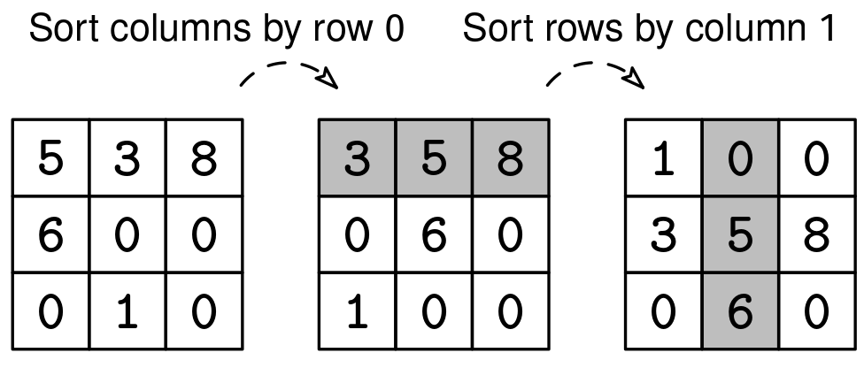

Design a class called Spreadsheet with the following API. Spreadsheets have between 1 and 100 rows and columns. The values at each cell are integers.

Spreadsheet API:

new(rows, cols): initializes a spreadsheet with the specified size and 0 in every cell.
set(row, col, value): sets the cell at (row, col) to value.
get(row, col): gets the value at (row, col).
sort_columns_by_row(row): sorts all the columns based on the values in the given row. Sorting should be stable.
sort_rows_by_column(col): sorts all the rows based on the values in the given column. Sorting should be stable.
Rows and columns start at 0. Assume that no rows or columns will be out of bounds.

Example 1:
spreadsheet = Spreadsheet()
spreadsheet.new(3, 3)
spreadsheet.set(0, 0, 5)
spreadsheet.set(0, 1, 3)
spreadsheet.set(0, 2, 8)
spreadsheet.set(1, 0, 6)
spreadsheet.set(2, 1, 1)
spreadsheet.sort_columns_by_row(0)
spreadsheet.sort_rows_by_column(1)
spreadsheet.get(1, 1)  # Returns 5

Example 2:
spreadsheet = Spreadsheet()
spreadsheet.new(1, 1)
spreadsheet.set(0, 0, 42)
spreadsheet.get(0, 0)  # Returns 42

Example 3:
spreadsheet = Spreadsheet()
spreadsheet.new(3, 2)
spreadsheet.sort_rows_by_column(0)
spreadsheet.get(0, 0)  # Returns 0
Here is a visualization of Example 1:

Constraints:

1 ≤ rows, cols ≤ 100
All values set in cells are integers between -10^9 and 10^9
See Solution
Problem 31.4 - Spreadsheet: Solution
JavaScript
This solution combines custom sorts, with a unique comparator depending on which method is called, to tackle both row and column sorting.

For sorting rows by a column in JavaScript, we use Array.sort() with a comparison function that compares values at the specified column index. For sorting columns by a row, we create an array of [column_index, value] pairs to track the original column positions. After sorting these pairs by value, we use the sorted column indices to reconstruct each row in the spreadsheet.

Here is the implementation:

class Spreadsheet {
  constructor(rows, cols) {
    this.rows = rows;
    this.cols = cols;

    this.sheet = [];
    for (let i = 0; i < rows; i++) {
      this.sheet.push(new Array(cols).fill(0));
    }
  }

  new(rows, cols) {
    this.rows = rows;
    this.cols = cols;
    this.sheet = [];
    for (let i = 0; i < rows; i++) {
      this.sheet.push(new Array(cols).fill(0));
    }
  }

  set(row, col, value) {
    this.sheet[row][col] = value;
  }

  get(row, col) {
    return this.sheet[row][col];
  }

  sortRowsByColumn(col) {
    this.sheet.sort((a, b) => a[col] - b[col]);
  }

  sortColumnsByRow(row) {
    const columnsWithValues = [];
    for (let col = 0; col < this.cols; col++) {
      columnsWithValues.push([col, this.sheet[row][col]]);
    }

    columnsWithValues.sort((a, b) => a[1] - b[1]);
    const sortedSheet = [];
    for (let r = 0; r < this.rows; r++) {
      const newRow = [];
      for (const [col, _] of columnsWithValues) {
        newRow.push(this.sheet[r][col]);
      }
      sortedSheet.push(newRow);
    }
    this.sheet = sortedSheet;
  }
}
Time & Space Analysis
R: the number of rows
C: the number of columns
New operation:

Time: O(R * C) - to initialize all cells to 0
Set and get operations:

Time: O(1) - direct array access
Sort columns by row operation:

Time: O(R * C + C log C) - to sort the columns based on the values in one row (O(C log C)), and then rearrange all the values within each row (O(R * C))
Sort rows by column operation:

Time: O(R log R) - to sort the rows
Data structure size:

Space: O(R * C) - we store the spreadsheet as a 2D array.
Tests
Here are some test cases to verify the solution:

function runTests() {
  const tests = [
    // Example from the book
    [
      (s) => [
        s.new(3, 3),
        s.set(0, 0, 5),
        s.set(0, 1, 3),
        s.set(0, 2, 8),
        s.set(1, 0, 6),
        s.set(2, 1, 1),
        s.sortColumnsByRow(0),
        s.sortRowsByColumn(1),
      ],
      [
        [1, 0, 0],
        [3, 5, 8],
        [0, 6, 0],
      ],
    ],
    // Edge case - 1x1 spreadsheet
    [(s) => [s.new(1, 1), s.set(0, 0, 42)], [[42]]],
    // Edge case - sort empty rows
    [(s) => [s.new(3, 2), s.sortRowsByColumn(0)], [
      [0, 0],
      [0, 0],
      [0, 0],
    ]],
  ];

  for (const [operations, want] of tests) {
    const s = new Spreadsheet(0, 0);
    operations(s);
    for (let r = 0; r < want.length; r++) {
      for (let c = 0; c < want[0].length; c++) {
        const got = s.get(r, c);
        const expect = want[r][c];
        if (got !== expect) {
          throw new Error(
            `\nget(${r}, ${c}): got: ${got}, want: ${expect}\n`
          );
        }
      }
    }
  }
}

runTests();
class Spreadsheet:
  def __init__(self, rows, cols):
    self.rows = rows
    self.cols = cols

    self.sheet = []
    for _ in range(rows):
      self.sheet.append([0] * cols)

  def new(self, rows, cols):
    self.rows = rows
    self.cols = cols
    self.sheet = []
    for _ in range(rows):
      self.sheet.append([0] * cols)

  def set(self, row, col, value):
    self.sheet[row][col] = value

  def get(self, row, col):
    return self.sheet[row][col]

  def sort_rows_by_column(self, col):
    self.sheet.sort(key=lambda row: row[col])

  def sort_columns_by_row(self, row):
    columns_with_values = []
    for col in range(self.cols):
      columns_with_values.append((col, self.sheet[row][col]))

    sorted_columns = sorted(columns_with_values, key=lambda x: x[1])
    sorted_sheet = []
    for r in range(self.rows):
      new_row = []
      for col, _ in sorted_columns:
        new_row.append(self.sheet[r][col])
      sorted_sheet.append(new_row)
    self.sheet = sorted_sheet

    def run_tests():
  tests = [
      # Example from the book
      (lambda s: [
          s.new(3, 3),
          s.set(0, 0, 5),
          s.set(0, 1, 3),
          s.set(0, 2, 8),
          s.set(1, 0, 6),
          s.set(2, 1, 1),
          s.sort_columns_by_row(0),
          s.sort_rows_by_column(1)
      ], [
          [1, 0, 0],
          [3, 5, 8],
          [0, 6, 0],
      ]),
      # Edge case - 1x1 spreadsheet
      (lambda s: [
          s.new(1, 1),
          s.set(0, 0, 42)
      ], [
          [42],
      ]),
      # Edge case - sort empty rows
      (lambda s: [
          s.new(3, 2),
          s.sort_rows_by_column(0)
      ], [
          [0, 0],
          [0, 0],
          [0, 0],
      ]),
  ]

  for operations, want in tests:
    s = Spreadsheet(0, 0)
    operations(s)
    for r in range(len(want)):
      for c in range(len(want[0])):
        got = s.get(r, c)
        expect = want[r][c]
        assert got == expect, f"\nget({r}, {c}): got: {got}, want: {expect}\n"

run_tests()

class Spreadsheet {
  private final List<List<Integer>> cells;
  private final int rows;
  private final int cols;

  public Spreadsheet(int rows, int cols) {
    this.rows = rows;
    this.cols = cols;
    this.cells = new ArrayList<>();
    for (int i = 0; i < rows; i++) {
      List<Integer> row = new ArrayList<>();
      for (int j = 0; j < cols; j++) {
        row.add(0);
      }
      this.cells.add(row);
    }
  }

  public void set(int row, int col, int val) {
    this.cells.get(row).set(col, val);
  }

  public int get(int row, int col) {
    return this.cells.get(row).get(col);
  }

  public void sortRow(int row) {
    Collections.sort(this.cells.get(row));
  }

  public void sortCol(int col) {
    List<Integer> column = new ArrayList<>();
    for (int i = 0; i < this.rows; i++) {
      column.add(this.cells.get(i).get(col));
    }
    Collections.sort(column);
    for (int i = 0; i < this.rows; i++) {
      this.cells.get(i).set(col, column.get(i));
    }
  }

  public void sortRowsByColumn(int col) {
    List<List<Integer>> sortedRows = new ArrayList<>(this.cells);
    sortedRows
        .sort((row1, row2) -> Integer.compare(row1.get(col), row2.get(col)));
    for (int i = 0; i < this.rows; i++) {
      this.cells.set(i, sortedRows.get(i));
    }
  }

  public void sortColumnsByRow(int row) {
    // Create pairs of (column index, value) for the given row
    List<Map.Entry<Integer, Integer>> columnsWithValues = new ArrayList<>();
    for (int col = 0; col < this.cols; col++) {
      columnsWithValues.add(
          new AbstractMap.SimpleEntry<>(col, this.cells.get(row).get(col)));
    }

    // Sort columns based on their values in the given row
    columnsWithValues.sort(Map.Entry.comparingByValue());

    // Create new sorted sheet
    List<List<Integer>> sortedSheet = new ArrayList<>();
    for (int r = 0; r < this.rows; r++) {
      List<Integer> newRow = new ArrayList<>();
      for (Map.Entry<Integer, Integer> entry : columnsWithValues) {
        int col = entry.getKey();
        newRow.add(this.cells.get(r).get(col));
      }
      sortedSheet.add(newRow);
    }

    // Update the sheet
    for (int r = 0; r < this.rows; r++) {
      this.cells.set(r, sortedSheet.get(r));
    }
  }
}
Time & Space Analysis
R: the number of rows
C: the number of columns
New operation:

Time: O(R * C) - to initialize all cells to 0
Set and get operations:

Time: O(1) - direct array access
Sort columns by row operation:

Time: O(R * C + C log C) - to sort the columns based on the values in one row (O(C log C)), and then rearrange all the values within each row (O(R * C))
Sort rows by column operation:

Time: O(R log R) - to sort the rows
Data structure size:

Space: O(R * C) - we store the spreadsheet as a 2D array.
Tests
Here are some test cases to verify the solution:

class RunTests {
  public void runTests() {
    // Example from the book
    {
      Spreadsheet sheet = new Spreadsheet(3, 3);
      sheet.set(0, 0, 5);
      sheet.set(0, 1, 3);
      sheet.set(0, 2, 8);
      sheet.set(1, 0, 6);
      sheet.set(2, 1, 1);
      sheet.sortColumnsByRow(0);
      sheet.sortRowsByColumn(1);
      int[][] want = new int[][] {
          { 1, 0, 0 },
          { 3, 5, 8 },
          { 0, 6, 0 },
      };
      for (int r = 0; r < want.length; r++) {
        for (int c = 0; c < want[0].length; c++) {
          int got = sheet.get(r, c);
          int expect = want[r][c];
          if (got != expect) {
            throw new RuntimeException(String.format(
                "\nget(%d, %d): got: %d, want: %d\n", r, c, got, expect));
          }
        }
      }
    }

    // Edge case - 1x1 spreadsheet
    {
      Spreadsheet sheet = new Spreadsheet(1, 1);
      sheet.set(0, 0, 42);
      int[][] want = new int[][] {
          { 42 },
      };
      for (int r = 0; r < want.length; r++) {
        for (int c = 0; c < want[0].length; c++) {
          int got = sheet.get(r, c);
          int expect = want[r][c];
          if (got != expect) {
            throw new RuntimeException(String.format(
                "\nget(%d, %d): got: %d, want: %d\n", r, c, got, expect));
          }
        }
      }
    }

    // Edge case - sort empty rows
    {
      Spreadsheet sheet = new Spreadsheet(3, 2);
      sheet.sortRowsByColumn(0);
      int[][] want = new int[][] {
          { 0, 0 },
          { 0, 0 },
          { 0, 0 },
      };
      for (int r = 0; r < want.length; r++) {
        for (int c = 0; c < want[0].length; c++) {
          int got = sheet.get(r, c);
          int expect = want[r][c];
          if (got != expect) {
            throw new RuntimeException(String.format(
                "\nget(%d, %d): got: %d, want: %d\n", r, c, got, expect));
          }
        }
      }
    }
  }
}

public class Solution {
  public static void main(String[] args) {
    new RunTests().runTests();
  }
}

