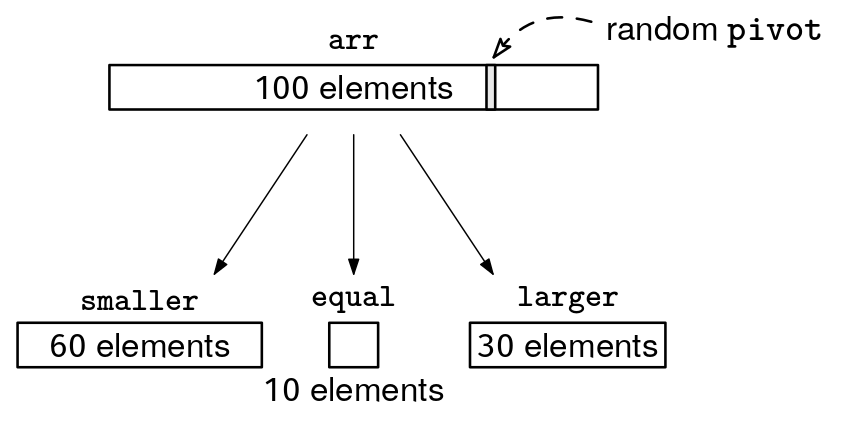
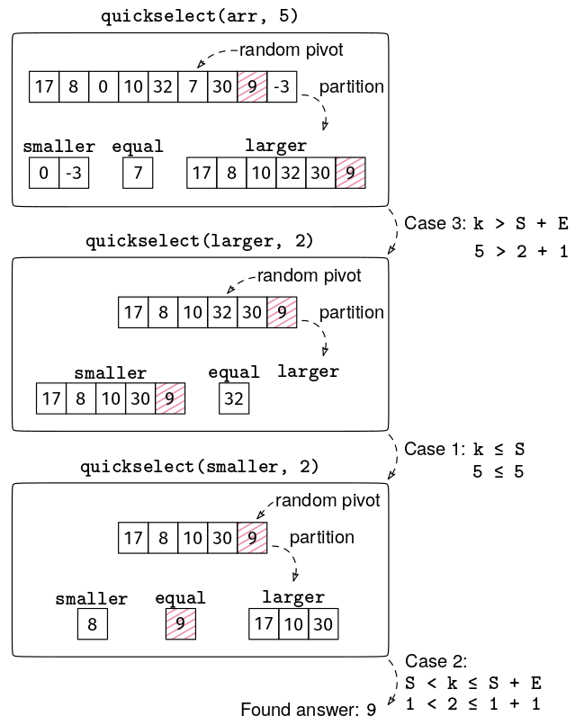

Given an array of n unique integers, arr, return the k smallest numbers, in any order.

Example 1: arr = [15, 4, 13, 8, 10, 5, 2, 20, 3, 9, 11, 27], k = 5
Output: [4, 3, 2, 5, 8]. The order doesn't matter.

Example 2: arr = [5, 3, 1, 4, 2], k = 1
Output: [1]. The smallest element.

Example 3: arr = [5, 3, 1, 4, 2], k = 4
Output: [1, 2, 3, 4]. All elements except the largest one.
Constraints:

0 ≤ k ≤ n ≤ 10^5
All elements in arr are unique
Each element in arr is between -10^9 and 10^9
See Solution
Problem 31.6 - First K: Solution
JavaScript
We'll see multiple approaches to this problem.

Sorting solution
This question is trivial if we sort the input. After sorting, we can get the first k elements.

function firstKSorting(arr, k) {
  const sorted = arr.sort((a, b) => a - b);
  return sorted.slice(0, k);
}
The time is O(n log n) and the extra space is O(n). Even if we sort the array in-place, keep in mind that most built-in sorting libraries use O(n) extra space internally.

Min-heap solution
A natural approach for problems involving partial sorts is to use a heap. We could dump the array into a min-heap and pop the k smallest numbers.

function firstKMinHeap(arr, k) {
  const heap = new Heap((x, y) => x < y, arr);
  const result = [];
  for (let i = 0; i < k; i++) {
    result.push(heap.pop());
  }
  return result;
}
This approach leverages that we can build a heap in linear time with heapify. After that, we do k heap pops. Since the heap has O(n) elements, each pop takes O(log n) time.

The time is O(n + k log n) and the extra space is O(n).

JS doesn't have a built-in heap, so you either have to provide your own or use a third-party library. You probably don't have to worry about building a heap from scratch in a real interview, but for completeness, here is the full heap definition we saw in the Heaps chapter:

class Heap {
  // A binary heap implementation that can act as either min-heap or max-heap.
  // By default, it creates a min-heap (the smallest element has highest priority).
  // For max-heap behavior, provide a custom 'higherPriority' function.
  // higherPriority: Function that returns True if x has higher priority than y.
  // heap:           Optional list of initial elements to heapify.
  constructor(higherPriority = (x, y) => x < y, heap = null) {
    this.higherPriority = higherPriority;
    this.heap = [];
    if (heap) {
      this.heap = [...heap];
      this.heapify();
    }
  }

  // Returns the number of elements in the heap.
  size() {
    return this.heap.length;
  }

  // Returns the highest priority element without removing it.
  top() {
    if (this.heap.length === 0) {
      return null;
    }
    return this.heap[0];
  }

  // Adds an element to the heap.
  push(elem) {
    this.heap.push(elem);
    this._bubbleUp(this.heap.length - 1);
  }

  // Removes and returns the highest priority element.
  pop() {
    if (this.heap.length === 0) {
      return null;
    }

    const top = this.heap[0];
    if (this.heap.length === 1) {
      this.heap = [];
      return top;
    }

    // Move last element to root and bubble down
    this.heap[0] = this.heap[this.heap.length - 1];
    this.heap.pop();
    this._bubbleDown(0);

    return top;
  }

  // Converts an array into a valid heap in O(n) time.
  heapify() {
    for (let idx = Math.floor(this.heap.length / 2); idx >= 0; idx--) {
      this._bubbleDown(idx);
    }
  }

  // Get parent index.
  _parent(idx) {
    if (idx === 0) {
      return -1; // The root has no parent.
    }
    return Math.floor((idx - 1) / 2);
  }

  // Get left child index.
  _leftChild(idx) {
    return 2 * idx + 1;
  }

  // Get right child index.
  _rightChild(idx) {
    return 2 * idx + 2;
  }

  // Move element up until heap property is restored.
  _bubbleUp(idx) {
    if (idx === 0) {
      return;
    }

    const parentIdx = this._parent(idx);
    if (
      parentIdx >= 0 &&
      this.higherPriority(this.heap[idx], this.heap[parentIdx])
    ) {
      [this.heap[idx], this.heap[parentIdx]] = [
        this.heap[parentIdx],
        this.heap[idx],
      ];
      this._bubbleUp(parentIdx);
    }
  }

  // Move element down until heap property is restored.
  _bubbleDown(idx) {
    const leftIdx = this._leftChild(idx);
    const isLeaf = leftIdx >= this.heap.length;
    if (isLeaf) {
      return;
    }

    // Find child with higher priority
    let childIdx = leftIdx;
    const rightIdx = this._rightChild(idx);
    if (
      rightIdx < this.heap.length &&
      this.higherPriority(this.heap[rightIdx], this.heap[leftIdx])
    ) {
      childIdx = rightIdx;
    }

    // Swap with child if it has higher priority
    if (this.higherPriority(this.heap[childIdx], this.heap[idx])) {
      [this.heap[idx], this.heap[childIdx]] = [
        this.heap[childIdx],
        this.heap[idx],
      ];
      this._bubbleDown(childIdx);
    }
  }
}
To learn more about heaps, check out the Implement a Heap problem.

Max-heap solution
Alternatively, we could use max-heap and keep track of the smallest k elements as we iterate through them. We use a max-heap so that the largest element among the smallest k is always at the root, making it easy to remove it when we need to make space for a smaller element.

The algorithm is simple: for each element, we push it to the max-heap. If the heap size exceeds k, we pop the largest element (which is guaranteed to be at the root of the max-heap). This ensures that the heap always contains the k smallest elements seen so far.

function firstKMaxHeap(arr, k) {
  const maxHeap = new Heap((x, y) => x > y);
  for (const num of arr) {
    maxHeap.push(num);
    if (maxHeap.size() > k) {
      maxHeap.pop();
    }
  }

  const result = [];
  while (maxHeap.size() > 0) {
    result.push(maxHeap.pop());
  }
  return result;
}
Since the heap size never exceeds k, each heap operation only takes O(log k) time. However, we don't benefit from heapify.

The time is O(n log k) and the extra space is O(k). This is the most space-efficient solution.

Quickselect solution
This solution is probably the hardest to implement, but also the most time-efficient. First, we need to realize that we can use this property:

Property 1: We only need to find the kth smallest element. After that, we can do a single pass to get all the elements equal to or smaller than it.

So, how do we find the kth smallest element? This is the exact problem solved by the Quickselect algorithm.

For now, assume that we had a quickselect() function that returns the kth smallest element of an array. Here is how we would use it:

function firstKQuickselect(arr, k) {
  if (arr.length === 0) {
    return [];
  }
  const kthVal = quickselect(arr, k);
  return arr.filter((x) => x <= kthVal);
}
As we'll see, quickselect() runs in O(n) time (with high probability), so this is the most time-efficient solution. Let's see how it works.

Quickselect algorithm
To be general, we'll show the version of Quickselect that works even if the input array can contain duplicates.

Recall the Quicksort partition step:

function partition(arr) {
  const pivot = arr[Math.floor(Math.random() * arr.length)];
  const smaller = [];
  const equal = [];
  const larger = [];
  for (const x of arr) {
    if (x < pivot) {
      smaller.push(x);
    } else if (x === pivot) {
      equal.push(x);
    } else {
      larger.push(x);
    }
  }
  return [smaller, equal, larger];
}
If the array can contain duplicates, equal may contain multiple elements:

The key is to think about the position of the pivot:

Property 2: After the quicksort partition step, we know exactly how many elements are smaller than the pivot. Thus, we can deduce the actual index of the pivot (or indices, if the pivot has duplicates) in the sorted order.

Let S and E represent the number of elements in the smaller and equal arrays, respectively. We can do a case analysis to see whether the kth smallest element is in smaller, equal, or larger:

Case 1: k <= S. The kth smallest element is in smaller.
Case 2: S < k <= S + E. The kth smallest element is in equal.
Case 3: k > S + E. The kth smallest element is in larger.
In Quickselect, we do this case analysis and act accordingly:

Case 1: We recursively search for the kth smallest element in smaller.
Case 2: The pivot is the kth smallest element. We return it directly.
Case 3: We recursively search for the (k - S - E)th smallest element in larger.
For example, if n = 100, S = 60, E = 10, and k = 76, we would need to search for the 6th smallest element in larger.

The implementation is similar to quicksort. In particular, the partition logic is the same. The main difference is that we have a single recursion call depending on the case analysis, a bit like in binary search.

function quickselect(arr, k) {
  const [smaller, equal, larger] = partition(arr);
  const S = smaller.length;
  const E = equal.length;

  if (k <= S) {
    return quickselect(smaller, k);
  } else if (k <= S + E) {
    return equal[0];
  } else {
    return quickselect(larger, k - S - E);
  }
}
Here is a full example, where we are looking for the 5th smallest element. The 5th smallest element (9) is shaded in red.

Quickselect is not common in interviews, but it's not hard to implement if you already understand quicksort, so you can add it to your bag of tricks.

Quickselect analysis
Quickselect runs in linear time with high probability, but the analysis is a bit tricky because it depends on how lucky we get with the pivots. To be clear, the analysis below is beyond what's expected for coding interviews.

The partition step takes O(n) time.

The key question is: when we make a recursive call, how small is the new array (smaller or larger) relative to arr? How much is the array size reduced at each step?

If we are consistently unlucky, we might reduce the array size by only one at each recursive call. For instance, if k is 1, and the random pivot happens to be the largest element, we'll only eliminate 1 element (the pivot itself). That's why, in the worst case with the worst possible luck, the number of steps is O(n), and the total runtime is O(n^2). However, the probability of this happening is negligible (approaches 0 exponentially fast as n grows).

As you probably know from the analysis of binary search, if the array is reduced by 50% at each step, the number of steps is log_2(n). (The definition of log_2(n) is "the number of times you can divide n by 2 until you get 1".)

However, we don't need the reduction to be 50% at each step. As long as the reduction is at least some constant fraction at each step (like, e.g., 25%), the number of steps is still logarithmic, just with a different base. In the end, it's still O(log n), since the base of logarithms goes away in big O notation.

The challenge with Quickselect is that we don't always reduce the array by a constant fraction.

The key is that, since the pivot is random, there's a 50% chance that the pivot will be in the middle n/2 elements of arr. If that happens, at least 25% of the elements will be eliminated from the search range: if k is larger than the pivot's position, we'll eliminate the n/4 smallest elements, and if k is smaller than the pivot's position, we'll eliminate the n/4 largest elements.

Eliminating a constant fraction of the elements (at least 25%) with a 50% chance is enough to guarantee that the number of recursive calls is O(log n) with high probability. As n grows, the probability of being unlucky becomes negligible.

The final recurrence for the expected worst-case runtime of Quickselect is:

T(n) = O(n) * s + T(0.75n)

Where:

O(n) is the runtime of the partition step.
s is the number of steps until the array gets reduced by at least 25%.
T(0.75n) is the runtime of the remaining 75% of the array recursively.
As we discussed, there's a >50% chance that s is 1, so the expected value of s is O(1). This leaves:

T(n) = O(n) + T(0.75n) = O(n + 0.75n + (0.75)^2 n + ...)

The infinite geometric series 1 + 0.75 + (0.75)^2 + ... converges to 4, so we can simplify the whole thing to T(n) = O(4n) = O(n).

Quickselect variations
If we don't want to deal with expected runtimes, there's a method to pick good pivots deterministically, called Median of Medians. It guarantees a deterministic worst-case runtime of O(n). However, the random pivot is faster in practice and easier to implement (especially relevant in interviews).

There's also an in-place version of Quickselect. The version we showed takes O(n) expected extra space because we declare new smaller, equal, and larger arrays. If we are allowed to modify the input, there is an in-place version of Quickselect that rearranges the array in-place to put the smaller elements first, then the pivot(s), and then the larger elements. Then, the expected extra space would be O(log n), with the recursion stack as the bottleneck. With an iterative implementation, we can bring this further down to O(1).

Time & Space Analysis
n: the number of elements in the array
k: the number of smallest elements to return
Assumptions:

Sorting takes O(n log n) time (e.g., using merge sort or Quicksort). Using a specialized sorting algorithm (like radix sort) could affect the analysis, but then we couldn't use a generic comparator function between elements.
If we modify the input array, we count that as using space.
Sorting:

Time: O(n log n)
Extra space: O(n)
Max-heap:

Time: O(n + k log n)
Extra space: O(n)
Min-heap:

Time: O(n log k)
Extra space: O(k)
Quickselect:

Time: O(n) (with high probability)
Extra space: O(n) (with high probability)
Tests
Here are some test cases to verify the solution:

function runTests() {
  const tests = [
    // Example from the book
    [[15, 4, 13, 8, 10, 5, 2, 20, 3, 9, 11, 27], 5, [2, 3, 4, 5, 8]],
    // Edge case - k = 1
    [[5, 2, 1, 3, 4], 1, [1]],
    // Edge case - k = length of array
    [[3, 1, 2], 3, [1, 2, 3]],
    // Edge case - array of length 1
    [[42], 1, [42]],
    // Reverse sorted array
    [[5, 4, 3, 2, 1], 4, [1, 2, 3, 4]],
    // Already sorted array
    [[1, 2, 3, 4, 5], 3, [1, 2, 3]],
    // Edge case - empty array
    [[], 0, []],
    // Array with negative numbers
    [[-3, -1, -4, -2], 3, [-4, -3, -2]],
    // Mix of positive and negative
    [[-5, 3, -2, 8, -1], 4, [-5, -2, -1, 3]],
    // Large numbers
    [[10 ** 9, -(10 ** 9), 0], 2, [-(10 ** 9), 0]],
  ];

  const solutions = [
    ["firstKSorting", firstKSorting],
    ["firstKMaxHeap", firstKMaxHeap],
    ["firstKMinHeap", firstKMinHeap],
    ["firstKQuickselect", firstKQuickselect],
  ];

  for (const [name, solution] of solutions) {
    for (const [arr, k, want] of tests) {
      const got = solution([...arr], k);
      const gotSorted = [...got].sort((a, b) => a - b);
      const wantSorted = [...want].sort((a, b) => a - b);
      if (JSON.stringify(gotSorted) !== JSON.stringify(wantSorted)) {
        throw new Error(
          `\n${name}(${JSON.stringify(arr)}, ${k}): got: ${got}, want: ${want} (in any order)\n`,
        );
      }
    }
  }
}

runTests();

def first_k_sorting(arr, k):
  arr.sort()
  return arr[:k]
The time is O(n log n) and the extra space is O(n). Even if we sort the array in-place, keep in mind that most built-in sorting libraries use O(n) extra space internally.

Min-heap solution
A natural approach for problems involving partial sorts is to use a heap. We could dump the array into a min-heap and pop the k smallest numbers.

def first_k_min_heap(arr, k):
  heapq.heapify(arr)
  return [heapq.heappop(arr) for _ in range(k)]
This approach leverages that we can build a heap in linear time with heapify. After that, we do k heap pops. Since the heap has O(n) elements, each pop takes O(log n) time.

The time is O(n + k log n) and the extra space is O(n).

To learn more about heaps, check out the Implement a Heap problem.

Max-heap solution
Alternatively, we could use max-heap and keep track of the smallest k elements as we iterate through them. We use a max-heap so that the largest element among the smallest k is always at the root, making it easy to remove it when we need to make space for a smaller element.

The algorithm is simple: for each element, we push it to the max-heap. If the heap size exceeds k, we pop the largest element (which is guaranteed to be at the root of the max-heap). This ensures that the heap always contains the k smallest elements seen so far.

def first_k_max_heap(arr, k):
  max_heap = []
  for num in arr:
    heapq.heappush(max_heap, -num)  # Negate values to simulate a max-heap
    if len(max_heap) > k:
      heapq.heappop(max_heap)
  return [-x for x in max_heap]
Since the heap size never exceeds k, each heap operation only takes O(log k) time. However, we don't benefit from heapify.

The time is O(n log k) and the extra space is O(k). This is the most space-efficient solution.

Quickselect solution
This solution is probably the hardest to implement, but also the most time-efficient. First, we need to realize that we can use this property:

Property 1: We only need to find the kth smallest element. After that, we can do a single pass to get all the elements equal to or smaller than it.

So, how do we find the kth smallest element? This is the exact problem solved by the Quickselect algorithm.

For now, assume that we had a quickselect() function that returns the kth smallest element of an array. Here is how we would use it:

def first_k_quickselect(arr, k):
  if not arr:
    return []
  kth_val = quickselect(arr, k)
  return [x for x in arr if x <= kth_val]
As we'll see, quickselect() runs in O(n) time (with high probability), so this is the most time-efficient solution. Let's see how it works.

Quickselect algorithm
To be general, we'll show the version of Quickselect that works even if the input array can contain duplicates.

Recall the Quicksort partition step:

def partition(arr):
  pivot = random.choice(arr)
  smaller, equal, larger = [], [], []
  for x in arr:
    if x < pivot:
      smaller.append(x)
    elif x == pivot:
      equal.append(x)
    else:
      larger.append(x)
  return smaller, equal, larger
If the array can contain duplicates, equal may contain multiple elements:

Quickselect Partition with Duplicates
The key is to think about the position of the pivot:

Property 2: After the quicksort partition step, we know exactly how many elements are smaller than the pivot. Thus, we can deduce the actual index of the pivot (or indices, if the pivot has duplicates) in the sorted order.

Let S and E represent the number of elements in the smaller and equal arrays, respectively. We can do a case analysis to see whether the kth smallest element is in smaller, equal, or larger:

Case 1: k <= S. The kth smallest element is in smaller.
Case 2: S < k <= S + E. The kth smallest element is in equal.
Case 3: k > S + E. The kth smallest element is in larger.
In Quickselect, we do this case analysis and act accordingly:

Case 1: We recursively search for the kth smallest element in smaller.
Case 2: The pivot is the kth smallest element. We return it directly.
Case 3: We recursively search for the (k - S - E)th smallest element in larger.
For example, if n = 100, S = 60, E = 10, and k = 76, we would need to search for the 6th smallest element in larger.

The implementation is similar to quicksort. In particular, the partition logic is the same. The main difference is that we have a single recursion call depending on the case analysis, a bit like in binary search.

def quickselect(arr, k):
  smaller, equal, larger = partition(arr)
  S, E = len(smaller), len(equal)

  if k <= S:
    return quickselect(smaller, k)
  elif k <= S + E:
    return equal[0]
  else:
    return quickselect(larger, k - S - E)
Here is a full example, where we are looking for the 5th smallest element. The 5th smallest element (9) is shaded in red.

Quickselect example
Quickselect is not common in interviews, but it's not hard to implement if you already understand quicksort, so you can add it to your bag of tricks.

Quickselect analysis
Quickselect runs in linear time with high probability, but the analysis is a bit tricky because it depends on how lucky we get with the pivots. To be clear, the analysis below is beyond what's expected for coding interviews.

The partition step takes O(n) time.

The key question is: when we make a recursive call, how small is the new array (smaller or larger) relative to arr? How much is the array size reduced at each step?

If we are consistently unlucky, we might reduce the array size by only one at each recursive call. For instance, if k is 1, and the random pivot happens to be the largest element, we'll only eliminate 1 element (the pivot itself). That's why, in the worst case with the worst possible luck, the number of steps is O(n), and the total runtime is O(n^2). However, the probability of this happening is negligible (approaches 0 exponentially fast as n grows).

As you probably know from the analysis of binary search, if the array is reduced by 50% at each step, the number of steps is log_2(n). (The definition of log_2(n) is "the number of times you can divide n by 2 until you get 1".)

However, we don't need the reduction to be 50% at each step. As long as the reduction is at least some constant fraction at each step (like, e.g., 25%), the number of steps is still logarithmic, just with a different base. In the end, it's still O(log n), since the base of logarithms goes away in big O notation.

The challenge with Quickselect is that we don't always reduce the array by a constant fraction.

The key is that, since the pivot is random, there's a 50% chance that the pivot will be in the middle n/2 elements of arr. If that happens, at least 25% of the elements will be eliminated from the search range: if k is larger than the pivot's position, we'll eliminate the n/4 smallest elements, and if k is smaller than the pivot's position, we'll eliminate the n/4 largest elements.

Eliminating a constant fraction of the elements (at least 25%) with a 50% chance is enough to guarantee that the number of recursive calls is O(log n) with high probability. As n grows, the probability of being unlucky becomes negligible.

The final recurrence for the expected worst-case runtime of Quickselect is:

T(n) = O(n) * s + T(0.75n)

Where:

O(n) is the runtime of the partition step.
s is the number of steps until the array gets reduced by at least 25%.
T(0.75n) is the runtime of the remaining 75% of the array recursively.
As we discussed, there's a >50% chance that s is 1, so the expected value of s is O(1). This leaves:

T(n) = O(n) + T(0.75n) = O(n + 0.75n + (0.75)^2 n + ...)

The infinite geometric series 1 + 0.75 + (0.75)^2 + ... converges to 4, so we can simplify the whole thing to T(n) = O(4n) = O(n).

Quickselect variations
If we don't want to deal with expected runtimes, there's a method to pick good pivots deterministically, called Median of Medians. It guarantees a deterministic worst-case runtime of O(n). However, the random pivot is faster in practice and easier to implement (especially relevant in interviews).

There's also an in-place version of Quickselect. The version we showed takes O(n) expected extra space because we declare new smaller, equal, and larger arrays. If we are allowed to modify the input, there is an in-place version of Quickselect that rearranges the array in-place to put the smaller elements first, then the pivot(s), and then the larger elements. Then, the expected extra space would be O(log n), with the recursion stack as the bottleneck. With an iterative implementation, we can bring this further down to O(1).

Time & Space Analysis
n: the number of elements in the array
k: the number of smallest elements to return
Assumptions:

Sorting takes O(n log n) time (e.g., using merge sort or Quicksort). Using a specialized sorting algorithm (like radix sort) could affect the analysis, but then we couldn't use a generic comparator function between elements.
If we modify the input array, we count that as using space.
Sorting:

Time: O(n log n)
Extra space: O(n)
Max-heap:

Time: O(n + k log n)
Extra space: O(n)
Min-heap:

Time: O(n log k)
Extra space: O(k)
Quickselect:

Time: O(n) (with high probability)
Extra space: O(n) (with high probability)
Tests
Here are some test cases to verify the solution:

def run_tests():
  tests = [
      # Example from the book
      ([15, 4, 13, 8, 10, 5, 2, 20, 3, 9, 11, 27], 5, [2, 3, 4, 5, 8]),
      # Edge case - k = 1
      ([5, 2, 1, 3, 4], 1, [1]),
      # Edge case - k = length of array
      ([3, 1, 2], 3, [1, 2, 3]),
      # Edge case - array of length 1
      ([42], 1, [42]),
      # Reverse sorted array
      ([5, 4, 3, 2, 1], 4, [1, 2, 3, 4]),
      # Already sorted array
      ([1, 2, 3, 4, 5], 3, [1, 2, 3]),
      # Edge case - empty array
      ([], 0, []),
      # Array with negative numbers
      ([-3, -1, -4, -2], 3, [-4, -3, -2]),
      # Mix of positive and negative
      ([-5, 3, -2, 8, -1], 4, [-5, -2, -1, 3]),
      # Large numbers
      ([10**9, -(10**9), 0], 2, [-(10**9), 0])
  ]

  solutions = [
      ('first_k_sorting', first_k_sorting),
      ('first_k_max_heap', first_k_max_heap),
      ('first_k_min_heap', first_k_min_heap),
      ('first_k_quickselect', first_k_quickselect)
  ]

  for name, solution in solutions:
    for arr, k, want in tests:
      got = solution(arr.copy(), k)
      assert sorted(got) == sorted(
          want), f"\n{name}({arr}, {k}): got: {got}, want: {want} (in any order)\n"

run_tests()

class FirstKSorting {
  public List<Integer> solve(List<Integer> arr, int k) {
    Collections.sort(arr);
    return arr.subList(0, k);
  }
}
The time is O(n log n) and the extra space is O(n). Even if we sort the array in-place, keep in mind that most built-in sorting libraries use O(n) extra space internally.

Min-heap solution
A natural approach for problems involving partial sorts is to use a heap. We could dump the array into a min-heap and pop the k smallest numbers.

class FirstKMinHeap {
  public List<Integer> solve(List<Integer> arr, int k) {
    PriorityQueue<Integer> minHeap = new PriorityQueue<>(arr);
    List<Integer> result = new ArrayList<>();
    for (int i = 0; i < k; i++) {
      result.add(minHeap.poll());
    }
    return result;
  }
}
This approach leverages that we can build a heap in linear time with heapify. After that, we do k heap pops. Since the heap has O(n) elements, each pop takes O(log n) time.

The time is O(n + k log n) and the extra space is O(n).

To learn more about heaps, check out the Implement a Heap problem.

Max-heap solution
Alternatively, we could use max-heap and keep track of the smallest k elements as we iterate through them. We use a max-heap so that the largest element among the smallest k is always at the root, making it easy to remove it when we need to make space for a smaller element.

The algorithm is simple: for each element, we push it to the max-heap. If the heap size exceeds k, we pop the largest element (which is guaranteed to be at the root of the max-heap). This ensures that the heap always contains the k smallest elements seen so far.

class FirstKMaxHeap {
  public List<Integer> solve(List<Integer> arr, int k) {
    PriorityQueue<Integer> maxHeap = new PriorityQueue<>(
        Collections.reverseOrder());
    for (int num : arr) {
      maxHeap.offer(num);
      if (maxHeap.size() > k) {
        maxHeap.poll();
      }
    }
    List<Integer> result = new ArrayList<>();
    while (!maxHeap.isEmpty()) {
      result.add(maxHeap.poll());
    }
    return result;
  }
}
Since the heap size never exceeds k, each heap operation only takes O(log k) time. However, we don't benefit from heapify.

The time is O(n log k) and the extra space is O(k). This is the most space-efficient solution.

Quickselect solution
This solution is probably the hardest to implement, but also the most time-efficient. First, we need to realize that we can use this property:

Property 1: We only need to find the kth smallest element. After that, we can do a single pass to get all the elements equal to or smaller than it.

So, how do we find the kth smallest element? This is the exact problem solved by the Quickselect algorithm.

For now, assume that we had a quickselect() function that returns the kth smallest element of an array. Here is how we would use it:

class FirstKQuickselect {
  private Quickselect quickselect = new Quickselect();

  public List<Integer> solve(List<Integer> arr, int k) {
    if (arr.isEmpty()) {
      return new ArrayList<>();
    }
    int kthVal = quickselect.solve(arr, k);
    List<Integer> result = new ArrayList<>();
    for (int x : arr) {
      if (x <= kthVal) {
        result.add(x);
      }
    }
    return result;
  }
}
As we'll see, quickselect() runs in O(n) time (with high probability), so this is the most time-efficient solution. Let's see how it works.

Quickselect algorithm
To be general, we'll show the version of Quickselect that works even if the input array can contain duplicates.

Recall the Quicksort partition step:

class Partition {
  public List<List<Integer>> solve(List<Integer> arr) {
    Random rand = new Random();
    int pivot = arr.get(rand.nextInt(arr.size()));
    List<Integer> smaller = new ArrayList<>();
    List<Integer> equal = new ArrayList<>();
    List<Integer> larger = new ArrayList<>();
    for (int x : arr) {
      if (x < pivot) {
        smaller.add(x);
      } else if (x == pivot) {
        equal.add(x);
      } else {
        larger.add(x);
      }
    }
    List<List<Integer>> result = new ArrayList<>();
    result.add(smaller);
    result.add(equal);
    result.add(larger);
    return result;
  }
}
Note about Java: we'll break this down into more classes than is idiomatic for the sake of breaking down the explanation.

If the array can contain duplicates, equal may contain multiple elements:

Quickselect Partition with Duplicates
The key is to think about the position of the pivot:

Property 2: After the quicksort partition step, we know exactly how many elements are smaller than the pivot. Thus, we can deduce the actual index of the pivot (or indices, if the pivot has duplicates) in the sorted order.

Let S and E represent the number of elements in the smaller and equal arrays, respectively. We can do a case analysis to see whether the kth smallest element is in smaller, equal, or larger:

Case 1: k <= S. The kth smallest element is in smaller.
Case 2: S < k <= S + E. The kth smallest element is in equal.
Case 3: k > S + E. The kth smallest element is in larger.
In Quickselect, we do this case analysis and act accordingly:

Case 1: We recursively search for the kth smallest element in smaller.
Case 2: The pivot is the kth smallest element. We return it directly.
Case 3: We recursively search for the (k - S - E)th smallest element in larger.
For example, if n = 100, S = 60, E = 10, and k = 76, we would need to search for the 6th smallest element in larger.

The implementation is similar to quicksort. In particular, the partition logic is the same. The main difference is that we have a single recursion call depending on the case analysis, a bit like in binary search.

class Quickselect {
  private Partition partition = new Partition();

  public int solve(List<Integer> arr, int k) {
    List<List<Integer>> partitioned = partition.solve(arr);
    List<Integer> smaller = partitioned.get(0);
    List<Integer> equal = partitioned.get(1);
    List<Integer> larger = partitioned.get(2);
    int S = smaller.size();
    int E = equal.size();

    if (k <= S) {
      return solve(smaller, k);
    } else if (k <= S + E) {
      return equal.get(0);
    } else {
      return solve(larger, k - S - E);
    }
  }
}
Here is a full example, where we are looking for the 5th smallest element. The 5th smallest element (9) is shaded in red.

Quickselect example
Quickselect is not common in interviews, but it's not hard to implement if you already understand quicksort, so you can add it to your bag of tricks.

Quickselect analysis
Quickselect runs in linear time with high probability, but the analysis is a bit tricky because it depends on how lucky we get with the pivots. To be clear, the analysis below is beyond what's expected for coding interviews.

The partition step takes O(n) time.

The key question is: when we make a recursive call, how small is the new array (smaller or larger) relative to arr? How much is the array size reduced at each step?

If we are consistently unlucky, we might reduce the array size by only one at each recursive call. For instance, if k is 1, and the random pivot happens to be the largest element, we'll only eliminate 1 element (the pivot itself). That's why, in the worst case with the worst possible luck, the number of steps is O(n), and the total runtime is O(n^2). However, the probability of this happening is negligible (approaches 0 exponentially fast as n grows).

As you probably know from the analysis of binary search, if the array is reduced by 50% at each step, the number of steps is log_2(n). (The definition of log_2(n) is "the number of times you can divide n by 2 until you get 1".)

However, we don't need the reduction to be 50% at each step. As long as the reduction is at least some constant fraction at each step (like, e.g., 25%), the number of steps is still logarithmic, just with a different base. In the end, it's still O(log n), since the base of logarithms goes away in big O notation.

The challenge with Quickselect is that we don't always reduce the array by a constant fraction.

The key is that, since the pivot is random, there's a 50% chance that the pivot will be in the middle n/2 elements of arr. If that happens, at least 25% of the elements will be eliminated from the search range: if k is larger than the pivot's position, we'll eliminate the n/4 smallest elements, and if k is smaller than the pivot's position, we'll eliminate the n/4 largest elements.

Eliminating a constant fraction of the elements (at least 25%) with a 50% chance is enough to guarantee that the number of recursive calls is O(log n) with high probability. As n grows, the probability of being unlucky becomes negligible.

The final recurrence for the expected worst-case runtime of Quickselect is:

T(n) = O(n) * s + T(0.75n)

Where:

O(n) is the runtime of the partition step.
s is the number of steps until the array gets reduced by at least 25%.
T(0.75n) is the runtime of the remaining 75% of the array recursively.
As we discussed, there's a >50% chance that s is 1, so the expected value of s is O(1). This leaves:

T(n) = O(n) + T(0.75n) = O(n + 0.75n + (0.75)^2 n + ...)

The infinite geometric series 1 + 0.75 + (0.75)^2 + ... converges to 4, so we can simplify the whole thing to T(n) = O(4n) = O(n).

Quickselect variations
If we don't want to deal with expected runtimes, there's a method to pick good pivots deterministically, called Median of Medians. It guarantees a deterministic worst-case runtime of O(n). However, the random pivot is faster in practice and easier to implement (especially relevant in interviews).

There's also an in-place version of Quickselect. The version we showed takes O(n) expected extra space because we declare new smaller, equal, and larger arrays. If we are allowed to modify the input, there is an in-place version of Quickselect that rearranges the array in-place to put the smaller elements first, then the pivot(s), and then the larger elements. Then, the expected extra space would be O(log n), with the recursion stack as the bottleneck. With an iterative implementation, we can bring this further down to O(1).

Time & Space Analysis
n: the number of elements in the array
k: the number of smallest elements to return
Assumptions:

Sorting takes O(n log n) time (e.g., using merge sort or Quicksort). Using a specialized sorting algorithm (like radix sort) could affect the analysis, but then we couldn't use a generic comparator function between elements.
If we modify the input array, we count that as using space.
Sorting:

Time: O(n log n)
Extra space: O(n)
Max-heap:

Time: O(n + k log n)
Extra space: O(n)
Min-heap:

Time: O(n log k)
Extra space: O(k)
Quickselect:

Time: O(n) (with high probability)
Extra space: O(n) (with high probability)
Tests
Here are some test cases to verify the solution:

class RunTests {
  public void runTests() {
    Object[][] tests = {
        // Example from the book
        { new int[] { 15, 4, 13, 8, 10, 5, 2, 20, 3, 9, 11, 27 },
            5, new int[] { 2, 3, 4, 5, 8 } },
        // Edge case - k = 1
        { new int[] { 5, 2, 1, 3, 4 },
            1, new int[] { 1 } },
        // Edge case - k = length of array
        { new int[] { 3, 1, 2 },
            3, new int[] { 1, 2, 3 } },
        // Edge case - array of length 1
        { new int[] { 42 },
            1, new int[] { 42 } },
        // Reverse sorted array
        { new int[] { 5, 4, 3, 2, 1 },
            4, new int[] { 1, 2, 3, 4 } },
        // Already sorted array
        { new int[] { 1, 2, 3, 4, 5 },
            3, new int[] { 1, 2, 3 } },
        // Edge case - empty array
        { new int[] {},
            0, new int[] {} },
        // Array with negative numbers
        { new int[] { -3, -1, -4, -2 },
            3, new int[] { -4, -3, -2 } },
        // Mix of positive and negative
        { new int[] { -5, 3, -2, 8, -1 },
            4, new int[] { -5, -2, -1, 3 } },
        // Large numbers
        { new int[] { 1000000000, -1000000000, 0 },
            2, new int[] { -1000000000, 0 } }
    };

    Object[][] solutions = {
        { "firstKSorting", new FirstKSorting() },
        { "firstKMaxHeap", new FirstKMaxHeap() },
        { "firstKMinHeap", new FirstKMinHeap() },
        { "firstKQuickselect", new FirstKQuickselect() }
    };

    for (Object[] solutionPair : solutions) {
      String name = (String) solutionPair[0];
      Object solution = solutionPair[1];

      for (Object[] test : tests) {
        int[] arr = (int[]) test[0];
        int k = (int) test[1];
        int[] wantArray = (int[]) test[2];
        List<Integer> want = Arrays.stream(wantArray).boxed()
            .collect(Collectors.toList());

        List<Integer> arrList = Arrays.stream(arr).boxed()
            .collect(Collectors.toList());

        List<Integer> got;
        if (solution instanceof FirstKSorting) {
          got = ((FirstKSorting) solution).solve(new ArrayList<>(arrList), k);
        } else if (solution instanceof FirstKMaxHeap) {
          got = ((FirstKMaxHeap) solution).solve(new ArrayList<>(arrList), k);
        } else if (solution instanceof FirstKMinHeap) {
          got = ((FirstKMinHeap) solution).solve(new ArrayList<>(arrList), k);
        } else {
          got = ((FirstKQuickselect) solution).solve(new ArrayList<>(arrList),
              k);
        }

        List<Integer> gotSorted = new ArrayList<>(got);
        List<Integer> wantSorted = new ArrayList<>(want);
        Collections.sort(gotSorted);
        Collections.sort(wantSorted);

        if (!gotSorted.equals(wantSorted)) {
          throw new RuntimeException(String.format(
              "\n%s(%s, %d): got: %s, want: %s (in any order)\n",
              name, Arrays.toString(arr), k, got, want));
        }
      }
    }
  }
}

public class Solution {
  public static void main(String[] args) {
    new RunTests().runTests();
  }
}

