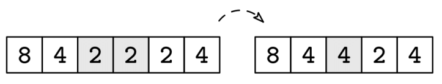

Given an array of integers, arr, a compress operation finds the first pair of consecutive equal numbers and combines them into their sum. If there are no consecutive equal numbers, the array is considered fully compressed. Your goal is to repeatedly compress the array until it is fully compressed.

Here is an example of a compress operation:

Example 1: arr = [8, 4, 2, 2, 2, 4]
Output: [16, 2, 4].
The steps are [8, 4, 2, 2, 2, 4] -> [8, 4, 4, 2, 4] -> [8, 8, 2, 4] -> [16, 2,
4]

Example 2: arr = [4, 4, 4, 4]
Output: [16]
The steps are [4, 4, 4, 4] -> [8, 4, 4] -> [8, 8] -> [16]

Example 3: arr = [1, 2, 3, 4]
Output: [1, 2, 3, 4]
Constraints:

The length of arr is at most 10^5
Each element in arr is a non-negative integer less than 10^3
See Solution
Problem 32.1 - Compress Array: Solution
Python
The compression order is important -- if we merge pairs that are not the leftmost pair, we may end up with an incorrect result. For instance, in Example 1, we could have ended with [8, 4, 2, 8] instead of [16, 2, 4].

We can use a stack to add the array elements from left to right. Whenever we add a number, we see if it triggers any combinations. It could trigger a chain of combinations, which we handle with a nested loop:

def compress_array(arr):
  stack = []
  for num in arr:
    while stack and stack[-1] == num:
      num += stack.pop()
    stack.append(num)
  return stack
Time & Space Analysis
n: the length of the array

Time: O(n) - each element is pushed onto the stack at most once and popped at most once during compression operations. The nested loop for chaining compressions doesn't change the amortized complexity.

Extra space: O(n) - in the worst case (no compressions possible), the stack contains all input elements.

Tests
Here are some test cases to verify the solution:

def run_tests():
  tests = [
    # Examples from problem description
    ([8, 4, 2, 2, 2, 4], [16, 2, 4]),
    ([4, 4, 4, 4], [16]),
    ([1, 2, 3, 4], [1, 2, 3, 4]),
    
    # Edge cases
    ([], []),
    ([1], [1]),
    ([0, 0], [0]),
    ([0, 0, 0, 0], [0]),
    
    # Multiple compression chains
    ([1, 1, 2, 2, 3, 3], [4, 2, 6]),
    ([2, 2, 2, 2, 2, 2], [8, 4]),
    
    # Alternating numbers
    ([1, 2, 1, 2, 1, 2], [1, 2, 1, 2, 1, 2]),
    
    # Numbers that sum to equal another number
    ([2, 2, 4], [8]),
    ([3, 3, 6, 6], [12, 6]),
    
    # Large numbers within constraints
    ([999, 999], [1998]),
    ([500, 500, 500, 500], [2000]),
    
    # Mix of different scenarios
    ([5, 5, 5, 1, 1, 5], [10, 5, 2, 5]),
  ]
  for arr, want in tests:
    got = compress_array(arr)
    assert got == want, f"\ncompress_array({arr}): got: {got}, want: {want}\n"

run_tests()

function compressArray(arr) {
  const stack = [];
  for (let num of arr) {
    while (stack.length && stack[stack.length - 1] === num) {
      num += stack.pop();
    }
    stack.push(num);
  }
  return stack;
}
Time & Space Analysis
n: the length of the array

Time: O(n) - each element is pushed onto the stack at most once and popped at most once during compression operations. The nested loop for chaining compressions doesn't change the amortized complexity.

Extra space: O(n) - in the worst case (no compressions possible), the stack contains all input elements.

Tests
Here are some test cases to verify the solution:

function runTests() {
  const tests = [
    [
      [8, 4, 2, 2, 2, 4],
      [16, 2, 4],
    ],
    [[4, 4, 4, 4], [16]],
    [
      [1, 2, 3, 4],
      [1, 2, 3, 4],
    ],
    [[], []],
    [[0, 0, 0, 0], [0]],
  ];
  for (const [arr, want] of tests) {
    const got = compressArray(arr);
    if (JSON.stringify(got) !== JSON.stringify(want)) {
      throw new Error(
        `\ncompressArray(${JSON.stringify(arr)}): got: ${JSON.stringify(got)}, want: ${JSON.stringify(want)}\n`,
      );
    }
  }
}

runTests();
class CompressArray {
  public List<Integer> solve(int[] arr) {
    List<Integer> stack = new ArrayList<>();
    for (int num : arr) {
      while (!stack.isEmpty() && stack.get(stack.size() - 1) == num) {
        num += stack.remove(stack.size() - 1);
      }
      stack.add(num);
    }
    return stack;
  }
}
Time & Space Analysis
n: the length of the array

Time: O(n) - each element is pushed onto the stack at most once and popped at most once during compression operations. The nested loop for chaining compressions doesn't change the amortized complexity.

Extra space: O(n) - in the worst case (no compressions possible), the stack contains all input elements.

Tests
Here are some test cases to verify the solution:

class RunTests {
  private static class TestCase {
    final int[] input;
    final List<Integer> want;

    TestCase(int[] input, List<Integer> want) {
      this.input = input;
      this.want = want;
    }
  }

  public void runTests() {
    TestCase[] tests = {
        new TestCase(new int[] { 8, 4, 2, 2, 2, 4 }, List.of(16, 2, 4)),
        new TestCase(new int[] { 4, 4, 4, 4 }, List.of(16)),
        new TestCase(new int[] { 1, 2, 3, 4 }, List.of(1, 2, 3, 4)),
        new TestCase(new int[] {}, List.of()),
        new TestCase(new int[] { 0, 0, 0, 0 }, List.of(0)),
    };

    CompressArray solution = new CompressArray();
    for (TestCase test : tests) {
      List<Integer> got = solution.solve(test.input);
      if (!got.equals(test.want)) {
        throw new RuntimeException(String.format(
            "\nsolve(%s): got: %s, want: %s\n",
            java.util.Arrays.toString(test.input), got, test.want));
      }
    }
  }
}

public class Solution {
  public static void main(String[] args) {
    new RunTests().runTests();
  }
}