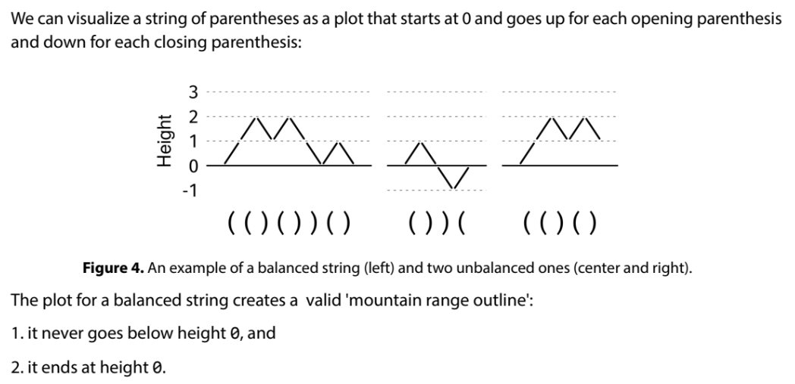
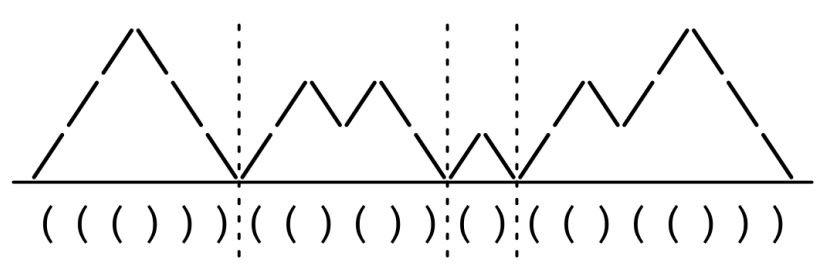

Given a balanced parentheses string, s, a balanced partition is a partition of s into substrings, each of which is itself balanced. Return the maximum possible number of substrings in a balanced partition.

Example: s = "((()))(()())()(()(()))"
Output: 4. The balanced partition with the most substrings is "((()))",
"(()())", "()", "(()(()))".
Constraints:

The length of s is at most 10^5
s consists only of '(' and ')'
See Solution
Problem 32.6 - Balanced Partition: Solution
Python
For balanced parentheses problems, it's useful to think of the "mountain range visualization":

If we think about this problem in terms of plot heights, we'll realize we should start a new substring every time the plot goes back to height 0:

Here is the implementation:

def max_balanced_partition(s):
  height = 0
  res = 0
  for c in s:
    if c == '(':
      height += 1
    else:
      height -= 1
      if height == 0:
        res += 1
  return res
Time & Space Analysis
n: the length of the string

Time: O(n) - each character is processed exactly once

Extra space: O(1) - only using constant extra space for the balance counter and partition count

Tests
Here are some test cases to verify the solution:

def run_tests():
  tests = [
      ("((()))(()())()(()(()))", 4),
      ("()()()", 3),
      ("(((())))", 1),
      ("", 0),
      ("()", 1),
  ]
  for s, want in tests:
    got = max_balanced_partition(s)
    assert got == want, f"\nmax_balanced_partition({s}): got: {
        got}, want: {want}\n"

run_tests()
function maxBalancedPartition(s) {
  let height = 0;
  let res = 0;
  for (const c of s) {
    if (c === "(") {
      height += 1;
    } else {
      height -= 1;
      if (height === 0) {
        res += 1;
      }
    }
  }
  return res;
}
Time & Space Analysis
n: the length of the string

Time: O(n) - each character is processed exactly once

Extra space: O(1) - only using constant extra space for the balance counter and partition count

Tests
Here are some test cases to verify the solution:

function runTests() {
  const tests = [
    ["((()))(()())()(()(()))", 4],
    ["()()()", 3],
    ["(((())))", 1],
    ["", 0],
    ["()", 1],
  ];
  for (const [s, want] of tests) {
    const got = maxBalancedPartition(s);
    if (got !== want) {
      throw new Error(
        `\nmaxBalancedPartition(${s}): got: ${got}, want: ${want}\n`,
      );
    }
  }
}

runTests();
class MaxBalancedPartition {
  public int solve(String s) {
    int height = 0;
    int res = 0;
    for (char c : s.toCharArray()) {
      if (c == '(') {
        height++;
      } else {
        height--;
        if (height == 0) {
          res++;
        }
      }
    }
    return res;
  }
}
Time & Space Analysis
n: the length of the string

Time: O(n) - each character is processed exactly once

Extra space: O(1) - only using constant extra space for the balance counter and partition count

Tests
Here are some test cases to verify the solution:

class RunTests {
  public void runTests() {
    Object[][] tests = {
        { "((()))(()())()(()(()))", 4 },
        { "()()()", 3 },
        { "(((())))", 1 },
        { "", 0 },
        { "()", 1 },
    };
    MaxBalancedPartition solution = new MaxBalancedPartition();
    for (Object[] test : tests) {
      String s = (String) test[0];
      int want = (int) test[1];
      int got = solution.solve(s);
      if (got != want) {
        throw new RuntimeException(String.format(
            "\nsolve(%s): got: %d, want: %d\n",
            s, got, want));
      }
    }
  }
}

public class Solution {
  public static void main(String[] args) {
    new RunTests().runTests();
  }
}
