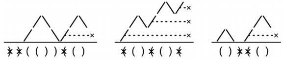

Given a string of parentheses, s, return the longest balanced subsequence.

A subsequence of s (not a subarray) is a string obtained by removing some of the letters in s. In other words, you have to delete the smallest number of characters necessary to make s balanced and return the resulting string. There may be more than one valid answer.

Example 1: s = "))(())(()"
Output: "(())()". We removed the following characters:

   "))(())(()".
    ^^    ^
We could have also removed

   "))(())(()".
    ^^     ^

Example 2: s = "(()()"
Output: "()()". We removed the following character:

   "(()()"
    ^
We could have also removed

   "(()()"
       ^

So "(())" is also a valid output.

Example 3: s = "())(()"
Output: "()()". We removed the following characters:

   "())(()"
      ^^
There are several other ways to reach the same answer. For example, we could
have also removed

   "())(()"
     ^  ^

Example 4: s = "("
Output: ""
Constraints:

0 <= s.length <= 10^5
s consists only of '(' and ')'
Problem 32.8 - Longest Balanced Subsequence: Solution
Java
For balanced parentheses problems, it's useful to think of the "mountain range visualization":

Thinking of the mountain range visualization, we can characterize invalid parentheses as follows:

Closing parentheses that send the mountain outline 'underground.'
Opening parentheses that are left unmatched at the end.

These invalid parentheses must be removed, so what we are left with after removing them is the longest balanced subsequence.

The reason why there are multiple valid outputs is that if the mountain range does not end at ground level, then there may be multiple opening parentheses we can remove to make it end at ground level, and those may result in different balanced subsequences.

For instance, in the example s = "(()()", the mountain range ends one level above ground level, and we can remove any single opening parentheses without making the mountain range go underground. Depending on which one we remove, we may end up with "(())" or "()()". Our solution always matches closing parentheses to open parentheses in a last-in-first-out manner, so the one that ends up getting removed is the first one.

class LongestBalancedSubsequence {
  public String solve(String s) {
    Set<Integer> invalidIndices = new HashSet<>();
    Stack<Integer> stack = new Stack<>();
    for (int i = 0; i < s.length(); i++) {
      char c = s.charAt(i);
      if (c == '(') {
        stack.push(i);
      } else if (stack.isEmpty()) {
        invalidIndices.add(i);
      } else {
        stack.pop();
      }
    }

    while (!stack.isEmpty()) {
      invalidIndices.add(stack.pop());
    }

    StringBuilder res = new StringBuilder();
    for (int i = 0; i < s.length(); i++) {
      if (!invalidIndices.contains(i)) {
        res.append(s.charAt(i));
      }
    }
    return res.toString();
  }
}
Time & Space Analysis
n: the length of the string

Time: O(n) - we identify all invalid parentheses in a single pass, and then we build the result string in a second pass.

Extra space: O(n) - in the worst case, the stack stores all opening parentheses.

Tests
Here are some test cases to verify the solution:

class RunTests {
  public void runTests() {
    Object[][] tests = {
        { "))(())(()", new String[] { "(())()" } },
        { "(()()", new String[] { "()()", "(())" } },
        { "(()(()(", new String[] { "()()", "(())" } },
        { "())(()", new String[] { "()()" } },
        { "(", new String[] { "" } },
        { "", new String[] { "" } }
    };
    LongestBalancedSubsequence solution = new LongestBalancedSubsequence();
    for (Object[] test : tests) {
      String s = (String) test[0];
      String[] want = (String[]) test[1];
      String got = solution.solve(s);
      boolean found = false;
      for (String w : want) {
        if (got.equals(w)) {
          found = true;
          break;
        }
      }
      if (!found) {
        throw new RuntimeException(String.format(
            "\nsolve(%s): got: %s, want: %s\n",
            s, got, String.join(" or ", want)));
      }
    }
  }
}

public class Solution {
  public static void main(String[] args) {
    new RunTests().runTests();
  }
}

Recipe - Dangling Bracket Stack

stack = []
for c in input s
  if c is an open bracket
    add it to the stack
  else if c is a closing bracket
    check that the stack is not empty
    try to match the top of the stack with the closing bracket
  else
    handle (or ignore) non-bracket elements

Check that there are no remaining unmatched parentheses in the stack

def longest_balanced_subsequence(s):
  invalid_indices = set()
  stack = []
  for i, c in enumerate(s):
    if c == "(":
      stack.append(i)
    elif not stack:
      invalid_indices.add(i)
    else:
      stack.pop()

  while stack:
    invalid_indices.add(stack.pop())

  res = []
  for i, c in enumerate(s):
    if i not in invalid_indices:
      res.append(c)
  return ''.join(res)
Time & Space Analysis
n: the length of the string

Time: O(n) - we identify all invalid parentheses in a single pass, and then we build the result string in a second pass.

Extra space: O(n) - in the worst case, the stack stores all opening parentheses.

Tests
Here are some test cases to verify the solution:

def run_tests():
  tests = [
      ("))(())(()", ["(())()"]),
      ("(()()", ["()()", "(())"]),
      ("(()(()(", ["()()", "(())"]),
      ("())(()", ["()()"]),
      ("(", [""]),
      ("", [""]),
  ]
  for s, want in tests:
    got = longest_balanced_subsequence(s)
    assert got in want, f"\nlongest_balanced_subsequence({s}): got: {
        got}, want: {want}\n"

run_tests()

function longestBalancedSubsequence(s) {
  const invalidIndices = new Set();
  const stack = [];
  for (let i = 0; i < s.length; i++) {
    const c = s[i];
    if (c === "(") {
      stack.push(i);
    } else if (!stack.length) {
      invalidIndices.add(i);
    } else {
      stack.pop();
    }
  }

  while (stack.length) {
    invalidIndices.add(stack.pop());
  }

  const res = [];
  for (let i = 0; i < s.length; i++) {
    if (!invalidIndices.has(i)) {
      res.push(s[i]);
    }
  }
  return res.join("");
}
Time & Space Analysis
n: the length of the string

Time: O(n) - we identify all invalid parentheses in a single pass, and then we build the result string in a second pass.

Extra space: O(n) - in the worst case, the stack stores all opening parentheses.

Tests
Here are some test cases to verify the solution:

function runTests() {
  const tests = [
    ["))(())(()", ["(())()"]],
    ["(()()", ["()()", "(())"]],
    ["(()(()(", ["()()", "(())"]],
    ["())(()", ["()()"]],
    ["(", [""]],
    ["", [""]],
  ];
  for (const [s, want] of tests) {
    const got = longestBalancedSubsequence(s);
    if (!want.includes(got)) {
      throw new Error(
        `\nlongestBalancedSubsequence(${s}): got: ${got}, want: ${want}\n`,
      );
    }
  }
}

runTests();