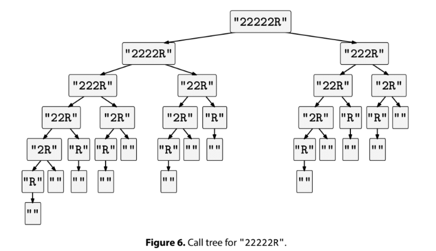

We are given a string, seq, with a sequence of instructions for a robot. The string consists of characters 'L', 'R', and '2'. The letters 'L' and 'R' instruct the robot to move left or right.

The character '2' (which never appears at the end of the string) means "perform all the instructions after this '2' twice, but skip the instruction immediately following the '2' during the second repetition." Output a string with the final list of left and right moves that the robot should do.

Example 1: seq = "LL"
Output: "LL"

Example 2: seq = "2LR"
Output: "LRR". The '2' indicates that we need to do "LR" first and then "R".

Example 3: seq = "2L"
Output: "L". The '2' indicates that we need to do "L" first and then "" (the
empty string).

Example 4: seq = "22LR"
Output: "LRRLR". The first '2' indicates that we need to do "2LR" first and
then "LR".

Example 5: seq = "LL2R2L"
Output: "LLRLL"
Constraints:

The length of seq is at most 10^4
seq consists only of the characters 'L', 'R', and '2'
'2' never appears at the end of seq
See Solution
Problem 33.1 - Robot Instructions: Solution
Python
This is an example of a problem that is easier to do recursively than iteratively. We can simulate "do all the instructions after this one and then do them again" with two recursive calls.

For each position in the sequence:

If we've reached the end, we're done
If we see a '2', we make two recursive calls:
First to process everything after the '2'
Then to process everything after the next character (skipping it in the second repetition)
If we see 'L' or 'R', we append it to our result and continue processing
To avoid unnecessary string copies, we'll use an array to build up our result and join it at the end.

Here is the implementation:

def moves(seq):
  res = []
  
  def moves_rec(pos):
    if pos == len(seq):
      return
    if seq[pos] == '2':
      moves_rec(pos+1)
      moves_rec(pos+2)
    else:
      res.append(seq[pos])
      moves_rec(pos+1)
  
  moves_rec(0)
  return ''.join(res)
Time & Space Analysis
n: the length of the instruction sequence
The worst case is when we have a lot of '2's, as in "222222...2R".

For the analysis, we can apply the BAD method: O(b^d * A), where

b is the branching factor: 2 (we can split the array into two halves).
d is the depth of the decision tree: n + 1.
A is the additional work per node: O(1).
Thus, the total runtime is O(2^(n+1) * O(1)) = O(2^n).

However, we call the BAD method "BAD" because sometimes it gives an upper bound that is not tight. In this problem, in the worst case where the input has n-1 '2's, not all leaves in the call tree are at maximum depth:

Robot Instructions Recursion Tree
The number of nodes is closer to O(1.618^n), but the math to derive the exact formula is beyond what you need for interviews.

Time: O(1.618^n) or O(2^n) - per the BAD method.
Extra space: O(1.618^n) or O(2^n) - for the output string.
Tests
Here are some test cases to verify the solution:

def run_tests():
  tests = [
    # Example 1 from book
    ("LL", "LL"),
    # Example 2 from book
    ("2LR", "LRR"),
    # Example 3 from book
    ("2L", "L"),
    # Example 4 from book
    ("22LR", "LRRLR"),
    # Example 5 from book
    ("LL2R2L", "LLRLL"),
    # Edge case - empty string
    ("", ""),
    # Edge case - single character
    ("L", "L"),
    # Multiple 2s in a row
    ("2222LR", "LRRLRLRRLRRLR"),
  ]
  
  for seq, want in tests:
    got = moves(seq)
    assert got == want, f"\nmoves({seq}): got: {got}, want: {want}\n"

run_tests()

function moves(seq) {
  const res = [];

  function movesRec(pos) {
    if (pos === seq.length) {
      return;
    }
    if (seq[pos] === "2") {
      movesRec(pos + 1);
      movesRec(pos + 2);
    } else {
      res.push(seq[pos]);
      movesRec(pos + 1);
    }
  }

  movesRec(0);
  return res.join("");
}
Time & Space Analysis
n: the length of the instruction sequence
The worst case is when we have a lot of '2's, as in "222222...2R".

For the analysis, we can apply the BAD method: O(b^d * A), where

b is the branching factor: 2 (we can split the array into two halves).
d is the depth of the decision tree: n + 1.
A is the additional work per node: O(1).
Thus, the total runtime is O(2^(n+1) * O(1)) = O(2^n).

However, we call the BAD method "BAD" because sometimes it gives an upper bound that is not tight. In this problem, in the worst case where the input has n-1 '2's, not all leaves in the call tree are at maximum depth:

Robot Instructions Recursion Tree
The number of nodes is closer to O(1.618^n), but the math to derive the exact formula is beyond what you need for interviews.

Time: O(1.618^n) or O(2^n) - per the BAD method.
Extra space: O(1.618^n) or O(2^n) - for the output string.
Tests
Here are some test cases to verify the solution:

function runTests() {
  const tests = [
    // Example 1 from book
    ["LL", "LL"],
    // Example 2 from book
    ["2LR", "LRR"],
    // Example 3 from book
    ["2L", "L"],
    // Example 4 from book
    ["22LR", "LRRLR"],
    // Example 5 from book
    ["LL2R2L", "LLRLL"],
    // Edge case - empty string
    ["", ""],
    // Edge case - single character
    ["L", "L"],
    // Multiple 2s in a row
    ["2222LR", "LRRLRLRRLRRLR"],
  ];

  for (const [seq, want] of tests) {
    const got = moves(seq);
    if (got !== want) {
      throw new Error(`\nmoves(${seq}): got: ${got}, want: ${want}\n`);
    }
  }
}

runTests();

class Moves {
  public String solve(String seq) {
    ArrayList<Character> res = new ArrayList<>();
    movesRec(seq, 0, res);
    StringBuilder sb = new StringBuilder();
    for (char c : res) {
      sb.append(c);
    }
    return sb.toString();
  }

  private void movesRec(String seq, int pos, ArrayList<Character> res) {
    if (pos == seq.length()) {
      return;
    }
    if (seq.charAt(pos) == '2') {
      movesRec(seq, pos + 1, res);
      movesRec(seq, pos + 2, res);
    } else {
      res.add(seq.charAt(pos));
      movesRec(seq, pos + 1, res);
    }
  }
}
Time & Space Analysis
n: the length of the instruction sequence
The worst case is when we have a lot of '2's, as in "222222...2R".

For the analysis, we can apply the BAD method: O(b^d * A), where

b is the branching factor: 2 (we can split the array into two halves).
d is the depth of the decision tree: n + 1.
A is the additional work per node: O(1).
Thus, the total runtime is O(2^(n+1) * O(1)) = O(2^n).

However, we call the BAD method "BAD" because sometimes it gives an upper bound that is not tight. In this problem, in the worst case where the input has n-1 '2's, not all leaves in the call tree are at maximum depth:

Robot Instructions Recursion Tree
The number of nodes is closer to O(1.618^n), but the math to derive the exact formula is beyond what you need for interviews.

Time: O(1.618^n) or O(2^n) - per the BAD method.
Extra space: O(1.618^n) or O(2^n) - for the output string.
Tests
Here are some test cases to verify the solution:

class RunTests {
  public void runTests() {
    Object[][] tests = {
        // Example 1 from book
        { "LL", "LL" },
        // Example 2 from book
        { "2LR", "LRR" },
        // Example 3 from book
        { "2L", "L" },
        // Example 4 from book
        { "22LR", "LRRLR" },
        // Example 5 from book
        { "LL2R2L", "LLRLL" },
        // Edge case - empty string
        { "", "" },
        // Edge case - single character
        { "L", "L" },
        // Multiple 2s in a row
        { "2222LR", "LRRLRLRRLRRLR" },
    };

    Moves solution = new Moves();
    for (Object[] test : tests) {
      String seq = (String) test[0];
      String want = (String) test[1];
      String got = solution.solve(seq);
      if (!got.equals(want)) {
        throw new RuntimeException(String.format(
            "\nsolve(%s): got: %s, want: %s\n",
            seq, got, want));
      }
    }
  }
}

public class Solution {
  public static void main(String[] args) {
    new RunTests().runTests();
  }
}

