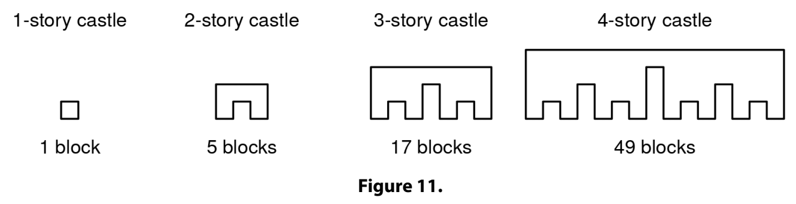
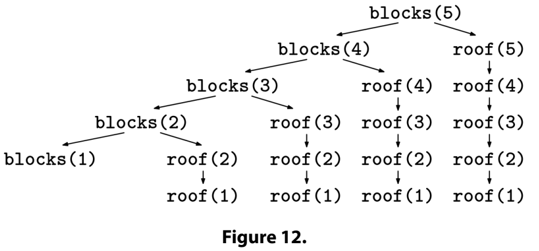
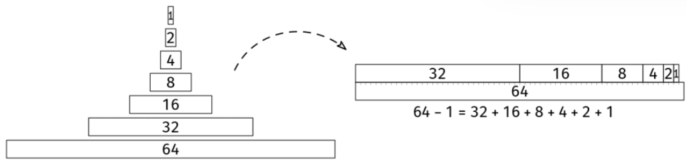

You want to build an n-story 2D Lego castle following these instructions:

A 1-story castle is just a 1x1 block.
An n-story castle is made with two (n-1)-story castles, side by side, one unit apart, with a row of blocks above them connecting them.
Lego castle

Given n > 0, how many 1x1 blocks will you need to buy to build an n-story castle?

Example 1: n = 1
Output: 1

Example 2: n = 2
Output: 5

Example 3: n = 3
Output: 17

Example 4: n = 4
Output: 49

Example 5: n = 5
Output: 129
Constraints:

1 ≤ n ≤ 57
Assume that the solution will fit in a signed 64-bit integer.
See Solution
Problem 33.4 - Lego Castle: Solution
Python
Naive recursion
We're trying to find a formula, blocks(n), which returns the number of blocks needed for an n-story castle. We know that:

blocks(1) = 1
for n > 1, blocks(n) can be obtained from blocks(n - 1) somehow.
We can break down the problem by introducing another function, roof(n), representing the number of blocks in the top row of an n-story castle. This makes the recurrence relation for blocks(n) straightforward:

blocks(n) = 2 * blocks(n - 1) + roof(n)

Next, we need to tackle roof(n). We can again use a recurrence relation:

roof(1) = 1
for n > 1, roof(n) = 2 * roof(n - 1) + 1
We can turn this recurrence relation into recursive code:

def blocks_rec(n):
  if n == 1:
    return 1

  def roof(i):
    if i == 1:
      return 1
    return roof(i - 1) * 2 + 1

  return blocks_rec(n - 1) * 2 + roof(n)
Memoization

Here is the call tree for blocks(5) for the recursive implementation above:

Lego castle call tree
To optimize the solution, we can use memoization to avoid recomputing the same values of roof(n) multiple times.

Here is the implementation:

def blocks_memoized(n):
  memo = dict()

  def roof(i):
    if i == 1:
      return 1
    if i in memo:
      return memo[i]
    memo[i] = roof(i - 1) * 2 + 1
    return memo[i]

  def blocks_rec(n):
    if n == 1:
      return 1
    return blocks_rec(n - 1) * 2 + roof(n)

  return blocks_rec(n)
Bottom-up approach
If we look at the values of roof(n), we see:

1, 3, 7, 15, ...

They are powers of 2 minus 1, so we can give a closed formula:

roof(n) = 2^n - 1

This simplifies our code, as we don't need memoization anymore.

To get down to O(1) extra space, we also need to stop using a call stack of depth n. We can move from the recursive implementation to a bottom-up, iterative implementation:

def blocks_iterative(n):
  blocks = 1
  for i in range(2, n + 1):
    roof = 2**i - 1
    blocks = blocks * 2 + roof
  return blocks
Closed formula approach
The memoized recursive solution is probably what the interviewer is looking for. However, there is also a closed formula for this problem, which allows us to compute the number of blocks in an n-story castle in constant time.

We'll think of the total number of blocks as a sum of all the individual roofs:

blocks(n) = roof(n) + 2 * roof(n - 1) + 4 * roof(n - 2) + ... + 2^(n-1) * roof(1)

To simplify further, it will help to put this in summation notation. In math, we would use the Sigma symbol, ∑. In an interview, we can simply type it like this:

blocks(n) = SUM FROM k = 0 TO n-1 OF 2^k * roof(n - k)

Using the formula for roof(n - k), we get:

blocks(n) = SUM FROM k = 0 TO n-1 OF 2^k * (2^(n-k) - 1)

We can simplify the expression inside the sum:

2^k * (2^(n-k) - 1) = 2^k * 2^(n-k) - 2^k = 2^n - 2^k

Now that the term inside the sum is split into two parts, we can separate them into two sums:

blocks(n) = (SUM FROM k = 0 TO n-1 OF 2^n) - (SUM FROM k = 0 TO n-1 OF 2^k)

We can now simplify each sum individually.

The first one is just adding 2^n a total of n times, so it is n * 2^n.

The second one is a 1 + 2 + 4 + ... + 2^(n-1), a classic geometric series. It's useful to know that the sum of the first few powers of 2 always falls one short of the next power of 2:

Geometric series

Thus, the second sum is just 2^n - 1.

Bringing it all together, we get:

blocks(n) = n * 2^n - (2^n - 1)

Here is the implementation:

def blocks_math(n):
  return n * 2**n - (2**n - 1)
Time & Space Analysis
n: the number of stories in the castle
Naive recursion:

Time: O(n^2) - due to the repeated computations of roof(i) for each i.
Space: O(n) - for the call stack.
Recursion with memoization:

Time: O(n) - with memoization, each value of roof(i) is computed exactly once.
Extra space: O(n) - for the memoization table and the call stack.
Iterative bottom-up implementation:

Time: O(n)
Extra space: O(1)
Closed formula:

Time: O(1) - the formula is a constant time expression.
Extra space: O(1) - the formula is a constant time expression.
Caveat: even though the math approach does not have any loops, note that the value of the answer grows exponentially, so the number of bits in the answer does grow linearly with n. In that sense, the math approach takes linear time (and the recursive approach takes even more). The constant time analysis is only valid for small values of n, or under the simplification that math operations always take constant time regardless of how large the numbers are.

Tests
Here are some test cases to verify the solution:

def run_tests():
  tests = [
      (1, 1),
      (2, 5),
      (3, 17),
      (4, 49),
      (5, 129),
      (6, 321),
      (7, 769),
      (8, 1793),
      (9, 4097),
      (10, 9217),
  ]
  for n, want in tests:
    got_rec = blocks_rec(n)
    got_memoized = blocks_memoized(n)
    got_iterative = blocks_iterative(n)
    got_math = blocks_math(n)
    assert got_rec == want, f"\nblocks_rec({n}): got: {got_rec}, want: {want}\n"
    assert got_memoized == want, f"\nblocks_memoized({n}): got: {got_memoized}, want: {want}\n"
    assert got_iterative == want, f"\nblocks_iterative({n}): got: {got_iterative}, want: {want}\n"
    assert got_math == want, f"\nblocks_math({n}): got: {got_math}, want: {want}\n"

run_tests()

function blocksRec(n) {
  if (n === 1) {
    return 1;
  }

  function roof(i) {
    if (i === 1) {
      return 1;
    }
    return roof(i - 1) * 2 + 1;
  }

  return blocksRec(n - 1) * 2 + roof(n);
}

function blocksMemoized(n) {
  const memo = new Map();

  function roof(i) {
    if (i === 1) {
      return 1;
    }
    if (memo.has(i)) {
      return memo.get(i);
    }
    const result = roof(i - 1) * 2 + 1;
    memo.set(i, result);
    return result;
  }

  function blocksRec(n) {
    if (n === 1) {
      return 1;
    }
    return blocksRec(n - 1) * 2 + roof(n);
  }

  return blocksRec(n);
}

function blocksIterative(n) {
  let blocks = 1;
  for (let i = 2; i <= n; i++) {
    const roof = 2 ** i - 1;
    blocks = blocks * 2 + roof;
  }
  return blocks;
}

function blocksMath(n) {
  return n * 2 ** n - (2 ** n - 1);
}

function runTests() {
  const tests = [
    [1, 1],
    [2, 5],
    [3, 17],
    [4, 49],
    [5, 129],
    [6, 321],
    [7, 769],
    [8, 1793],
    [9, 4097],
    [10, 9217],
  ];

  for (const [n, want] of tests) {
    const gotRec = blocksRec(n);
    const gotMemoized = blocksMemoized(n);
    const gotIterative = blocksIterative(n);
    const gotMath = blocksMath(n);
    if (gotRec !== want) {
      throw new Error(`\nblocksRec(${n}): got: ${gotRec}, want: ${want}\n`);
    }
    if (gotMemoized !== want) {
      throw new Error(`\nblocksMemoized(${n}): got: ${gotMemoized}, want: ${want}\n`);
    }
    if (gotIterative !== want) {
      throw new Error(`\nblocksIterative(${n}): got: ${gotIterative}, want: ${want}\n`);
    }
    if (gotMath !== want) {
      throw new Error(`\nblocksMath(${n}): got: ${gotMath}, want: ${want}\n`);
    }
  }
}

runTests();
class BlocksRec {
  private long roof(int i) {
    if (i == 1) {
      return 1;
    }
    return roof(i - 1) * 2 + 1;
  }

  private long blocksRec(int n) {
    if (n == 1) {
      return 1;
    }
    return blocksRec(n - 1) * 2 + roof(n);
  }

  public long solve(int n) {
    return blocksRec(n);
  }
}
class BlocksMemoized {
  private HashMap<Integer, Long> memo;

  public long solve(int n) {
    memo = new HashMap<>();
    return blocksRec(n);
  }

  private long roof(int i) {
    if (i == 1) {
      return 1;
    }
    if (memo.containsKey(i)) {
      return memo.get(i);
    }
    long result = roof(i - 1) * 2 + 1;
    memo.put(i, result);
    return result;
  }

  private long blocksRec(int n) {
    if (n == 1) {
      return 1;
    }
    return blocksRec(n - 1) * 2 + roof(n);
  }
}

class BlocksIterative {
  public long solve(int n) {
    long blocks = 1;
    for (int i = 2; i <= n; i++) {
      long roof = (1L << i) - 1;
      blocks = blocks * 2 + roof;
    }
    return blocks;
  }
}

class BlocksMath {
  public long solve(int n) {
    long power = 1L << n;
    return n * power - (power - 1);
  }
}

class RunTests {
  public void runTests() {
    Object[][] tests = {
        { 1, 1L },
        { 2, 5L },
        { 3, 17L },
        { 4, 49L },
        { 5, 129L },
        { 6, 321L },
        { 7, 769L },
        { 8, 1793L },
        { 9, 4097L },
        { 10, 9217L },
    };

    BlocksRec solutionRec = new BlocksRec();
    BlocksMemoized solutionMemoized = new BlocksMemoized();
    BlocksIterative solutionIterative = new BlocksIterative();
    BlocksMath solutionMath = new BlocksMath();
    for (Object[] test : tests) {
      int n = (Integer) test[0];
      long want = (Long) test[1];
      long gotRec = solutionRec.solve(n);
      long gotMemoized = solutionMemoized.solve(n);
      long gotIterative = solutionIterative.solve(n);
      long gotMath = solutionMath.solve(n);
      if (gotRec != want) {
        throw new RuntimeException(String.format(
            "\nBlocksRec.solve(%d): got: %d, want: %d\n",
            n, gotRec, want));
      }
      if (gotMemoized != want) {
        throw new RuntimeException(String.format(
            "\nBlocksMemoized.solve(%d): got: %d, want: %d\n",
            n, gotMemoized, want));
      }
      if (gotIterative != want) {
        throw new RuntimeException(String.format(
            "\nBlocksIterative.solve(%d): got: %d, want: %d\n",
            n, gotIterative, want));
      }
      if (gotMath != want) {
        throw new RuntimeException(String.format(
            "\nBlocksMath.solve(%d): got: %d, want: %d\n",
            n, gotMath, want));
      }
    }
  }
}

public class Solution {
  public static void main(String[] args) {
    new RunTests().runTests();
  }
}