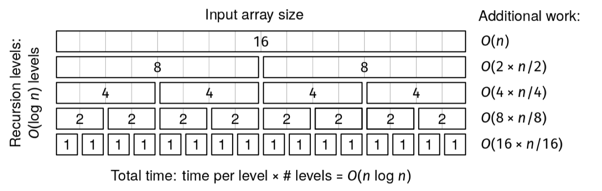

We are given an array, arr, whose length is a power of 2.

We define the set of laminal arrays as follows:

The array arr is laminal.
Each half of a laminal array with even length is laminal.
Find the laminal array with maximum sum and return its sum.

Example 1: arr = [3, -9, 2, 4, -1, 5, 5, -4]
Output: 6
The laminal arrays are:
[3, -9, 2, 4, -1, 5, 5, -4],
[3, -9, 2, 4], [-1, 5, 5, -4],
[3, -9], [2, 4], [-1, 5], [5, -4],
[3], [-9], [2], [4], [-1], [5], [5], [-4]
The one with the maximum sum is [2, 4].

Example 2: arr = [1]
Output: 1

Example 3: arr = [-1, -2]
Output: -1

Example 4: arr = [1, 2, 3, 4]
Output: 10

Example 5: arr = [-2, -1, -4, -3]
Output: -1
Constraints:

The length of arr is a power of 2
1 ≤ len(arr) ≤ 10^5
-10^9 ≤ arr[i] ≤ 10^9
See Solution
Problem 33.5 - Laminal Arrays: Solution
Python
The self-referential nature of the 'laminal' definition makes this problem a good fit for recursion. Furthermore, the fact that the elements from the first half of arr are not in any of the same laminal subarrays as the elements from the second half allows us to employ a divide-and-conquer strategy:

Find the max-sum laminal subarray in the first half of arr
Find the max-sum laminal subarray in the second half of arr
Return the max-sum array between those and arr itself
def max_laminal_sum_inefficient(arr):  # O(n log n)

  # Returns the max sum for a laminal array in arr[l:r].

  def max_laminal_sum_rec(l, r):
    if r - l == 1:
      return arr[l]    
    mid = (l + r) // 2
    option1 = max_laminal_sum_rec(l, mid)
    option2 = max_laminal_sum_rec(mid, r)
    option3 = sum(arr[l:r])
    return max(option1, option2, option3)

  return max_laminal_sum_rec(0, len(arr))
Like merge sort, the call tree has O(log n) depth, branching factor 2, and O(n) additional work at the root, which halves at each depth. The runtime is O(n log n), as shown in this figure:

Laminal Arrays Analysis

We can further optimize the solution by returning the sum of each half so that we don't need to make the expensive sum(arr[l:r]) call. The recursive function returns both:

The maximum sum for a laminal subarray in the current range
The sum of all elements in the current range
Here is the implementation:

def max_laminal_sum(arr):  # O(n)

  # Returns the max sum for a laminal array in arr[l:r] and the sum of arr[l:r].
  def max_laminal_sum_rec(l, r):
    if r - l == 1:
      return arr[l], arr[l]
    mid = (l + r) // 2
    option1, left_sum = max_laminal_sum_rec(l, mid)
    option2, right_sum = max_laminal_sum_rec(mid, r)
    option3 = left_sum + right_sum
    return max(option1, option2, option3), option3

  res, _ = max_laminal_sum_rec(0, len(arr))
  return res
Time & Space Analysis
n: the length of the array
As mentioned above, the inefficient solution takes O(n log n) time, like merge sort, since it has the same structure.

For the efficient version, we can apply the BAD method: O(b^d * A), where

b is the branching factor: 2 (we can split the array into two halves).
d is the depth of the decision tree: log₂(n).
A is the additional work per node: O(1).
Thus, the total runtime is O(2^log₂(n) * O(1)) = O(n).

Time: O(n) - per the BAD method.
Extra space: O(log n) - the recursion call stack depth is proportional to log₂(n) since the array length is halved at each recursive level.
(The BAD method gives an overestimate of O(n^2) for the inefficient algorithm.)

Tests
Here are some test cases to verify the solution:

def run_tests():
  tests = [
      # Example 1 from book
      ([3, -9, 2, 4, -1, 5, 5, -4], 6),
      # Example 2 from book
      ([1], 1),
      # Example 3 from book
      ([-1, -2], -1),
      # Additional test case
      ([1, 2, 3, 4], 10),
      # Additional test case with all negatives
      ([-2, -1, -4, -3], -1),
      # Large test case
      ([1, -2, 3, -4, 5, -6, 7, -8, 9, -10, 11, -
        12, 13, -14, 15, -16], 15),
  ]
  for arr, want in tests:
    got = max_laminal_sum(arr)
    assert got == want, f"\nmax_laminal_sum({arr}): got: {got}, want: {want}\n"
    got = max_laminal_sum_inefficient(arr)
    assert got == want, f"\nmax_laminal_sum_inefficient({arr}): got: {got}, want: {want}\n"

run_tests()

function maxLaminalSumInefficient(arr) {
  // O(n log n)

  // Returns the max sum for a laminal array in arr[l:r].
  function maxLaminalSumRec(l, r) {
    if (r - l === 1) {
      return arr[l];
    }
    const mid = Math.floor((l + r) / 2);
    const option1 = maxLaminalSumRec(l, mid);
    const option2 = maxLaminalSumRec(mid, r);
    const option3 = arr.slice(l, r).reduce((sum, val) => sum + val, 0);
    return Math.max(option1, option2, option3);
  }

  return maxLaminalSumRec(0, arr.length);
}

function maxLaminalSum(arr) {
  // O(n)

  // Returns the max sum for a laminal array in arr[l:r] and the sum of arr[l:r].
  function maxLaminalSumRec(l, r) {
    if (r - l === 1) {
      return [arr[l], arr[l]];
    }
    const mid = Math.floor((l + r) / 2);
    const [option1, leftSum] = maxLaminalSumRec(l, mid);
    const [option2, rightSum] = maxLaminalSumRec(mid, r);
    const option3 = leftSum + rightSum;
    return [Math.max(option1, option2, option3), option3];
  }

  const [res, _] = maxLaminalSumRec(0, arr.length);
  return res;
}

function runTests() {
  const tests = [
    // Example 1 from book
    [[3, -9, 2, 4, -1, 5, 5, -4], 6],
    // Example 2 from book
    [[1], 1],
    // Example 3 from book
    [[-1, -2], -1],
    // Additional test case
    [[1, 2, 3, 4], 10],
    // Additional test case with all negatives
    [[-2, -1, -4, -3], -1],
    // Large test case
    [[1, -2, 3, -4, 5, -6, 7, -8, 9, -10, 11, -12, 13, -14, 15, -16], 15],
  ];
  for (const [arr, want] of tests) {
    const got = maxLaminalSum(arr);
    if (got !== want) {
      throw new Error(
        `\nmaxLaminalSum(${JSON.stringify(arr)}): got: ${got}, want: ${want}\n`,
      );
    }
    const gotInefficient = maxLaminalSumInefficient(arr);
    if (gotInefficient !== want) {
      throw new Error(
        `\nmaxLaminalSumInefficient(${JSON.stringify(arr)}): got: ${gotInefficient}, want: ${want}\n`,
      );
    }
  }
}

runTests();

class MaxLaminalSumInefficient {
  public int solve(int[] arr) { // O(n log n)
    return maxLaminalSumRec(arr, 0, arr.length);
  }

  // Returns the max sum for a laminal array in arr[l:r].
  private int maxLaminalSumRec(int[] arr, int l, int r) {
    if (r - l == 1) {
      return arr[l];
    }
    int mid = (l + r) / 2;
    int option1 = maxLaminalSumRec(arr, l, mid);
    int option2 = maxLaminalSumRec(arr, mid, r);
    int option3 = 0;
    for (int i = l; i < r; i++) {
      option3 += arr[i];
    }
    return Math.max(Math.max(option1, option2), option3);
  }
}
class MaxLaminalSum {
  public int solve(int[] arr) { // O(n)
    return maxLaminalSumRec(arr, 0, arr.length)[0];
  }

  // Returns the max sum for a laminal array in arr[l:r] and the sum of
  // arr[l:r].
  private int[] maxLaminalSumRec(int[] arr, int l, int r) {
    if (r - l == 1) {
      return new int[] { arr[l], arr[l] };
    }

    int mid = (l + r) / 2;
    int[] left = maxLaminalSumRec(arr, l, mid);
    int[] right = maxLaminalSumRec(arr, mid, r);
    int option1 = left[0];
    int option2 = right[0];
    int option3 = left[1] + right[1];
    return new int[] { Math.max(Math.max(option1, option2), option3), option3 };
  }
}

class RunTests {
  public void runTests() {
    Object[][] tests = {
        // Example 1 from book
        { new int[] { 3, -9, 2, 4, -1, 5, 5, -4 }, 6 },
        // Example 2 from book
        { new int[] { 1 }, 1 },
        // Example 3 from book
        { new int[] { -1, -2 }, -1 },
        // Additional test case
        { new int[] { 1, 2, 3, 4 }, 10 },
        // Additional test case with all negatives
        { new int[] { -2, -1, -4, -3 }, -1 },
        // Large test case
        { new int[] { 1, -2, 3, -4, 5, -6, 7, -8, 9, -10, 11, -12, 13, -14, 15,
            -16 }, 15 },
    };

    MaxLaminalSum solution = new MaxLaminalSum();
    MaxLaminalSumInefficient solutionInefficient = new MaxLaminalSumInefficient();
    for (Object[] test : tests) {
      int[] arr = (int[]) test[0];
      int want = (Integer) test[1];
      int got = solution.solve(arr);
      if (got != want) {
        throw new RuntimeException(String.format(
            "\nsolve(%s): got: %d, want: %d\n",
            java.util.Arrays.toString(arr), got, want));
      }
      int gotInefficient = solutionInefficient.solve(arr);
      if (gotInefficient != want) {
        throw new RuntimeException(String.format(
            "\nsolve(%s): got: %d, want: %d\n",
            java.util.Arrays.toString(arr), gotInefficient, want));
      }
    }
  }
}

public class Solution {
  public static void main(String[] args) {
    new RunTests().runTests();
  }
}

