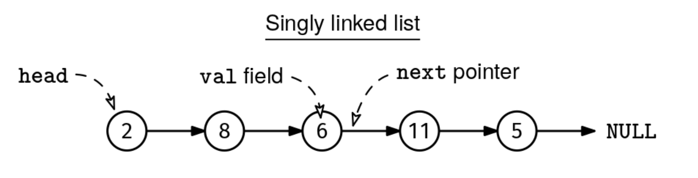
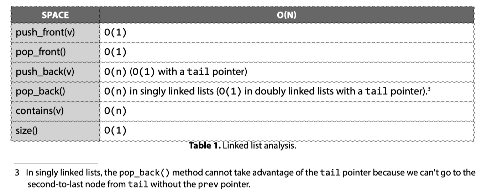

Implement a SinglyLinkedList class with the following methods:

push_front(v):
    Adds a node with value v at the beginning of the list.

pop_front():
    Removes the node at the beginning of the list and returns its value.
    If the list is empty, returns None.

push_back(v):
    Adds a node with value v at the end of the list.

pop_back():
    Removes the node at the end of the list and returns its value.
    If the list is empty, returns None.

size():
    Returns the number of nodes in the list.

contains(v):
    Return the first node with value v, if any, or null otherwise.
Here are some examples:

Example 1:
list = SinglyLinkedList()
list.push_front(1)  # List is now: 1
list.push_front(2)  # List is now: 2->1
list.push_back(3)   # List is now: 2->1->3
list.contains(2)    # Returns node with value 2
list.contains(4)    # Returns None (value not found)
list.size()         # Returns 3
list.pop_front()    # Returns 2, list is now: 1->3
list.pop_back()     # Returns 3, list is now: 1

Example 2:
list = SinglyLinkedList()
list.pop_front()    # Returns None (empty list)
list.pop_back()     # Returns None (empty list)
list.size()         # Returns 0
This diagram shows the typical structure of a singly linked list:

Constraints:

You have to create the Node class with a val field and a next pointer. If your language is typed, you can either make the type of val be generic or integer.
The push_front(), pop_front(), and size() methods should take O(1) time if the elements are integers.
The list can contain up to 10^5 nodes.
Problem 34.1 - Singly Linked List Design: Solution
Python
Our node class looks like this:

class Node:
  def __init__(self, val):
    self.val = val
    self.next = None
Our linked list class has two fields:

a node representing the head of the list
a node counter, size, so that we don't need to iterate through the list to find the size
Here is how we can implement the methods:

push_front(v):

Create a new node with the new value
Set the new node's next pointer to the current head
Update the head to point to the new node
Increment the size variable by one
pop_front():

Check if head is already None (i.e., the list is empty). If so, we return None
Save the value of the head node so we can return it later
Set the head to head.next
If the language is not garbage collected (like in C++), we need to delete the previous head to avoid memory leaks.
Decrement the size variable by one
Return the saved value
push_back(v): Adding a new node to the end requires traversing the list to the last node.

Create a new node with the new value
Increment the size variable by one
Check if the head is already None (i.e., the list is empty). If it is, we set the head to the new node and exit early
Traverse the list with a pointer, cur, until we've reached the last node in the list
Update the last node's next pointer to point to the new node
pop_back(): Removing the last node requires traversing the list and stopping at the second-to-last node so we can update its next pointer.

Check if the head is already None (i.e., the list is empty). If it is, we can return None and exit early
Decrement the size variable by one
Handle the case where there is a single node: if head.next is None, we save the value at the head so we can return it, set the head to None, and return the saved value.
Traverse the list with a pointer, cur, until we've reached the second-to-last node in the list (meaning that cur.next exists but cur.next.next does not)
Save the value of the second-to-last node so we can return it later
Update the second-to-last node's next pointer to None
Return the saved value
If the language is not garbage collected (like in C++), don't forget to delete the removed node to avoid memory leaks.

Accessing multiple levels of pointers, like cur.next.next, should raise your alert level, as it's easy to mistakenly access a field of a null pointer. It's worth pausing to ask, "Am I 100% sure that cur.next cannot be null at this point?" This is why we check that cur.next is not null before checking if cur.next.next is.

contains(v): we traverse the list to check for a given value.

size(): we return the size field.

Here is the implementation:

class SinglyLinkedList:
  def __init__(self):
    self.head = None
    self._size = 0

  def size(self):
    return self._size

  def push_front(self, val):
    new = Node(val)
    new.next = self.head
    self.head = new
    self._size += 1

  def pop_front(self):
    if not self.head:
      return None
    val = self.head.val
    self.head = self.head.next
    self._size -= 1
    return val

  def push_back(self, val):
    new = Node(val)
    self._size += 1
    if not self.head:
      self.head = new
      return
    cur = self.head
    while cur.next:
      cur = cur.next
    cur.next = new

  def pop_back(self):
    if not self.head:
      return None
    self._size -= 1
    if not self.head.next:
      val = self.head.val
      self.head = None
      return val
    cur = self.head
    while cur.next and cur.next.next:
      cur = cur.next
    val = cur.next.val
    cur.next = None
    return val

  def contains(self, val):
    cur = self.head
    while cur:
      if cur.val == val:
        return cur
      cur = cur.next
    return None
Optimizations
It is possible to optimize the push_back method to O(1) time by adding a tail field to our SinglyLinkedList class that always points to the last node. Then, we could skip the traversal. The only downside is that we need to remember to update this extra pointer whenever the tail changes.

In singly linked lists, the pop_back method cannot take advantage of the same tail pointer because we can't go to the second-to-last node from our tail. In doubly linked lists, this optimization is possible because our tail node would have access to a prev pointer.

Time & Space Analysis
n: the number of nodes in the singly linked list
Push front, pop front, and size:

Time: O(1) - these operations only involve a constant number of pointer manipulations.
Push back, pop back, and contains:

Time: O(n) - we may need to traverse the entire list to reach the end or find a value.
Data structure size:

Space: O(n) - each node takes O(1) space.
Linked list analysis

Tests
Here are some test cases to verify the solution:

def run_tests():
  sll = SinglyLinkedList()

  # Test size on empty list
  assert sll.size() == 0, f"\nsize(): got: {sll.size()}, want: 0\n"

  # Test pop_front on empty list
  assert sll.pop_front() is None, "\npop_front() on empty list should return None\n"

  # Test pop_back on empty list
  assert sll.pop_back() is None, "\npop_back() on empty list should return None\n"

  # Test push_front and size
  sll.push_front(10)
  assert sll.size() == 1, f"\nsize(): got: {sll.size()}, want: 1\n"

  # Test push_back and size
  sll.push_back(20)
  assert sll.size() == 2, f"\nsize(): got: {sll.size()}, want: 2\n"

  # Test contains
  assert sll.contains(10) is not None, "\ncontains(10) should find the node\n"
  assert sll.contains(30) is None, "\ncontains(30) should not find the node\n"

  # Test pop_front
  assert sll.pop_front() == 10, "\npop_front() should return 10\n"
  assert sll.size() == 1, f"\nsize(): got: {sll.size()}, want: 1\n"

  # Test pop_back
  assert sll.pop_back() == 20, "\npop_back() should return 20\n"
  assert sll.size() == 0, f"\nsize(): got: {sll.size()}, want: 0\n"

  # Test push_back and pop_back
  sll.push_back(30)
  assert sll.pop_back() == 30, "\npop_back() should return 30\n"

  # Test push_front and pop_front
  sll.push_front(40)
  assert sll.pop_front() == 40, "\npop_front() should return 40\n"

run_tests()

class Node {
  constructor(val = 0, next = null) {
    this.val = val;
    this.next = next;
  }
}

class SinglyLinkedList {
  constructor() {
    this.head = null;
    this._size = 0;
  }

  size() {
    return this._size;
  }

  pushFront(val) {
    const newNode = new Node(val);
    newNode.next = this.head;
    this.head = newNode;
    this._size++;
  }

  popFront() {
    if (!this.head) {
      return null;
    }
    const val = this.head.val;
    this.head = this.head.next;
    this._size--;
    return val;
  }

  pushBack(val) {
    const newNode = new Node(val);
    this._size++;
    if (!this.head) {
      this.head = newNode;
      return;
    }
    let cur = this.head;
    while (cur.next) {
      cur = cur.next;
    }
    cur.next = newNode;
  }

  popBack() {
    if (!this.head) {
      return null;
    }
    this._size--;
    if (!this.head.next) {
      const val = this.head.val;
      this.head = null;
      return val;
    }
    let cur = this.head;
    while (cur.next && cur.next.next) {
      cur = cur.next;
    }
    const val = cur.next.val;
    cur.next = null;
    return val;
  }

  contains(val) {
    let cur = this.head;
    while (cur) {
      if (cur.val === val) {
        return cur;
      }
      cur = cur.next;
    }
    return null;
  }
}

function runTests() {
  const sll = new SinglyLinkedList();

  // Test size on empty list
  if (sll.size() !== 0) {
    throw new Error(`\nsize(): got: ${sll.size()}, want: 0\n`);
  }
  // Test pop_front on empty list
  if (sll.popFront() !== null) {
    throw new Error("\npopFront() on empty list should return null\n");
  }

  // Test pop_back on empty list
  if (sll.popBack() !== null) {
    throw new Error("\npopBack() on empty list should return null\n");
  }

  // Test push_front and size
  sll.pushFront(10);
  if (sll.size() !== 1) {
    throw new Error(`\nsize(): got: ${sll.size()}, want: 1\n`);
  }

  // Test push_back and size
  sll.pushBack(20);
  if (sll.size() !== 2) {
    throw new Error(`\nsize(): got: ${sll.size()}, want: 2\n`);
  }

  // Test contains
  if (sll.contains(10) === null) {
    throw new Error("\ncontains(10) should find the node\n");
  }
  if (sll.contains(30) !== null) {
    throw new Error("\ncontains(30) should not find the node\n");
  }

  // Test pop_front
  if (sll.popFront() !== 10) {
    throw new Error("\npopFront() should return 10\n");
  }
  if (sll.size() !== 1) {
    throw new Error(`\nsize(): got: ${sll.size()}, want: 1\n`);
  }

  // Test pop_back
  if (sll.popBack() !== 20) {
    throw new Error("\npopBack() should return 20\n");
  }
  if (sll.size() !== 0) {
    throw new Error(`\nsize(): got: ${sll.size()}, want: 0\n`);
  }

  // Test push_back and pop_back
  sll.pushBack(30);
  if (sll.popBack() !== 30) {
    throw new Error("\npopBack() should return 30\n");
  }

  // Test push_front and pop_front
  sll.pushFront(40);
  if (sll.popFront() !== 40) {
    throw new Error("\npopFront() should return 40\n");
  }
}

runTests();

class Node {
  int val;
  Node next;

  Node(int x) {
    val = x;
    next = null;
  }
}

class SinglyLinkedList {
  private Node head;
  private int size;

  public SinglyLinkedList() {
    head = null;
    size = 0;
  }

  public int size() {
    return size;
  }

  public void pushFront(int val) {
    Node newNode = new Node(val);
    newNode.next = head;
    head = newNode;
    size++;
  }

  public void pushBack(int val) {
    Node newNode = new Node(val);
    if (head == null) {
      head = newNode;
    } else {
      Node cur = head;
      while (cur.next != null) {
        cur = cur.next;
      }
      cur.next = newNode;
    }
    size++;
  }

  public Integer popFront() {
    if (head == null) {
      return null;
    }
    int val = head.val;
    head = head.next;
    size--;
    return val;
  }

  public Integer popBack() {
    if (head == null) {
      return null;
    }
    if (head.next == null) {
      int val = head.val;
      head = null;
      size--;
      return val;
    }
    Node cur = head;
    while (cur.next.next != null) {
      cur = cur.next;
    }
    int val = cur.next.val;
    cur.next = null;
    size--;
    return val;
  }

  public Node contains(int val) {
    Node cur = head;
    while (cur != null) {
      if (cur.val == val)
        return cur;
      cur = cur.next;
    }
    return null;
  }
}

class RunTests {
  public void runTests() {
    SinglyLinkedList list = new SinglyLinkedList();

    // Test empty list
    if (list.size() != 0) {
      throw new RuntimeException(String.format(
          "\nsize(): got: %d, want: 0\n", list.size()));
    }

    if (list.popFront() != null) {
      throw new RuntimeException("\npopFront(): got value, want: null\n");
    }

    if (list.popBack() != null) {
      throw new RuntimeException("\npopBack(): got value, want: null\n");
    }

    // Test push_front
    list.pushFront(10);
    list.pushBack(20);
    if (list.size() != 2) {
      throw new RuntimeException(String.format(
          "\nsize(): got: %d, want: 2\n", list.size()));
    }
    if (list.contains(10) == null) {
      throw new RuntimeException("\ncontains(10): got: false, want: true\n");
    }
    if (list.contains(20) == null) {
      throw new RuntimeException("\ncontains(20): got: false, want: true\n");
    }

    // Test pop_front
    Integer val = list.popFront();
    if (val == null || val != 10) {
      throw new RuntimeException(String.format(
          "\npopFront(): got: %s, want: 10\n", val == null ? "null" : val));
    }
    if (list.size() != 1) {
      throw new RuntimeException(String.format(
          "\nsize(): got: %d, want: 1\n", list.size()));
    }
    if (list.contains(10) != null) {
      throw new RuntimeException("\ncontains(10): got: true, want: false\n");
    }

    // Test pop_back
    val = list.popBack();
    if (val == null || val != 20) {
      throw new RuntimeException(String.format(
          "\npopBack(): got: %s, want: 20\n", val == null ? "null" : val));
    }
    if (list.size() != 0) {
      throw new RuntimeException(String.format(
          "\nsize(): got: %d, want: 0\n", list.size()));
    }
    if (list.contains(20) != null) {
      throw new RuntimeException("\ncontains(20): got: true, want: false\n");
    }

    // Test multiple operations
    list.pushBack(30);
    list.pushFront(40);
    if (list.size() != 2) {
      throw new RuntimeException(String.format(
          "\nsize(): got: %d, want: 2\n", list.size()));
    }

    val = list.popFront();
    if (val == null || val != 40) {
      throw new RuntimeException(String.format(
          "\npopFront(): got: %s, want: 40\n", val == null ? "null" : val));
    }

    val = list.popBack();
    if (val == null || val != 30) {
      throw new RuntimeException(String.format(
          "\npopBack(): got: %s, want: 30\n", val == null ? "null" : val));
    }

    if (list.size() != 0) {
      throw new RuntimeException(String.format(
          "\nsize(): got: %d, want: 0\n", list.size()));
    }
  }
}

public class Solution {
  public static void main(String[] args) {
    new RunTests().runTests();
  }
}
