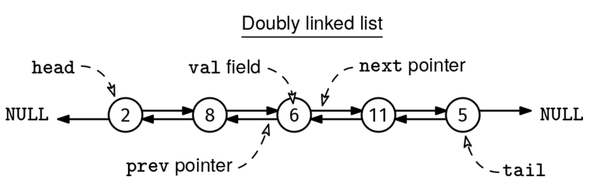

Implement a DoublyLinkedList class with the following methods:

push_front(v):
    Adds a node with value v at the beginning of the list.

pop_front():
    Removes the node at the beginning of the list and returns its value.
    If the list is empty, returns None.

push_back(v):
    Adds a node with value v at the end of the list.

pop_back():
    Removes the node at the end of the list and returns its value.
    If the list is empty, returns None.

size():
    Returns the number of nodes in the list.

contains(v):
    Return the first node with value v, if any, or null otherwise.
Here are some examples:

Example 1:
list = DoublyLinkedList()
list.push_front(1)  # List is now: 1
list.push_front(2)  # List is now: 2<->1
list.push_back(3)   # List is now: 2<->1<->3
list.contains(2)    # Returns node with value 2
list.contains(4)    # Returns None (value not found)
list.size()         # Returns 3
list.pop_front()    # Returns 2, list is now: 1<->3
list.pop_back()     # Returns 3, list is now: 1

Example 2:
list = DoublyLinkedList()
list.pop_front()    # Returns None (empty list)
list.pop_back()     # Returns None (empty list)
list.size()         # Returns 0
This diagram shows the typical structure of a doubly linked list:

The push_front(), pop_front(), push_back(), pop_back(), and size() methods should all take O(1) time.

Constraints:

You have to create the Node class with a val field and prev and next pointers. If your language is typed, you can either make the type of val be generic or integer.
The list can contain up to 10^5 nodes.
See Solution
Problem 34.2 - Doubly Linked List Design: Solution
Python
Our node class looks like this. It includes both prev and next pointers:

class Node:
  def __init__(self, val):
    self.val = val
    self.next = None
    self.prev = None
Our doubly linked list class has three fields:

a node representing the head of the list
a node representing the tail of the list
a node counter, size, so that we don't need to iterate through the list to find the size
Here is how we can implement the methods:

push_front(v):

Create a new node with the new value
If the list is empty (head is None), set both head and tail to the new node
Otherwise, set the new node's next pointer to the current head, set the current head's prev pointer to the new node, and update the head to point to the new node
Increment the size variable by one
pop_front():

Check if the head is already None (i.e., the list is empty). If it is, we can return None and exit early
Save the value of the head node so we can return it later
Update head to point to head.next
If the new head is None (i.e., there was only one node in the list), also set tail to None. Otherwise, set the new head's prev pointer to None
If the language is not garbage collected (like in C++), don't forget to delete the removed node to avoid memory leaks
Decrement the size variable by one
Return the saved value
push_back(v): Adding a new node to the end is efficient because we maintain a tail pointer.

Create a new node with the new value
If the list is empty (tail is None), set both head and tail to the new node
Otherwise, set the new node's prev pointer to the current tail, set the current tail's next pointer to the new node, and update the tail to point to the new node
Increment the size variable by one
pop_back(): Removing the last node is efficient because we can access the second-to-last node through the tail's prev pointer.

Check if the tail is already None (i.e., the list is empty). If it is, we can return None and exit early
Save the value of the tail node so we can return it later
Update tail to point to tail.prev
If the new tail is None (i.e., there was only one node in the list), also set head to None. Otherwise, set the new tail's next pointer to None
If the language is not garbage collected (like in C++), don't forget to delete the removed node to avoid memory leaks
Decrement the size variable by one
Return the saved value
contains(v): we traverse the list to check for a given value.

size(): we return the size field.

The key advantage of doubly linked lists over singly linked lists is that both push_back() and pop_back() operations can be performed in O(1) time because we maintain a tail pointer and can navigate backwards using prev pointers.

Here is the implementation:

class DoublyLinkedList:
  def __init__(self):
    self.head = None
    self.tail = None
    self._size = 0

  def size(self):
    return self._size

  def push_front(self, val):
    new = Node(val)
    if not self.head:
      self.head = self.tail = new
    else:
      new.next = self.head
      self.head.prev = new
      self.head = new
    self._size += 1

  def pop_front(self):
    if not self.head:
      return None
    val = self.head.val
    self.head = self.head.next
    if self.head:
      self.head.prev = None
    else:
      self.tail = None
    self._size -= 1
    return val

  def push_back(self, val):
    new = Node(val)
    if not self.tail:
      self.head = self.tail = new
    else:
      new.prev = self.tail
      self.tail.next = new
      self.tail = new
    self._size += 1

  def pop_back(self):
    if not self.tail:
      return None
    val = self.tail.val
    self.tail = self.tail.prev
    if self.tail:
      self.tail.next = None
    else:
      self.head = None
    self._size -= 1
    return val

  def contains(self, val):
    cur = self.head
    while cur:
      if cur.val == val:
        return cur
      cur = cur.next
    return None
Time & Space Analysis
n: the number of nodes in the doubly linked list
Push front, pop front, push back, pop back, and size:

Time: O(1) - these operations only involve a constant number of pointer manipulations.
Contains:

Time: O(n) - we may need to traverse the entire list to find a value.
Data structure size:

Space: O(n) - each node takes O(1) space.
Tests
Here are some test cases to verify the solution:

def run_tests():
  dll = DoublyLinkedList()

  # Test size on empty list
  assert dll.size() == 0, f"\nsize(): got: {dll.size()}, want: 0\n"

  # Test pop_front on empty list
  assert dll.pop_front() is None, "\npop_front() on empty list should return None\n"

  # Test pop_back on empty list
  assert dll.pop_back() is None, "\npop_back() on empty list should return None\n"

  # Test push_front and size
  dll.push_front(10)
  assert dll.size() == 1, f"\nsize(): got: {dll.size()}, want: 1\n"

  # Test push_back and size
  dll.push_back(20)
  assert dll.size() == 2, f"\nsize(): got: {dll.size()}, want: 2\n"

  # Test contains
  assert dll.contains(10) is not None, "\ncontains(10) should find the node\n"
  assert dll.contains(30) is None, "\ncontains(30) should not find the node\n"

  # Test pop_front
  assert dll.pop_front() == 10, "\npop_front() should return 10\n"
  assert dll.size() == 1, f"\nsize(): got: {dll.size()}, want: 1\n"

  # Test pop_back
  assert dll.pop_back() == 20, "\npop_back() should return 20\n"
  assert dll.size() == 0, f"\nsize(): got: {dll.size()}, want: 0\n"

  # Test push_back and pop_back
  dll.push_back(30)
  assert dll.pop_back() == 30, "\npop_back() should return 30\n"

  # Test push_front and pop_front
  dll.push_front(40)
  assert dll.pop_front() == 40, "\npop_front() should return 40\n"

run_tests()

class Node {
  constructor(val) {
    this.val = val;
    this.next = null;
    this.prev = null;
  }
}

class DoublyLinkedList {
  constructor() {
    this.head = null;
    this.tail = null;
    this._size = 0;
  }

  size() {
    return this._size;
  }

  pushFront(val) {
    const newNode = new Node(val);
    if (!this.head) {
      this.head = this.tail = newNode;
    } else {
      newNode.next = this.head;
      this.head.prev = newNode;
      this.head = newNode;
    }
    this._size++;
  }

  popFront() {
    if (!this.head) {
      return null;
    }
    const val = this.head.val;
    this.head = this.head.next;
    if (this.head) {
      this.head.prev = null;
    } else {
      this.tail = null;
    }
    this._size--;
    return val;
  }

  pushBack(val) {
    const newNode = new Node(val);
    if (!this.tail) {
      this.head = this.tail = newNode;
    } else {
      newNode.prev = this.tail;
      this.tail.next = newNode;
      this.tail = newNode;
    }
    this._size++;
  }

  popBack() {
    if (!this.tail) {
      return null;
    }
    const val = this.tail.val;
    this.tail = this.tail.prev;
    if (this.tail) {
      this.tail.next = null;
    } else {
      this.head = null;
    }
    this._size--;
    return val;
  }

  contains(val) {
    let cur = this.head;
    while (cur) {
      if (cur.val === val) {
        return cur;
      }
      cur = cur.next;
    }
    return null;
  }
}
Time & Space Analysis
n: the number of nodes in the doubly linked list
Push front, pop front, push back, pop back, and size:

Time: O(1) - these operations only involve a constant number of pointer manipulations.
Contains:

Time: O(n) - we may need to traverse the entire list to find a value.
Data structure size:

Space: O(n) - each node takes O(1) space.
Tests
Here are some test cases to verify the solution:

function runTests() {
  const dll = new DoublyLinkedList();

  // Test size on empty list
  if (dll.size() !== 0) {
    throw new Error(`\nsize(): got: ${dll.size()}, want: 0\n`);
  }

  // Test pop_front on empty list
  if (dll.popFront() !== null) {
    throw new Error("\npopFront() on empty list should return null\n");
  }

  // Test pop_back on empty list
  if (dll.popBack() !== null) {
    throw new Error("\npopBack() on empty list should return null\n");
  }

  // Test push_front and size
  dll.pushFront(10);
  if (dll.size() !== 1) {
    throw new Error(`\nsize(): got: ${dll.size()}, want: 1\n`);
  }

  // Test push_back and size
  dll.pushBack(20);
  if (dll.size() !== 2) {
    throw new Error(`\nsize(): got: ${dll.size()}, want: 2\n`);
  }

  // Test contains
  if (dll.contains(10) === null) {
    throw new Error("\ncontains(10) should find the node\n");
  }
  if (dll.contains(30) !== null) {
    throw new Error("\ncontains(30) should not find the node\n");
  }

  // Test pop_front
  if (dll.popFront() !== 10) {
    throw new Error("\npopFront() should return 10\n");
  }
  if (dll.size() !== 1) {
    throw new Error(`\nsize(): got: ${dll.size()}, want: 1\n`);
  }

  // Test pop_back
  if (dll.popBack() !== 20) {
    throw new Error("\npopBack() should return 20\n");
  }
  if (dll.size() !== 0) {
    throw new Error(`\nsize(): got: ${dll.size()}, want: 0\n`);
  }

  // Test push_back and pop_back
  dll.pushBack(30);
  if (dll.popBack() !== 30) {
    throw new Error("\npopBack() should return 30\n");
  }

  // Test push_front and pop_front
  dll.pushFront(40);
  if (dll.popFront() !== 40) {
    throw new Error("\npopFront() should return 40\n");
  }
}

runTests();

class Node {
  int val;
  Node next;
  Node prev;

  Node(int x) {
    val = x;
    next = null;
    prev = null;
  }
}
Our doubly linked list class has three fields:

a node representing the head of the list
a node representing the tail of the list
a node counter, size, so that we don't need to iterate through the list to find the size
Here is how we can implement the methods:

push_front(v):

Create a new node with the new value
If the list is empty (head is None), set both head and tail to the new node
Otherwise, set the new node's next pointer to the current head, set the current head's prev pointer to the new node, and update the head to point to the new node
Increment the size variable by one
pop_front():

Check if the head is already None (i.e., the list is empty). If it is, we can return None and exit early
Save the value of the head node so we can return it later
Update head to point to head.next
If the new head is None (i.e., there was only one node in the list), also set tail to None. Otherwise, set the new head's prev pointer to None
If the language is not garbage collected (like in C++), don't forget to delete the removed node to avoid memory leaks
Decrement the size variable by one
Return the saved value
push_back(v): Adding a new node to the end is efficient because we maintain a tail pointer.

Create a new node with the new value
If the list is empty (tail is None), set both head and tail to the new node
Otherwise, set the new node's prev pointer to the current tail, set the current tail's next pointer to the new node, and update the tail to point to the new node
Increment the size variable by one
pop_back(): Removing the last node is efficient because we can access the second-to-last node through the tail's prev pointer.

Check if the tail is already None (i.e., the list is empty). If it is, we can return None and exit early
Save the value of the tail node so we can return it later
Update tail to point to tail.prev
If the new tail is None (i.e., there was only one node in the list), also set head to None. Otherwise, set the new tail's next pointer to None
If the language is not garbage collected (like in C++), don't forget to delete the removed node to avoid memory leaks
Decrement the size variable by one
Return the saved value
contains(v): we traverse the list to check for a given value.

size(): we return the size field.

The key advantage of doubly linked lists over singly linked lists is that both push_back() and pop_back() operations can be performed in O(1) time because we maintain a tail pointer and can navigate backwards using prev pointers.

Here is the implementation:

class DoublyLinkedList {
  private Node head;
  private Node tail;
  private int size;

  public DoublyLinkedList() {
    head = null;
    tail = null;
    size = 0;
  }

  public int size() {
    return size;
  }

  public void pushFront(int val) {
    Node newNode = new Node(val);
    if (head == null) {
      head = tail = newNode;
    } else {
      newNode.next = head;
      head.prev = newNode;
      head = newNode;
    }
    size++;
  }

  public Integer popFront() {
    if (head == null) {
      return null;
    }
    int val = head.val;
    head = head.next;
    if (head != null) {
      head.prev = null;
    } else {
      tail = null;
    }
    size--;
    return val;
  }

  public void pushBack(int val) {
    Node newNode = new Node(val);
    if (tail == null) {
      head = tail = newNode;
    } else {
      newNode.prev = tail;
      tail.next = newNode;
      tail = newNode;
    }
    size++;
  }

  public Integer popBack() {
    if (tail == null) {
      return null;
    }
    int val = tail.val;
    tail = tail.prev;
    if (tail != null) {
      tail.next = null;
    } else {
      head = null;
    }
    size--;
    return val;
  }

  public Node contains(int val) {
    Node cur = head;
    while (cur != null) {
      if (cur.val == val)
        return cur;
      cur = cur.next;
    }
    return null;
  }
}
Time & Space Analysis
n: the number of nodes in the doubly linked list
Push front, pop front, push back, pop back, and size:

Time: O(1) - these operations only involve a constant number of pointer manipulations.
Contains:

Time: O(n) - we may need to traverse the entire list to find a value.
Data structure size:

Space: O(n) - each node takes O(1) space.
Tests
Here are some test cases to verify the solution:

class RunTests {
  public void runTests() {
    DoublyLinkedList list = new DoublyLinkedList();

    // Test empty list
    if (list.size() != 0) {
      throw new RuntimeException(String.format(
          "\nsize(): got: %d, want: 0\n", list.size()));
    }

    if (list.popFront() != null) {
      throw new RuntimeException("\npopFront(): got value, want: null\n");
    }

    if (list.popBack() != null) {
      throw new RuntimeException("\npopBack(): got value, want: null\n");
    }

    // Test push_front
    list.pushFront(10);
    list.pushBack(20);
    if (list.size() != 2) {
      throw new RuntimeException(String.format(
          "\nsize(): got: %d, want: 2\n", list.size()));
    }
    if (list.contains(10) == null) {
      throw new RuntimeException("\ncontains(10): got: false, want: true\n");
    }
    if (list.contains(20) == null) {
      throw new RuntimeException("\ncontains(20): got: false, want: true\n");
    }

    // Test pop_front
    Integer val = list.popFront();
    if (val == null || val != 10) {
      throw new RuntimeException(String.format(
          "\npopFront(): got: %s, want: 10\n", val == null ? "null" : val));
    }
    if (list.size() != 1) {
      throw new RuntimeException(String.format(
          "\nsize(): got: %d, want: 1\n", list.size()));
    }
    if (list.contains(10) != null) {
      throw new RuntimeException("\ncontains(10): got: true, want: false\n");
    }

    // Test pop_back
    val = list.popBack();
    if (val == null || val != 20) {
      throw new RuntimeException(String.format(
          "\npopBack(): got: %s, want: 20\n", val == null ? "null" : val));
    }
    if (list.size() != 0) {
      throw new RuntimeException(String.format(
          "\nsize(): got: %d, want: 0\n", list.size()));
    }
    if (list.contains(20) != null) {
      throw new RuntimeException("\ncontains(20): got: true, want: false\n");
    }

    // Test multiple operations
    list.pushBack(30);
    list.pushFront(40);
    if (list.size() != 2) {
      throw new RuntimeException(String.format(
          "\nsize(): got: %d, want: 2\n", list.size()));
    }

    val = list.popFront();
    if (val == null || val != 40) {
      throw new RuntimeException(String.format(
          "\npopFront(): got: %s, want: 40\n", val == null ? "null" : val));
    }

    val = list.popBack();
    if (val == null || val != 30) {
      throw new RuntimeException(String.format(
          "\npopBack(): got: %s, want: 30\n", val == null ? "null" : val));
    }

    if (list.size() != 0) {
      throw new RuntimeException(String.format(
          "\nsize(): got: %d, want: 0\n", list.size()));
    }
  }
}

public class Solution {
  public static void main(String[] args) {
    new RunTests().runTests();
  }
}