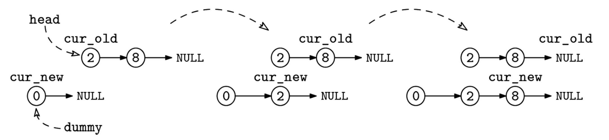

Given the head, head, of a singly linked list, return a new list with the same values. The list may be empty.

Example 1:
Input: 1 -> 2 -> 3 -> null
Output: 1 -> 2 -> 3 -> null

Example 2:
Input: null
Output: null

Example 3:
Input: 1 -> null
Output: 1 -> null
Constraints:

You have to create the Node class with an integer val field and a next pointer.
The list can contain up to 10^5 nodes.
See Solution
Problem 34.5 - Linked-List Copy: Solution
Python
The central idea is to use two pointers, one to iterate through the original list and one to iterate through the new list.

It just requires special handling for the case where the head is null:

class Node:
  def __init__(self, val):
    self.val = val
    self.next = None

def copy_list(head):
  if not head:
    return None
  new_head = Node(head.val)
  cur_new = new_head
  cur_old = head.next
  while cur_old:
    cur_new.next = Node(cur_old.val)
    cur_new = cur_new.next
    cur_old = cur_old.next
  return new_head
Dummy node approach
This question isn't particularly difficult, but it shows how we can use a dummy node to simplify the logic. In this case, it helps to create a dummy node to start the output list. Whether the input list is empty or not, it's safe to initialize the output list this way, eliminating the need to check for an empty input list.

Here is the implementation:

def copy_list_with_dummy(head):
  dummy = Node(0)  # New list's dummy head
  cur_new = dummy
  cur_old = head
  while cur_old:
    cur_new.next = Node(cur_old.val)
    cur_new = cur_new.next
    cur_old = cur_old.next
  return dummy.next

Time & Space Analysis
n: the number of nodes in the linked list

Time: O(n) - we traverse the linked list once.

Extra space: O(n) - we create a new copy of the entire linked list.

Tests
Here are some test cases to verify the solution:

def run_tests():

  def linked_list_to_array(head):
    result = []
    current = head
    while current:
      result.append(current.val)
      current = current.next
    return result

  def array_to_linked_list(arr):
    dummy = Node(0)
    current = dummy
    for val in arr:
      current.next = Node(val)
      current = current.next
    return dummy.next
  
  # Test cases
  tests = [
      # Test empty list
      [],
      # Test single element list
      [1],
      # Test multiple elements list
      [1, 2, 3],
      # Test list with repeated values
      [1, 1, 1],
      # Test list with negative values
      [-1, -2, -3],
      # Test list with zero
      [0],
      # Test longer list
      [1, 2, 3, 4, 5],
      # Test list with mixed values
      [-1, 0, 1],
  ]

  for i, arr in enumerate(tests):
    head = array_to_linked_list(arr)

    # Test first copy_list function
    copied_head_1 = copy_list(head)
    got_1 = linked_list_to_array(copied_head_1)
    assert got_1 == arr, f"\nTest {
        i + 1} (copy_list 1): got: {got_1}, want: {arr}\n"

    # Test second copy_list function
    copied_head_2 = copy_list_with_dummy(head)
    got_2 = linked_list_to_array(copied_head_2)
    assert got_2 == arr, f"\nTest {
        i + 1} (copy_list 2): got: {got_2}, want: {arr}\n"

run_tests()

class Node {
  constructor(val = 0, next = null) {
    this.val = val;
    this.next = next;
  }
}

function copyList(head) {
  if (!head) {
    return null;
  }
  const newHead = new Node(head.val);
  let curNew = newHead;
  let curOld = head.next;
  while (curOld) {
    curNew.next = new Node(curOld.val);
    curNew = curNew.next;
    curOld = curOld.next;
  }
  return newHead;
}
Dummy node approach
This question isn't particularly difficult, but it shows how we can use a dummy node to simplify the logic. In this case, it helps to create a dummy node to start the output list. Whether the input list is empty or not, it's safe to initialize the output list this way, eliminating the need to check for an empty input list.

Here is the implementation:

function copyListWithDummy(head) {
  const dummy = new Node(0);
  let curNew = dummy;
  let curOld = head;
  while (curOld) {
    curNew.next = new Node(curOld.val);
    curNew = curNew.next;
    curOld = curOld.next;
  }
  return dummy.next;
}
Linked list copy
Time & Space Analysis
n: the number of nodes in the linked list

Time: O(n) - we traverse the linked list once.

Extra space: O(n) - we create a new copy of the entire linked list.

Tests
Here are some test cases to verify the solution:

function runTests() {
  function arrayToLinkedList(arr) {
    const dummy = new Node(0);
    let current = dummy;
    for (let i = 0; i < arr.length; i++) {
      current.next = new Node(arr[i]);
      current = current.next;
    }
    return dummy.next;
  }

  function linkedListToArray(head) {
    const result = [];
    let current = head;
    while (current) {
      result.push(current.val);
      current = current.next;
    }
    return result;
  }
  const tests = [
    // Test empty list
    [],
    // Test single element list
    [1],
    // Test multiple elements list
    [1, 2, 3],
    // Test list with repeated values
    [1, 1, 1],
    // Test list with negative values
    [-1, -2, -3],
    // Test list with zero
    [0],
    // Test longer list
    [1, 2, 3, 4, 5],
    // Test list with mixed values
    [-1, 0, 1],
  ];

  for (let i = 0; i < tests.length; i++) {
    const arr = tests[i];
    const head = arrayToLinkedList(arr);

    // Test first copyList function
    const copiedHead1 = copyList(head);
    const got1 = linkedListToArray(copiedHead1);
    if (JSON.stringify(got1) !== JSON.stringify(arr)) {
      throw new Error(
        `\nTest ${i + 1} (copyList 1): got: ${got1}, want: ${arr}\n`,
      );
    }

    // Test second copyList function
    const copiedHead2 = copyListWithDummy(head);
    const got2 = linkedListToArray(copiedHead2);
    if (JSON.stringify(got2) !== JSON.stringify(arr)) {
      throw new Error(
        `\nTest ${i + 1} (copyList 2): got: ${got2}, want: ${arr}\n`,
      );
    }
  }
}

runTests();

class Node {
  int val;
  Node next;

  Node(int x) {
    val = x;
    next = null;
  }
}

class CopyList {
  public Node solve(Node head) {
    if (head == null)
      return null;
    Node newHead = new Node(head.val);
    Node curNew = newHead;
    Node curOld = head.next;
    while (curOld != null) {
      curNew.next = new Node(curOld.val);
      curNew = curNew.next;
      curOld = curOld.next;
    }
    return newHead;
  }
}
Dummy node approach
This question isn't particularly difficult, but it shows how we can use a dummy node to simplify the logic. In this case, it helps to create a dummy node to start the output list. Whether the input list is empty or not, it's safe to initialize the output list this way, eliminating the need to check for an empty input list.

Here is the implementation:

class CopyListWithDummy {
  public Node solve(Node head) {
    Node dummy = new Node(0); // New list's dummy head
    Node curNew = dummy;
    Node curOld = head;
    while (curOld != null) {
      curNew.next = new Node(curOld.val);
      curNew = curNew.next;
      curOld = curOld.next;
    }
    return dummy.next;
  }
}
Linked list copy
Time & Space Analysis
n: the number of nodes in the linked list

Time: O(n) - we traverse the linked list once.

Extra space: O(n) - we create a new copy of the entire linked list.

Tests
Here are some test cases to verify the solution:

class RunTests {
  private Node arrayToLinkedList(int[] arr) {
    Node dummy = new Node(0);
    Node cur = dummy;
    for (int i = 0; i < arr.length; i++) {
      cur.next = new Node(arr[i]);
      cur = cur.next;
    }
    return dummy.next;
  }

  private List<Integer> linkedListToList(Node head) {
    List<Integer> result = new ArrayList<>();
    Node cur = head;
    while (cur != null) {
      result.add(cur.val);
      cur = cur.next;
    }
    return result;
  }

  public void runTests() {
    int[][] tests = {
        // Test empty list
        {},
        // Test single element list
        { 1 },
        // Test multiple elements list
        { 1, 2, 3 },
        // Test list with repeated values
        { 1, 1, 1 },
        // Test list with negative values
        { -1, -2, -3 },
        // Test list with zero
        { 0 },
        // Test longer list
        { 1, 2, 3, 4, 5 },
        // Test list with mixed values
        { -1, 0, 1 },
    };

    CopyList solution1 = new CopyList();
    CopyListWithDummy solution2 = new CopyListWithDummy();

    for (int i = 0; i < tests.length; i++) {
      int[] arr = tests[i];
      Node head = arrayToLinkedList(arr);

      // Test first copyList function
      Node copiedHead1 = solution1.solve(head);
      List<Integer> got1 = linkedListToList(copiedHead1);
      List<Integer> want = new ArrayList<>();
      for (int w : arr)
        want.add(w);

      if (!got1.equals(want)) {
        throw new RuntimeException(String.format(
            "\nTest %d (copyList 1): got: %s, want: %s\n",
            i + 1, got1, want));
      }

      // Test second copyList function
      Node copiedHead2 = solution2.solve(head);
      List<Integer> got2 = linkedListToList(copiedHead2);

      if (!got2.equals(want)) {
        throw new RuntimeException(String.format(
            "\nTest %d (copyList 2): got: %s, want: %s\n",
            i + 1, got2, want));
      }
    }
  }
}

public class Solution {
  public static void main(String[] args) {
    new RunTests().runTests();
  }
}
