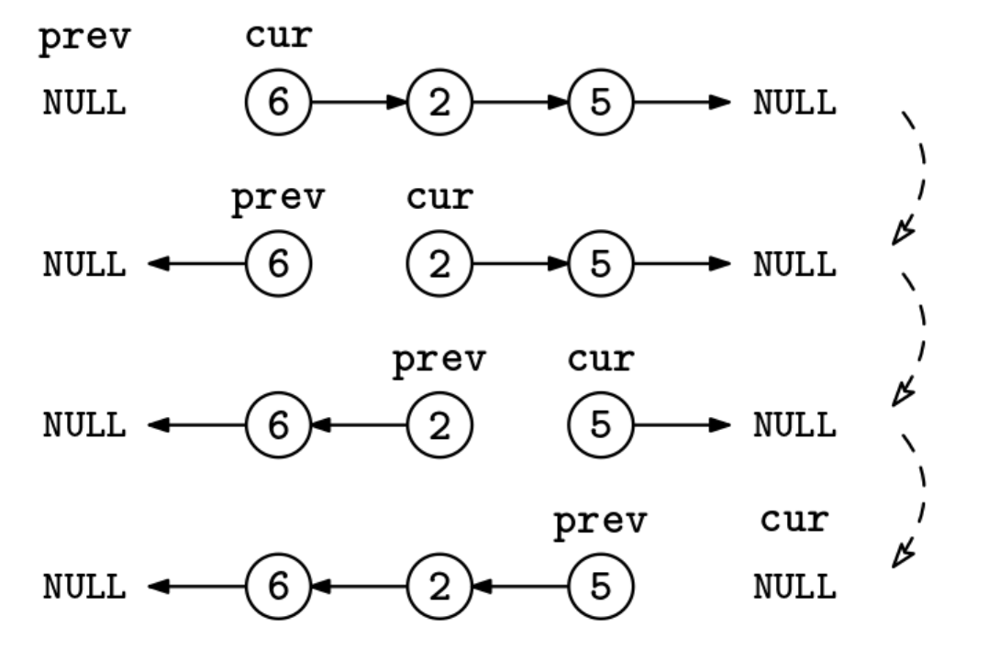

Given the head, head, of a singly linked list, reverse the nodes in place and return the new head of the list. The list may be empty.

Example 1:
Input: 1 -> 2 -> 3 -> null
Output: 3 -> 2 -> 1 -> null

Example 2:
Input: null
Output: null

Example 3:
Input: 1 -> null
Output: 1 -> null
Constraints:

You have to create the Node class with an integer val field and a next pointer.
The list can contain up to 10^5 nodes.
See Solution
Problem 34.6 - Linked-List Reversal: Solution
Python
We can reverse one edge at a time. We iterate through the list with two pointers: cur, which points to the current node we are reversing, and prev, which points to the previous node in the original list. At each iteration, we need to:

Store the pointer of cur.next so it doesn't become unreachable,
flip cur.next to point to prev, and
advance prev and cur.
At the end, prev is the new head.

Here is the implementation:

class Node:
  def __init__(self, val):
    self.val = val
    self.next = None

def reverse_list(head):
  prev = None
  cur = head
  while cur:
    nxt = cur.next
    cur.next = prev
    prev = cur
    cur = nxt
  return prev
By itself, this isn't a particularly challenging problem, but this technique can be used in more challenging questions like the Sublist Reversal problem.

Time & Space Analysis
n: the number of nodes in the linked list

Time: O(n) - we traverse the linked list once.

Extra space: O(1) - we only use a constant number of pointers regardless of the input size.

Tests
Here are some test cases to verify the solution:

def run_tests():

  def linked_list_to_array(head):
    result = []
    current = head
    while current:
      result.append(current.val)
      current = current.next
    return result

  def array_to_linked_list(arr):
    dummy_head = Node(0)
    current = dummy_head
    for val in arr:
      current.next = Node(val)
      current = current.next
    return dummy_head.next

  # Test cases
  tests = [
      # Test empty list
      ([], []),
      # Test single element list
      ([1], [1]),
      # Test multiple elements list
      ([1, 2, 3], [3, 2, 1]),
      # Test list with repeated values
      ([1, 1, 1], [1, 1, 1]),
      # Test list with negative values
      ([-1, -2, -3], [-3, -2, -1]),
      # Test list with zero
      ([0], [0]),
      # Test longer list
      ([1, 2, 3, 4, 5], [5, 4, 3, 2, 1]),
      # Test list with mixed values
      ([-1, 0, 1], [1, 0, -1]),
  ]

  for i, (arr, expected) in enumerate(tests):
    head = array_to_linked_list(arr)
    reversed_head = reverse_list(head)
    got = linked_list_to_array(reversed_head)
    assert got == expected, f"\nTest {i + 1}: got: {got}, want: {expected}\n"

run_tests()
class Node {
  constructor(val = 0, next = null) {
    this.val = val;
    this.next = next;
  }
}

function reverseList(head) {
  let prev = null;
  let cur = head;
  while (cur) {
    const nxt = cur.next;
    cur.next = prev;
    prev = cur;
    cur = nxt;
  }
  return prev;
}
By itself, this isn't a particularly challenging problem, but this technique can be used in more challenging questions like the Sublist Reversal problem.

Time & Space Analysis
n: the number of nodes in the linked list

Time: O(n) - we traverse the linked list once.

Extra space: O(1) - we only use a constant number of pointers regardless of the input size.

Tests
Here are some test cases to verify the solution:

function runTests() {
  function arrayToLinkedList(arr) {
    const dummy = new Node(0);
    let current = dummy;
    for (let i = 0; i < arr.length; i++) {
      current.next = new Node(arr[i]);
      current = current.next;
    }
    return dummy.next;
  }

  function linkedListToArray(head) {
    const result = [];
    let current = head;
    while (current) {
      result.push(current.val);
      current = current.next;
    }
    return result;
  }

  // Test cases
  const tests = [
    // Test empty list
    [[], []],
    // Test single element list
    [[1], [1]],
    // Test multiple elements list
    [
      [1, 2, 3],
      [3, 2, 1],
    ],
    // Test list with repeated values
    [
      [1, 1, 1],
      [1, 1, 1],
    ],
    // Test list with negative values
    [
      [-1, -2, -3],
      [-3, -2, -1],
    ],
    // Test list with zero
    [[0], [0]],
    // Test longer list
    [
      [1, 2, 3, 4, 5],
      [5, 4, 3, 2, 1],
    ],
    // Test list with mixed values
    [
      [-1, 0, 1],
      [1, 0, -1],
    ],
  ];

  for (let i = 0; i < tests.length; i++) {
    const [arr, expected] = tests[i];
    const head = arrayToLinkedList(arr);
    const reversedHead = reverseList(head);
    const got = linkedListToArray(reversedHead);
    if (JSON.stringify(got) !== JSON.stringify(expected)) {
      throw new Error(
        `\nreverseList(${JSON.stringify(arr)}): got: ${JSON.stringify(got)}, want: ${JSON.stringify(expected)}\n`,
      );
    }
  }
}

runTests();

class Node {
  int val;
  Node next;

  Node(int x) {
    val = x;
    next = null;
  }
}

class ReverseList {
  public Node solve(Node head) {
    Node prev = null;
    Node cur = head;
    while (cur != null) {
      Node nxt = cur.next;
      cur.next = prev;
      prev = cur;
      cur = nxt;
    }
    return prev;
  }
}
By itself, this isn't a particularly challenging problem, but this technique can be used in more challenging questions like the Sublist Reversal problem.

Time & Space Analysis
n: the number of nodes in the linked list

Time: O(n) - we traverse the linked list once.

Extra space: O(1) - we only use a constant number of pointers regardless of the input size.

Tests
Here are some test cases to verify the solution:

class RunTests {
  private Node arrayToLinkedList(int[] arr) {
    Node dummy = new Node(0);
    Node current = dummy;
    for (int i = 0; i < arr.length; i++) {
      current.next = new Node(arr[i]);
      current = current.next;
    }
    return dummy.next;
  }

  private List<Integer> linkedListToList(Node head) {
    List<Integer> result = new ArrayList<>();
    Node cur = head;
    while (cur != null) {
      result.add(cur.val);
      cur = cur.next;
    }
    return result;
  }

  public void runTests() {
    Object[][] tests = {
        // Test empty list
        { new int[] {}, new int[] {} },
        // Test single element list
        { new int[] { 1 }, new int[] { 1 } },
        // Test multiple elements list
        { new int[] { 1, 2, 3 }, new int[] { 3, 2, 1 } },
        // Test list with repeated values
        { new int[] { 1, 1, 1 }, new int[] { 1, 1, 1 } },
        // Test list with negative values
        { new int[] { -1, -2, -3 }, new int[] { -3, -2, -1 } },
        // Test list with zero
        { new int[] { 0 }, new int[] { 0 } },
        // Test longer list
        { new int[] { 1, 2, 3, 4, 5 }, new int[] { 5, 4, 3, 2, 1 } },
        // Test list with mixed values
        { new int[] { -1, 0, 1 }, new int[] { 1, 0, -1 } },
    };

    ReverseList solution = new ReverseList();
    for (int i = 0; i < tests.length; i++) {
      int[] input = (int[]) tests[i][0];
      int[] want = (int[]) tests[i][1];
      Node head = arrayToLinkedList(input);
      Node reversedHead = solution.solve(head);
      List<Integer> got = linkedListToList(reversedHead);
      List<Integer> wantList = new ArrayList<>();
      for (int w : want)
        wantList.add(w);

      if (!got.equals(wantList)) {
        throw new RuntimeException(String.format(
            "\nTest %d: got: %s, want: %s\n",
            i + 1, got, wantList));
      }
    }
  }
}

public class Solution {
  public static void main(String[] args) {
    new RunTests().runTests();
  }
}

