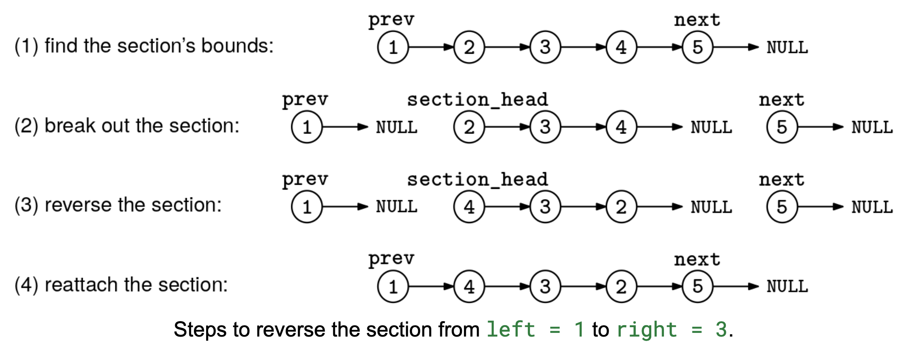

Given the head, head, of a singly linked list, and two indices, left and right, with 0 ≤ left < right, reverse all nodes between the two indices in place and return the new head of the list.

If left is beyond the last index, do not modify the list. If only right is beyond the last index, reverse everything up to the last node.

Example 1:
head = 1 -> 2 -> 3 -> 4 -> 5 -> null
left = 1
right = 3

Output: 1 -> 4 -> 3 -> 2 -> 5 -> null
The first node (index 0) and the last node (index 4) stay the same

Example 2:
head = 1 -> 2 -> 3 -> 4 -> 5 -> null
left = 2
right = 7

Output: 1 -> 2 -> 5 -> 4 -> 3 -> null
All nodes starting at index 2 are reversed because index 7 is beyond
the last index

Example 3:
head = 1 -> 2 -> null
left = 5
right = 6

Output: 1 -> 2 -> null
left is out of bounds, so we leave the list untouched
Constraints:

You have to create the Node class with an integer val field and a next pointer.
The list can contain up to 10^5 nodes.
See Solution
Problem 34.7 - Sublist Reversal: Solution
Python
If a problem asks to reverse only a part of a linked list, we can use the break down the problem booster and do it in steps:

Find the bounds of the section that need to be reversed.
Break that section out of the linked list without losing the before/after parts of the list.
Reverse the section.
Reattach the section.
You can see this process in the figure below:

Here is the implementation:

class Node:
  def __init__(self, val):
    self.val = val
    self.next = None

def node_at_index(head, index):
  """
  Retrieves the node at the specified zero-based index.
  Returns None if:
  - The index is negative.
  - The index is out of bounds (greater than or equal to the list length).
  - The linked list is empty (head is None).
  Iterates through the list, returning the node when the index matches.
  """
  if index < 0:
      # Invalid index
    return None

  cur = head
  i = 0

  while cur:
    if i == index:
      return cur
    cur = cur.next
    i += 1

  # If we traverse the whole list and don't find the index
  return None

def reverse_list(head):
  prev = None
  cur = head
  while cur:
    nxt = cur.next
    cur.next = prev
    prev = cur
    cur = nxt
  return prev

def reverse_section(head, left, right):
  dummy = Node(0)
  dummy.next = head

  # Step 1: find the nodes BEFORE and AFTER the section.
  if left == 0:
    prev = dummy
  else:
    prev = node_at_index(head, left - 1)
  if not prev or not prev.next:
    # Nothing to reverse.
    return head
  nxt = node_at_index(head, right + 1)  # May be None.

  # Step 2: break out the section.
  section_head = prev.next
  prev.next = None
  section_tail = section_head
  while section_tail.next != nxt:
    section_tail = section_tail.next
  section_tail.next = None

  # Step 3: reverse section.
  old_section_head = section_head
  new_section_head = reverse_list(section_head)

  # Step 4: reattach the section.
  prev.next = new_section_head
  old_section_head.next = nxt

  return dummy.next
Time & Space Analysis
n: the number of nodes in the linked list

Time: O(n) - we traverse the linked list to find the left and right boundaries, then reverse the sublist.

Extra space: O(1) - we only use a constant number of pointers regardless of the input size.

Tests
Here are some test cases to verify the solution:

def run_tests():

  def linked_list_to_array(head):
    result = []
    current = head
    while current:
      result.append(current.val)
      current = current.next
    return result

  def array_to_linked_list(arr):
    dummy = Node(0)
    current = dummy
    for val in arr:
      current.next = Node(val)
      current = current.next
    return dummy.next

  # Test cases
  tests = [
      # From book
      ([1, 2, 3, 4, 5], 1, 3, [1, 4, 3, 2, 5]),
      ([1, 2, 3, 4, 5], 2, 7, [1, 2, 5, 4, 3]),
      ([1, 2], 5, 6, [1, 2]),

      # Test empty list
      ([], 0, 1, []),
      # Test single element list
      ([1], 0, 1, [1]),
      # Test reversing entire list
      ([1, 2, 3], 0, 3, [3, 2, 1]),
      # Test reversing sublist with repeated values
      ([1, 1, 1, 2, 2], 1, 3, [1, 2, 1, 1, 2]),
      # Test reversing sublist with negative values
      ([-1, -2, -3, -4], 1, 3, [-1, -4, -3, -2]),
      # Test reversing sublist with zero
      ([0, 1, 2], 0, 1, [1, 0, 2]),
      # Test reversing sublist at the end
      ([1, 2, 3, 4, 5], 2, 4, [1, 2, 5, 4, 3]),
      # Test left beyond list length - should not modify
      ([1, 2, 3], 4, 5, [1, 2, 3]),
      # Test right beyond list length - reverse to end
      ([1, 2, 3], 1, 5, [1, 3, 2]),
  ]

  for i, (arr, left, right, expected) in enumerate(tests):
    head = array_to_linked_list(arr)
    reversed_head = reverse_section(head, left, right)
    got = linked_list_to_array(reversed_head)
    assert got == expected, f"\nTest {i + 1}: got: {got}, want: {expected}\n"

run_tests()
class Node {
  constructor(val = 0, next = null) {
    this.val = val;
    this.next = next;
  }
}

function nodeAtIndex(head, index) {
  /*
    Retrieves the node at the specified zero-based index.
    Returns null if:
    - The index is negative.
    - The index is out of bounds (greater than or equal to the list length).
    - The linked list is empty (head is null).
    Iterates through the list, returning the node when the index matches.
    */
  if (index < 0) {
    // Invalid index
    return null;
  }

  let cur = head;
  let i = 0;

  while (cur) {
    if (i === index) {
      return cur;
    }
    cur = cur.next;
    i++;
  }

  // If we traverse the whole list and don't find the index
  return null;
}

function reverseList(head) {
  let prev = null;
  let cur = head;
  while (cur) {
    const nxt = cur.next;
    cur.next = prev;
    prev = cur;
    cur = nxt;
  }
  return prev;
}

function reverseSection(head, left, right) {
  const dummy = new Node(0);
  dummy.next = head;

  // Step 1: find the nodes BEFORE and AFTER the section.
  let prev;
  if (left === 0) {
    prev = dummy;
  } else {
    prev = nodeAtIndex(head, left - 1);
  }
  if (!prev || !prev.next) {
    // Nothing to reverse.
    return head;
  }
  const nxt = nodeAtIndex(head, right + 1); // May be null.

  // Step 2: break out the section.
  const sectionHead = prev.next;
  prev.next = null;
  let sectionTail = sectionHead;
  while (sectionTail.next !== nxt) {
    sectionTail = sectionTail.next;
  }
  sectionTail.next = null;

  // Step 3: reverse section.
  const oldSectionHead = sectionHead;
  const newSectionHead = reverseList(sectionHead);

  // Step 4: reattach the section.
  prev.next = newSectionHead;
  oldSectionHead.next = nxt;

  return dummy.next;
}
Time & Space Analysis
n: the number of nodes in the linked list

Time: O(n) - we traverse the linked list to find the left and right boundaries, then reverse the sublist.

Extra space: O(1) - we only use a constant number of pointers regardless of the input size.

Tests
Here are some test cases to verify the solution:

function runTests() {
  function arrayToLinkedList(arr) {
    const dummy = new Node(0);
    let current = dummy;
    for (let i = 0; i < arr.length; i++) {
      current.next = new Node(arr[i]);
      current = current.next;
    }
    return dummy.next;
  }

  function linkedListToArray(head) {
    const result = [];
    let current = head;
    while (current) {
      result.push(current.val);
      current = current.next;
    }
    return result;
  }

  // Test cases
  const tests = [
    // From book
    [[1, 2, 3, 4, 5], 1, 3, [1, 4, 3, 2, 5]],
    [[1, 2, 3, 4, 5], 2, 7, [1, 2, 5, 4, 3]],
    [[1, 2], 5, 6, [1, 2]],

    // Test empty list
    [[], 0, 1, []],
    // Test single element list
    [[1], 0, 1, [1]],
    // Test reversing entire list
    [[1, 2, 3], 0, 3, [3, 2, 1]],
    // Test reversing sublist with repeated values
    [[1, 1, 1, 2, 2], 1, 3, [1, 2, 1, 1, 2]],
    // Test reversing sublist with negative values
    [[-1, -2, -3, -4], 1, 3, [-1, -4, -3, -2]],
    // Test reversing sublist with zero
    [[0, 1, 2], 0, 1, [1, 0, 2]],
    // Test reversing sublist at the end
    [[1, 2, 3, 4, 5], 2, 4, [1, 2, 5, 4, 3]],
    // Test left beyond list length - should not modify
    [[1, 2, 3], 4, 5, [1, 2, 3]],
    // Test right beyond list length - reverse to end
    [[1, 2, 3], 1, 5, [1, 3, 2]],
  ];

  for (let i = 0; i < tests.length; i++) {
    const [arr, left, right, expected] = tests[i];
    const head = arrayToLinkedList(arr);
    const reversedHead = reverseSection(head, left, right);
    const got = linkedListToArray(reversedHead);
    if (JSON.stringify(got) !== JSON.stringify(expected)) {
      throw new Error(
        `\nTest ${i + 1}: got: ${JSON.stringify(got)}, want: ${JSON.stringify(expected)}\n`,
      );
    }
  }
  return true;
}

runTests();
class Node {
  int val;
  Node next;

  Node(int x) {
    val = x;
    next = null;
  }
}

class ReverseSection {
  private Node nodeAtIndex(Node head, int index) {
    // Retrieves the node at the specified zero-based index in a singly linked
    // list.
    // Returns null if:
    // - The index is negative.
    // - The index is out of bounds (greater than or equal to the list length).
    // - The linked list is empty (head is null).
    // Iterates through the list, returning the node when the index matches.
    if (index < 0) {
      // Invalid index
      return null;
    }

    Node cur = head;
    int i = 0;

    while (cur != null) {
      if (i == index) {
        return cur;
      }
      cur = cur.next;
      i++;
    }

    // If we traverse the whole list and don't find the index
    return null;
  }

  private Node reverseList(Node head) {
    Node prev = null;
    Node cur = head;
    while (cur != null) {
      Node nxt = cur.next;
      cur.next = prev;
      prev = cur;
      cur = nxt;
    }
    return prev;
  }

  public Node solve(Node head, int left, int right) {
    Node dummy = new Node(0);
    dummy.next = head;

    // Step 1: find the nodes BEFORE and AFTER the section.
    Node prev;
    if (left == 0) {
      prev = dummy;
    } else {
      prev = nodeAtIndex(head, left - 1);
    }
    if (prev == null || prev.next == null) {
      // Nothing to reverse.
      return head;
    }
    Node nxt = nodeAtIndex(head, right + 1); // May be null.

    // Step 2: break out the section.
    Node sectionHead = prev.next;
    prev.next = null;
    Node sectionTail = sectionHead;
    while (sectionTail.next != nxt) {
      sectionTail = sectionTail.next;
    }
    sectionTail.next = null;

    // Step 3: reverse section.
    Node oldSectionHead = sectionHead;
    Node newSectionHead = reverseList(sectionHead);

    // Step 4: reattach the section.
    prev.next = newSectionHead;
    oldSectionHead.next = nxt;

    return dummy.next;
  }
}
Time & Space Analysis
n: the number of nodes in the linked list

Time: O(n) - we traverse the linked list to find the left and right boundaries, then reverse the sublist.

Extra space: O(1) - we only use a constant number of pointers regardless of the input size.

Tests
Here are some test cases to verify the solution:

class RunTests {
  private Node arrayToLinkedList(int[] arr) {
    Node dummy = new Node(0);
    Node cur = dummy;
    for (int i = 0; i < arr.length; i++) {
      cur.next = new Node(arr[i]);
      cur = cur.next;
    }
    return dummy.next;
  }

  private List<Integer> linkedListToList(Node head) {
    List<Integer> result = new ArrayList<>();
    Node cur = head;
    while (cur != null) {
      result.add(cur.val);
      cur = cur.next;
    }
    return result;
  }

  public void runTests() {
    Object[][] tests = {
        // From book
        { new int[] { 1, 2, 3, 4, 5 }, 1, 3, new int[] { 1, 4, 3, 2, 5 } },
        { new int[] { 1, 2, 3, 4, 5 }, 2, 7, new int[] { 1, 2, 5, 4, 3 } },
        { new int[] { 1, 2 }, 5, 6, new int[] { 1, 2 } },

        // Test empty list
        { new int[] {}, 0, 1, new int[] {} },
        // Test single element list
        { new int[] { 1 }, 0, 1, new int[] { 1 } },
        // Test reversing entire list
        { new int[] { 1, 2, 3 }, 0, 3, new int[] { 3, 2, 1 } },
        // Test reversing sublist with repeated values
        { new int[] { 1, 1, 1, 2, 2 }, 1, 3, new int[] { 1, 2, 1, 1, 2 } },
        // Test reversing sublist with negative values
        { new int[] { -1, -2, -3, -4 }, 1, 3, new int[] { -1, -4, -3, -2 } },
        // Test reversing sublist with zero
        { new int[] { 0, 1, 2 }, 0, 1, new int[] { 1, 0, 2 } },
        // Test reversing sublist at the end
        { new int[] { 1, 2, 3, 4, 5 }, 2, 4, new int[] { 1, 2, 5, 4, 3 } },
        // Test left beyond list length - should not modify
        { new int[] { 1, 2, 3 }, 4, 5, new int[] { 1, 2, 3 } },
        // Test right beyond list length - reverse to end
        { new int[] { 1, 2, 3 }, 1, 5, new int[] { 1, 3, 2 } },
    };

    ReverseSection solution = new ReverseSection();
    for (int i = 0; i < tests.length; i++) {
      int[] input = (int[]) tests[i][0];
      int left = (int) tests[i][1];
      int right = (int) tests[i][2];
      int[] want = (int[]) tests[i][3];
      Node head = arrayToLinkedList(input);
      Node result = solution.solve(head, left, right);
      List<Integer> got = linkedListToList(result);
      List<Integer> wantList = new ArrayList<>();
      for (int w : want)
        wantList.add(w);

      if (!got.equals(wantList)) {
        throw new RuntimeException(String.format(
            "\nTest %d: got: %s, want: %s\n",
            i + 1, got, wantList));
      }
    }
  }
}

public class Solution {
  public static void main(String[] args) {
    new RunTests().runTests();
  }
}
