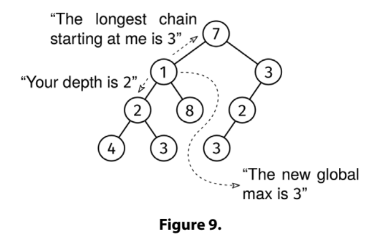

Given a binary tree, we say a node is aligned if its value is equal to its depth (distance from root). A descendant chain is a sequence of nodes where each node is the parent of the next node. Return the length of the longest descendant chain of aligned nodes. The chain does not need to start at the root.

Example:
                7
               / \
              1   3
             / \   \
            2   8   2
           / \     / \
          4   3   3   3

Output: 3
The aligned nodes are the circled ones:
Depth
  0             7
               / \
  1          (1)   3
             / \   \
  2        (2)  8  (2)
           / \     / \
  3       4  (3) (3) (3)

The longest descendant chain of aligned nodes is 1 -> 2 -> 3 on the left
subtree.
Here is a drawing of the same example:

Constraints:

The number of nodes is at most 10^5
The height of the tree is at most 500
Each node has a value between 0 and 10^9

See Solution
Problem 35.1 - Aligned Chain: Solution
Python
The first question we should ask for binary tree problems is: "What information do I need to pass through the tree, and in which direction?"

Information directions

For this problem:

We pass the current depth down the tree (a node doesn't know its own depth by itself).
We pass the longest aligned chain starting at each node up the tree. This way, if a node is aligned, it can extend the longest chain in its children.
We track the longest chain seen so far using global (non-local) state.
Aligned chain

Here is the implementation:

class Node:
  def __init__(self, val, left=None, right=None):
    self.val = val
    self.left = left
    self.right = right

def longest_aligned_chain(root):
  res = 0

  def visit(node, depth):  # Inner recursive function.
    nonlocal res  # To make res visible inside visit().
    if not node:
      return 0
    left_chain = visit(node.left, depth + 1)
    right_chain = visit(node.right, depth + 1)
    current_chain = 0
    if node.val == depth:
      current_chain = 1 + max(left_chain, right_chain)
      res = max(res, current_chain)
    return current_chain

  visit(root, 0)  # Trigger DFS, which updates the 'global' res.
  return res
Time & Space Analysis
n: the number of nodes in the tree

h: the height of the tree

Time: O(n) - we visit each node once

Extra space: O(h) - for the call stack

Tests
Here are some test cases to verify the solution:

def run_tests():
  tests = [
      # Test 1: from the book
      (Node(7, Node(1, Node(2, Node(4), Node(3)),
                    Node(8)), Node(3, Node(2, Node(3)))), 3),
      # Test 2
      (Node(0,
            Node(1,
                 Node(2,
                      Node(3),
                      None),
                 Node(4)),
            Node(5)), 4),

      # Test 3: Empty tree
      (None, 0),

      # Test 4: Single node aligned at root
      (Node(0), 1),

      # Test 5: Single node not aligned
      (Node(1), 0),

      # Test 6: Multiple valid chains, should return longest
      (Node(0,
            Node(1,
                 Node(2,
                      Node(4),
                      None),
                 Node(2,
                      Node(3),
                      None))), 4),

      # Test 7: No aligned nodes
      (Node(5,
            Node(4,
                 Node(3),
                 Node(3)),
            Node(2)), 0),

      # Test 8
      (Node(0,
            Node(1),
            Node(1)), 2),
  ]

  for i, (root, want) in enumerate(tests, 1):
    got = longest_aligned_chain(root)
    assert got == want, f"\nTest {i} failed! Got: {got}, Want: {want}"

run_tests()

class Node {
  constructor(val, left = null, right = null) {
    this.val = val;
    this.left = left;
    this.right = right;
  }
}

function longestAlignedChain(root) {
  let res = 0;

  function visit(node, depth) {
    if (!node) {
      return 0;
    }
    const leftChain = visit(node.left, depth + 1);
    const rightChain = visit(node.right, depth + 1);
    let currentChain = 0;
    if (node.val === depth) {
      currentChain = 1 + Math.max(leftChain, rightChain);
      res = Math.max(res, currentChain);
    }
    return currentChain;
  }

  visit(root, 0);
  return res;
}
Time & Space Analysis
n: the number of nodes in the tree

h: the height of the tree

Time: O(n) - we visit each node once

Extra space: O(h) - for the call stack

Tests
Here are some test cases to verify the solution:

function runTests() {
  const tests = [
    // Test 1: from the book
    [
      new Node(
        7,
        new Node(1, new Node(2, new Node(4), new Node(3)), new Node(8)),
        new Node(3, new Node(2, new Node(3))),
      ),
      3,
    ],
    // Test 2
    [
      new Node(
        0,
        new Node(1, new Node(2, new Node(3), null), new Node(4)),
        new Node(5),
      ),
      4,
    ],
    // Test 3: Empty tree
    [null, 0],
    // Test 4: Single node aligned at root
    [new Node(0), 1],
    // Test 5: Single node not aligned
    [new Node(1), 0],
    // Test 6: Multiple valid chains, should return longest
    [
      new Node(
        0,
        new Node(
          1,
          new Node(2, new Node(4), null),
          new Node(2, new Node(3), null),
        ),
      ),
      4,
    ],
    // Test 7: No aligned nodes
    [new Node(5, new Node(4, new Node(3), new Node(3)), new Node(2)), 0],
    // Test 8
    [new Node(0, new Node(1), new Node(1)), 2],
  ];

  for (let i = 0; i < tests.length; i++) {
    const [root, want] = tests[i];
    const got = longestAlignedChain(root);
    if (got !== want) {
      throw new Error(`\nTest ${i + 1} failed! Got: ${got}, Want: ${want}`);
    }
  }
}

runTests();

class Node {
  public int value;
  public Node left;
  public Node right;

  public Node(int value) {
    this.value = value;
    this.left = null;
    this.right = null;
  }
}

class LongestAlignedChain {
  private int res = 0;

  private int visit(Node node, int depth) {
    if (node == null) {
      return 0;
    }
    int leftChain = visit(node.left, depth + 1);
    int rightChain = visit(node.right, depth + 1);
    int currentChain = 0;
    if (node.value == depth) {
      currentChain = 1 + Math.max(leftChain, rightChain);
      res = Math.max(res, currentChain);
    }
    return currentChain;
  }

  public int solve(Node root) {
    res = 0;
    visit(root, 0);
    return res;
  }
}
Time & Space Analysis
n: the number of nodes in the tree

h: the height of the tree

Time: O(n) - we visit each node once

Extra space: O(h) - for the call stack

Tests
Here are some test cases to verify the solution:

class RunTests {
  private static Node createNode(int value) {
    return new Node(value);
  }

  private static Node createNode(int value, Node left,
      Node right) {
    Node node = new Node(value);
    node.left = left;
    node.right = right;
    return node;
  }

  public void runTests() {
    TestCase[] testCases = {
        // Test 1: from the book
        new TestCase(createNode(7,
            createNode(1,
                createNode(2,
                    createNode(4, null, null),
                    createNode(3, null, null)),
                createNode(8, null, null)),
            createNode(3,
                createNode(2,
                    createNode(3, null, null),
                    null),
                null)),
            3),
        // Test 2
        new TestCase(createNode(0,
            createNode(1,
                createNode(2,
                    createNode(3, null, null),
                    null),
                createNode(4, null, null)),
            createNode(5, null, null)),
            4),
        // Test 3: Empty tree
        new TestCase(null, 0),
        // Test 4: Single node aligned at root
        new TestCase(createNode(0, null, null), 1),
        // Test 5: Single node not aligned
        new TestCase(createNode(1, null, null), 0),
        // Test 6: Multiple valid chains, should return longest
        new TestCase(createNode(0,
            createNode(1,
                createNode(2,
                    createNode(4, null, null),
                    null),
                createNode(2,
                    createNode(3, null, null),
                    null)),
            null),
            4),
        // Test 7: No aligned nodes
        new TestCase(createNode(5,
            createNode(4,
                createNode(3, null, null),
                createNode(3, null, null)),
            createNode(2, null, null)),
            0),
        // Test 8
        new TestCase(createNode(0,
            createNode(1, null, null),
            createNode(1, null, null)),
            2),
    };

    LongestAlignedChain solution = new LongestAlignedChain();
    for (TestCase testCase : testCases) {
      int actual = solution.solve(testCase.root);
      if (actual != testCase.expected) {
        throw new RuntimeException(String.format(
            "\naligned_chain(tree): got: %d, want: %d\n",
            actual, testCase.expected));
      }
    }
  }
}

public class Solution {
  public static void main(String[] args) {
    new RunTests().runTests();
  }
}

class TestCase {
  final Node root;
  final int expected;

  TestCase(Node root, int expected) {
    this.root = root;
    this.expected = expected;
  }
}

