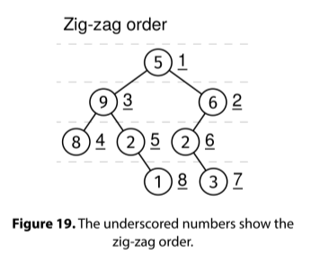

Given a binary tree, return the values of all its nodes in zig-zag order. This is similar to a level-order traversal but alternating the direction of the nodes at each level. Nodes at even depth are ordered left to right, and nodes at odd depth are ordered right to left.

Example:

Input:
    1
   / \
  2   3
 / \   \
4   5   6

Output: [1, 3, 2, 4, 5, 6]
Zig-zag order 1

Constraints:

The number of nodes is at most 10^5
The values at each node are between 0 and 10^9
See Solution
Problem 35.10 - Zig-Zag Order: Solution
Python
This problem requires an adapted level-order traversal. We also need to track the level of the nodes. This is something we can do with the Node–Depth Queue recipe.

node_depth_queue_recipe(root):
  Q = Queue()
  Q.add((root, 0))
  while not Q.empty():
    node, depth = Q.pop()
    if not node:
      continue
    # Do something with node and depth.
    Q.add((node.left, depth+1))
    Q.add((node.right, depth+1))
We use the Node–Depth Queue recipe, but we put the nodes at each level in a per-level array. For odd levels, we reverse this array before appending the nodes to the solution.

Here is the implementation:

class Node:
  def __init__(self, val, left=None, right=None):
    self.val = val
    self.left = left
    self.right = right

def zig_zag_order(root):
  res = []
  Q = deque()
  Q.append((root, 0))
  cur_level = []
  cur_depth = 0
  while Q:
    node, depth = Q.popleft()
    if not node:
      continue
    if depth > cur_depth:
      if cur_depth % 2 == 0:
        res += cur_level
      else:
        res += cur_level[::-1]  # Reverse order.
      cur_level = []
      cur_depth = depth
    cur_level.append(node)
    Q.append((node.left, depth + 1))
    Q.append((node.right, depth + 1))
  if cur_depth % 2 == 0:   # Add the last level.
    res += cur_level
  else:
    res += cur_level[::-1]
  return res
Alternative solution
There is one data structure that allows us to skip having to reverse the nodes explicitly: a double-ended queue (deque). If we store the nodes in a deque, at the end of each level, we can simply alternate the end that we pop from and the end that we push to.

This doesn't affect the asymptotic runtime.

Time & Space Analysis
n: the number of nodes in the tree

Time: O(n)

Extra space: O(n) - for the queue and the output

Tests
Here are some test cases to verify the solution:

def run_tests():
  # Example 1 from the book
  root1 = Node(1)
  root1.left = Node(2)
  root1.right = Node(3)
  root1.left.left = Node(4)
  root1.left.right = Node(5)
  root1.right.left = Node(6)
  root1.right.right = Node(7)

  # Example 2 - empty tree
  root2 = None

  # Example 3 - single node
  root3 = Node(1)

  # Example 4 - unbalanced tree
  root4 = Node(1)
  root4.left = Node(2)
  root4.left.left = Node(3)
  root4.left.left.left = Node(4)

  # Example 5 - complete binary tree
  root5 = Node(1)
  root5.left = Node(2)
  root5.right = Node(3)
  root5.left.left = Node(4)
  root5.left.right = Node(5)
  root5.right.left = Node(6)
  root5.right.right = Node(7)
  root5.left.left.left = Node(8)
  root5.left.left.right = Node(9)
  root5.left.right.left = Node(10)
  root5.left.right.right = Node(11)
  root5.right.left.left = Node(12)
  root5.right.right.left = Node(14)
  root5.right.right.right = Node(15)

  tests = [
      # Example 1 - basic tree
      (root1, [1, 3, 2, 4, 5, 6, 7]),
      # Example 2 - empty tree
      (root2, []),
      # Example 3 - single node
      (root3, [1]),
      # Example 4 - unbalanced tree
      (root4, [1, 2, 3, 4]),
      # Example 5 - complete binary tree
      (root5, [1, 3, 2, 4, 5, 6, 7, 15, 14, 12, 11, 10, 9, 8])
  ]

  for i, (root, want) in enumerate(tests):
    got = [node.val for node in zig_zag_order(root)]
    assert got == want, f"\nExample {
        i + 1}: zig_zag_order({root}): got: {got}, want: {want}\n"

run_tests()
node_depth_queue_recipe(root):
  Q = Queue()
  Q.add((root, 0))
  while not Q.empty():
    node, depth = Q.pop()
    if not node:
      continue
    # Do something with node and depth.
    Q.add((node.left, depth+1))
    Q.add((node.right, depth+1))
We use the Node–Depth Queue recipe, but we put the nodes at each level in a per-level array. For odd levels, we reverse this array before appending the nodes to the solution.

Here is the implementation:

class Node {
  constructor(val, left = null, right = null) {
    this.val = val;
    this.left = left;
    this.right = right;
  }
}

function zigZagOrder(root) {
  const res = [];
  const Q = new Queue();
  Q.push([root, 0]);
  let curLevel = [];
  let curDepth = 0;
  while (!Q.empty()) {
    const [node, depth] = Q.pop();
    if (!node) {
      continue;
    }
    if (depth > curDepth) {
      if (curDepth % 2 === 0) {
        res.push(...curLevel);
      } else {
        res.push(...curLevel.reverse()); // Reverse order
      }
      curLevel = [];
      curDepth = depth;
    }
    curLevel.push(node.val);
    Q.push([node.left, depth + 1]);
    Q.push([node.right, depth + 1]);
  }
  if (curDepth % 2 === 0) {
    // Add the last level
    res.push(...curLevel);
  } else {
    res.push(...curLevel.reverse());
  }
  return res;
}
For JS, we need to provide a queue implementation (or use a third-party one). Here is the linked-list based queue we discussed in the Linked Lists chapter.

class QueueNode {
  constructor(val) {
    this.val = val;
    this.next = null;
  }
}

class Queue {
  constructor() {
    this.head = null;
    this.tail = null;
    this._size = 0;
  }

  empty() {
    return !this.head;
  }

  size() {
    return this._size;
  }

  push(val) {
    const newNode = new QueueNode(val);
    if (this.tail) {
      this.tail.next = newNode;
    }

    this.tail = newNode;
    if (!this.head) {
      this.head = newNode;
    }
    this._size++;
  }

  pop() {
    if (this.empty()) {
      throw new Error("empty queue");
    }
    const val = this.head.val;
    this.head = this.head.next;
    if (!this.head) {
      this.tail = null;
    }
    this._size--;
    return val;
  }
}
Learn more about what to do if you need a Queue in an interview in JS at nilmamano.com/blog/js-queues.

Alternative solution
There is one data structure that allows us to skip having to reverse the nodes explicitly: a double-ended queue (deque). If we store the nodes in a deque, at the end of each level, we can simply alternate the end that we pop from and the end that we push to.

This doesn't affect the asymptotic runtime.

Time & Space Analysis
n: the number of nodes in the tree

Time: O(n)

Extra space: O(n) - for the queue and the output

Tests
Here are some test cases to verify the solution:

function runTests() {
  // Example 1 from the book
  const root1 = new Node(1);
  root1.left = new Node(2);
  root1.right = new Node(3);
  root1.left.left = new Node(4);
  root1.left.right = new Node(5);
  root1.right.left = new Node(6);
  root1.right.right = new Node(7);

  // Example 2 - empty tree
  const root2 = null;

  // Example 3 - single node
  const root3 = new Node(1);

  // Example 4 - unbalanced tree
  const root4 = new Node(1);
  root4.left = new Node(2);
  root4.left.left = new Node(3);
  root4.left.left.left = new Node(4);

  // Example 5 - complete binary tree
  const root5 = new Node(1);
  root5.left = new Node(2);
  root5.right = new Node(3);
  root5.left.left = new Node(4);
  root5.left.right = new Node(5);
  root5.right.left = new Node(6);
  root5.right.right = new Node(7);
  root5.left.left.left = new Node(8);
  root5.left.left.right = new Node(9);
  root5.left.right.left = new Node(10);
  root5.left.right.right = new Node(11);
  root5.right.left.left = new Node(12);
  root5.right.right.left = new Node(14);
  root5.right.right.right = new Node(15);

  const tests = [
    // Example 1 - basic tree
    [root1, [1, 3, 2, 4, 5, 6, 7]],
    // Example 2 - empty tree
    [root2, []],
    // Example 3 - single node
    [root3, [1]],
    // Example 4 - unbalanced tree
    [root4, [1, 2, 3, 4]],
    // Example 5 - complete binary tree
    [root5, [1, 3, 2, 4, 5, 6, 7, 15, 14, 12, 11, 10, 9, 8]],
  ];

  for (let i = 0; i < tests.length; i++) {
    const [root, want] = tests[i];
    const got = zigZagOrder(root);
    if (JSON.stringify(got) !== JSON.stringify(want)) {
      throw new Error(
        `\nExample ${i + 1}: zigZagOrder(): got: ${got}, want: ${want}\n`,
      );
    }
  }
}

runTests();

class Node {
  public int value;
  public Node left;
  public Node right;

  public Node(int value) {
    this.value = value;
    this.left = null;
    this.right = null;
  }
}

class ZigZagOrder {
  public List<Integer> solve(Node root) {
    if (root == null) {
      return Collections.emptyList();
    }

    List<Integer> res = new ArrayList<>();
    Queue<Map.Entry<Node, Integer>> queue = new LinkedList<>();
    queue.offer(new AbstractMap.SimpleEntry<>(root, 0));
    List<Integer> curLevel = new ArrayList<>();
    int curDepth = 0;

    while (!queue.isEmpty()) {
      Map.Entry<Node, Integer> entry = queue.poll();
      Node node = entry.getKey();
      int depth = entry.getValue();

      if (depth > curDepth) {
        if (curDepth % 2 == 0) {
          res.addAll(curLevel);
        } else {
          Collections.reverse(curLevel);
          res.addAll(curLevel);
        }
        curLevel = new ArrayList<>();
        curDepth = depth;
      }

      curLevel.add(node.value);
      if (node.left != null) {
        queue.offer(new AbstractMap.SimpleEntry<>(node.left, depth + 1));
      }
      if (node.right != null) {
        queue.offer(new AbstractMap.SimpleEntry<>(node.right, depth + 1));
      }
    }

    // Add the last level
    if (curDepth % 2 == 0) {
      res.addAll(curLevel);
    } else {
      Collections.reverse(curLevel);
      res.addAll(curLevel);
    }

    return res;
  }
}
Alternative solution
There is one data structure that allows us to skip having to reverse the nodes explicitly: a double-ended queue (deque). If we store the nodes in a deque, at the end of each level, we can simply alternate the end that we pop from and the end that we push to.

This doesn't affect the asymptotic runtime.

Time & Space Analysis
n: the number of nodes in the tree

Time: O(n)

Extra space: O(n) - for the queue and the output

Tests
Here are some test cases to verify the solution:

class RunTests {
  private static Node createNode(int value) {
    return new Node(value);
  }

  private static Node createNode(int value, Node left, Node right) {
    Node node = new Node(value);
    node.left = left;
    node.right = right;
    return node;
  }

  public void runTests() {
    // Create test trees
    Node root1 = createNode(1,
        createNode(2,
            createNode(4, null, null),
            createNode(5, null, null)),
        createNode(3,
            createNode(6, null, null),
            createNode(7, null, null)));

    Node root4 = createNode(1,
        createNode(2,
            createNode(3,
                createNode(4, null, null),
                null),
            null),
        null);

    Node root5 = createNode(1,
        createNode(2,
            createNode(4,
                createNode(8, null, null),
                createNode(9, null, null)),
            createNode(5,
                createNode(10, null, null),
                createNode(11, null, null))),
        createNode(3,
            createNode(6,
                createNode(12, null, null),
                null),
            createNode(7,
                createNode(14, null, null),
                createNode(15, null, null))));

    TestCase[] testCases = {
        // Example 1 - basic tree
        new TestCase(root1,
            Arrays.asList(1, 3, 2, 4, 5, 6, 7)),
        // Example 2 - empty tree
        new TestCase(null,
            Collections.<Integer>emptyList()),
        // Example 3 - single node
        new TestCase(createNode(1),
            Arrays.asList(1)),
        // Example 4 - unbalanced tree
        new TestCase(root4,
            Arrays.asList(1, 2, 3, 4)),
        // Example 5 - complete binary tree
        new TestCase(root5,
            Arrays.asList(1, 3, 2, 4, 5, 6, 7, 15, 14, 12, 11, 10, 9, 8)),
    };

    ZigZagOrder solution = new ZigZagOrder();
    for (TestCase testCase : testCases) {
      List<Integer> actual = solution.solve(testCase.root);
      if (!actual.equals(testCase.expected)) {
        throw new RuntimeException(String.format(
            "\nzig_zag_order(tree): got: %s, want: %s\n",
            actual, testCase.expected));
      }
    }
  }
}

public class Solution {
  public static void main(String[] args) {
    new RunTests().runTests();
  }
}

class TestCase {
  final Node root;
  final List<Integer> expected;

  TestCase(Node root, List<Integer> expected) {
    this.root = root;
    this.expected = Collections.unmodifiableList(new ArrayList<>(expected));
  }
}