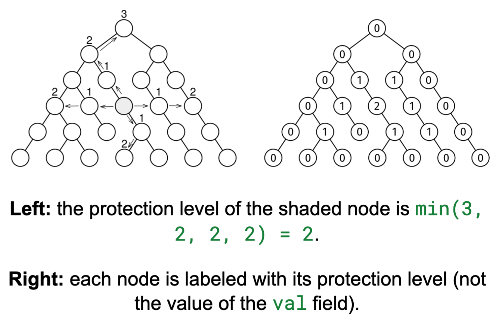

Given the root of a non-empty binary tree, return the highest protection level of any node. The protection level of a node is the minimum of four values:

The number of ancestors
The length of the longest chain of descendants
The number of nodes on the same level to its left
The number of nodes on the same level to its right

Example:
            O
         /     \
        O       O
       / \     / \
      O   O   O   O
     / \   \   \   \
    O   O   O   O   O
   / \   \   \   \   \
  O   O   O   O   O   O
 /   / \     / \   \   \
O   O   O   O   O   O   O

Output: 2.
The protection level of each node is:
            0
         /     \
        0       0
       / \     / \
      0   1   1   0
     / \   \   \   \
    0   1   2   1   0
   / \   \   \   \   \
  0   1   0   1   1   0
 /   / \     / \   \   \
0   0   0   0   0   0   0

Most protected node 1

Constraints:

The number of nodes is at most 10^5
The height of the tree is at most 500
The value at each node doesn't matter.
See Solution
Problem 35.11 - Most Protected Node: Solution
Python
At each node, we need to know the number of nodes above, to the left, to the right, and below. We can use a combination of techniques:

On the one hand, we have the Node–Depth Queue recipe, which enhances a level-order traversal by tracking the depth of each node:

node_depth_queue_recipe(root):
  Q = Queue()
  Q.add((root, 0))
  while not Q.empty():
    node, depth = Q.pop()
    if not node:
      continue
    # Do something with node and depth.
    Q.add((node.left, depth+1))
    Q.add((node.right, depth+1))
On the other hand, we have recursive traversals, where we need to decide which information needs to flow along the tree and in which direction:

Information directions
For this problem:

The number of nodes above a node is just its depth, which we get "for free" with the Node–Depth Queue recipe.
To count the nodes left and right of each node, we can adapt the Node–Depth Queue recipe to find the index of each node within its level.
Finally, to find the longest chain of descendants at each node, it makes more sense to use a DFS-based traversal that passes subtree heights up the tree.
We can use a global map from each node to its protection level. Whenever we find the number of nodes in one direction for a node, we update its protection level in the map with the min() operation. At the end, we return the maximum value in the map.

Here is the implementation:

class Node:
  def __init__(self, val, left=None, right=None):
    self.val = val
    self.left = left
    self.right = right

def most_protected_node(root):
  if not root:
    return 0

  # Map from node to its current minimum protection level
  protection = defaultdict(lambda: math.inf)
  nodes_per_level = defaultdict(int)
  node_to_index_in_level = {}

  # First pass: BFS to get depth and position in level
  Q = deque([(root, 0)])
  while Q:
    node, depth = Q.popleft()
    if not node:
      continue

    # Add node to its level
    nodes_per_level[depth] += 1
    # Store node's position in its level
    node_to_index_in_level[node] = nodes_per_level[depth] - 1

    # Update protection with min of ancestor count (depth) and left count
    protection[node] = min(depth, node_to_index_in_level[node])

    Q.append((node.left, depth + 1))
    Q.append((node.right, depth + 1))

  # Second pass: DFS to get descendant heights
  # Passes current depth down the tree.
  # Passes subtree height up the tree.
  # Updates protection level of nodes in global map.
  def dfs(node, depth):
    if not node:
      return -1
    height = 1 + max(dfs(node.left, depth + 1),
                     dfs(node.right, depth + 1))

    protection[node] = min(protection[node], height)

    # Update protection with right counts
    protection[node] = min(
        protection[node], nodes_per_level[depth] - node_to_index_in_level[node] - 1)

    return height

  dfs(root, 0)

  # Return highest protection level
  return max(protection.values())
Time & Space Analysis
n: the number of nodes in the tree

Time: O(n)

Extra space: O(n) - for the queue and protection level map

Tests
Here are some test cases to verify the solution:

def run_tests():
  def perfect_tree(height):
    if height == 1:
      return Node(1)
    return Node(1, perfect_tree(height - 1), perfect_tree(height - 1))

  root = Node(1,
               Node(2,
                    Node(3,
                         Node(4,
                              Node(5, Node(6)),
                              Node(7, Node(8), Node(9))),
                         Node(10, Node(11))),
                    Node(12,
                         Node(13,
                              Node(14,
                                   Node(15),
                                   Node(16))))),
               Node(17,
                    Node(18, Node(
                        19, Node(20, Node(21)))),
                    Node(22, Node(23, Node(24, Node(25))))))

  tests = [
      (root, 2),
      (Node(1), 0),  # Single node
      (Node(1, Node(2, Node(3, Node(4)))), 0),  # Linear tree
      (perfect_tree(1), 0), 
      (perfect_tree(2), 0), 
      (perfect_tree(3), 0), 
      (perfect_tree(4), 1), 
      (perfect_tree(5), 1), 
      (perfect_tree(6), 2), 
      (perfect_tree(7), 3), 
      (perfect_tree(8), 3), 
      (perfect_tree(9), 4), 
  ]

  for i, (root, want) in enumerate(tests):
    got = most_protected_node(root)
    assert got == want, f"\nExample {
        i + 1}: most_protected_node(): got: {got}, want: {want}\n"

run_tests()
  
  class Node {
  constructor(val, left = null, right = null) {
    this.val = val;
    this.left = left;
    this.right = right;
  }
}

function mostProtectedNode(root) {
  if (!root) {
    return 0;
  }

  // Map from node to its current minimum protection level
  const protection = new Map();
  const nodesPerLevel = new Map();
  const nodeToIndexInLevel = new Map();

  // First pass: BFS to get depth and position in level
  const Q = new Queue();
  Q.push([root, 0]);
  while (!Q.empty()) {
    const [node, depth] = Q.pop();
    if (!node) {
      continue;
    }

    // Add node to its level
    nodesPerLevel.set(depth, (nodesPerLevel.get(depth) || 0) + 1);
    // Store node's position in its level
    nodeToIndexInLevel.set(node, nodesPerLevel.get(depth) - 1);

    // Update protection with min of ancestor count (depth) and left count
    protection.set(node, Math.min(depth, nodeToIndexInLevel.get(node)));

    Q.push([node.left, depth + 1]);
    Q.push([node.right, depth + 1]);
  }

  // Second pass: DFS to get descendant heights
  // Passes current depth down the tree.
  // Passes subtree height up the tree.
  // Updates protection level of nodes in global map.
  function dfs(node, depth) {
    if (!node) {
      return -1;
    }
    const height =
      1 + Math.max(dfs(node.left, depth + 1), dfs(node.right, depth + 1));

    protection.set(node, Math.min(protection.get(node), height));

    // Update protection with right counts
    protection.set(
      node,
      Math.min(
        protection.get(node),
        nodesPerLevel.get(depth) - nodeToIndexInLevel.get(node) - 1,
      ),
    );

    return height;
  }

  dfs(root, 0);

  // Return highest protection level
  return Math.max(...protection.values());
}
For JS, we need to provide a queue implementation (or use a third-party one). Here is the linked-list based queue we discussed in the Linked Lists chapter.

class QueueNode {
  constructor(val) {
    this.val = val;
    this.next = null;
  }
}

class Queue {
  constructor() {
    this.head = null;
    this.tail = null;
    this._size = 0;
  }

  empty() {
    return !this.head;
  }

  size() {
    return this._size;
  }

  push(val) {
    const newNode = new QueueNode(val);
    if (this.tail) {
      this.tail.next = newNode;
    }

    this.tail = newNode;
    if (!this.head) {
      this.head = newNode;
    }
    this._size++;
  }

  pop() {
    if (this.empty()) {
      throw new Error("empty queue");
    }
    const val = this.head.val;
    this.head = this.head.next;
    if (!this.head) {
      this.tail = null;
    }
    this._size--;
    return val;
  }
}
Learn more about what to do if you need a Queue in an interview in JS at nilmamano.com/blog/js-queues.

Time & Space Analysis
n: the number of nodes in the tree

Time: O(n)

Extra space: O(n) - for the queue and protection level map

Tests
Here are some test cases to verify the solution:

function runTests() {
  const root = new Node(
    1,
    new Node(
      2,
      new Node(
        3,
        new Node(
          4,
          new Node(5, new Node(6)),
          new Node(7, new Node(8), new Node(9)),
        ),
        new Node(10, new Node(11)),
      ),
      new Node(12, new Node(13, new Node(14, new Node(15), new Node(16)))),
    ),
    new Node(
      17,
      new Node(18, new Node(19, new Node(20, new Node(21)))),
      new Node(22, new Node(23, new Node(24, new Node(25)))),
    ),
  );

  function perfectTree(height) {
    if (height === 1) {
      return new Node(1);
    }
    return new Node(1, perfectTree(height - 1), perfectTree(height - 1));
  }

  const tests = [
    [root, 2],
    [new Node(1), 0], // Single node
    [new Node(1, new Node(2, new Node(3, new Node(4)))), 0], // Linear tree
    [perfectTree(1), 0],
    [perfectTree(2), 0],
    [perfectTree(3), 0],
    [perfectTree(4), 1],
    [perfectTree(5), 1],
    [perfectTree(6), 2],
    [perfectTree(7), 3],
    [perfectTree(8), 3],
    [perfectTree(9), 4],
  ];

  for (let i = 0; i < tests.length; i++) {
    const [root, want] = tests[i];
    const got = mostProtectedNode(root);
    if (got !== want) {
      throw new Error(
        `\nExample ${i + 1}: mostProtectedNode(): got: ${got}, want: ${want}\n`,
      );
    }
  }
}

runTests();

class Node {
  public Integer value;
  public Node left;
  public Node right;

  public Node(Integer value) {
    this.value = value;
    this.left = null;
    this.right = null;
  }
}

class MostProtectedNode {
  private Map<Node, Integer> protection;
  private Map<Integer, Integer> nodesPerLevel;
  private Map<Node, Integer> nodeToIndexInLevel;

  private int dfs(Node node, int depth) {
    if (node == null) {
      return -1;
    }
    int height = 1
        + Math.max(dfs(node.left, depth + 1), dfs(node.right, depth + 1));

    protection.put(node, Math.min(protection.get(node), height));

    // Update protection with right counts
    protection.put(node,
        Math.min(protection.get(node),
            nodesPerLevel.get(depth) - nodeToIndexInLevel.get(node) - 1));

    return height;
  }

  public int solve(Node root) {
    if (root == null) {
      return 0;
    }

    // Reset all maps
    protection = new HashMap<>();
    nodesPerLevel = new HashMap<>();
    nodeToIndexInLevel = new HashMap<>();

    // First pass: BFS to get depth and position in level
    Queue<Map.Entry<Node, Integer>> Q = new LinkedList<>();
    Q.add(new SimpleEntry<>(root, 0));

    while (!Q.isEmpty()) {
      Map.Entry<Node, Integer> entry = Q.poll();
      Node node = entry.getKey();
      int depth = entry.getValue();
      if (node == null) {
        continue;
      }

      // Add node to its level
      nodesPerLevel.merge(depth, 1, Integer::sum);
      // Store node's position in its level
      nodeToIndexInLevel.put(node, nodesPerLevel.get(depth) - 1);

      // Update protection with min of ancestor count (depth) and left count
      protection.put(node, Math.min(depth, nodeToIndexInLevel.get(node)));

      Q.add(new SimpleEntry<>(node.left, depth + 1));
      Q.add(new SimpleEntry<>(node.right, depth + 1));
    }

    // Second pass: DFS to get descendant heights
    dfs(root, 0);

    // Return highest protection level
    return protection.values().stream().max(Integer::compareTo).orElse(0);
  }
}
Time & Space Analysis
n: the number of nodes in the tree

Time: O(n)

Extra space: O(n) - for the queue and protection level map

Tests
Here are some test cases to verify the solution:

class RunTests {
  private static Node createNode(int value) {
    return new Node(value);
  }

  private static Node createNode(int value, Node left,
      Node right) {
    Node node = new Node(value);
    node.left = left;
    node.right = right;
    return node;
  }

  private static Node perfectTree(int height) {
    if (height == 1) {
      return createNode(1, null, null);
    }
    return createNode(1, perfectTree(height - 1), perfectTree(height - 1));
  }

  public void runTests() {
    Node root = createNode(1,
        createNode(2,
            createNode(3,
                createNode(4,
                    createNode(5,
                        createNode(6, null, null),
                        null),
                    createNode(7,
                        createNode(8, null, null),
                        createNode(9, null, null))),
                createNode(10,
                    createNode(11, null, null),
                    null)),
            createNode(12,
                createNode(13,
                    createNode(14,
                        createNode(15, null, null),
                        createNode(16, null, null)),
                    null),
                null)),
        createNode(17,
            createNode(18,
                createNode(19,
                    createNode(20,
                        createNode(21, null, null),
                        null),
                    null),
                null),
            createNode(22,
                createNode(23,
                    createNode(24,
                        createNode(25, null, null),
                        null),
                    null),
                null)));

    TestCase[] testCases = {
        new TestCase(root, 2),
        new TestCase(createNode(1, null, null), 0), // Single node
        new TestCase(createNode(1,
            createNode(2,
                createNode(3,
                    createNode(4, null, null),
                    null),
                null),
            null),
            0), // Linear tree
        new TestCase(perfectTree(1), 0),
        new TestCase(perfectTree(2), 0),
        new TestCase(perfectTree(3), 0),
        new TestCase(perfectTree(4), 1),
        new TestCase(perfectTree(5), 1),
        new TestCase(perfectTree(6), 2),
        new TestCase(perfectTree(7), 3),
        new TestCase(perfectTree(8), 3),
        new TestCase(perfectTree(9), 4),
    };

    MostProtectedNode solution = new MostProtectedNode();
    for (TestCase testCase : testCases) {
      int actual = solution.solve(testCase.root);
      if (actual != testCase.expected) {
        throw new RuntimeException(String.format(
            "\nmost_protected_node(tree): got: %d, want: %d\n",
            actual, testCase.expected));
      }
    }
  }
}

public class Solution {
  public static void main(String[] args) {
    new RunTests().runTests();
  }
}

class TestCase {
  final Node root;
  final int expected;

  TestCase(Node root, int expected) {
    this.root = root;
    this.expected = expected;
  }
}

