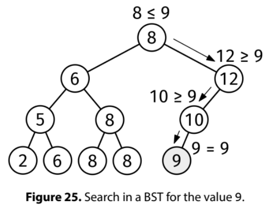

A binary search tree (BST) is a binary tree if, for every node:

All the values on its left subtree are less than or equal to the node's value.
All the values on its right subtree are greater than or equal to the node's value.
Given the root of a non-empty binary search tree and a value, target, find the closest value to target in the tree. In case of a tie, return the smaller value.

Example 1:
              5
            /    \
           2      9
            \    / \
             4  9   11
                 \
                  9
target = 4
Output: 4

Example 2:
Same tree, target = 3
Output: 2
Constraints:

1 <= number of nodes <= 10^4
-10^9 <= node.val <= 10^9
-10^9 <= target <= 10^9
The tree is a valid binary search tree
See Solution
Problem 35.13 - BST Nearest Value: Solution
Java
Recall that the typical search path in a BST when searching for a target value looks like a path from the root to the traget value, or to a leaf if the target is missing:

BST Search

To find the nearest value, we need to use the following property:

The node with the closest value to the target in the BST lies on the search path you would take to find the target itself, even if the target is not present in the tree.
Say the target is 6, and the root's value is 5. The root is a lower bound for the target. Next, we go to the right child of the root. If its value is 8, that becomes an upper bound for the target. The nodes along the search path form bounds around the target, narrowing down on it. Any node outside the path would be further away from the target than the bounds we already found.

The implementation follows the normal value search in a BST, but tracking the nearest value above and below the target. In the end, we return the closest of the two.

Here is the implementation:

class Node {
  public int value;
  public Node left;
  public Node right;

  public Node(int value) {
    this.value = value;
    this.left = null;
    this.right = null;
  }
}

class FindClosest {
  public long solve(Node root, int target) {
    Node curNode = root;
    long nextAbove = Long.MAX_VALUE;
    long nextBelow = Long.MIN_VALUE;

    while (curNode != null) {
      if (curNode.value == target) {
        return curNode.value;
      } else if (curNode.value > target) {
        nextAbove = curNode.value;
        curNode = curNode.left;
      } else {
        nextBelow = curNode.value;
        curNode = curNode.right;
      }
    }

    // If we only found values above or only values below, return the closest
    // one
    if (nextAbove == Long.MAX_VALUE) {
      return nextBelow;
    }
    if (nextBelow == Long.MIN_VALUE) {
      return nextAbove;
    }

    // Otherwise compare distances
    if (nextAbove - target < target - nextBelow) {
      return nextAbove;
    }
    return nextBelow;
  }
}
Time & Space Analysis
n: the number of nodes in the BST

h: the height of the BST

Time: O(h) - the algorithm follows a single path from root to leaf, visiting at most h nodes.

Extra space: O(1) - the algorithm uses only a constant amount of extra space for tracking the bounds.

In a balanced BST, h = O(log n), but in a skewed BST, h = O(n).

Tests
Here are some test cases to verify the solution:

class RunTests {
  private static Node createNode(int value) {
    return new Node(value);
  }

  private static Node createNode(int value, Node left,
      Node right) {
    Node node = new Node(value);
    node.left = left;
    node.right = right;
    return node;
  }

  public void runTests() {
    Node root1 = createNode(5,
        createNode(2,
            null,
            createNode(4, null, null)),
        createNode(9,
            createNode(9,
                null,
                createNode(9, null, null)),
            createNode(11, null, null)));

    // Single node
    Node root3 = createNode(1, null, null);

    // Perfect BST
    Node root4 = createNode(4,
        createNode(2,
            createNode(1, null, null),
            createNode(3, null, null)),
        createNode(6,
            createNode(5, null, null),
            createNode(7, null, null)));

    // Unbalanced BST
    Node root5 = createNode(5,
        createNode(3,
            createNode(2,
                createNode(1, null, null),
                null),
            createNode(4, null, null)),
        null);

    // Example from the book
    Node root6 = createNode(8,
        createNode(6,
            createNode(5,
                createNode(2, null, null),
                createNode(6, null, null)),
            createNode(8,
                createNode(8, null, null),
                createNode(8, null, null))),
        createNode(12,
            createNode(10,
                createNode(9, null, null),
                null),
            null));

    TestCase[] testCases = {
        new TestCase(root1, 6, 5L), // Closest to 6 is 5
        new TestCase(root1, 9, 9L), // Exact match
        new TestCase(root1, 3, 2L), // Closest to 3 is 2
        new TestCase(root1, 4, 4L), // Exact match
        new TestCase(root3, 1, 1L), // Single node, exact match
        new TestCase(root3, 2, 1L), // Single node, closest is 1
        new TestCase(root4, 5, 5L), // Perfect BST, exact match
        new TestCase(root4, 8, 7L), // Perfect BST, closest is 7
        new TestCase(root5, 1, 1L), // Unbalanced BST, exact match at leaf
        new TestCase(root5, 5, 5L), // Unbalanced BST, exact match at root
        new TestCase(root5, 6, 5L), // Unbalanced BST, closest is 5
        new TestCase(root6, 9, 9L),
        new TestCase(root6, 13, 12L),
        new TestCase(root6, 1, 2L),
        new TestCase(root6, 8, 8L),
        new TestCase(root6, 6, 6L),
        new TestCase(root6, 7, 6L),
        new TestCase(root6, 11, 10L),
        new TestCase(root6, 4, 5L),
    };

    FindClosest solution = new FindClosest();
    for (TestCase testCase : testCases) {
      long actual = solution.solve(testCase.root, testCase.target);
      if (actual != testCase.expected) {
        throw new RuntimeException(String.format(
            "\nfind_closest(root, %d): got: %d, want: %d\n",
            testCase.target, actual, testCase.expected));
      }
    }
  }
}

public class Solution {
  public static void main(String[] args) {
    new RunTests().runTests();
  }
}

class TestCase {
  final Node root;
  final int target;
  final long expected;

  TestCase(Node root, int target, long expected) {
    this.root = root;
    this.target = target;
    this.expected = expected;
  }
}

class Node:
  def __init__(self, val, left=None, right=None):
    self.val = val
    self.left = left
    self.right = right

def find_closest(root, target):
  cur_node = root
  next_above, next_below = math.inf, -math.inf
  while cur_node:
    if cur_node.val == target:
      return cur_node.val
    elif cur_node.val > target:
      next_above = cur_node.val
      cur_node = cur_node.left
    else:
      next_below = cur_node.val
      cur_node = cur_node.right
  if next_above - target < target - next_below:
    return next_above
  return next_below
Time & Space Analysis
n: the number of nodes in the BST

h: the height of the BST

Time: O(h) - the algorithm follows a single path from root to leaf, visiting at most h nodes.

Extra space: O(1) - the algorithm uses only a constant amount of extra space for tracking the bounds.

In a balanced BST, h = O(log n), but in a skewed BST, h = O(n).

Tests
Here are some test cases to verify the solution:

def run_tests():
  root1 = Node(5,
               Node(2,
                    None,
                    Node(4)),
               Node(9,
                    Node(9,
                         None,
                         Node(9)),
                    Node(11)))

  # Single node
  root3 = Node(1)

  # Perfect BST
  root4 = Node(4,
               Node(2,
                    Node(1),
                    Node(3)),
               Node(6,
                    Node(5),
                    Node(7)))

  # Unbalanced BST
  root5 = Node(5,
               Node(3,
                    Node(2,
                         Node(1),
                         None),
                    Node(4)),
               None)

  # Example from the book
  root6 = Node(8,
               Node(6,
                    Node(5,
                         Node(2),
                         Node(6)),
                    Node(8,
                         Node(8),
                         Node(8))),
               Node(12,
                    Node(10,
                         Node(9),
                         None),
                    None))
  tests = [
      (root1, 6, 5),  # Closest to 6 is 5
      (root1, 9, 9),  # Exact match
      (root1, 3, 2),  # Closest to 3 is 2
      (root1, 4, 4),  # Exact match
      (root3, 1, 1),  # Single node, exact match
      (root3, 2, 1),  # Single node, closest is 1
      (root4, 5, 5),  # Perfect BST, exact match
      (root4, 8, 7),  # Perfect BST, closest is 7
      (root5, 1, 1),  # Unbalanced BST, exact match at leaf
      (root5, 5, 5),  # Unbalanced BST, exact match at root
      (root5, 6, 5),  # Unbalanced BST, closest is 5
      (root6, 9, 9),
      (root6, 13, 12),
      (root6, 1, 2),
      (root6, 8, 8),
      (root6, 6, 6),
      (root6, 7, 6),
      (root6, 11, 10),
      (root6, 4, 5),
  ]

  for i, (root, target, want) in enumerate(tests):
    got = find_closest(root, target)
    assert got == want, f"\nfind_closest(root{
        i + 1}, {target}): got: {got}, want: {want}\n"

run_tests()

class Node {
  constructor(val, left = null, right = null) {
    this.val = val;
    this.left = left;
    this.right = right;
  }
}

function findClosest(root, target) {
  let curNode = root;
  let nextAbove = Infinity;
  let nextBelow = -Infinity;
  while (curNode) {
    if (curNode.val === target) {
      return curNode.val;
    } else if (curNode.val > target) {
      nextAbove = curNode.val;
      curNode = curNode.left;
    } else {
      nextBelow = curNode.val;
      curNode = curNode.right;
    }
  }
  if (nextAbove - target < target - nextBelow) {
    return nextAbove;
  }
  return nextBelow;
}
Time & Space Analysis
n: the number of nodes in the BST

h: the height of the BST

Time: O(h) - the algorithm follows a single path from root to leaf, visiting at most h nodes.

Extra space: O(1) - the algorithm uses only a constant amount of extra space for tracking the bounds.

In a balanced BST, h = O(log n), but in a skewed BST, h = O(n).

Tests
Here are some test cases to verify the solution:

function runTests() {
  const root1 = new Node(
    5,
    new Node(2, null, new Node(4)),
    new Node(9, new Node(9, null, new Node(9)), new Node(11)),
  );

  // Single node
  const root2 = null;

  // Perfect BST
  const root3 = new Node(1);

  // Unbalanced BST
  const root4 = new Node(
    4,
    new Node(2, new Node(1), new Node(3)),
    new Node(6, new Node(5), new Node(7)),
  );

  // Unbalanced BST
  const root5 = new Node(
    5,
    new Node(3, new Node(2, new Node(1), null), new Node(4)),
    null,
  );

  // Example from the book
  const root6 = new Node(
    8,
    new Node(
      6,
      new Node(5, new Node(2), new Node(6)),
      new Node(8, new Node(8), new Node(8)),
    ),
    new Node(12, new Node(10, new Node(9), null), null),
  );

  const tests = [
    [root1, 6, 5], // Closest to 6 is 5
    [root1, 9, 9], // Exact match
    [root1, 3, 2], // Closest to 3 is 2
    [root1, 4, 4], // Exact match
    [root3, 1, 1], // Single node, exact match
    [root3, 2, 1], // Single node, closest is 1
    [root4, 5, 5], // Perfect BST, exact match
    [root4, 8, 7], // Perfect BST, closest is 7
    [root5, 1, 1], // Unbalanced BST, exact match at leaf
    [root5, 5, 5], // Unbalanced BST, exact match at root
    [root5, 6, 5], // Unbalanced BST, closest is 5
    [root6, 9, 9],
    [root6, 13, 12],
    [root6, 1, 2],
    [root6, 8, 8],
    [root6, 6, 6],
    [root6, 7, 6],
    [root6, 11, 10],
    [root6, 4, 5],
  ];

  for (let i = 0; i < tests.length; i++) {
    const [root, target, want] = tests[i];
    const got = findClosest(root, target);
    if (got !== want) {
      throw new Error(
        `\nfindClosest(root${i + 1}, ${target}): got: ${got}, want: ${want}\n`,
      );
    }
  }
}

runTests();