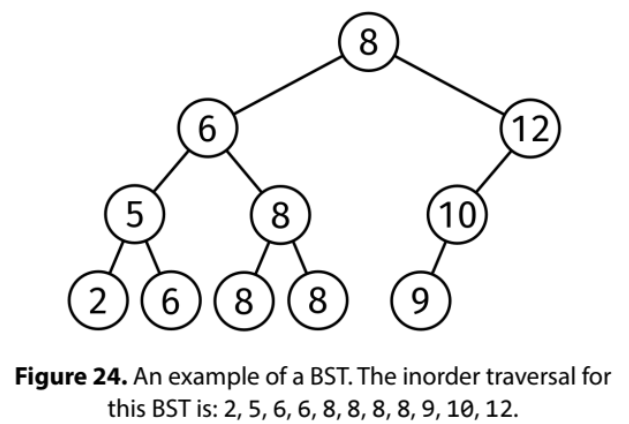

A binary search tree (BST) is a binary tree where, for every node:

All the values on its left subtree are less than or equal to the node's value.
All the values on its right subtree are greater than or equal to the node's value.
Given the roots of two binary search trees, return an array containing all elements from both trees in sorted order. The trees may contain duplicate values.

Example:
root1 =
              5
            /    \
           2      9
            \    / \
             4  9   11
root2 =
              3
            /    \
           2      7
          /      / \
         1      6   8

Output: [1, 2, 2, 3, 4, 5, 6, 7, 8, 9, 9, 11]

Example 2:
root1 =
              2
            /    \
           2      2

root2 =
              2
            /    \
           2      2

Output: [2, 2, 2, 2, 2, 2]
Constraints:

The number of nodes of each tree is at most 10^5
The height of each tree is at most 500
The value at each node is between 0 and 10^9
See Solution
Problem 35.17 - BST Merge Into Array: Solution
Python
We can use the 'break down the problem' booster to solve this in two steps:

Use inorder traversal to extract the sorted array of values from each tree.
Use the solution to the classic 'merge two sorted arrays' problem to merge the two arrays.
BST Inorder traversal

Here is the implementation:

class Node:
  def __init__(self, val, left=None, right=None):
    self.val = val
    self.left = left
    self.right = right

def merge_into_array(root1, root2):
  
  def inorder(root, arr):
    if not root:
      return
    inorder(root.left, arr)
    arr.append(root.val)
    inorder(root.right, arr)

  arr1, arr2 = [], []
  inorder(root1, arr1)
  inorder(root2, arr2)

  # Merge sorted arrays
  res = []
  i = j = 0
  while i < len(arr1) and j < len(arr2):
    if arr1[i] <= arr2[j]:
      res.append(arr1[i])
      i += 1
    else:
      res.append(arr2[j])
      j += 1

  res.extend(arr1[i:])
  res.extend(arr2[j:])
  return res
It is also possible to write a single-pass solution that moves two parallel pointers through the two trees, each following an inorder traversal. However, that is more complicated.

Time & Space Analysis
n1: the number of nodes in the first tree

n2: the number of nodes in the second tree

Time: O(n1 + n2) - we visit each node once

Extra space: O(n1 + n2) - for the output array

Tests
Here are some test cases to verify the solution:

def run_tests():
  root1 = Node(5,
               Node(2,
                    None,
                    Node(4)),
               Node(9,
                    Node(9),
                    Node(11)))

  root2 = Node(3,
               Node(2,
                    Node(1)),
               Node(7,
                    Node(6),
                    Node(8)))

  root3 = Node(2,
               Node(2),
               Node(2))

  root4 = Node(2,
               Node(2),
               Node(2))

  tests = [
      # Example 1 from the book
      (root1, root2, [1, 2, 2, 3, 4, 5, 6, 7, 8, 9, 9, 11]),
      # Example 2 from the book
      (root3, root4, [2, 2, 2, 2, 2, 2]),
      # Edge cases
      (None, None, []),
      (Node(1), None, [1]),
      (None, Node(1), [1]),
      (Node(1), Node(2), [1, 2]),
  ]

  for root1, root2, want in tests:
    got = merge_into_array(root1, root2)
    assert got == want, f"\nmerge_into_array({root1}, {root2}): got: {
        got}, want: {want}\n"

run_tests()

class Node {
  constructor(val, left = null, right = null) {
    this.val = val;
    this.left = left;
    this.right = right;
  }
}

function mergeIntoArray(root1, root2) {

  function inorder(root, arr) {
    if (!root) {
      return;
    }
    inorder(root.left, arr);
    arr.push(root.val);
    inorder(root.right, arr);
  }

  const arr1 = [],
    arr2 = [];
  inorder(root1, arr1);
  inorder(root2, arr2);

  // Merge sorted arrays
  const res = [];
  let i = 0,
    j = 0;
  while (i < arr1.length && j < arr2.length) {
    if (arr1[i] <= arr2[j]) {
      res.push(arr1[i]);
      i++;
    } else {
      res.push(arr2[j]);
      j++;
    }
  }

  res.push(...arr1.slice(i));
  res.push(...arr2.slice(j));
  return res;
}
It is also possible to write a single-pass solution that moves two parallel pointers through the two trees, each following an inorder traversal. However, that is more complicated.

Time & Space Analysis
n1: the number of nodes in the first tree

n2: the number of nodes in the second tree

Time: O(n1 + n2) - we visit each node once

Extra space: O(n1 + n2) - for the output array

Tests
Here are some test cases to verify the solution:

function runTests() {
  const root1 = new Node(
    5,
    new Node(2, null, new Node(4)),
    new Node(9, new Node(9), new Node(11)),
  );

  const root2 = new Node(
    3,
    new Node(2, new Node(1)),
    new Node(7, new Node(6), new Node(8)),
  );

  const root3 = new Node(2, new Node(2), new Node(2));

  const root4 = new Node(2, new Node(2), new Node(2));

  const tests = [
    // Example 1 from the book
    [root1, root2, [1, 2, 2, 3, 4, 5, 6, 7, 8, 9, 9, 11]],
    // Example 2 from the book
    [root3, root4, [2, 2, 2, 2, 2, 2]],
    // Edge cases
    [null, null, []],
    [new Node(1), null, [1]],
    [null, new Node(1), [1]],
    [new Node(1), new Node(2), [1, 2]],
  ];

  for (const [root1, root2, want] of tests) {
    const got = mergeIntoArray(root1, root2);
    if (JSON.stringify(got) !== JSON.stringify(want)) {
      throw new Error(`\nmergeIntoArray(): got: ${got}, want: ${want}\n`);
    }
  }
}

runTests();

class Node {
  public int value;
  public Node left;
  public Node right;

  public Node(int value) {
    this.value = value;
    this.left = null;
    this.right = null;
  }
}

class MergeIntoArray {
  private void inorder(Node root, List<Integer> arr) {
    if (root == null) {
      return;
    }
    inorder(root.left, arr);
    arr.add(root.value);
    inorder(root.right, arr);
  }

  public List<Integer> solve(Node root1, Node root2) {
    List<Integer> arr1 = new ArrayList<>();
    List<Integer> arr2 = new ArrayList<>();
    inorder(root1, arr1);
    inorder(root2, arr2);

    // Merge sorted arrays
    List<Integer> result = new ArrayList<>();
    int i = 0, j = 0;
    while (i < arr1.size() && j < arr2.size()) {
      if (arr1.get(i) <= arr2.get(j)) {
        result.add(arr1.get(i));
        i++;
      } else {
        result.add(arr2.get(j));
        j++;
      }
    }

    // Add remaining elements
    result.addAll(arr1.subList(i, arr1.size()));
    result.addAll(arr2.subList(j, arr2.size()));
    return result;
  }
}
It is also possible to write a single-pass solution that moves two parallel pointers through the two trees, each following an inorder traversal. However, that is more complicated.

Time & Space Analysis
n1: the number of nodes in the first tree

n2: the number of nodes in the second tree

Time: O(n1 + n2) - we visit each node once

Extra space: O(n1 + n2) - for the output array

Tests
Here are some test cases to verify the solution:

class RunTests {
  private Node createNode(int value) {
    return new Node(value);
  }

  private Node createNode(int value, Node left,
      Node right) {
    Node node = new Node(value);
    node.left = left;
    node.right = right;
    return node;
  }

  public void runTests() {
    // Create test trees
    Node root1 = createNode(5,
        createNode(2, null, createNode(4)),
        createNode(9, createNode(9), createNode(11)));

    Node root2 = createNode(3,
        createNode(2, createNode(1), null),
        createNode(7, createNode(6), createNode(8)));

    Node root3 = createNode(2,
        createNode(2),
        createNode(2));

    Node root4 = createNode(2,
        createNode(2),
        createNode(2));

    TestCase[] testCases = {
        // Example 1 from the book
        new TestCase(root1, root2,
            Arrays.asList(1, 2, 2, 3, 4, 5, 6, 7, 8, 9, 9, 11)),
        // Example 2 from the book
        new TestCase(root3, root4,
            Arrays.asList(2, 2, 2, 2, 2, 2)),
        // Edge cases
        new TestCase(null, null,
            Collections.<Integer>emptyList()),
        new TestCase(createNode(1), null,
            Arrays.asList(1)),
        new TestCase(null, createNode(1),
            Arrays.asList(1)),
        new TestCase(createNode(1), createNode(2),
            Arrays.asList(1, 2)),
    };

    MergeIntoArray solution = new MergeIntoArray();
    for (TestCase testCase : testCases) {
      List<Integer> actual = solution.solve(testCase.root1, testCase.root2);
      if (!actual.equals(testCase.expected)) {
        throw new RuntimeException(String.format(
            "\nmerge_into_array(tree1, tree2): got: %s, want: %s\n",
            actual, testCase.expected));
      }
    }
  }
}

public class Solution {
  public static void main(String[] args) {
    new RunTests().runTests();
  }
}

class TestCase {
  final Node root1;
  final Node root2;
  final List<Integer> expected;

  TestCase(Node root1, Node root2,
      List<Integer> expected) {
    this.root1 = root1;
    this.root2 = root2;
    this.expected = Collections.unmodifiableList(new ArrayList<>(expected));
  }
}