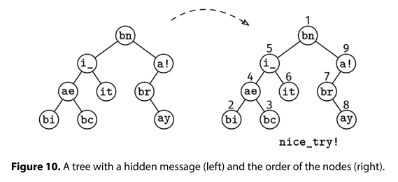
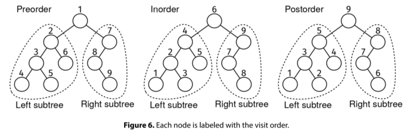

The self-proclaimed 'cryptography expert' in your friend group has devised their own schema to hide messages in binary trees. Each node has a text field with exactly two characters. The first character is either 'b', 'i', or 'a'. The second character is part of the hidden message. To decode the message, you have to read the hidden-message characters in the following order:

If the first character in a node is 'b', the node goes before its left subtree, and the left subtree goes before the right subtree.
If it is 'a', the node goes after its right subtree, and the right subtree goes after the left subtree.
If it is 'i', the node goes after its left subtree and before its right subtree.
Given the root of the binary tree, return the hidden message as a string.

Example:

                 bn
               /    \
             i_      a!
            /  \     /
          ae    it  br
         /  \         \
       bi    bc        ay

Output: "nice_try!"

Constraints:

Assume we have a binary tree node class with a left and right fields, and a text field.
The number of nodes is at most 10^5
The height of the tree is at most 500
The text field is a string of length 2. The first character is either 'b', 'i', or 'a'. The second character is a letter or number.
See Solution
Problem 35.2 - Hidden Message: Solution
Python
Recall the three types of recursive tree traversals:

To decode the message, we use preorder, inorder, or postorder on a node-by-node basis, depending on the first character of each node. We append the letters one by one to a "global" list.

We use a list (i.e., dynamic array) instead of a string because, in Python, it's not possible to append to a string in O(1) time.

Here is the implementation:

class Node:
  def __init__(self, text, left=None, right=None):
    self.text = text
    self.left = left
    self.right = right

def hidden_message(root):
  message = []

  def visit(node):
    if not node:
      return
    if node.text[0] == 'b':
      message.append(node.text[1])
      visit(node.left)
      visit(node.right)
    elif node.text[0] == 'i':
      visit(node.left)
      message.append(node.text[1])
      visit(node.right)
    else:
      visit(node.left)
      visit(node.right)
      message.append(node.text[1])

  visit(root)
  return ''.join(message)
Time & Space Analysis
n: the number of nodes in the tree

h: the height of the tree

Time: O(n) - we visit each node once

Extra space: O(n) - for the decoded message

Tests
Here are some test cases to verify the solution:

def run_tests():

  # Test 1: Example from the book - "nice_try!"
  root1 = Node("bn")
  root1.left = Node("i_")
  root1.left.left = Node("ae")
  root1.left.right = Node("it")
  root1.left.left.left = Node("bi")
  root1.left.left.right = Node("bc")
  root1.right = Node("a!")
  root1.right.left = Node("br")
  root1.right.right = Node("ay")
  # Test 2: Empty tree
  root2 = None

  # Test 3: Single TreeNode with before order
  root3 = Node("bx")

  # Test 4: Single TreeNode with in order
  root4 = Node("ix")

  # Test 5: Single TreeNode with after order
  root5 = Node("ax")

  # Test 6: All before order TreeNodes
  root6 = Node("b1",
               Node("b2",
                    Node(
                        "b4", None, None),
                    Node("b5", None, None)),
               Node("b3",
                    Node(
                        "b6", None, None),
                    Node("b7", None, None)))

  # Test 7: All in order TreeNodes
  root7 = Node("i1",
               Node("i2",
                    Node(
                        "i4", None, None),
                    Node("i5", None, None)),
               Node("i3",
                    Node(
                        "i6", None, None),
                    Node("i7", None, None)))

  # Test 8: All after order TreeNodes
  root8 = Node("a1",
               Node("a2",
                    Node(
                        "a4", None, None),
                    Node("a5", None, None)),
               Node("a3",
                    Node(
                        "a6", None, None),
                    Node("a7", None, None)))

  # Test 9: Mixed orders forming "hello"
  root9 = Node("bh",
               Node("be",
                    Node(
                        "bl", None, None),
                    Node("il", None, None)),
               Node("ao", None, None))

  # Test 10: Invalid first character
  root10 = Node("cx")

  # Test 11: Text too short
  root11 = Node("i")

  # Test 12: Text too long
  root12 = Node("bxy")

  tests = [
      (root1, "nice_try!"),  # Example from book
      (root2, ""),          # Empty tree
      (root3, "x"),         # Single TreeNode before
      (root4, "x"),         # Single TreeNode in
      (root5, "x"),         # Single TreeNode after
      (root6, "1245367"),   # All before order
      (root7, "4251637"),   # All in order
      (root8, "4526731"),   # All after order
      (root9, "hello"),     # Mixed orders spelling "hello"
  ]

  # Run normal test cases
  for i, (root, want) in enumerate(tests, 1):
    got = hidden_message(root)
    assert got == want, f"\nhidden_message(): got: {got}, want: {want}\n"

run_tests()

class Node {
  constructor(text, left = null, right = null) {
    this.text = text;
    this.left = left;
    this.right = right;
  }
}

function hiddenMessage(root) {
  const message = [];

  function visit(node) {
    if (!node) {
      return;
    }
    if (node.text[0] === "b") {
      message.push(node.text[1]);
      visit(node.left);
      visit(node.right);
    } else if (node.text[0] === "i") {
      visit(node.left);
      message.push(node.text[1]);
      visit(node.right);
    } else {
      visit(node.left);
      visit(node.right);
      message.push(node.text[1]);
    }
  }

  visit(root);
  return message.join("");
}
Time & Space Analysis
n: the number of nodes in the tree

h: the height of the tree

Time: O(n) - we visit each node once

Extra space: O(n) - for the decoded message

Tests
Here are some test cases to verify the solution:

function runTests() {
  // Test 1: Example from the book - "nice_try!"
  const root1 = new Node("bn");
  root1.left = new Node("i_");
  root1.left.left = new Node("ae");
  root1.left.right = new Node("it");
  root1.left.left.left = new Node("bi");
  root1.left.left.right = new Node("bc");
  root1.right = new Node("a!");
  root1.right.left = new Node("br");
  root1.right.right = new Node("ay");

  // Test 2: Empty tree
  const root2 = null;

  // Test 3: Single TreeNode with before order
  const root3 = new Node("bx");

  // Test 4: Single TreeNode with in order
  const root4 = new Node("ix");

  // Test 5: Single TreeNode with after order
  const root5 = new Node("ax");

  // Test 6: All before order TreeNodes
  const root6 = new Node(
    "b1",
    new Node("b2", new Node("b4", null, null), new Node("b5", null, null)),
    new Node("b3", new Node("b6", null, null), new Node("b7", null, null)),
  );

  // Test 7: All in order TreeNodes
  const root7 = new Node(
    "i1",
    new Node("i2", new Node("i4", null, null), new Node("i5", null, null)),
    new Node("i3", new Node("i6", null, null), new Node("i7", null, null)),
  );

  // Test 8: All after order TreeNodes
  const root8 = new Node(
    "a1",
    new Node("a2", new Node("a4", null, null), new Node("a5", null, null)),
    new Node("a3", new Node("a6", null, null), new Node("a7", null, null)),
  );

  // Test 9: Mixed orders forming "hello"
  const root9 = new Node(
    "bh",
    new Node("be", new Node("bl", null, null), new Node("il", null, null)),
    new Node("ao", null, null),
  );

  const tests = [
    [root1, "nice_try!"], // Example from book
    [root2, ""], // Empty tree
    [root3, "x"], // Single TreeNode before
    [root4, "x"], // Single TreeNode in
    [root5, "x"], // Single TreeNode after
    [root6, "1245367"], // All before order
    [root7, "4251637"], // All in order
    [root8, "4526731"], // All after order
    [root9, "hello"], // Mixed orders spelling "hello"
  ];

  // Run normal test cases
  for (let i = 0; i < tests.length; i++) {
    const [root, want] = tests[i];
    const got = hiddenMessage(root);
    if (got !== want) {
      throw new Error(`\nhiddenMessage(): got: ${got}, want: ${want}\n`);
    }
  }
}

runTests();

class Node {
  public String text;
  public Node left;
  public Node right;

  public Node(String text) {
    this.text = text;
    this.left = null;
    this.right = null;
  }
}

class HiddenMessage {
  private StringBuilder message;

  private void visit(Node node) {
    if (node == null) {
      return;
    }
    if (node.text.charAt(0) == 'b') {
      message.append(node.text.charAt(1));
      visit(node.left);
      visit(node.right);
    } else if (node.text.charAt(0) == 'i') {
      visit(node.left);
      message.append(node.text.charAt(1));
      visit(node.right);
    } else {
      visit(node.left);
      visit(node.right);
      message.append(node.text.charAt(1));
    }
  }

  public String solve(Node root) {
    message = new StringBuilder();
    visit(root);
    return message.toString();
  }
}
Time & Space Analysis
n: the number of nodes in the tree

h: the height of the tree

Time: O(n) - we visit each node once

Extra space: O(n) - for the decoded message

Tests
Here are some test cases to verify the solution:

class RunTests {
  private static Node createNode(String text) {
    return new Node(text);
  }

  private static Node createNode(String text, Node left, Node right) {
    Node node = new Node(text);
    node.left = left;
    node.right = right;
    return node;
  }

  public void runTests() {
    TestCase[] testCases = {
        // Test 1: Example from the book - "nice_try!"
        new TestCase(createNode("bn",
            createNode("i_",
                createNode("ae",
                    createNode("bi", null, null),
                    createNode("bc", null, null)),
                createNode("it", null, null)),
            createNode("a!",
                createNode("br", null, null),
                createNode("ay", null, null))),
            "nice_try!"),
        // Test 2: Empty tree
        new TestCase(null, ""),
        // Test 3: Single TreeNode with before order
        new TestCase(createNode("bx", null, null), "x"),
        // Test 4: Single TreeNode with in order
        new TestCase(createNode("ix", null, null), "x"),
        // Test 5: Single TreeNode with after order
        new TestCase(createNode("ax", null, null), "x"),
        // Test 6: All before order TreeNodes
        new TestCase(createNode("b1",
            createNode("b2",
                createNode("b4", null, null),
                createNode("b5", null, null)),
            createNode("b3",
                createNode("b6", null, null),
                createNode("b7", null, null))),
            "1245367"),
        // Test 7: All in order TreeNodes
        new TestCase(createNode("i1",
            createNode("i2",
                createNode("i4", null, null),
                createNode("i5", null, null)),
            createNode("i3",
                createNode("i6", null, null),
                createNode("i7", null, null))),
            "4251637"),
        // Test 8: All after order TreeNodes
        new TestCase(createNode("a1",
            createNode("a2",
                createNode("a4", null, null),
                createNode("a5", null, null)),
            createNode("a3",
                createNode("a6", null, null),
                createNode("a7", null, null))),
            "4526731"),
        // Test 9: Mixed orders forming "hello"
        new TestCase(createNode("bh",
            createNode("be",
                createNode("bl", null, null),
                createNode("il", null, null)),
            createNode("ao", null, null)),
            "hello"),
    };

    HiddenMessage solution = new HiddenMessage();
    for (TestCase testCase : testCases) {
      String actual = solution.solve(testCase.root());
      if (!actual.equals(testCase.expected())) {
        throw new RuntimeException(String.format(
            "\nhidden_message(tree): got: %s, want: %s\n",
            actual, testCase.expected()));
      }

    }
  }
}

public class Solution {
  public static void main(String[] args) {
    new RunTests().runTests();
  }
}

record TestCase(Node root, String expected) {
}

