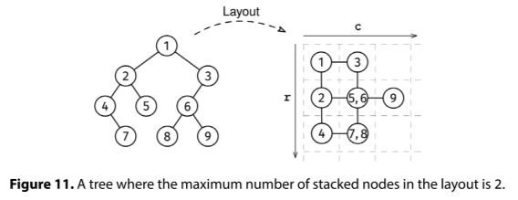
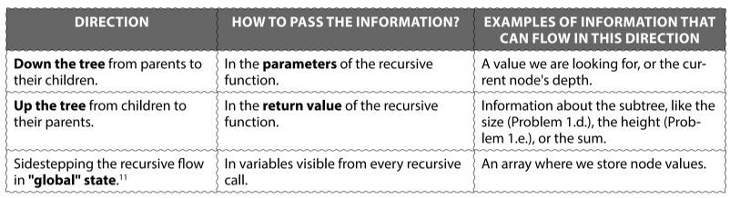

You are given the root of a non-empty binary tree. We lay out the tree on a grid as follows:

We put the root at (r, c) = (0, 0)
We recursively lay out the left subtree one unit below the root (increasing r by one)
We recursively lay out the right subtree one unit to the root's right (increasing c by one)
For instance, the left child of the root goes on (1, 0) and the right child goes on (0, 1).

Two nodes are stacked if they are laid on the same (r, c) coordinates. For instance, root.left.right and root.right.left would overlap at (1, 1).

Return the maximum number of nodes stacked on the same coordinate.

Example:

Input:
         1
       /   \
     2       3
   /  \     /
  4    5   6
   \      / \
    7    8   9

Output: 2
The layout looks like this:

1 -- 3
|    |
2 - 5,6 - 9
|    |
4 - 7,8

The most stacked nodes are 5,6 or 7,8.

Constraints:

The number of nodes is at most 10^5
The height of the tree is at most 500
The value at each node doesn't matter.
See Solution
Problem 35.4 - Tree Layout: Solution
Python
The first question we should ask for binary tree problems is: "What information do I need to pass through the tree, and in which direction?"

Information directions

Let's analyze the flow of information we need for this problem:

Each node needs to know its coordinates in the grid, so we can pass them down the tree.
We use a frequency map to map coordinates to the number of nodes at that coordinate. This map is "global" state -- it's not part of the recursive flow.
Here is the implementation:

class Node:
  def __init__(self, val, left=None, right=None):
    self.val = val
    self.left = left
    self.right = right

def most_stacked(root):
  pos_to_count = dict()

  def visit(node, r, c):
    if not node:
      return
    if (r, c) not in pos_to_count:
      pos_to_count[(r, c)] = 0
    pos_to_count[(r, c)] += 1
    visit(node.left, r + 1, c)
    visit(node.right, r, c + 1)

  visit(root, 0, 0)
  return max(pos_to_count.values())
Time & Space Analysis
n: the number of nodes in the tree

h: the height of the tree

Time: O(n)

Extra space: O(n) - for the frequency map

Tests
Here are some test cases to verify the solution:

def run_tests():
  # Test 1: Example from the book - two nodes stacked
  root1 = Node(1)
  root1.left = Node(2)
  root1.right = Node(3)
  root1.left.left = Node(4)
  root1.left.right = Node(5)
  root1.left.left.right = Node(7)
  root1.right.left = Node(6)
  root1.right.left.left = Node(8)
  root1.right.left.right = Node(9)

  root2 = Node(1)

  root3 = Node(1,
               Node(2),
               Node(3))

  # Test 4: Perfect binary tree of depth 4
  root4 = Node(1,
               Node(2,
                    Node(4,
                         Node(8),
                         Node(9, None, Node(16))),
                    Node(5,
                         Node(10, None, Node(17)),
                         Node(11, Node(18), None))),
               Node(3,
                    Node(6,
                         Node(12),
                         Node(13)),
                    Node(7,
                         Node(14, Node(19), None),
                         Node(15, Node(20), None))))

  tests = [
      (root1, 2),  # Example from book
      (root2, 1),  # Single node
      (root3, 1),
      (root4, 4),
  ]

  for i, (root, want) in enumerate(tests, 1):
    got = most_stacked(root)
    assert got == want, f"\nmost_stacked(): got: {got}, want: {want}\n"

run_tests()
class Node {
  constructor(val, left = null, right = null) {
    this.val = val;
    this.left = left;
    this.right = right;
  }
}

function mostStacked(root) {
  const posToCount = new Map();

  function visit(node, r, c) {
    if (!node) {
      return;
    }
    const key = `${r},${c}`;
    posToCount.set(key, (posToCount.get(key) || 0) + 1);
    visit(node.left, r + 1, c);
    visit(node.right, r, c + 1);
  }

  visit(root, 0, 0);
  return Math.max(...posToCount.values());
}
Time & Space Analysis
n: the number of nodes in the tree

h: the height of the tree

Time: O(n)

Extra space: O(n) - for the frequency map

Tests
Here are some test cases to verify the solution:

function runTests() {
  // Test 1: Example from the book - two nodes stacked
  const root1 = new Node(1);
  root1.left = new Node(2);
  root1.right = new Node(3);
  root1.left.left = new Node(4);
  root1.left.right = new Node(5);
  root1.left.left.right = new Node(7);
  root1.right.left = new Node(6);
  root1.right.left.left = new Node(8);
  root1.right.left.right = new Node(9);

  const root2 = new Node(1);

  const root3 = new Node(1, new Node(2), new Node(3));

  // Test 4: Perfect binary tree of depth 4
  const root4 = new Node(
    1,
    new Node(
      2,
      new Node(4, new Node(8), new Node(9, null, new Node(16))),
      new Node(
        5,
        new Node(10, null, new Node(17)),
        new Node(11, new Node(18), null),
      ),
    ),
    new Node(
      3,
      new Node(6, new Node(12), new Node(13)),
      new Node(
        7,
        new Node(14, new Node(19), null),
        new Node(15, new Node(20), null),
      ),
    ),
  );

  const tests = [
    [root1, 2], // Example from book
    [root2, 1], // Single node
    [root3, 1],
    [root4, 4],
  ];

  for (let i = 0; i < tests.length; i++) {
    const [root, want] = tests[i];
    const got = mostStacked(root);
    if (got !== want) {
      throw new Error(`\nmostStacked(): got: ${got}, want: ${want}\n`);
    }
  }
}

runTests();

class Node {
  public Integer value;
  public Node left;
  public Node right;

  public Node(Integer value) {
    this.value = value;
    this.left = null;
    this.right = null;
  }
}

class MostStacked {
  private Map<String, Integer> posToCount;

  private void visit(Node node, int r, int c) {
    if (node == null) {
      return;
    }
    String key = r + "," + c;
    posToCount.merge(key, 1, Integer::sum);
    visit(node.left, r + 1, c);
    visit(node.right, r, c + 1);
  }

  public int solve(Node root) {
    posToCount = new HashMap<>();
    visit(root, 0, 0);
    int maxCount = 0;
    for (int count : posToCount.values()) {
      maxCount = Math.max(maxCount, count);
    }
    return maxCount;
  }
}
Time & Space Analysis
n: the number of nodes in the tree

h: the height of the tree

Time: O(n)

Extra space: O(n) - for the frequency map

Tests
Here are some test cases to verify the solution:

class RunTests {
  private static Node createNode(int value) {
    return new Node(value);
  }

  private static Node createNode(int value, Node left,
      Node right) {
    Node node = new Node(value);
    node.left = left;
    node.right = right;
    return node;
  }

  public void runTests() {
    TestCase[] testCases = {
        // Test 1: Example from the book - two nodes stacked
        new TestCase(createNode(1,
            createNode(2,
                createNode(4,
                    null,
                    createNode(7, null, null)),
                createNode(5, null, null)),
            createNode(3,
                createNode(6,
                    createNode(8, null, null),
                    createNode(9, null, null)),
                null)),
            2),
        // Test 2: Single node
        new TestCase(createNode(1, null, null), 1),
        // Test 3: Simple tree
        new TestCase(createNode(1,
            createNode(2, null, null),
            createNode(3, null, null)),
            1),
        // Test 4: Perfect binary tree of depth 4
        new TestCase(createNode(1,
            createNode(2,
                createNode(4,
                    createNode(8, null, null),
                    createNode(9,
                        null,
                        createNode(16, null, null))),
                createNode(5,
                    createNode(10,
                        null,
                        createNode(17, null, null)),
                    createNode(11,
                        createNode(18, null, null),
                        null))),
            createNode(3,
                createNode(6,
                    createNode(12, null, null),
                    createNode(13, null, null)),
                createNode(7,
                    createNode(14,
                        createNode(19, null, null),
                        null),
                    createNode(15,
                        createNode(20, null, null),
                        null)))),
            4),
    };

    MostStacked solution = new MostStacked();
    for (TestCase testCase : testCases) {
      int actual = solution.solve(testCase.root);
      if (actual != testCase.expected) {
        throw new RuntimeException(String.format(
            "\nmost_stacked(tree): got: %d, want: %d\n",
            actual, testCase.expected));
      }
    }
  }
}

public class Solution {
  public static void main(String[] args) {
    new RunTests().runTests();
  }
}

class TestCase {
  final Node root;
  final int expected;

  TestCase(Node root, int expected) {
    this.root = root;
    this.expected = expected;
  }
}

