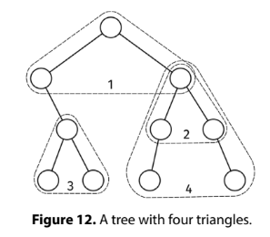

Given the root of a binary tree, return the number of triangles. A triangle is a set of three distinct nodes, a, b, and c, where:

a is the lowest common ancestor of b and c.
b and c have the same depth.
the path from a to b only consists of left children (the nodes in the path can have right children).
the path from a to c only consists of right children (the nodes in the path can have left children).

Example 1:
         0
     /       \
    1         2
     \       / \
      3     4   5
     / \   /     \
    6   7 8       9

Output: 4.
The triangles are: (0, 1, 2), (3, 6, 7), (2, 4, 5), (2, 8, 9).

Example 2:
      0
   /      \
  1        4
 /  \       \
2    3       5
Output: 3.
The triangles are: (0, 1, 4), (1, 2, 3), (0, 2, 5).
Constraints:

The number of nodes is at most 10^5
The height of the tree is at most 500
The value at each node doesn't matter.
See Solution
Problem 35.5 - Triangle Count: Solution
python
The first question we should ask for binary tree problems is: "What information do I need to pass through the tree, and in which direction?"

Information directions
We don't want to count triangles one by one; this would be too inefficient. Instead, we can find, for each node u, the number of triangles with u at the top.

For this, we need to:

Pass two things up the tree: left_side, the number of consecutive left descendants, and right_side, the number of consecutive right descendants.
Compute the triangles with u at the top as min(left_side, right_side).
Add the count to a running total, which can be stored as "global" state.
Here is the implementation:

class Node:
  def __init__(self, val, left=None, right=None):
    self.val = val
    self.left = left
    self.right = right

def triangle_count(root):
  res = 0

  def visit(node):
    nonlocal res
    if not node:
      return 0, 0  # left_side, right_side counts

    left_side, _ = visit(node.left)  # Only care about left descendants
    _, right_side = visit(node.right)  # Only care about right descendants

    # Number of triangles with this node at the top is min of left and right sides
    res += min(left_side, right_side)

    # Return counts of consecutive left/right descendants
    return (left_side + 1, right_side + 1)

  visit(root)
  return res
Time & Space Analysis
n: the number of nodes in the tree

h: the height of the tree

Time: O(n)

Extra space: O(h) - for the call stack

Tests
Here are some test cases to verify the solution:

def run_tests():
  tests = [
      # Example
      (Node(1,
            Node(2,
                 Node(4),
                 Node(5)),
            Node(3,
                 Node(6),
                 Node(7))), 4),
      (None, 0),  # Empty tree
      (Node(1), 0),  # Single node
      # No triangles - only left children
      (Node(1,
            Node(2,
                     Node(3),
                     None),
            None), 0),
      # No triangles - only right children
      (Node(1,
            None,
            Node(2,
                 None,
                 Node(3))), 0),
      (Node(1,
            Node(2),
            Node(3)), 1),
  ]

  for _, (root, want) in enumerate(tests):
    got = triangle_count(root)
    assert got == want, f"\ntriangle_count(): got: {got}, want: {want}\n"

run_tests()

class Node {
  constructor(val, left = null, right = null) {
    this.val = val;
    this.left = left;
    this.right = right;
  }
}

function triangleCount(root) {
  let res = 0;

  function visit(node) {
    if (!node) {
      return [0, 0]; // left_side, right_side counts
    }

    const [leftSide, unused1] = visit(node.left); // Only care about left descendants
    const [unused2, rightSide] = visit(node.right); // Only care about right descendants

    // Number of triangles with this node at the top is min of left and right sides
    res += Math.min(leftSide, rightSide);

    // Return counts of consecutive left/right descendants
    return [leftSide + 1, rightSide + 1];
  }

  visit(root);
  return res;
}
Time & Space Analysis
n: the number of nodes in the tree

h: the height of the tree

Time: O(n)

Extra space: O(h) - for the call stack

Tests
Here are some test cases to verify the solution:

function runTests() {
  const tests = [
    // Example
    [
      new Node(
        1,
        new Node(2, new Node(4), new Node(5)),
        new Node(3, new Node(6), new Node(7)),
      ),
      4,
    ],
    [null, 0], // Empty tree
    [new Node(1), 0], // Single node
    // No triangles - only left children
    [new Node(1, new Node(2, new Node(3), null), null), 0],
    // No triangles - only right children
    [new Node(1, null, new Node(2, null, new Node(3))), 0],
    [new Node(1, new Node(2), new Node(3)), 1],
  ];

  for (let i = 0; i < tests.length; i++) {
    const [root, want] = tests[i];
    const got = triangleCount(root);
    if (got !== want) {
      throw new Error(`\ntriangleCount(): got: ${got}, want: ${want}\n`);
    }
  }
}

runTests();

class Node {
  public int value;
  public Node left;
  public Node right;

  public Node(int value) {
    this.value = value;
    this.left = null;
    this.right = null;
  }
}

class TriangleCount {
  private int res;

  private static class TreeSides {
    final int leftSide;
    final int rightSide;

    TreeSides(int leftSide, int rightSide) {
      this.leftSide = leftSide;
      this.rightSide = rightSide;
    }
  }

  private TreeSides visit(Node node) {
    if (node == null) {
      return new TreeSides(0, 0); // left_side, right_side counts
    }

    TreeSides left = visit(node.left); // Only care about left descendants
    TreeSides right = visit(node.right); // Only care about right descendants

    // Number of triangles with this node at the top is min of left and right
    // sides
    res += Math.min(left.leftSide, right.rightSide);

    // Return counts of consecutive left/right descendants
    return new TreeSides(left.leftSide + 1, right.rightSide + 1);
  }

  public int solve(Node root) {
    res = 0;
    visit(root);
    return res;
  }
}
Time & Space Analysis
n: the number of nodes in the tree

h: the height of the tree

Time: O(n)

Extra space: O(h) - for the call stack

Tests
Here are some test cases to verify the solution:

class RunTests {
  private static Node createNode(int value) {
    return new Node(value);
  }

  private static Node createNode(int value, Node left,
      Node right) {
    Node node = new Node(value);
    node.left = left;
    node.right = right;
    return node;
  }

  public void runTests() {
    TestCase[] testCases = {
        // Example
        new TestCase(createNode(1, null, null), 0), // Single node
        new TestCase(null, 0), // Empty tree

        // Example from the book
        new TestCase(createNode(1,
            createNode(2,
                createNode(4, null, null),
                createNode(5, null, null)),
            createNode(3,
                createNode(6, null, null),
                createNode(7, null, null))),
            4),

        // No triangles - only left children
        new TestCase(createNode(1,
            createNode(2,
                createNode(3, null, null),
                null),
            null),
            0),

        // No triangles - only right children
        new TestCase(createNode(1,
            null,
            createNode(2,
                null,
                createNode(3, null, null))),
            0),

        // Single triangle
        new TestCase(createNode(1,
            createNode(2, null, null),
            createNode(3, null, null)),
            1),
    };

    TriangleCount solution = new TriangleCount();
    for (TestCase testCase : testCases) {
      int actual = solution.solve(testCase.root);
      if (actual != testCase.expected) {
        throw new RuntimeException(String.format(
            "\ntriangle_count(root): got: %d, want: %d\n",
            actual, testCase.expected));
      }
    }
  }
}

public class Solution {
  public static void main(String[] args) {
    new RunTests().runTests();
  }
}

class TestCase {
  final Node root;
  final int expected;

  TestCase(Node root, int expected) {
    this.root = root;
    this.expected = expected;
  }
}

