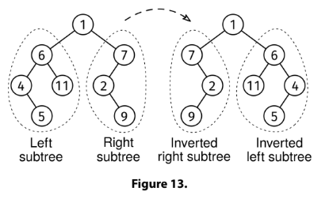

Given a binary tree, invert it by modifying the left and right pointers (do not modify the values in the nodes or create new nodes).

The left subtree of the root should become the right subtree inverted, and the right subtree of the root should become the left subtree inverted.

Return the root of the tree after modifying it.

Example:
     1
   /   \
  6     7
 / \   /
4  11 2
 \     \
  5     9

Output:
     1
   /   \
  7     6
   \   / \
    2 11  4
   /     /
  9     5

Constraints:

The number of nodes is at most 10^5
The height of the tree is at most 500
Each node has a value between 0 and 10^9

See Solution
Problem 35.6 - Invert a Binary Tree: Solution
Python
This problem asks us to modify the binary tree, which is less common among tree problems.

Since the definition of 'inverted' is recursive, we can handle it recursively: we swap the root's children and then invert each subtree.

Here is the implementation:

class Node:
  def __init__(self, val, left=None, right=None):
    self.val = val
    self.left = left
    self.right = right

def invert(root):
  if not root:
    return None
  root.left, root.right = invert(root.right), invert(root.left)
  return root
Time & Space Analysis
n: the number of nodes in the tree

h: the height of the tree

Time: O(n) - we visit each node once

Extra space: O(h) - for the call stack

Tests
Here are some test cases to verify the solution:

def run_tests():

  # Test 1: Example from the book - tree with 4 triangles
  root1a = Node(1,
                Node(6,
                     Node(4,
                          None,
                          Node(5)),
                     Node(11)),
                Node(7,
                     Node(2,
                          None,
                          Node(9)),
                     None))
  root1b = Node(1)
  root1b.left = Node(7)
  root1b.right = Node(6)
  root1b.left.right = Node(2)
  root1b.left.right.left = Node(9)
  root1b.right.left = Node(11)
  root1b.right.right = Node(4)
  root1b.right.right.left = Node(5)

  # Test 2: Empty tree
  root2 = None

  # Test 3: Single node
  root3 = Node(1)

  root4a = Node(1,
                Node(2,
                     Node(3),
                     None),
                None)
  root4b = Node(1,
                None,
                Node(2,
                     None,
                     Node(3)))

  tests = [
      (root1a, root1b),  # Example from book
      (root2, None),  # Empty tree
      (root3, root3),  # Single node
      (root4a, root4b),
  ]

  def same_values(t1, t2):
    if not t1 and not t2:
      return True
    if not t1 or not t2:
      return False
    return (t1.val == t2.val and
            same_values(t1.left, t2.left) and
            same_values(t1.right, t2.right))

  for i, (root, want) in enumerate(tests, 1):
    got = invert(root)
    assert same_values(got, want), f"\ninvert(): got != want\n"

run_tests()
class Node {
  constructor(val, left = null, right = null) {
    this.val = val;
    this.left = left;
    this.right = right;
  }
}

function invert(root) {
  if (!root) {
    return null;
  }
  [root.left, root.right] = [invert(root.right), invert(root.left)];
  return root;
}
Time & Space Analysis
n: the number of nodes in the tree

h: the height of the tree

Time: O(n) - we visit each node once

Extra space: O(h) - for the call stack

Tests
Here are some test cases to verify the solution:

function runTests() {
  // Test 1: Example from the book - tree with 4 triangles
  const root1a = new Node(
    1,
    new Node(6, new Node(4, null, new Node(5)), new Node(11)),
    new Node(7, new Node(2, null, new Node(9)), null),
  );
  const root1b = new Node(1);
  root1b.left = new Node(7);
  root1b.right = new Node(6);
  root1b.left.right = new Node(2);
  root1b.left.right.left = new Node(9);
  root1b.right.left = new Node(11);
  root1b.right.right = new Node(4);
  root1b.right.right.left = new Node(5);

  // Test 2: Empty tree
  const root2 = null;

  // Test 3: Single node
  const root3 = new Node(1);

  const root4a = new Node(1, new Node(2, new Node(3), null), null);
  const root4b = new Node(1, null, new Node(2, null, new Node(3)));

  const tests = [
    [root1a, root1b], // Example from book
    [root2, null], // Empty tree
    [root3, root3], // Single node
    [root4a, root4b],
  ];

  function sameValues(t1, t2) {
    if (!t1 && !t2) {
      return true;
    }
    if (!t1 || !t2) {
      return false;
    }
    return (
      t1.val === t2.val &&
      sameValues(t1.left, t2.left) &&
      sameValues(t1.right, t2.right)
    );
  }

  for (let i = 0; i < tests.length; i++) {
    const [root, want] = tests[i];
    const got = invert(root);
    if (!sameValues(got, want)) {
      throw new Error(`\ninvert(): got != want\n`);
    }
  }
}

runTests();
class Node {
  public Integer value;
  public Node left;
  public Node right;

  public Node(Integer value) {
    this.value = value;
    this.left = null;
    this.right = null;
  }
}

class Invert {
  public Node solve(Node root) {
    if (root == null) {
      return null;
    }
    Node temp = root.left;
    root.left = solve(root.right);
    root.right = solve(temp);
    return root;
  }
}
Time & Space Analysis
n: the number of nodes in the tree

h: the height of the tree

Time: O(n) - we visit each node once

Extra space: O(h) - for the call stack

Tests
Here are some test cases to verify the solution:

class RunTests {
  private static Node createNode(int value) {
    return new Node(value);
  }

  private static Node createNode(int value, Node left, Node right) {
    Node node = new Node(value);
    node.left = left;
    node.right = right;
    return node;
  }

  private static boolean sameValues(Node t1,
      Node t2) {
    if (t1 == null && t2 == null) {
      return true;
    }
    if (t1 == null || t2 == null) {
      return false;
    }
    return (t1.value.equals(t2.value) &&
        sameValues(t1.left, t2.left) &&
        sameValues(t1.right, t2.right));
  }

  public void runTests() {
    TestCase[] testCases = {
        // Test 1: Example from the book - tree with 4 triangles
        new TestCase(createNode(1,
            createNode(6,
                createNode(4,
                    null,
                    createNode(5, null, null)),
                createNode(11, null, null)),
            createNode(7,
                createNode(2,
                    null,
                    createNode(9, null, null)),
                null)),
            createNode(1,
                createNode(7,
                    null,
                    createNode(2,
                        createNode(9, null, null),
                        null)),
                createNode(6,
                    createNode(11, null, null),
                    createNode(4,
                        createNode(5, null, null),
                        null)))),
        // Test 2: Empty tree
        new TestCase(null, null),
        // Test 3: Single node
        new TestCase(createNode(1, null, null),
            createNode(1, null, null)),
        // Test 4: Left-heavy to right-heavy transformation
        new TestCase(createNode(1,
            createNode(2,
                createNode(3, null, null),
                null),
            null),
            createNode(1,
                null,
                createNode(2,
                    null,
                    createNode(3, null, null)))),
    };

    Invert solution = new Invert();
    for (TestCase testCase : testCases) {
      Node actual = solution.solve(testCase.root);
      if (!sameValues(actual, testCase.expected)) {
        throw new RuntimeException(String.format(
            "\ninvert_binary_tree(tree): got != want\n"));
      }
    }
  }
}

public class Solution {
  public static void main(String[] args) {
    new RunTests().runTests();
  }
}

class TestCase {
  final Node root;
  final Node expected;

  TestCase(Node root, Node expected) {
    this.root = root;
    this.expected = expected;
  }
}