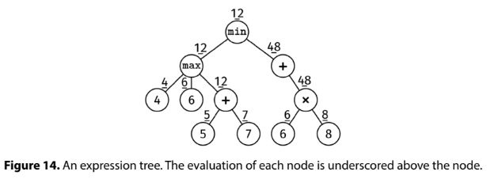

We are given the root of a tree representing an arithmetic expression.

The node definition has three fields: kind, num, and children.

The kind field determines the node's type. There are 'Number' nodes, which have kind = "num", and 'Operation' nodes, where kind is one of "sum", "product", "max", or "min".
The num field is only valid for 'Number' nodes. It stores an integer value.
The children field is only valid for 'Operation' nodes. It stores a list of child nodes (there are no null children).
This is not a binary tree, as nodes can have more than two children. We call this an N-ary tree.

Implement an evaluate() function which evaluates the tree according to the following rules:

The value of a 'Number' node is its num field.
The value of an 'Operation' node depends on its kind: it is the sum, product, max, or min of the children's values (the product of a single value is itself).

Example:

Input:
     min
    /   \
 max     +
 /|\      \
4 6 +      *
   / \    / \
  5   7  6   8

Output: 12
See figure.

Constraints:

The number of nodes is at most 10^5
The height of the tree is at most 500
'Number' nodes have values between -10^4 and 10^4
It is guaranteed that the evaluation at every node will be between -10^4 and 10^4
See Solution
Problem 35.7 - Evaluate Expression Tree: Solution
Python
This problem is based on N-ary trees, which are a bit different than the usual binary trees.

Working with them is not much different than working with binary trees. All the same concepts still apply -- we just need to iterate over the children.

We use this node definition:

class Node:
  def __init__(self, kind, num, children):
    self.kind = kind          # One of "sum", "product", "max", "min", or "num".
    self.num = num            # Only valid when kind is "num".
    self.children = children  # Only valid when kind is not "num".
To tackle this problem, we can walk through the tree. At each node, look at the kind. If it is an operation, apply that operation to the results of its children (not the values in the children themselves). Then, return the evaluation up the tree.

Here is the implementation:

def product(vals):
  res = 1
  for val in vals:
    res *= val
  return res

def evaluate(root):
  if root.kind == "num":
    return root.num
  children_evals = []
  for child in root.children:
    children_evals.append(evaluate(child))
  if root.kind == "sum":
    return sum(children_evals)
  if root.kind == "product":
    return product(children_evals)
  if root.kind == "max":
    return max(children_evals)
  if root.kind == "min":
    return min(children_evals)
  raise ValueError("Invalid node kind")
Time & Space Analysis
n: the number of nodes in the tree

h: the height of the tree

Time: O(n) - we visit each node once

Extra space: O(h) - for the call stack

Tests
Here are some test cases to verify the solution:

def run_tests():
  # Test 0: Example from the book
  root0 = Node("min", None, [
      Node("max", None, [
          Node("num", 4, None),
          Node("num", 6, None),
          Node("sum", None, [
              Node("num", 5, None),
              Node("num", 7, None)
          ])
      ]),
      Node("sum", None, [
          Node("product", None, [
              Node("num", 6, None),
              Node("num", 8, None)
          ])
      ])
  ])

  # Test 1: Example - (2 + 3) * 4
  root1 = Node("product", None, [
      Node("sum", None, [
          Node("num", 2, None),
          Node("num", 3, None)
      ]),
      Node("num", 4, None)
  ])

  # Test 2: Single number node
  root2 = Node("num", 5, None)

  # Test 3: Empty sum node
  root3 = Node("sum", None, [])

  # Test 4: Empty product node
  root4 = Node("product", None, [])

  # Test 5: Complex expression with all operations
  # min(2, max(3,4)) + product(1,2,3)
  root5 = Node("sum", None, [
      Node("min", None, [
          Node("num", 2, None),
          Node("max", None, [
              Node("num", 3, None),
              Node("num", 4, None)
          ])
      ]),
      Node("product", None, [
          Node("num", 1, None),
          Node("num", 2, None),
          Node("num", 3, None)
      ])
  ])

  tests = [
      (root0, 12),
      (root1, 20),  # (2 + 3) * 4 = 20
      (root2, 5),   # Single number
      (root3, 0),   # Empty sum = 0
      (root4, 1),   # Empty product = 1
      (root5, 8),   # min(2,max(3,4)) + product(1,2,3) = 2 + 6 = 8
      (root0.children[0], 12),
      (root0.children[1], 48),
  ]

  for i, (root, want) in enumerate(tests, 1):
    got = evaluate(root)
    assert got == want, f"\nevaluate(root{i}): got: {got}, want: {want}\n"

run_tests()
class Node {
  constructor(kind, num, children) {
    this.kind = kind; // One of "sum", "product", "max", "min", or "num".
    this.num = num; // Only valid when kind is "num".
    this.children = children; // Only valid when kind is not "num".
  }
}
To tackle this problem, we can walk through the tree. At each node, look at the kind. If it is an operation, apply that operation to the results of its children (not the values in the children themselves). Then, return the evaluation up the tree.

Here is the implementation:

function product(vals) {
  return vals.reduce((acc, val) => acc * val, 1);
}

function evaluate(root) {
  if (root.kind === "num") {
    return root.num;
  }
  const childrenEvals = root.children.map((child) => evaluate(child));
  if (root.kind === "sum") {
    return childrenEvals.reduce((acc, val) => acc + val, 0);
  }
  if (root.kind === "product") {
    return product(childrenEvals);
  }
  if (root.kind === "max") {
    return Math.max(...childrenEvals);
  }
  if (root.kind === "min") {
    return Math.min(...childrenEvals);
  }
  throw new Error("Invalid node kind");
}
Time & Space Analysis
n: the number of nodes in the tree

h: the height of the tree

Time: O(n) - we visit each node once

Extra space: O(h) - for the call stack

Tests
Here are some test cases to verify the solution:

function runTests() {
  // Test 0: Example from the book
  const root0 = new Node("min", null, [
    new Node("max", null, [
      new Node("num", 4, null),
      new Node("num", 6, null),
      new Node("sum", null, [
        new Node("num", 5, null),
        new Node("num", 7, null),
      ]),
    ]),
    new Node("sum", null, [
      new Node("product", null, [
        new Node("num", 6, null),
        new Node("num", 8, null),
      ]),
    ]),
  ]);

  // Test 1: Example - (2 + 3) * 4
  const root1 = new Node("product", null, [
    new Node("sum", null, [new Node("num", 2, null), new Node("num", 3, null)]),
    new Node("num", 4, null),
  ]);

  // Test 2: Single number node
  const root2 = new Node("num", 5, null);

  // Test 3: Empty sum node
  const root3 = new Node("sum", null, []);

  // Test 4: Empty product node
  const root4 = new Node("product", null, []);

  // Test 5: Complex expression with all operations
  // min(2, max(3,4)) + product(1,2,3)
  const root5 = new Node("sum", null, [
    new Node("min", null, [
      new Node("num", 2, null),
      new Node("max", null, [
        new Node("num", 3, null),
        new Node("num", 4, null),
      ]),
    ]),
    new Node("product", null, [
      new Node("num", 1, null),
      new Node("num", 2, null),
      new Node("num", 3, null),
    ]),
  ]);

  const tests = [
    [root0, 12],
    [root1, 20], // (2 + 3) * 4 = 20
    [root2, 5], // Single number
    [root3, 0], // Empty sum = 0
    [root4, 1], // Empty product = 1
    [root5, 8], // min(2,max(3,4)) + product(1,2,3) = 2 + 6 = 8
    [root0.children[0], 12],
    [root0.children[1], 48],
  ];

  for (let i = 0; i < tests.length; i++) {
    const [root, want] = tests[i];
    const got = evaluate(root);
    if (got !== want) {
      throw new Error(`\nevaluate(root${i + 1}): got: ${got}, want: ${want}\n`);
    }
  }
}

runTests();
class Node {
  String kind; // One of "sum", "product", "max", "min", or "num"
  int num; // Only valid when kind is "num"
  List<Node> children; // Only valid when kind is not "num"

  Node(String kind, int num, List<Node> children) {
    this.kind = kind;
    this.num = num;
    this.children = children;
  }
}
To tackle this problem, we can walk through the tree. At each node, look at the kind. If it is an operation, apply that operation to the results of its children (not the values in the children themselves). Then, return the evaluation up the tree.

Here is the implementation:

class Evaluate {
  private int product(List<Integer> vals) {
    return vals.stream().reduce(1, (a, b) -> a * b);
  }

  public int solve(Node root) {
    if (root.kind.equals("num")) {
      return root.num;
    }
    List<Integer> childrenEvals = new ArrayList<>();
    for (Node child : root.children) {
      childrenEvals.add(solve(child));
    }
    switch (root.kind) {
    case "sum":
      return childrenEvals.stream().mapToInt(Integer::intValue).sum();
    case "product":
      return product(childrenEvals);
    case "max":
      return Collections.max(childrenEvals);
    case "min":
      return Collections.min(childrenEvals);
    default:
      throw new RuntimeException("Invalid node kind");
    }
  }
}
Time & Space Analysis
n: the number of nodes in the tree

h: the height of the tree

Time: O(n) - we visit each node once

Extra space: O(h) - for the call stack

Tests
Here are some test cases to verify the solution:

class RunTests {
  public void runTests() {
    Object[][] tests = {
        // Test 0: Example from the book
        { new Node("min", 0, Arrays.asList(
            new Node("max", 0, Arrays.asList(
                new Node("num", 4, null),
                new Node("num", 6, null),
                new Node("sum", 0, Arrays.asList(
                    new Node("num", 5, null),
                    new Node("num", 7, null))))),
            new Node("sum", 0, Arrays.asList(
                new Node("product", 0, Arrays.asList(
                    new Node("num", 6, null),
                    new Node("num", 8, null))))))),
            12 },
        // Test 1: Example - (2 + 3) * 4
        { new Node("product", 0, Arrays.asList(
            new Node("sum", 0, Arrays.asList(
                new Node("num", 2, null),
                new Node("num", 3, null))),
            new Node("num", 4, null))),
            20 },
        // Test 2: Single number node
        { new Node("num", 5, null), 5 },
        // Test 3: Empty sum node
        { new Node("sum", 0, new ArrayList<>()), 0 },
        // Test 4: Empty product node
        { new Node("product", 0, new ArrayList<>()), 1 },
        // Test 5: Complex expression with all operations
        // min(2, max(3,4)) + product(1,2,3)
        { new Node("sum", 0, Arrays.asList(
            new Node("min", 0, Arrays.asList(
                new Node("num", 2, null),
                new Node("max", 0, Arrays.asList(
                    new Node("num", 3, null),
                    new Node("num", 4, null))))),
            new Node("product", 0, Arrays.asList(
                new Node("num", 1, null),
                new Node("num", 2, null),
                new Node("num", 3, null))))),
            8 }
    };

    Evaluate solution = new Evaluate();
    for (int i = 0; i < tests.length; i++) {
      Node root = (Node) tests[i][0];
      int want = (int) tests[i][1];
      int got = solution.solve(root);
      if (got != want) {
        throw new RuntimeException(String.format(
            "\nevaluate(root%d): got: %d, want: %d\n",
            i + 1, got, want));
      }
    }
  }
}

public class Solution {
  public static void main(String[] args) {
    new RunTests().runTests();
  }
}

Recipe 1 - Node-depth Queue

def node_depth_queue_recipe(root):
  Q = Queue()
  Q.add((root, 0))
  while not Q.empty():
    node, depth = Q.pop()
    if not node:
      continue
    # Do something with node and depth.
    Q.add((node.left, depth+1))
    Q.add((node.right, depth+1))
