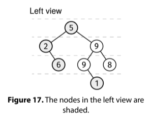

Recipe 1 - Node-depth Queue

def node_depth_queue_recipe(root):
  Q = Queue()
  Q.add((root, 0))
  while not Q.empty():
    node, depth = Q.pop()
    if not node:
      continue
    # Do something with node and depth.
    Q.add((node.left, depth+1))
    Q.add((node.right, depth+1))

    Given the root of a binary tree, return its left view. The left view is an array with the value of the first node on each layer, ordered from top to bottom.

Example:

Input:
    1
   / \
  2   3
   \   \
    5   6
         \
          7

Output: [1, 2, 5, 7]

Constraints:

The number of nodes is at most 10^5
Each node has a value between 0 and 10^9
See Solution
Problem 35.8 - Left View: Solution
Python
This problem requires a level-order traversal. Furthermore, we need to track the level of the nodes. We can do this with the Node–Depth Queue recipe:

node_depth_queue_recipe(root):
  Q = Queue()
  Q.add((root, 0))
  while not Q.empty():
    node, depth = Q.pop()
    if not node:
      continue
    # Do something with node and depth.
    Q.add((node.left, depth+1))
    Q.add((node.right, depth+1))
Here is the implementation:

class Node:
  def __init__(self, val, left=None, right=None):
    self.val = val
    self.left = left
    self.right = right

def left_view(root):
  if not root:
    return []
  Q = deque()
  Q.append((root, 0))
  res = [root.val]
  current_depth = 0
  while Q:
    node, depth = Q.popleft()
    if not node:
      continue
    if depth == current_depth + 1:
      res.append(node.val)
      current_depth += 1
    Q.append((node.left, depth + 1))
    Q.append((node.right, depth + 1))
  return res
Time & Space Analysis
n: the number of nodes in the tree

Time: O(n) - we visit each node once

Extra space: O(n) - for the queue and left view array

Tests
Here are some test cases to verify the solution:

def run_tests():

  # Test 1
  root1 = Node(1,
               Node(2,
                    Node(4),
                    Node(5)),
               Node(3,
                    None,
                    Node(6)))

  # Test 2: Empty tree
  root2 = None

  # Test 3: Single node
  root3 = Node(1)

  # Test 4: Only right children
  root4 = Node(1,
               None,
               Node(2,
                    None,
                    Node(3)))

  # Test 5: Only left children
  root5 = Node(1,
               Node(2,
                    Node(3),
                    None),
               None)

  # Test 6: Example from the book
  root6 = Node(5,
               Node(2,
                    None,
                    Node(6)),
               Node(9,
                    Node(9,
                         None,
                         Node(1)),
                    Node(8)))

  tests = [
      (root1, [1, 2, 4]),  # Example
      (root2, []),  # Empty tree
      (root3, [1]),  # Single node
      (root4, [1, 2, 3]),  # Only right children
      (root5, [1, 2, 3]),  # Only left children
      (root6, [5, 2, 6, 1])  # Example from the book
  ]

  for i, (root, want) in enumerate(tests):
    got = left_view(root)
    assert got == want, f"\nleft_view(root{i + 1}): got: {got}, want: {want}\n"

run_tests()

node_depth_queue_recipe(root):
  Q = Queue()
  Q.add((root, 0))
  while not Q.empty():
    node, depth = Q.pop()
    if not node:
      continue
    # Do something with node and depth.
    Q.add((node.left, depth+1))
    Q.add((node.right, depth+1))
Here is the implementation:

class Node {
  constructor(val, left = null, right = null) {
    this.val = val;
    this.left = left;
    this.right = right;
  }
}

function leftView(root) {
  if (!root) {
    return [];
  }
  const Q = new Queue();
  Q.push([root, 0]);
  const res = [root.val];
  let currentDepth = 0;
  while (!Q.empty()) {
    const [node, depth] = Q.pop();
    if (!node) {
      continue;
    }
    if (depth === currentDepth + 1) {
      res.push(node.val);
      currentDepth += 1;
    }
    Q.push([node.left, depth + 1]);
    Q.push([node.right, depth + 1]);
  }
  return res;
}
For JS, we need to provide a queue implementation (or use a third-party one). Here is the linked-list based queue we discussed in the Linked Lists chapter.

class QueueNode {
  constructor(val) {
    this.val = val;
    this.next = null;
  }
}

class Queue {
  constructor() {
    this.head = null;
    this.tail = null;
    this._size = 0;
  }

  empty() {
    return !this.head;
  }

  size() {
    return this._size;
  }

  push(val) {
    const newNode = new QueueNode(val);
    if (this.tail) {
      this.tail.next = newNode;
    }

    this.tail = newNode;
    if (!this.head) {
      this.head = newNode;
    }
    this._size++;
  }

  pop() {
    if (this.empty()) {
      throw new Error("empty queue");
    }
    const val = this.head.val;
    this.head = this.head.next;
    if (!this.head) {
      this.tail = null;
    }
    this._size--;
    return val;
  }
}
Learn more about what to do if you need a Queue in an interview in JS at nilmamano.com/blog/js-queues.

Time & Space Analysis
n: the number of nodes in the tree

Time: O(n) - we visit each node once

Extra space: O(n) - for the queue and left view array

Tests
Here are some test cases to verify the solution:

function runTests() {
  // Test 1
  const root1 = new Node(
    1,
    new Node(2, new Node(4), new Node(5)),
    new Node(3, null, new Node(6)),
  );

  // Test 2: Empty tree
  const root2 = null;

  // Test 3: Single node
  const root3 = new Node(1);

  // Test 4: Only right children
  const root4 = new Node(1, null, new Node(2, null, new Node(3)));

  // Test 5: Only left children
  const root5 = new Node(1, new Node(2, new Node(3), null), null);

  // Test 6: Example from the book
  const root6 = new Node(
    5,
    new Node(2, null, new Node(6)),
    new Node(9, new Node(9, null, new Node(1)), new Node(8)),
  );

  const tests = [
    [root1, [1, 2, 4]], // Example
    [root2, []], // Empty tree
    [root3, [1]], // Single node
    [root4, [1, 2, 3]], // Only right children
    [root5, [1, 2, 3]], // Only left children
    [root6, [5, 2, 6, 1]], // Example from the book
  ];

  for (const [i, [root, want]] of tests.entries()) {
    const got = leftView(root);
    if (JSON.stringify(got) !== JSON.stringify(want)) {
      throw new Error(`\nleftView(root${i + 1}): got: ${got}, want: ${want}\n`);
    }
  }
}

runTests();

node_depth_queue_recipe(root):
  Q = Queue()
  Q.add((root, 0))
  while not Q.empty():
    node, depth = Q.pop()
    if not node:
      continue
    # Do something with node and depth.
    Q.add((node.left, depth+1))
    Q.add((node.right, depth+1))
Here is the implementation:

class Node {
  public Integer value;
  public Node left;
  public Node right;

  public Node(Integer value) {
    this.value = value;
    this.left = null;
    this.right = null;
  }
}

class LeftView {
  public List<Integer> solve(Node root) {
    if (root == null) {
      return Collections.emptyList();
    }

    List<Integer> res = new ArrayList<>();
    Queue<Map.Entry<Node, Integer>> queue = new LinkedList<>();
    queue.offer(new AbstractMap.SimpleEntry<>(root, 0));
    int currentDepth = -1;

    while (!queue.isEmpty()) {
      Map.Entry<Node, Integer> entry = queue.poll();
      Node node = entry.getKey();
      int depth = entry.getValue();
      if (node == null) {
        continue;
      }
      if (depth == currentDepth + 1) {
        res.add(node.value);
        currentDepth++;
      }
      queue.offer(new AbstractMap.SimpleEntry<>(node.left, depth + 1));
      queue.offer(new AbstractMap.SimpleEntry<>(node.right, depth + 1));
    }
    return res;
  }
}
Time & Space Analysis
n: the number of nodes in the tree

Time: O(n) - we visit each node once

Extra space: O(n) - for the queue and left view array

Tests
Here are some test cases to verify the solution:

class RunTests {
  private static Node createNode(int value) {
    return new Node(value);
  }

  private static Node createNode(int value, Node left, Node right) {
    Node node = new Node(value);
    node.left = left;
    node.right = right;
    return node;
  }

  public void runTests() {
    TestCase[] testCases = {
        // Test 1
        new TestCase(createNode(1,
            createNode(2,
                createNode(4, null, null),
                createNode(5, null, null)),
            createNode(3,
                null,
                createNode(6, null, null))),
            Arrays.asList(1, 2, 4)),
        // Test 2: Empty tree
        new TestCase(null,
            Collections.<Integer>emptyList()),
        // Test 3: Single node
        new TestCase(createNode(1, null, null),
            Arrays.asList(1)),
        // Test 4: Only right children
        new TestCase(createNode(1,
            null,
            createNode(2,
                null,
                createNode(3, null, null))),
            Arrays.asList(1, 2, 3)),
        // Test 5: Only left children
        new TestCase(createNode(1,
            createNode(2,
                createNode(3, null, null),
                null),
            null),
            Arrays.asList(1, 2, 3)),
        // Test 6: Example from the book
        new TestCase(createNode(5,
            createNode(2,
                null,
                createNode(6, null, null)),
            createNode(9,
                createNode(9,
                    null,
                    createNode(1, null, null)),
                createNode(8, null, null))),
            Arrays.asList(5, 2, 6, 1)),
    };

    LeftView solution = new LeftView();
    for (TestCase testCase : testCases) {
      List<Integer> actual = solution.solve(testCase.root);
      if (!actual.equals(testCase.expected)) {
        throw new RuntimeException(String.format(
            "\nleft_view(tree): got: %s, want: %s\n",
            actual, testCase.expected));
      }
    }
  }
}

public class Solution {
  public static void main(String[] args) {
    new RunTests().runTests();
  }
}

class TestCase {
  final Node root;
  final List<Integer> expected;

  TestCase(Node root, List<Integer> expected) {
    this.root = root;
    this.expected = Collections.unmodifiableList(new ArrayList<>(expected));
  }
}
