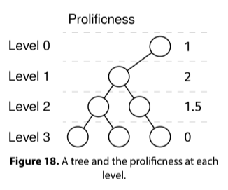

Given the root of a binary tree, return the most prolific level. The prolificness of a level is the average number of children over all the nodes in that level.

Return -1 if the tree is empty. In case of a tie, return any of the most prolific levels.

Example:

Input:
      O
     /
    O
   / \
  O   O
 / \   \
O   O   O

Output: 1
- Level 0 has prolificness 1
- Level 1 has prolificness 2
- Level 2 has prolificness 1.5
- Level 3 has prolificness 0
The most prolific level is 1, with a prolificness of 2.

Constraints:

The number of nodes is at most 10^5
The value at each node doesn't matter.
See Solution
Problem 35.9 - Most Prolific Level: Solution
Python
The key property for this problem is that the prolificness of level i is the number of nodes at level i+1 divided by the number of nodes at level i.

Using the Node–Depth Queue recipe, we can easily determine the number of nodes at each depth. Then, we just need to compute the prolificness at each level.

Here is the recipe:

node_depth_queue_recipe(root):
  Q = Queue()
  Q.add((root, 0))
  while not Q.empty():
    node, depth = Q.pop()
    if not node:
      continue
    # Do something with node and depth.
    Q.add((node.left, depth+1))
    Q.add((node.right, depth+1))
Here is the implementation:

class Node:
  def __init__(self, val, left=None, right=None):
    self.val = val
    self.left = left
    self.right = right

def most_prolific_level(root):
  
  def level_counts(root):
    Q = deque()
    Q.append((root, 0))
    level_count = defaultdict(int)
    while Q:
      node, depth = Q.popleft()
      if not node:
        continue
      level_count[depth] += 1
      Q.append((node.left, depth + 1))
      Q.append((node.right, depth + 1))
    return level_count

  level_count = level_counts(root)
  res = -1
  max_prolificness = -1  # Less than any valid prolificness.
  for level in level_count:
    next_level_count = level_count.get(level + 1, 0)
    prolificness = next_level_count / level_count[level]
    if prolificness > max_prolificness:
      max_prolificness = prolificness
      res = level
  return res
Time & Space Analysis
n: the number of nodes in the tree

Time: O(n) - we visit each node once

Extra space: O(n) - for the queue and level counts

Tests
Here are some test cases to verify the solution:

def run_tests():
  # Test 1
  root1 = Node(5,
               Node(2,
                    None,
                    Node(6)),
               Node(9,
                    Node(9,
                         None,
                         Node(1)),
                    Node(8)))

  # Test 2: Empty tree
  root2 = None

  # Test 3: Single node
  root3 = Node(1)

  # Test 4: Perfect binary tree
  root4 = Node(1,
               Node(2,
                    Node(4),
                    Node(5)),
               Node(3,
                    Node(6),
                    Node(7)))

  # Test 5: Unbalanced tree
  root5 = Node(1,
               Node(2,
                    Node(4,
                         Node(8),
                         Node(9)),
                    Node(5)),
               Node(3))

  # Test 6: Example from the book
  root6 = Node(1,
               Node(2,
                    Node(4,
                         Node(8),
                         Node(9)),
                    Node(5,
                         None,
                         Node(11))),
               None)
  # Test 7
  root7 = Node(1,
               Node(2,
                    Node(4,
                         Node(8),
                         Node(9))))
  tests = [
      (root1, [0]),
      (root2, [-1]),  # Empty tree
      (root3, [0]),  # Single node: level 0 has prolificness 0
      # Level 0->1 and 1->2 both have prolificness 2
      (root4, [0, 1]), # Both level 0 and 1 are valid answers
      (root5, [0]),
      (root6, [1]),
      (root7, [2]),
  ]

  for i, (root, valid_wants) in enumerate(tests):
    got = most_prolific_level(root)
    assert got in valid_wants, f"\nmost_prolific_level(root{
        i + 1}): got: {got}, valid_wants: {valid_wants}\n"

run_tests()

node_depth_queue_recipe(root):
  Q = Queue()
  Q.add((root, 0))
  while not Q.empty():
    node, depth = Q.pop()
    if not node:
      continue
    # Do something with node and depth.
    Q.add((node.left, depth+1))
    Q.add((node.right, depth+1))
Here is the implementation:

class Node {
  constructor(val, left = null, right = null) {
    this.val = val;
    this.left = left;
    this.right = right;
  }
}

function mostProlificLevel(root) {

  function levelCounts(root) {
    const Q = new Queue();
    Q.push([root, 0]);
    const levelCount = new Map();
    while (!Q.empty()) {
      const [node, depth] = Q.pop();
      if (!node) {
        continue;
      }
      levelCount.set(depth, (levelCount.get(depth) || 0) + 1);
      Q.push([node.left, depth + 1]);
      Q.push([node.right, depth + 1]);
    }
    return levelCount;
  }

  const levelCount = levelCounts(root);
  let res = -1;
  let maxProlificness = -1; // Less than any valid prolificness
  for (const [level, count] of levelCount.entries()) {
    const nextLevelCount = levelCount.get(level + 1) || 0;
    const prolificness = nextLevelCount / count;
    if (prolificness > maxProlificness) {
      maxProlificness = prolificness;
      res = level;
    }
  }
  return res;
}
For JS, we need to provide a queue implementation (or use a third-party one). Here is the linked-list based queue we discussed in the Linked Lists chapter.

class QueueNode {
  constructor(val) {
    this.val = val;
    this.next = null;
  }
}

class Queue {
  constructor() {
    this.head = null;
    this.tail = null;
    this._size = 0;
  }

  empty() {
    return !this.head;
  }

  size() {
    return this._size;
  }

  push(val) {
    const newNode = new QueueNode(val);
    if (this.tail) {
      this.tail.next = newNode;
    }

    this.tail = newNode;
    if (!this.head) {
      this.head = newNode;
    }
    this._size++;
  }

  pop() {
    if (this.empty()) {
      throw new Error("empty queue");
    }
    const val = this.head.val;
    this.head = this.head.next;
    if (!this.head) {
      this.tail = null;
    }
    this._size--;
    return val;
  }
}
Learn more about what to do if you need a Queue in an interview in JS at nilmamano.com/blog/js-queues.

Time & Space Analysis
n: the number of nodes in the tree

Time: O(n) - we visit each node once

Extra space: O(n) - for the queue and level counts

Tests
Here are some test cases to verify the solution:

function runTests() {
  // Test 1
  const root1 = new Node(
    5,
    new Node(2, null, new Node(6)),
    new Node(9, new Node(9, null, new Node(1)), new Node(8)),
  );

  // Test 2: Empty tree
  const root2 = null;

  // Test 3: Single node
  const root3 = new Node(1);

  // Test 4: Perfect binary tree
  const root4 = new Node(
    1,
    new Node(2, new Node(4), new Node(5)),
    new Node(3, new Node(6), new Node(7)),
  );

  // Test 5: Unbalanced tree
  const root5 = new Node(
    1,
    new Node(2, new Node(4, new Node(8), new Node(9)), new Node(5)),
    new Node(3),
  );

  // Test 6: Example from the book
  const root6 = new Node(
    1,
    new Node(
      2,
      new Node(4, new Node(8), new Node(9)),
      new Node(5, null, new Node(11)),
    ),
    null,
  );

  // Test 7
  const root7 = new Node(1, new Node(2, new Node(4, new Node(8), new Node(9))));

  const tests = [
    [root1, [0]],
    [root2, [-1]], // Empty tree
    [root3, [0]], // Single node: level 0 has prolificness 0
    // Level 0->1 and 1->2 both have prolificness 2
    [root4, [0, 1]], // Both level 0 and 1 are valid answers
    [root5, [0]],
    [root6, [1]],
    [root7, [2]],
  ];

  for (let i = 0; i < tests.length; i++) {
    const [root, validWants] = tests[i];
    const got = mostProlificLevel(root);
    if (!validWants.includes(got)) {
      throw new Error(
        `\nmostProlificLevel(root${i + 1}): got: ${got}, valid_wants: ${JSON.stringify(validWants)}\n`,
      );
    }
  }
}

runTests();

node_depth_queue_recipe(root):
  Q = Queue()
  Q.add((root, 0))
  while not Q.empty():
    node, depth = Q.pop()
    if not node:
      continue
    # Do something with node and depth.
    Q.add((node.left, depth+1))
    Q.add((node.right, depth+1))
Here is the implementation:

class Node {
  public Integer value;
  public Node left;
  public Node right;

  public Node(Integer value) {
    this.value = value;
    this.left = null;
    this.right = null;
  }
}

class MostProlificLevel {
  private Map<Integer, Integer> levelCounts(Node root) {
    Queue<Map.Entry<Node, Integer>> queue = new LinkedList<>();
    queue.offer(new AbstractMap.SimpleEntry<>(root, 0));
    Map<Integer, Integer> levelCount = new HashMap<>();

    while (!queue.isEmpty()) {
      Map.Entry<Node, Integer> entry = queue.poll();
      Node node = entry.getKey();
      int depth = entry.getValue();
      if (node == null) {
        continue;
      }
      levelCount.put(depth, levelCount.getOrDefault(depth, 0) + 1);
      queue.offer(new AbstractMap.SimpleEntry<>(node.left, depth + 1));
      queue.offer(new AbstractMap.SimpleEntry<>(node.right, depth + 1));
    }
    return levelCount;
  }

  public int solve(Node root) {
    if (root == null) {
      return -1;
    }
    Map<Integer, Integer> levelCount = levelCounts(root);
    int res = -1;
    double maxProlificness = -1; // Less than any valid prolificness

    for (Map.Entry<Integer, Integer> entry : levelCount.entrySet()) {
      int level = entry.getKey();
      int count = entry.getValue();
      int nextLevelCount = levelCount.getOrDefault(level + 1, 0);
      double prolificness = (double) nextLevelCount / count;
      if (prolificness > maxProlificness ||
          (prolificness == maxProlificness && level < res)) {
        maxProlificness = prolificness;
        res = level;
      }
    }
    return res;
  }
}
Time & Space Analysis
n: the number of nodes in the tree

Time: O(n) - we visit each node once

Extra space: O(n) - for the queue and level counts

Tests
Here are some test cases to verify the solution:

class RunTests {
  private static Node createNode(int value) {
    return new Node(value);
  }

  private static Node createNode(int value, Node left, Node right) {
    Node node = new Node(value);
    node.left = left;
    node.right = right;
    return node;
  }

  private boolean contains(int[] arr, int value) {
    for (int v : arr) {
      if (v == value) {
        return true;
      }
    }
    return false;
  }

  public void runTests() {
    TestCase[] testCases = {
        // Test 1
        new TestCase(createNode(5,
            createNode(2,
                null,
                createNode(6, null, null)),
            createNode(9,
                createNode(9,
                    null,
                    createNode(1, null, null)),
                createNode(8, null, null))),
            new int[] { 0 }),
        // Test 2: Empty tree
        new TestCase(null, new int[] { -1 }),
        // Test 3: Single node
        new TestCase(createNode(1, null, null), new int[] { 0 }),
        // Test 4: Perfect binary tree
        new TestCase(createNode(1,
            createNode(2,
                createNode(4, null, null),
                createNode(5, null, null)),
            createNode(3,
                createNode(6, null, null),
                createNode(7, null, null))),
            new int[] { 0, 1 }), // Both level 0 and 1 are valid answers
        // Test 5: Unbalanced tree
        new TestCase(createNode(1,
            createNode(2,
                createNode(4,
                    createNode(8, null, null),
                    createNode(9, null, null)),
                createNode(5, null, null)),
            createNode(3, null, null)),
            new int[] { 0 }),
        // Test 6: Example from the book
        new TestCase(createNode(1,
            createNode(2,
                createNode(4,
                    createNode(8, null, null),
                    createNode(9, null, null)),
                createNode(5,
                    null,
                    createNode(11, null, null))),
            null),
            new int[] { 1 }),
        // Test 7
        new TestCase(createNode(1,
            createNode(2,
                createNode(4,
                    createNode(8, null, null),
                    createNode(9, null, null)),
                null),
            null),
            new int[] { 2 }),
    };

    MostProlificLevel solution = new MostProlificLevel();
    for (TestCase testCase : testCases) {
      int actual = solution.solve(testCase.root);
      if (!contains(testCase.validWants, actual)) {
        throw new RuntimeException(String.format(
            "\nmost_prolific_level(tree): got: %d, valid_wants: %s\n",
            actual, Arrays.toString(testCase.validWants)));
      }
    }
  }
}

public class Solution {
  public static void main(String[] args) {
    new RunTests().runTests();
  }
}

class TestCase {
  final Node root;
  final int[] validWants; // There can be multiple valid answers

  TestCase(Node root, int[] validWants) {
    this.root = root;
    this.validWants = validWants;
  }
}