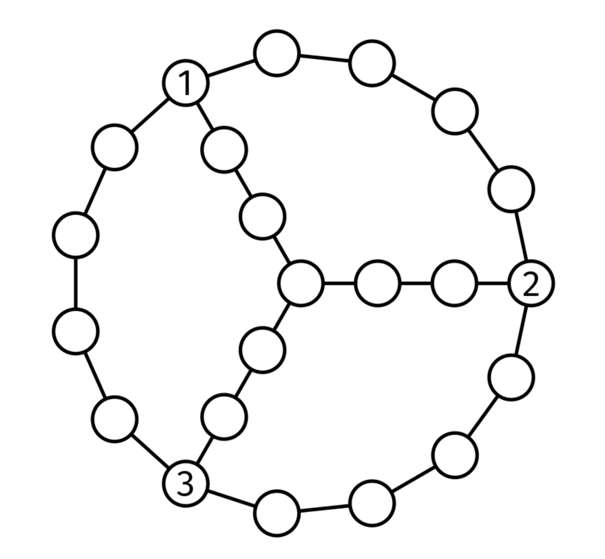

Three friends want to meet. They live in nodes in a connected, undirected graph.

You are given the adjacency list, graph, and the nodes where they start, node1, node2, and node3.

Return the minimum number of edges they need to traverse in total between the three to meet at any node in the graph.

For example, for this graph:

Graph Hangout
If the three friends start at the nodes labeled 1, 2 and 3, they can each get to the middle node by traversing 3 edges. The next closest meeting point is at one of the starting nodes, where the other two friends have to traverse 5 edges each. Thus, the answer is 9.

Example 1:
graph = [
    [1, 4],   # Node 0
    [0, 2],   # Node 1
    [1, 3],   # Node 2
    [2, 4],   # Node 3
    [0, 3]    # Node 4
]
node1 = 0
node2 = 2
node3 = 4

Output: 3
They can meet at node 0 or 4 in combined 3 steps

Example 2:
graph = [
    [1, 2, 3],  # Node 0
    [0, 2, 3],  # Node 1
    [0, 1, 3],  # Node 2
    [0, 1, 2]   # Node 3
]
node1 = 0
node2 = 1
node3 = 2

Output: 2
In a complete graph, they can meet at any node
Constraints:

graph.length <= 10^4
graph[i].length < 10^4
0 <= graph[i][j] < graph.length
0 <= node1, node2, node3 < graph.length
The graph is well-formed, with no parallel edges or self-loops

Problem 36.11 - Graph Hangout: Solution
Java
Let's start with an easier version. What if there are only two friends?

In that case, they should meet at any node along the shortest path between them. It doesn't matter which -- that is just a matter of who walks more. We could do a BFS from node1 and return the distance to node2 (or the other way around).

Since there are three friends, the closest node to all of them may not be in the shortest path between two of the friends, as shown in this figure:

Graph Hangout

Instead, we can compute a "score" for each node by adding up the distances it would take each friend to get there. We need the minimum score.

To get the scores, we can do a BFS from each friend's location and add up the distances maps.

Here is the implementation:

class WalkingDistanceToCoffee {

  private Map<Integer, Integer> bfs(int[][] graph, int start) {
    Queue<Integer> Q = new ArrayDeque<>();
    Q.add(start);
    Map<Integer, Integer> distances = new HashMap<>();
    distances.put(start, 0);
    while (!Q.isEmpty()) {
      int node = Q.poll();
      for (int nbr : graph[node]) {
        if (!distances.containsKey(nbr)) {
          distances.put(nbr, distances.get(node) + 1);
          Q.add(nbr);
        }
      }
    }
    return distances;
  }

  public int solve(int[][] graph, int node1, int node2, int node3) {
    Map<Integer, Integer> distances1 = bfs(graph, node1);
    Map<Integer, Integer> distances2 = bfs(graph, node2);
    Map<Integer, Integer> distances3 = bfs(graph, node3);
    int res = Integer.MAX_VALUE;

    for (int i = 0; i < graph.length; i++) {
      res = Math.min(res,
          distances1.get(i) + distances2.get(i) + distances3.get(i));
    }
    return res;
  }
}
Time & Space Analysis
V: the number of nodes in the graph

E: the number of edges in the graph

Time: O(V + E) - for the 3 BFSs

Extra space: O(V)

Note: if the graph was given as an edge list instead (which is common in interviews), we would need to convert it to an adjacency list, so the space complexity would be O(V + E).

Tests
Here are some test cases to verify the solution:

class RunTests {
  public void runTests() {
    Object[][] tests = {
        // Example from the book
        { new int[][] {
            { 1, 14 }, // 0: Outer ring connections
            { 0, 2 }, // 1
            { 1, 3 }, // 2
            { 2, 4 }, // 3
            { 3, 5, 19 }, // 4: Connector from outer to inner ring
            { 4, 6 }, // 5
            { 5, 7 }, // 6
            { 6, 8 }, // 7
            { 7, 9, 21 }, // 8: Connector from outer to inner ring
            { 8, 10 }, // 9
            { 9, 11 }, // 10
            { 10, 12 }, // 11
            { 11, 13 }, // 12
            { 12, 14 }, // 13
            { 0, 13, 15 }, // 14: Connector from outer to inner ring
            { 14, 16 }, // 15
            { 15, 17 }, // 16
            { 16, 18, 20 }, // 17: Center node connections
            { 17, 19 }, // 18
            { 18, 4 }, // 19
            { 17, 21 }, // 20
            { 8, 20 } // 21
        }, 14, 4, 8, 9 },
        // Cycle with 5 nodes
        { new int[][] { { 1, 4 }, { 0, 2 }, { 1, 3 }, { 2, 4 }, { 0, 3 } }, 0,
            2, 4, 3 },
        // Simple line graph
        { new int[][] { { 1 }, { 0, 2 }, { 1 } }, 0, 1, 2, 2 },
        // Star graph - optimal meeting point is center
        { new int[][] { { 1 }, { 0, 2, 3, 4 }, { 1 }, { 1 }, { 1 } }, 0, 2, 3,
            3 },
        // Complete graph - can meet at any node
        { new int[][] { { 1, 2, 3 }, { 0, 2, 3 }, { 0, 1, 3 }, { 0, 1, 2 } }, 0,
            1, 2, 2 },
        // Edge case - all start at same node
        { new int[][] { { 1 }, { 0 } }, 0, 0, 0, 0 },
        // Edge case - two start at same node
        { new int[][] { { 1 }, { 0, 2 }, { 1 } }, 0, 0, 2, 2 },
    };

    WalkingDistanceToCoffee solution = new WalkingDistanceToCoffee();
    for (Object[] test : tests) {
      int[][] graph = (int[][]) test[0];
      int node1 = (int) test[1];
      int node2 = (int) test[2];
      int node3 = (int) test[3];
      int want = (int) test[4];
      int got = solution.solve(graph, node1, node2, node3);
      if (got != want) {
        throw new RuntimeException(String.format(
            "\nsolve(%s, %d, %d, %d): got: %d, want: %d\n",
            java.util.Arrays.deepToString(graph), node1, node2, node3, got,
            want));
      }
    }
  }
}

public class Solution {
  public static void main(String[] args) {
    new RunTests().runTests();
  }
}

def bfs(graph, start):
  Q = deque()
  Q.append(start)
  distances = {start: 0}
  while Q:
    node = Q.popleft()
    for nbr in graph[node]:
      if nbr not in distances:
        distances[nbr] = distances[node] + 1
        Q.append(nbr)
  return distances

def walking_distance_to_coffee(graph, node1, node2, node3):
  distances1 = bfs(graph, node1)
  distances2 = bfs(graph, node2)
  distances3 = bfs(graph, node3)
  res = math.inf
  for i in range(len(graph)):
    res = min(res, distances1[i] + distances2[i] + distances3[i])
  return res
Time & Space Analysis
V: the number of nodes in the graph

E: the number of edges in the graph

Time: O(V + E) - for the 3 BFSs

Extra space: O(V)

Note: if the graph was given as an edge list instead (which is common in interviews), we would need to convert it to an adjacency list, so the space complexity would be O(V + E).

Tests
Here are some test cases to verify the solution:

def run_tests():
  tests = [
    # Example from the book
      ([
      [1, 14],        # 0: Outer ring connections
      [0, 2],         # 1
      [1, 3],         # 2
      [2, 4],         # 3
      [3, 5, 19],     # 4: Connector from outer to inner ring
      [4, 6],         # 5
      [5, 7],         # 6
      [6, 8],         # 7
      [7, 9, 21],     # 8: Connector from outer to inner ring
      [8, 10],        # 9
      [9, 11],        # 10
      [10, 12],       # 11
      [11, 13],       # 12
      [12, 14],       # 13
      [0, 13, 15],    # 14: Connector from outer to inner ring
      [14, 16],       # 15
      [15, 17],       # 16
      [16, 18, 20],   # 17: Center node connections
      [17, 19],       # 18
      [18, 4],        # 19
      [17, 21],       # 20
      [8, 20]         # 21
      ], 14, 4, 8, 9),
      # Cycle with 5 nodes
      ([[1, 4], [0, 2], [1, 3], [2, 4], [0, 3]], 0, 2, 4, 3),
      # Simple line graph
      ([[1], [0, 2], [1]], 0, 1, 2, 2),
      # Star graph - optimal meeting point is center
      ([[1], [0, 2, 3, 4], [1], [1], [1]], 0, 2, 3, 3),
      # Complete graph - can meet at any node
      ([[1, 2, 3], [0, 2, 3], [0, 1, 3], [0, 1, 2]], 0, 1, 2, 2),
      # Edge case - all start at same node
      ([[1], [0]], 0, 0, 0, 0),
      # Edge case - two start at same node
      ([[1], [0, 2], [1]], 0, 0, 2, 2),
  ]
  for graph, node1, node2, node3, want in tests:
    got = walking_distance_to_coffee(graph, node1, node2, node3)
    assert got == want, f"\nwalking_distance_to_coffee({graph}, {node1}, {node2}, {
        node3}): got: {got}, want: {want}\n"

run_tests()

function bfs(graph, start) {
  const Q = new Queue();
  Q.push(start);
  const distances = new Map();
  distances.set(start, 0);
  while (!Q.empty()) {
    const node = Q.pop();
    for (const nbr of graph[node]) {
      if (!distances.has(nbr)) {
        distances.set(nbr, distances.get(node) + 1);
        Q.push(nbr);
      }
    }
  }
  return distances;
}

function walkingDistanceToCoffee(graph, node1, node2, node3) {
  const distances1 = bfs(graph, node1);
  const distances2 = bfs(graph, node2);
  const distances3 = bfs(graph, node3);
  let res = Infinity;
  for (let i = 0; i < graph.length; i++) {
    res = Math.min(
      res,
      distances1.get(i) + distances2.get(i) + distances3.get(i),
    );
  }
  return res;
}
For JS, we need to provide a queue implementation (or use a third-party one). Here is the linked-list based queue we discussed in the Linked Lists chapter.

class QueueNode {
  constructor(val) {
    this.val = val;
    this.next = null;
  }
}

class Queue {
  constructor() {
    this.head = null;
    this.tail = null;
    this._size = 0;
  }

  empty() {
    return !this.head;
  }

  size() {
    return this._size;
  }

  push(val) {
    const newNode = new QueueNode(val);
    if (this.tail) {
      this.tail.next = newNode;
    }

    this.tail = newNode;
    if (!this.head) {
      this.head = newNode;
    }
    this._size++;
  }

  pop() {
    if (this.empty()) {
      throw new Error("empty queue");
    }
    const val = this.head.val;
    this.head = this.head.next;
    if (!this.head) {
      this.tail = null;
    }
    this._size--;
    return val;
  }
}
Learn more about what to do if you need a Queue in an interview in JS at nilmamano.com/blog/js-queues.

Time & Space Analysis
V: the number of nodes in the graph

E: the number of edges in the graph

Time: O(V + E) - for the 3 BFSs

Extra space: O(V)

Note: if the graph was given as an edge list instead (which is common in interviews), we would need to convert it to an adjacency list, so the space complexity would be O(V + E).

Tests
Here are some test cases to verify the solution:

function runTests() {
  const tests = [
    // Example from the book
    [
      [
        [1, 14], // 0: Outer ring connections
        [0, 2], // 1
        [1, 3], // 2
        [2, 4], // 3
        [3, 5, 19], // 4: Connector from outer to inner ring
        [4, 6], // 5
        [5, 7], // 6
        [6, 8], // 7
        [7, 9, 21], // 8: Connector from outer to inner ring
        [8, 10], // 9
        [9, 11], // 10
        [10, 12], // 11
        [11, 13], // 12
        [12, 14], // 13
        [0, 13, 15], // 14: Connector from outer to inner ring
        [14, 16], // 15
        [15, 17], // 16
        [16, 18, 20], // 17: Center node connections
        [17, 19], // 18
        [18, 4], // 19
        [17, 21], // 20
        [8, 20], // 21
      ],
      14,
      4,
      8,
      9,
    ],
    // Cycle with 5 nodes
    [
      [
        [1, 4],
        [0, 2],
        [1, 3],
        [2, 4],
        [0, 3],
      ],
      0,
      2,
      4,
      3,
    ],
    // Simple line graph
    [[[1], [0, 2], [1]], 0, 1, 2, 2],
    // Star graph - optimal meeting point is center
    [[[1], [0, 2, 3, 4], [1], [1], [1]], 0, 2, 3, 3],
    // Complete graph - can meet at any node
    [
      [
        [1, 2, 3],
        [0, 2, 3],
        [0, 1, 3],
        [0, 1, 2],
      ],
      0,
      1,
      2,
      2,
    ],
    // Edge case - all start at same node
    [[[1], [0]], 0, 0, 0, 0],
    // Edge case - two start at same node
    [[[1], [0, 2], [1]], 0, 0, 2, 2],
  ];
  for (const [graph, node1, node2, node3, want] of tests) {
    const got = walkingDistanceToCoffee(graph, node1, node2, node3);
    if (got !== want) {
      throw new Error(
        `\nwalkingDistanceToCoffee(${JSON.stringify(graph)}, ${node1}, ${node2}, ${node3}): got: ${got}, want: ${want}\n`,
      );
    }
  }
}

runTests();
